<!-- Generado por scripts/processes/generate-process-docs.ts desde src/modules/workflow-catalog/definitions. No editar a mano. -->

# P-25 · Publicidad externa (ATLAS Ads): alta de anunciante, perfil fiscal, estado y moderación

`ads_advertisers` · v1 · prioridad **P2** · tipo `back_office` · dueño `ERP:ADS_ADMIN_MANAGER` · bloques `ERP_BACKEND`

Del alta del anunciante en el ERP a la campaña activa, moderada, entregada y facturada: perfil fiscal obligatorio, envío a moderación, decisión del moderador, activación sólo con aprobación, eventos facturables contra presupuesto y cierre de facturación por período.

## Por qué existe

Atlas vende espacio publicitario a anunciantes externos. Hace falta saber quién anuncia (con su NIT y perfil fiscal), qué anuncio pasó la moderación antes de mostrarse y cuánto se consumió del presupuesto, para no entregar ni cobrar publicidad que nadie aprobó.

## Quién lo inicia y quién lo cierra

Lo inicia un gestor de publicidad (rol ERP ADS_ADMIN_MANAGER) al dar de alta al anunciante en «Operaciones › Ads»; modera un ADS_MODERATOR o ADS_COMPLIANCE_ADMIN y lo cierra Finanzas de publicidad (ADS_FINANCE) al cerrar la facturación del período y registrar el pago.

## Cuándo empieza y cuándo termina

Empieza con el anunciante en PENDING_REVIEW (POST /admin/ads/advertisers) y la campaña en DRAFT; termina con la campaña ACTIVE, PAUSED, ENDED o ARCHIVED tras pasar por moderación, y con la factura del período en PAID o PARTIALLY_PAID. Una campaña ENDED o ARCHIVED no vuelve a ACTIVE.

## Qué pasa cuando falla

Activar una campaña sin aprobación de moderación responde 409 CAMPAIGN_NOT_APPROVED; un anunciante REJECTED no pasa directo a ACTIVE; sin perfil fiscal activo no se cierra facturación; un evento con fraude por encima del umbral se guarda como no facturable. Cada cambio queda en la auditoría de publicidad con su severidad.

## Qué indicador dice que va bien

Cola de moderación sin casos viejos (GET /admin/ads/moderation/queue), tasa de eventos inválidos y alertas del tablero de publicidad (GET /admin/ads/dashboard), y facturas del período sin duplicar por anunciante, moneda y rango.

## Resultado

- **Éxito:** La campaña se entrega sólo tras moderación, consume presupuesto con eventos facturables y se factura y cobra por período.
- **Fracaso:** La campaña queda REJECTED en moderación, el anunciante suspendido o bloqueado, o la facturación no cierra por falta de perfil fiscal.

## Dónde vive cada instancia

`ERP_BACKEND` · `atlas_ads.ad_campaigns` · estado en `status` · abiertas: `DRAFT`, `PENDING_REVIEW`, `APPROVED`, `ACTIVE`, `PAUSED`

## Etapas

```mermaid
flowchart LR
  ads_advertiser_creation["Alta del anunciante"]
  ads_billing_profile["Perfil fiscal del anunciante"]
  ads_advertiser_status["Estado del anunciante"]
  ads_campaign_authoring["Armar la campaña"]
  ads_campaign_submit["Enviar a moderación"]
  ads_moderation["Moderar"]
  ads_campaign_status["Activar, pausar, terminar o archivar"]
  ads_delivery_and_events["Entregar el anuncio y contar eventos"]
  ads_billable_correction["Corregir si un evento es facturable"]
  ads_billing_close["Cerrar la facturación y cobrar"]
  ads_advertiser_creation --> ads_billing_profile
  ads_billing_profile --> ads_advertiser_status
  ads_advertiser_status --> ads_campaign_authoring
  ads_campaign_authoring --> ads_campaign_submit
  ads_campaign_submit --> ads_moderation
  ads_moderation --> ads_campaign_status
  ads_campaign_status --> ads_delivery_and_events
  ads_delivery_and_events --> ads_billable_correction
  ads_billable_correction --> ads_billing_close
```

| Etapa | Nombre | Actor | Cliente | Pantalla | Pasos |
|---|---|---|---|---|---|
| `ads_advertiser_creation` | Alta del anunciante | internal_user | ERP_PORTAL | `/operaciones/ads/anunciantes/crear` | 2 |
| `ads_billing_profile` | Perfil fiscal del anunciante | internal_user | ERP_PORTAL | `/operaciones/ads/anunciantes` | 1 |
| `ads_advertiser_status` | Estado del anunciante | internal_user | ERP_PORTAL | `/operaciones/ads/anunciantes` | 1 |
| `ads_campaign_authoring` | Armar la campaña | internal_user | ERP_PORTAL | `/operaciones/ads/campanas` | 4 |
| `ads_campaign_submit` | Enviar a moderación | internal_user | ERP_PORTAL | **sin pantalla declarada** | 1 |
| `ads_moderation` | Moderar | internal_user | ERP_PORTAL | `/operaciones/ads/moderacion` | 2 |
| `ads_campaign_status` | Activar, pausar, terminar o archivar | internal_user | ERP_PORTAL | `/operaciones/ads/campanas` | 1 |
| `ads_delivery_and_events` | Entregar el anuncio y contar eventos | system | BLOCK | — | 2 |
| `ads_billable_correction` | Corregir si un evento es facturable | internal_user | ERP_PORTAL | `/operaciones/ads/delivery-monitor` | 1 |
| `ads_billing_close` | Cerrar la facturación y cobrar | internal_user | ERP_PORTAL | `/operaciones/ads/facturacion` | 2 |

### Alta del anunciante (`ads_advertiser_creation`)

El gestor registra datos legales y fiscales mínimos; se rechaza el duplicado por país + NIT dentro de la transacción y el anunciante nace en PENDING_REVIEW con su auditoría CREATE_ADVERTISER.

| Paso | Tipo | Bloque | Operación | Roles | Eventos |
|---|---|---|---|---|---|
| Dar de alta el anunciante | http | ERP_BACKEND | `POST /admin/ads/advertisers` | ADS_ADMIN_MANAGER | — |
| Alta de anunciantes en lote | http | ERP_BACKEND | `POST /admin/ads/advertisers/bulk` | ADS_ADMIN_MANAGER | — |

### Perfil fiscal del anunciante (`ads_billing_profile`)

Razón social, NIT, país, moneda, correo y dirección fiscal. Es obligatorio antes de cerrar facturación real del anunciante.

| Paso | Tipo | Bloque | Operación | Roles | Eventos |
|---|---|---|---|---|---|
| Crear el perfil fiscal | http | ERP_BACKEND | `POST /admin/ads/advertisers/:advertiserId/billing-profiles` | ADS_ADMIN_MANAGER, ADS_FINANCE | — |

### Estado del anunciante (`ads_advertiser_status`)

El gestor activa, suspende o rechaza con motivo obligatorio; REJECTED → ACTIVE directo está bloqueado. La auditoría guarda antes y después.

| Paso | Tipo | Bloque | Operación | Roles | Eventos |
|---|---|---|---|---|---|
| Cambiar el estado del anunciante | http | ERP_BACKEND | `PATCH /admin/ads/advertisers/:advertiserId/status` | ADS_ADMIN_MANAGER | — |

### Armar la campaña (`ads_campaign_authoring`)

Campaña con presupuesto y modelo de compra, conjuntos de anuncios, creatividades y anuncios. Todo nace en borrador.

| Paso | Tipo | Bloque | Operación | Roles | Eventos |
|---|---|---|---|---|---|
| Crear la campaña | http | ERP_BACKEND | `POST /admin/ads/campaigns` | ADS_ADMIN_MANAGER, ADS_ADMIN_OPERATOR | — |
| Crear un conjunto de anuncios | http | ERP_BACKEND | `POST /admin/ads/campaigns/:campaignId/ad-sets` | ADS_ADMIN_MANAGER, ADS_ADMIN_OPERATOR | — |
| Crear una creatividad | http | ERP_BACKEND | `POST /admin/ads/creatives` | ADS_ADMIN_MANAGER, ADS_ADMIN_OPERATOR | — |
| Crear el anuncio | http | ERP_BACKEND | `POST /admin/ads/ad-sets/:adSetId/ads` | ADS_ADMIN_MANAGER, ADS_ADMIN_OPERATOR | — |

### Enviar a moderación (`ads_campaign_submit`)

Crea una revisión PENDING_REVIEW por cada anuncio de la campaña y deja la campaña PENDING_REVIEW con aprobación PENDING. Sin pantalla en el ERP.

| Paso | Tipo | Bloque | Operación | Roles | Eventos |
|---|---|---|---|---|---|
| Enviar la campaña a revisión | http | ERP_BACKEND | `POST /admin/ads/campaigns/:campaignId/submit` | ADS_ADMIN_MANAGER, ADS_ADMIN_OPERATOR | — |

### Moderar (`ads_moderation`)

El moderador decide cada revisión pendiente; la decisión se propaga a campaña, anuncio y creatividad y se audita. No se aprueba una revisión ya rechazada sin crear una nueva.

| Paso | Tipo | Bloque | Operación | Roles | Eventos |
|---|---|---|---|---|---|
| Ver la cola de moderación | http | ERP_BACKEND | `GET /admin/ads/moderation/queue` | ADS_ADMIN_VIEWER, ADS_MODERATOR, ADS_COMPLIANCE_ADMIN, ADS_AUDITOR | — |
| Decidir la revisión | http | ERP_BACKEND | `POST /admin/ads/moderation/:reviewId/decision` | ADS_MODERATOR, ADS_COMPLIANCE_ADMIN | — |

### Activar, pausar, terminar o archivar (`ads_campaign_status`)

La misma regla vale para la consola y para el portal del comercio: no se activa sin aprobación de moderación y una campaña ENDED o ARCHIVED no vuelve a ACTIVE.

| Paso | Tipo | Bloque | Operación | Roles | Eventos |
|---|---|---|---|---|---|
| Cambiar el estado de la campaña | http | ERP_BACKEND | `PATCH /admin/ads/campaigns/:campaignId/status` | ADS_ADMIN_OPERATOR, ADS_ADMIN_MANAGER | — |

### Entregar el anuncio y contar eventos (`ads_delivery_and_events`)

Un servidor de anuncios elige el anuncio elegible (anunciante activo, todo aprobado y vigente, presupuesto y frecuencia) y registra impresiones, clics y conversiones; los facturables reservan presupuesto y generan cargo en el libro de gasto.

| Paso | Tipo | Bloque | Operación | Roles | Eventos |
|---|---|---|---|---|---|
| Elegir el anuncio a mostrar | http | ERP_BACKEND | `POST /ads/delivery/select` | ADS_AD_SERVER | — |
| Registrar un evento | http | ERP_BACKEND | `POST /ads/events` | ADS_EVENT_TRACKER, ADS_AD_SERVER | — |

### Corregir si un evento es facturable (`ads_billable_correction`)

Operaciones corrige con motivo; pasar a no facturable crea un crédito y libera presupuesto, al revés reserva presupuesto y crea un ajuste.

| Paso | Tipo | Bloque | Operación | Roles | Eventos |
|---|---|---|---|---|---|
| Cambiar el estado facturable | http | ERP_BACKEND | `PATCH /admin/ads/events/:eventId/billable-status` | ADS_ADMIN_OPERATOR, ADS_OPS_MONITOR | — |

### Cerrar la facturación y cobrar (`ads_billing_close`)

Finanzas agrupa el libro de gasto por anunciante, moneda y campaña y crea una factura DRAFT por anunciante y moneda (nunca desde los eventos, nunca dos para el mismo período). Después registra los pagos.

| Paso | Tipo | Bloque | Operación | Roles | Eventos |
|---|---|---|---|---|---|
| Cerrar el período de facturación | http | ERP_BACKEND | `POST /admin/ads/billing/period-close` | ADS_FINANCE | — |
| Registrar un pago | http | ERP_BACKEND | `POST /admin/ads/invoices/:invoiceId/payments` | ADS_FINANCE | — |

## Fuentes

- `AtlasERPBackend/docs/architecture/flows.md (Flujos — ATLAS Ads)`
- `AtlasERPBackend/src/modules/ads/controllers/admin-ads.controller.ts`
- `AtlasERPBackend/src/modules/ads/controllers/admin-ads-authoring.controller.ts`
- `AtlasERPBackend/src/modules/ads/controllers/ads-delivery.controller.ts`
- `AtlasERPBackend/src/modules/ads/ads.enums.ts`
- `AtlasERPBackend/src/modules/ads/ads.campaign-transitions.ts`
- `AtlasERPBackend/src/modules/ads/services/moderation.service.ts`
- `AtlasERPBackend/src/modules/auth-gateway/role-mapping.ts`
- `AtlasERPBackend/src/database/migrations/20260708203000-create-atlas-ads-schema.sql`
- `AtlasERPFrontend/services/adsService.ts`
