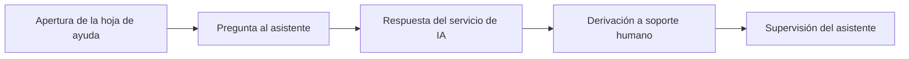

<!-- Generado por scripts/processes/generate-process-docs.ts desde src/modules/workflow-catalog/definitions. No editar a mano. -->

# P-14 · Atlas Assist: ayuda contextual y chat en la app

`atlas_assist_help` · v1 · prioridad **P2** · tipo `integration` · dueño `OPERATIONS_MANAGER` · bloques `ATLAS_BACKEND`, `AI_SERVICE`

El cliente pulsa el botón de ayuda de la app, pregunta y recibe una respuesta del asistente de IA basada en un catálogo versionado de ayuda; si la duda requiere a una persona, la app lo lleva a Soporte. La app sólo habla con Atlas, que reenvía al servicio de IA con una referencia opaca del cliente.

## Por qué existe

Las dudas de uso de la app (dónde está algo, qué significa un estado, qué es Atlas y cómo es el plan de pagos) llegan a cualquier hora; el asistente las contesta al momento con un catálogo de ayuda que cita pantallas reales, y así soporte humano se queda con lo que de verdad necesita a una persona.

## Quién lo inicia y quién lo cierra

Lo inicia el cliente al pulsar el botón de ayuda flotante de la app y escribir su pregunta; lo cierra el propio cliente al obtener la respuesta o al aceptar «Hablar con una persona», que lo lleva a Soporte. Ninguna persona interna interviene en la conversación con el asistente.

## Cuándo empieza y cuándo termina

Empieza cuando la app abre la hoja del asistente y recupera la conversación vigente (si contesta 404 el botón ni se pinta). Termina con la respuesta del asistente guardada en el historial del servicio de IA, o con la derivación a la pantalla de Soporte cuando la respuesta sugiere hablar con una persona.

## Qué pasa cuando falla

Con el asistente apagado en Atlas o en el servicio de IA todo responde 404 y la app esconde el botón. Si la misma pregunta sigue en curso responde 409 y la app reintenta sola cada 2 segundos con la misma clave; si hay demasiadas consultas, 429. Una clave de servicio que no coincide se registra como error y el cliente ve un aviso amable que lo manda a Soporte; nadie interno recibe alerta.

## Qué indicador dice que va bien

Proporción de preguntas contestadas frente a respuestas 503 de indisponibilidad y 429 de saturación, y proporción de respuestas que sugieren hablar con una persona; hoy sólo se pueden leer en los registros del servicio de IA, porque ningún tablero ni pantalla del portal lo muestra.

## Resultado

- **Éxito:** El cliente recibe una respuesta útil del catálogo de ayuda, o llega a Soporte cuando su caso necesita a una persona.
- **Fracaso:** El botón desaparece por un interruptor apagado o la clave de servicio no coincide y nadie interno se entera.

## Etapas

| Etapa | Nombre | Actor | Cliente | Pantalla | Pasos |
|---|---|---|---|---|---|
| `assist_open` | Apertura de la hoja de ayuda | customer | CONSUMER_APP | **sin pantalla declarada** | 1 |
| `assist_ask` | Pregunta al asistente | customer | CONSUMER_APP | **sin pantalla declarada** | 1 |
| `assist_answer` | Respuesta del servicio de IA | system | BLOCK | — | 2 |
| `assist_handoff` | Derivación a soporte humano | customer | CONSUMER_APP | **sin pantalla declarada** | 1 |
| `assist_oversight` | Supervisión del asistente | internal_user | ADMIN_PORTAL | **sin pantalla declarada** | 1 |

### Apertura de la hoja de ayuda (`assist_open`)

La app pide la conversación vigente para rehidratar la hoja. Si responde 404 el asistente está apagado y el botón no se muestra.

| Paso | Tipo | Bloque | Operación | Roles | Eventos |
|---|---|---|---|---|---|
| Recuperar la conversación vigente | http | ATLAS_BACKEND | `GET /mobile/assist/conversation` | customer | — |

### Pregunta al asistente (`assist_ask`)

El cliente escribe su duda; la app la envía con una clave de idempotencia y la pantalla desde la que pregunta.

| Paso | Tipo | Bloque | Operación | Roles | Eventos |
|---|---|---|---|---|---|
| Enviar la pregunta | http | ATLAS_BACKEND | `POST /mobile/assist/chat` | customer | — |

### Respuesta del servicio de IA (`assist_answer`)

El servicio de IA valida la clave de servicio, selecciona hechos del catálogo de ayuda, llama al modelo y guarda el turno en su historial (90 días).

| Paso | Tipo | Bloque | Operación | Roles | Eventos |
|---|---|---|---|---|---|
| Contestar con el catálogo de ayuda | http | AI_SERVICE | `POST /v1/assist/chat` | — | — |
| Leer la última conversación | http | AI_SERVICE | `GET /v1/assist/conversations/latest` | — | — |

### Derivación a soporte humano (`assist_handoff`)

Si la respuesta sugiere hablar con una persona (reclamos, pagos no reconocidos) o el asistente no está disponible, la app ofrece ir a Soporte; allí sigue el proceso de soporte.

| Paso | Tipo | Bloque | Operación | Roles | Eventos |
|---|---|---|---|---|---|
| Ir a la pantalla de Soporte | manual | ATLAS_BACKEND | Es una navegación dentro de la app decidida por el cliente; no hay llamada propia, la conversación humana la abre el proceso de soporte. | — | — |

### Supervisión del asistente (`assist_oversight`)

Alguien de soporte debería ver la salud del servicio de IA, la versión del catálogo y la tasa de derivaciones. No existe pantalla para ello en el portal.

| Paso | Tipo | Bloque | Operación | Roles | Eventos |
|---|---|---|---|---|---|
| Revisar salud y catálogo del asistente | manual | ATLAS_BACKEND | El portal admin no referencia al servicio de IA: no hay ruta ni pantalla que muestre su salud, su catálogo ni sus conversaciones. | — | — |

## Fuentes

- `src/modules/assist/assist.controller.ts`
- `src/modules/assist/assist.service.ts`
- `src/modules/assist/ai-assist.client.ts`
- `src/modules/assist/assist.schemas.ts`
- `AtlasAIService/src/modules/assist/assist.controller.ts`
- `AtlasAIService/src/modules/assist/assist-catalog.v1.ts`
- `AtlasAIService/docs/support/status.md`
- `AtlasAIService/docs/support/help-surface-map.md`
- `AtlasAIService/docs/support/catalog.v1.json`
- `AtlasFrontend/apps/consumer-app/src/features/assist.ts`
- `AtlasFrontend/apps/consumer-app/src/ui/assist-sheet.tsx`
- `memoria atlas-assist-boton-de-ayuda`
- `_plan-documentar-procesos-y-cableado-portal-2026-09-26/datos/procesos.json (P-14)`
