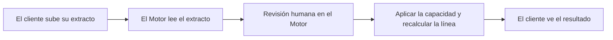

<!-- Generado por scripts/processes/generate-process-docs.ts desde src/modules/workflow-catalog/definitions. No editar a mano. -->

# P-07 · Extracto bancario → capacidad de pago → recálculo de línea

`bank_statement_capacity` · v1 · prioridad **P1** · tipo `integration` · dueño `RISK_ANALYST` · bloques `ATLAS_BACKEND`, `DECISION_ENGINE`

El cliente sube el PDF de su extracto, un job lo manda al worker de extractos del Motor, y según el veredicto (analizado, rechazado, en revisión humana o Motor caído) la línea de crédito se recalcula con motivo `bank_statement`.

## Por qué existe

La línea calculada sólo con lo declarado en el alta no refleja lo que la persona gana y gasta de verdad. El extracto aporta ingresos, gastos, obligaciones y rechazos por fondos insuficientes, y con eso el Motor recalcula una capacidad de pago que la app promete revisar en 24 horas.

## Quién lo inicia y quién lo cierra

Lo inicia el cliente desde la pantalla «extracto bancario» de la app al subir el PDF. Lo cierra el job `process_bank_statement_reviews` con el veredicto del Motor; cuando el Motor duda, una persona analista lo mira en la pantalla de extractos del portal del Motor.

## Cuándo empieza y cuándo termina

Empieza con la revisión creada en `received` y un plazo comprometido (`promised_by`) de 24 horas; sólo cabe una revisión abierta por cliente. Termina en `applied` (capacidad aplicada y línea recalculada) o `rejected` (el Motor demostró que el documento no sirve y dice por qué).

## Qué pasa cuando falla

Motor caído o archivo ilegible del almacén: la revisión NO se rechaza, se queda en `received` y el siguiente barrido reintenta. Si el Motor la deriva a revisión, queda en `processing` con su motivo; hoy nada vuelve a leer esa resolución del Motor, así que la revisión sigue abierta y bloquea subir otro extracto. Los plazos por vencer sólo se anotan en el registro del job.

## Qué indicador dice que va bien

Revisiones abiertas (`received`/`processing`) con `promised_by` vencido o por vencer, proporción `applied` frente a `rejected` por `rejection_category`, y revisiones que se quedan en `processing` con `review_reason` sin cerrarse.

## Resultado

- **Éxito:** La revisión queda `applied`, con la capacidad de pago del Motor guardada y una versión nueva de la línea de crédito.
- **Fracaso:** La revisión queda rechazada con un motivo que el cliente puede resolver, o abierta pasado el plazo de 24 horas.

## Dónde vive cada instancia

`ATLAS_BACKEND` · `credit.bank_statement_reviews` · estado en `status` · abiertas: `received`, `processing`

## Etapas

| Etapa | Nombre | Actor | Cliente | Pantalla | Pasos |
|---|---|---|---|---|---|
| `statement_upload` | El cliente sube su extracto | customer | CONSUMER_APP | **sin pantalla declarada** | 3 |
| `statement_engine_analysis` | El Motor lee el extracto | system | BLOCK | — | 3 |
| `statement_motor_human_review` | Revisión humana en el Motor | internal_user | MOTOR_PORTAL | `/workers/bank-statement` | 4 |
| `statement_apply_capacity` | Aplicar la capacidad y recalcular la línea | system | BLOCK | — | 1 |
| `statement_customer_status` | El cliente ve el resultado | customer | CONSUMER_APP | **sin pantalla declarada** | 3 |

### El cliente sube su extracto (`statement_upload`)

La app pide un permiso firmado, sube el PDF directo al almacén cifrado y registra la revisión. El servidor comprueba que el objeto es de ESTE cliente, existe y es un PDF.

| Paso | Tipo | Bloque | Operación | Roles | Eventos |
|---|---|---|---|---|---|
| Pedir el permiso de subida | http | ATLAS_BACKEND | `POST /customer-onboarding/:customerId/documents/upload-url` | customer, internal_operator, risk_analyst, admin, platform_admin | — |
| Subir el PDF al almacén cifrado | external | ATLAS_BACKEND | La subida va directa al almacén de evidencia con la URL firmada, no a una ruta de Atlas. | — | — |
| Registrar el extracto y arrancar el plazo | http | ATLAS_BACKEND | `POST /customers/:customerId/bank-statements` | customer, internal_operator, risk_analyst, admin, platform_admin | — |

### El Motor lee el extracto (`statement_engine_analysis`)

Cada pasada del job toma las revisiones `received` más antiguas, descarga el PDF y lo manda al worker de extractos del Motor (tres compuertas: contenedor, contenido y emisor; tres meses completos). Luego sondea la ejecución.

| Paso | Tipo | Bloque | Operación | Roles | Eventos |
|---|---|---|---|---|---|
| Barrer las revisiones pendientes | job | ATLAS_BACKEND | job `process_bank_statement_reviews` | — | — |
| Enviar el PDF al worker del Motor | http | DECISION_ENGINE | `POST /v1/workers/bank-statement/runs` | — | — |
| Consultar la ejecución | http | DECISION_ENGINE | `GET /v1/workers/bank-statement/runs/:requestId` | — | — |

### Revisión humana en el Motor (`statement_motor_human_review`)

Cuando el Motor duda, o el análisis sale sin capacidad utilizable, la revisión queda `processing` con `review_reason`. Una persona la toma y la resuelve en la pantalla de extractos del Motor. Atlas no vuelve a leer esa resolución.

| Paso | Tipo | Bloque | Operación | Roles | Eventos |
|---|---|---|---|---|---|
| Ver la cola de extractos en revisión | http | DECISION_ENGINE | `GET /v1/workers/bank-statement/reviews` | — | — |
| Tomar una revisión | http | DECISION_ENGINE | `POST /v1/workers/bank-statement/reviews/:requestId/claim` | — | — |
| Resolver la revisión | http | DECISION_ENGINE | `POST /v1/workers/bank-statement/reviews/:requestId/resolve` | — | — |
| Reprocesar el extracto | http | DECISION_ENGINE | `POST /v1/workers/bank-statement/reviews/:requestId/reprocess` | — | — |

### Aplicar la capacidad y recalcular la línea (`statement_apply_capacity`)

Con capacidad elegible, Atlas guarda ingresos, gastos, obligaciones, cuota máxima y rechazos por fondos insuficientes, y pide al Motor la línea nueva (motivo `bank_statement`). Si el Motor no recalcula, la revisión se queda `processing`.

| Paso | Tipo | Bloque | Operación | Roles | Eventos |
|---|---|---|---|---|---|
| El Motor recalcula la línea | http | DECISION_ENGINE | `POST /v1/decisions/:artifactCode` | — | — |

### El cliente ve el resultado (`statement_customer_status`)

La app enseña «lo estamos revisando» con la hora comprometida, el motivo del rechazo con una frase que la persona puede resolver, o la línea nueva con su historial.

| Paso | Tipo | Bloque | Operación | Roles | Eventos |
|---|---|---|---|---|---|
| Consultar el último extracto | http | ATLAS_BACKEND | `GET /customers/:customerId/bank-statements/latest` | customer, internal_operator, risk_analyst, admin, platform_admin | — |
| Ver la línea recalculada | http | ATLAS_BACKEND | `GET /customers/:customerId/credit-line` | customer, internal_operator, risk_analyst, admin, platform_admin | — |
| Ver qué movió la línea | http | ATLAS_BACKEND | `GET /customers/:customerId/credit-line/history` | customer, internal_operator, risk_analyst, admin, platform_admin | — |

## Fuentes

- `src/modules/credit/credit.controller.ts`
- `src/modules/credit/application/bank-statement.service.ts`
- `src/modules/credit/application/bank-statement-review.worker.ts`
- `src/modules/credit/bank-statement.mapper.ts`
- `src/modules/credit/domain/statement-rejection.ts`
- `src/modules/decision-engine/bank-statement-engine.client.ts`
- `src/modules/customer-onboarding/customer-onboarding-profile.schemas.ts`
- `src/database/models/bank-statement-reviews.model.ts`
- `src/modules/runtime-jobs/scheduled-jobs.catalog.ts`
- `AtlasFrontend/apps/consumer-app/app/(app)/extracto-bancario.tsx`
- `AtlasFrontend/apps/consumer-app/src/api/endpoints/credit-line.ts`
- `AtlasDecisionEngineFrontend/src/features/workers/statement-review.api.ts`
- `memoria atlas-extracto-capacidad-pago`
- `memoria atlas-plan-promesas-reales`
- `_plan-promesas-reales-2026-09-14/PLAN.md (D1, D3)`
