<!-- Generado por scripts/processes/generate-process-docs.ts desde src/modules/workflow-catalog/definitions. No editar a mano. -->

# P-20 · Venta BNPL, comisión MDR, consumo y facturación del comercio (incl. SIAT)

`bnpl_sale_mdr_billing` · v1 · prioridad **P1** · tipo `back_office` · dueño `ERP:FINANCE` · bloques `ERP_BACKEND`, `ATLAS_BACKEND`

Una venta a plazos registrada en un comercio activo calcula su comisión (MDR) con la regla del contrato vigente y la banda de riesgo que decidió Core, y deja una cuenta por cobrar al comercio. Finanzas agrupa esas cuentas en una factura con número propio, registra el pago del comercio y la lleva al mayor; el comercio ve cobros, cargos y facturas en «Consumo y facturación». La factura electrónica del SIAT no está integrada.

## Por qué existe

La comisión por venta es el ingreso que Atlas cobra al comercio. Tiene que calcularse con la regla pactada en el contrato vigente y no con lo que el comercio declare, facturarse con una serie sin huecos ni repetidos, y quedar visible para el comercio junto a lo que ya cobró, sin mezclar dos libros que no se hablan (los cobros viven en Atlas y los cargos en el ERP).

## Quién lo inicia y quién lo cierra

Lo inicia la venta a plazos: hoy la registra Operaciones del ERP (o el comercio con rol MERCHANT_ADMIN) desde «Cobertura y conciliación»; la banda de riesgo llega sola de Core. Finanzas del ERP (FINANCE) emite la factura, registra el pago del comercio y la contabiliza; el comercio la consulta y descarga desde «Consumo y facturación».

## Cuándo empieza y cuándo termina

Empieza con la compra registrada (POST /b2b/bnpl/purchases), que exige cuenta CUSTOMER, sucursal activa que pueda originar y contrato vigente, y deja la cuenta por cobrar de tipo MDR. Termina con la factura FAC-CM-AAAA-NNNNNN emitida (ISSUED), pagada (PAID) y contabilizada; la factura fiscal del SIAT con CUF queda fuera hasta que se integre.

## Qué pasa cuando falla

Un comercio que no está en CUSTOMER responde 403, una sucursal que no puede originar 403, y sin versión contractual activa para la fecha 409; la entrada que no sea el 60 % se rechaza. Sin banda de riesgo conocida la compra sigue sin banda, no se bloquea. Una comisión creada sobre el id del contrato en vez del de la versión nunca se aplicó. El PDF avisa de que es representación interna mientras no haya documento SIAT aceptado.

## Qué indicador dice que va bien

Compras sin cuenta por cobrar MDR (lo detecta la conciliación), cuentas por cobrar MDR abiertas y vencidas por comercio, facturas en DRAFT sin contabilizar, y la diferencia entre la comisión devengada por cuotas y la calculada sobre pagos que «Consumo y facturación» enseña en vez de taparla.

## Resultado

- **Éxito:** La comisión de cada venta queda facturada con número de serie, pagada, contabilizada y visible para el comercio.
- **Fracaso:** La venta no se registra (comercio, sucursal o contrato no habilitados), la comisión no se calcula o la factura queda sin pagar o sin contabilizar.

## Dónde vive cada instancia

`ERP_BACKEND` · `atlas_sales.merchant_invoices` · estado en `status` · abiertas: `DRAFT`, `ISSUED`, `PARTIALLY_PAID`, `OVERDUE`

## Etapas

```mermaid
flowchart LR
  mdr_risk_band["Core informa la banda de riesgo del cliente"]
  mdr_register_sale["Se registra la venta a plazos"]
  mdr_merchant_consumption["El comercio ve su consumo y facturación"]
  mdr_issue_invoice["Finanzas emite la factura de comisión"]
  mdr_collect_and_post["Finanzas registra el pago y contabiliza"]
  mdr_siat["Factura electrónica del SIAT"]
  mdr_risk_band --> mdr_register_sale
  mdr_register_sale --> mdr_merchant_consumption
  mdr_merchant_consumption --> mdr_issue_invoice
  mdr_issue_invoice --> mdr_collect_and_post
  mdr_collect_and_post --> mdr_siat
```

| Etapa | Nombre | Actor | Cliente | Pantalla | Pasos |
|---|---|---|---|---|---|
| `mdr_risk_band` | Core informa la banda de riesgo del cliente | system | BLOCK | — | 2 |
| `mdr_register_sale` | Se registra la venta a plazos | internal_user | ERP_PORTAL | `/operaciones/crm/conciliacion-cobertura` | 1 |
| `mdr_merchant_consumption` | El comercio ve su consumo y facturación | merchant_user | ERP_PORTAL | `/portal-comercio/facturacion` | 5 |
| `mdr_issue_invoice` | Finanzas emite la factura de comisión | internal_user | ERP_PORTAL | `/operaciones/crm/facturacion` | 4 |
| `mdr_collect_and_post` | Finanzas registra el pago y contabiliza | internal_user | ERP_PORTAL | `/operaciones/crm/facturacion` | 2 |
| `mdr_siat` | Factura electrónica del SIAT | external_provider | BLOCK | — | 1 |

### Core informa la banda de riesgo del cliente (`mdr_risk_band`)

Al decidir un crédito, Core publica credit.decision.recorded y lo entrega firmado al ERP, que guarda la banda del cliente. Así la regla MDR por banda la decide Core y no el comercio.

| Paso | Tipo | Bloque | Operación | Roles | Eventos |
|---|---|---|---|---|---|
| Entregar la decisión de crédito al ERP | event | ATLAS_BACKEND | Lo entrega el job deliver_erp_events del catálogo de jobs opcionales de AtlasBackend, que sólo existe con ERP_EVENTS_DELIVERY_URL y su secreto configurados. | — | — |
| Guardar la banda de riesgo del cliente | http | ERP_BACKEND | `POST /integration/core/events` | — | — |

### Se registra la venta a plazos (`mdr_register_sale`)

«Registrar compra a plazos» en Cobertura y conciliación: la entrada es el 60 % y se paga en el momento; el 40 % se reparte en cuotas. La compra guarda la versión contractual vigente y su comisión.

| Paso | Tipo | Bloque | Operación | Roles | Eventos |
|---|---|---|---|---|---|
| Registrar la compra y su comisión | http | ERP_BACKEND | `POST /b2b/bnpl/purchases` | MERCHANT_ADMIN, OPERATIONS, ADMIN | — |

### El comercio ve su consumo y facturación (`mdr_merchant_consumption`)

«Consumo y facturación» del portal del comercio lee dos libros: los cobros de Atlas (por expediente) y los cargos, comisiones y facturas del ERP (por cuenta B2B). Cada factura se descarga como documento.

| Paso | Tipo | Bloque | Operación | Roles | Eventos |
|---|---|---|---|---|---|
| Ver los cobros (pasarela del ERP) | http | ERP_BACKEND | `GET /merchant-credit/:partnerId/portfolio` | merchant, MERCHANT_ADMIN, MERCHANT_OPERATIONS, OPERATIONS, ADMIN | — |
| Cartera de cobros del comercio | http | ATLAS_BACKEND | `GET /merchant/partners/:partnerId/payment-claims/portfolio` | merchant, internal_operator, admin, platform_admin | — |
| Ver las comisiones que debe | http | ERP_BACKEND | `GET /portal/commissions` | ADMIN, COMMERCIAL_MANAGER, COMMERCIAL_EXECUTIVE, MERCHANT_ADMIN | — |
| Ver cargos y facturas | http | ERP_BACKEND | `GET /portal/billing` | ADMIN, COMMERCIAL_MANAGER, COMMERCIAL_EXECUTIVE, MERCHANT_ADMIN | — |
| Descargar una factura | http | ERP_BACKEND | `GET /portal/billing/invoices/:id` | ADMIN, COMMERCIAL_MANAGER, COMMERCIAL_EXECUTIVE, MERCHANT_ADMIN | — |

### Finanzas emite la factura de comisión (`mdr_issue_invoice`)

CRM › Facturación: Finanzas elige las cuentas por cobrar abiertas del comercio y emite la factura; el número lo asigna el sistema (serie global FAC-CM con cerrojo) y el IVA sale del cálculo, no se teclea.

| Paso | Tipo | Bloque | Operación | Roles | Eventos |
|---|---|---|---|---|---|
| Ver las cuentas por cobrar | http | ERP_BACKEND | `GET /b2b/receivables` | COMMERCIAL_EXECUTIVE, COMMERCIAL_MANAGER, ADMIN, FINANCE, ACCOUNTANT | — |
| Emitir la factura | http | ERP_BACKEND | `POST /b2b/billing/invoices` | FINANCE, ADMIN | — |
| Ver las facturas emitidas | http | ERP_BACKEND | `GET /b2b/billing/invoices` | FINANCE, OPERATIONS, ADMIN | — |
| Descargar la factura como documento | http | ERP_BACKEND | `GET /b2b/billing/invoices/:id` | FINANCE, OPERATIONS, ADMIN | — |

### Finanzas registra el pago y contabiliza (`mdr_collect_and_post`)

El pago del comercio se aplica por imputaciones explícitas a sus cargos; la factura se lleva al mayor con un paso manual.

| Paso | Tipo | Bloque | Operación | Roles | Eventos |
|---|---|---|---|---|---|
| Registrar el pago del comercio | http | ERP_BACKEND | `POST /b2b/billing/merchant-payments` | FINANCE, ADMIN | — |
| Contabilizar la factura | http | ERP_BACKEND | `PATCH /b2b/billing/invoices/:id/post-to-gl` | FINANCE, ADMIN, ACCOUNTANT | — |

### Factura electrónica del SIAT (`mdr_siat`)

Pendiente: la emisión fiscal con CUF ante el SIN no está integrada. El plan del 2026-09-26 la emula en el servidor de pruebas de proveedores.

| Paso | Tipo | Bloque | Operación | Roles | Eventos |
|---|---|---|---|---|---|
| Emitir la factura ante el SIAT | external | ATLAS_BACKEND | El SIAT del SIN es un servicio externo que el ERP todavía no consume: no hay cliente, catálogos SIN ni cola de envío (plan _plan-facturacion-siat-2026-09-26). | — | — |

## Fuentes

- `AtlasERPBackend/docs/architecture/flows.md (Venta BNPL y MDR, Facturación y cobro B2B)`
- `AtlasERPBackend/src/modules/b2b-sales-crm/services/b2b-bnpl-billing.service.ts`
- `AtlasERPBackend/src/modules/b2b-sales-crm/integration/core-credit-events.service.ts`
- `AtlasERPBackend/src/modules/b2b-sales-crm/controllers/billing.controller.ts`
- `AtlasERPBackend/src/modules/b2b-sales-crm/controllers/bnpl.controller.ts`
- `AtlasERPBackend/src/modules/portal/portal.service.ts (listCommissions)`
- `AtlasERPBackend/src/common/numbering/document-numbering.ts`
- `src/modules/loan-payment-claims/merchant-payment-claims.controller.ts (portfolio)`
- `src/modules/runtime-jobs/optional-jobs.catalog.ts (deliver_erp_events)`
- `AtlasERPFrontend/app/operaciones/crm/facturacion/page.tsx`
- `AtlasERPFrontend/app/operaciones/crm/conciliacion-cobertura/page.tsx (registrar compra a plazos)`
- `AtlasERPFrontend/components/screens/MerchantBillingScreen.tsx`
- `_plan-facturacion-siat-2026-09-26/PLAN.md`
- `memoria atlas-erp-consumo-facturacion`
- `memoria atlas-facturacion-numeracion-descarga`
- `memoria atlas-erp-uuid-de-otra-entidad`
