<!-- Generado por scripts/processes/generate-process-docs.ts desde src/modules/workflow-catalog/definitions. No editar a mano. -->

# P-21 · Cobertura de CxC del comercio, barrido de mora, recuperación y conciliación

`coverage_and_recovery` · v1 · prioridad **P1** · tipo `system_job` · dueño `ERP:FINANCE` · bloques `ERP_BACKEND`, `ATLAS_BACKEND`

Un barrido horario del ERP marca en mora las cuotas vencidas sin pago confirmado y manda a revisión los avisos de pago que nadie confirmó a tiempo. Finanzas programa la cobertura (cuenta por pagar de Atlas al comercio) de la cuota impaga, una persona registra la liquidación y otra la aprueba; sólo entonces nace la cuenta por cobrar de recuperación contra el cliente y Core se entera. Cada cobro de recuperación es un movimiento reversible, y la conciliación del período cuadra lo cubierto, lo pagado y lo recuperado.

## Por qué existe

Atlas garantiza al comercio el cobro de las cuotas que financia: si el cliente no paga, Atlas le paga al comercio y asume la deuda. Mover ese dinero exige prueba en cada transición —cuota realmente vencida e impaga, liquidación identificada confirmada por una segunda persona, cobro de recuperación con referencia única— para que nadie cubra dos veces ni recupere lo que no se pagó.

## Quién lo inicia y quién lo cierra

Lo inicia el sistema: el procesador b2b.overdue-sweep del ERP corre cada hora dentro de la API y marca la mora. Finanzas del ERP (FINANCE) programa la cobertura y registra la liquidación, OTRA persona de Finanzas la aprueba, Cobranza (COLLECTIONS) aplica los cobros de recuperación, y Finanzas u Operaciones cierra el período con la conciliación.

## Cuándo empieza y cuándo termina

Empieza cuando una cuota SCHEDULED pasa su vencimiento sin pago confirmado y el barrido la marca OVERDUE (o manda el aviso de pago sin confirmar a la cola de revisión). La cobertura va SCHEDULED/DUE → PAID con la liquidación aprobada, la cuota a COVERED_BY_ATLAS y nace la recuperación OPEN, que avanza a PARTIALLY_RECOVERED y RECOVERED; termina con la conciliación en COMPLETED u OPEN_ITEMS.

## Qué pasa cuando falla

Lo ambiguo (aviso de pago sin confirmar, contrato no activo) no se cubre solo: va a la cola de revisión. Una segunda cobertura viva para la misma cuota se rechaza por índice único; la misma persona no puede registrar y aprobar una liquidación; un cobro repetido con la misma referencia no suma y uno que excede el saldo se rechaza. Si un tick del barrido falla, se registra y el siguiente reintenta.

## Qué indicador dice que va bien

Cuotas OVERDUE sin cobertura programada, elementos abiertos en la cola de revisión y su antigüedad, liquidaciones registradas sin aprobar, y los hallazgos de la conciliación: compras sin comisión, cuentas por cobrar vencidas, cuotas sin cuenta por pagar y coberturas pagadas sin recuperación.

## Resultado

- **Éxito:** La cuota impaga queda cubierta con liquidación aprobada, la recuperación registrada contra el cliente y el período conciliado sin partidas abiertas.
- **Fracaso:** La mora no se detecta, la cobertura se queda en revisión o sin aprobar, o la conciliación cierra con partidas abiertas.

## Dónde vive cada instancia

`ERP_BACKEND` · `atlas_sales.merchant_payables` · estado en `status` · abiertas: `SCHEDULED`, `DUE`, `DISPUTED`

## Etapas

```mermaid
flowchart LR
  cov_overdue_sweep["El barrido marca la mora"]
  cov_review_queue["Finanzas resuelve lo ambiguo"]
  cov_schedule["Finanzas programa la cobertura"]
  cov_settlement["Liquidación con doble control"]
  cov_core_projection["Core se entera de la cobertura y la recuperación"]
  cov_recovery["Cobranza registra la recuperación"]
  cov_reconciliation["Conciliación del período"]
  cov_overdue_sweep --> cov_review_queue
  cov_review_queue --> cov_schedule
  cov_schedule --> cov_settlement
  cov_settlement --> cov_core_projection
  cov_core_projection --> cov_recovery
  cov_recovery --> cov_reconciliation
```

| Etapa | Nombre | Actor | Cliente | Pantalla | Pasos |
|---|---|---|---|---|---|
| `cov_overdue_sweep` | El barrido marca la mora | system | BLOCK | — | 3 |
| `cov_review_queue` | Finanzas resuelve lo ambiguo | internal_user | ERP_PORTAL | `/operaciones/crm/conciliacion-cobertura` | 2 |
| `cov_schedule` | Finanzas programa la cobertura | internal_user | ERP_PORTAL | `/operaciones/crm/conciliacion-cobertura` | 4 |
| `cov_settlement` | Liquidación con doble control | internal_user | ERP_PORTAL | `/operaciones/crm/conciliacion-cobertura` | 3 |
| `cov_core_projection` | Core se entera de la cobertura y la recuperación | system | BLOCK | — | 2 |
| `cov_recovery` | Cobranza registra la recuperación | internal_user | ERP_PORTAL | `/operaciones/crm/conciliacion-cobertura` | 4 |
| `cov_reconciliation` | Conciliación del período | internal_user | ERP_PORTAL | `/operaciones/crm/conciliacion-cobertura` | 1 |

### El barrido marca la mora (`cov_overdue_sweep`)

Cada hora (y al arrancar) el ERP marca OVERDUE las cuotas vencidas sin pago confirmado según el día de negocio de Bolivia. Un aviso de pago REPORTED da 72 h de plazo; vencido, la cuota pasa a mora y el aviso a la cola de revisión.

| Paso | Tipo | Bloque | Operación | Roles | Eventos |
|---|---|---|---|---|---|
| Recibir los avisos y confirmaciones de pago de Core | http | ERP_BACKEND | `POST /integration/core/events` | — | — |
| Barrer las cuotas vencidas | job | ERP_BACKEND | job `b2b.overdue-sweep` | — | — |
| Lanzar el barrido a mano | http | ERP_BACKEND | `POST /b2b/coverage/installments/sweep-overdue` | FINANCE, OPERATIONS, ADMIN | — |

### Finanzas resuelve lo ambiguo (`cov_review_queue`)

Cuarta tabla de Cobertura y conciliación: las cuotas que el sistema no cubre solo (aviso de pago sin confirmar, contrato no activo) se resuelven desde su fila.

| Paso | Tipo | Bloque | Operación | Roles | Eventos |
|---|---|---|---|---|---|
| Ver la cola de revisión | http | ERP_BACKEND | `GET /b2b/coverage/review-queue` | FINANCE, OPERATIONS, ADMIN | — |
| Resolver un elemento de revisión | http | ERP_BACKEND | `POST /b2b/coverage/review-queue/:reviewItemId/resolve` | FINANCE, ADMIN | — |

### Finanzas programa la cobertura (`cov_schedule`)

Desde la fila de la cuota: sólo una cuota vencida, impaga y sin cobertura viva, por su saldo. Nace la cuenta por pagar de Atlas al comercio por esa cuota específica.

| Paso | Tipo | Bloque | Operación | Roles | Eventos |
|---|---|---|---|---|---|
| Ver las cuotas | http | ERP_BACKEND | `GET /b2b/coverage/installments` | FINANCE, OPERATIONS, ADMIN | — |
| Programar la cobertura de la cuota | http | ERP_BACKEND | `POST /b2b/coverage/payables` | FINANCE, OPERATIONS, ADMIN | — |
| Ver las coberturas | http | ERP_BACKEND | `GET /b2b/coverage/payables` | FINANCE, OPERATIONS, ADMIN | — |
| Cancelar la cobertura | http | ERP_BACKEND | `PATCH /b2b/coverage/payables/:payableId/cancel` | FINANCE, ADMIN | — |

### Liquidación con doble control (`cov_settlement`)

Una persona registra la liquidación identificada (referencia única, importe, moneda, beneficiario, fecha, evidencia) y OTRA la aprueba. Sólo al aprobar la cuenta por pagar pasa a PAID, la cuota a COVERED_BY_ATLAS y nace la recuperación, con su evento en el outbox, en una transacción.

| Paso | Tipo | Bloque | Operación | Roles | Eventos |
|---|---|---|---|---|---|
| Registrar la liquidación al comercio | http | ERP_BACKEND | `PATCH /b2b/coverage/payables/:payableId/paid` | FINANCE, ADMIN | — |
| Aprobar la liquidación | http | ERP_BACKEND | `PATCH /b2b/coverage/payables/:payableId/settlement/approve` | FINANCE, ADMIN | b2b.coverage.settled |
| Rechazar la liquidación | http | ERP_BACKEND | `PATCH /b2b/coverage/payables/:payableId/settlement/reject` | FINANCE, ADMIN | — |

### Core se entera de la cobertura y la recuperación (`cov_core_projection`)

El worker de outbox del ERP entrega firmados b2b.coverage.settled y los movimientos de recuperación a AtlasBackend, que los proyecta sobre la cuota.

| Paso | Tipo | Bloque | Operación | Roles | Eventos |
|---|---|---|---|---|---|
| Entregar los eventos de cobertura | job | ERP_BACKEND | job `worker-outbox` | — | — |
| Proyectar la cobertura sobre la cuota | http | ATLAS_BACKEND | `POST /internal/integration/erp/events` | — | — |

### Cobranza registra la recuperación (`cov_recovery`)

Cada cobro al cliente es un movimiento con referencia única contra la recuperación: repetirlo no suma, excederse se rechaza y el reverso compensa sin borrar.

| Paso | Tipo | Bloque | Operación | Roles | Eventos |
|---|---|---|---|---|---|
| Ver las recuperaciones | http | ERP_BACKEND | `GET /b2b/coverage/recoveries` | FINANCE, OPERATIONS, ADMIN | — |
| Aplicar un cobro de recuperación | http | ERP_BACKEND | `PATCH /b2b/coverage/recoveries/:recoveryId/apply-payment` | FINANCE, COLLECTIONS, ADMIN | b2b.recovery.payment_applied |
| Ver los cobros de una recuperación | http | ERP_BACKEND | `GET /b2b/coverage/recoveries/:recoveryId/movements` | FINANCE, COLLECTIONS, ADMIN | — |
| Revertir un cobro equivocado | http | ERP_BACKEND | `POST /b2b/coverage/recoveries/:recoveryId/movements/:movementId/reverse` | FINANCE, ADMIN | b2b.recovery.payment_reversed |

### Conciliación del período (`cov_reconciliation`)

«Ejecutar conciliación» en la barra: detecta compras sin comisión, cuentas por cobrar vencidas, cuotas sin cuenta por pagar y coberturas pagadas sin recuperación, y deja la corrida COMPLETED u OPEN_ITEMS.

| Paso | Tipo | Bloque | Operación | Roles | Eventos |
|---|---|---|---|---|---|
| Ejecutar la conciliación | http | ERP_BACKEND | `POST /b2b/reconciliation/runs` | FINANCE, OPERATIONS, ADMIN | — |

## Fuentes

- `AtlasERPBackend/docs/architecture/flows.md (Cobertura y recuperación, Conciliación)`
- `AtlasERPBackend/src/modules/b2b-sales-crm/controllers/coverage.controller.ts`
- `AtlasERPBackend/src/modules/b2b-sales-crm/services/b2b-overdue-sweep.processor.ts`
- `AtlasERPBackend/src/modules/b2b-sales-crm/services/b2b-overdue-sweep.service.ts`
- `AtlasERPBackend/src/modules/b2b-sales-crm/services/b2b-coverage.service.ts`
- `AtlasERPBackend/src/modules/b2b-sales-crm/services/coverage-review.service.ts`
- `AtlasERPBackend/src/modules/b2b-sales-crm/services/b2b-reconciliation.service.ts`
- `AtlasERPBackend/src/modules/b2b-sales-crm/b2b-sales-crm.enums.ts`
- `AtlasERPBackend/src/config/env.ts (BNPL_OVERDUE_SWEEP_ENABLED, BNPL_OVERDUE_SWEEP_INTERVAL_MS)`
- `src/modules/erp-integration/integration-envelope.schemas.ts (CONSUMED_ERP_TOPICS)`
- `src/modules/erp-integration/erp-event-inbox.service.ts`
- `AtlasERPFrontend/app/operaciones/crm/conciliacion-cobertura/page.tsx`
- `_plan-produccion-siete-repos-2026-09-24/04_DOMINIO_Y_AUTORIDAD.md (DEC-03, DEC-04, DEC-05)`
- `_plan-produccion-siete-repos-2026-09-24/contratos/propuestos/CTR-COVERAGE-SETTLEMENT.schema.json`
