<!-- Generado por scripts/processes/generate-process-docs.ts desde src/modules/workflow-catalog/definitions. No editar a mano. -->

# P-06 · Línea de crédito, solicitud y decisión de crédito por el Motor

`credit_line_and_application` · v1 · prioridad **P0** · tipo `customer_journey` · dueño `RISK_MANAGER` · bloques `ATLAS_BACKEND`, `DECISION_ENGINE`, `ERP_BACKEND`

Desde el catálogo de productos hasta la solicitud decidida y aceptada: línea calculada por el Motor, solicitud del cliente, decisión automática o revisión humana (en el Motor o en Atlas) y aceptación del comercio.

## Por qué existe

Atlas no decide montos ni tasas a mano: la línea de crédito y cada solicitud se deciden con la política versionada y aprobada del Motor, para que cada «sí» o «no» sea explicable y medible, y para que el comercio decida si quiere la operación que el riesgo ya aceptó.

## Quién lo inicia y quién lo cierra

Lo inicia el cliente activo desde la app al pedir un crédito (normalmente en la caja de un comercio, tras leer su QR). Lo cierra el Motor con su decisión, una persona analista cuando la solicitud va a revisión, y el comercio desde «Gestión POS» del ERP al aceptar o rechazar la compra aprobada.

## Cuándo empieza y cuándo termina

Empieza con la solicitud creada en estado `submitted` (sólo si la elegibilidad se reevalúa bien en el servidor). Termina cuando queda `approved` con la aceptación del negocio registrada, o `rejected` (por el Motor, por una persona o porque el comercio la declinó). El desembolso es el proceso siguiente (P-08).

## Qué pasa cuando falla

Si el Motor no responde, la solicitud NUNCA se rechaza: pasa a `under_review` con modo `engine_unavailable_manual` y Atlas abre su propio caso de revisión. Si el proceso muere antes de preguntar, el barrido de solicitudes `submitted` la vuelve a decidir. Si el Motor abrió caso, la persona lo resuelve en el portal del Motor y el aviso de vuelta mueve la solicitud; si no, hoy no hay pantalla en el portal interno para decidirla.

## Qué indicador dice que va bien

Proporción de solicitudes decididas con `decision_mode = decision_engine` frente a `engine_unavailable_manual` o `manual`, solicitudes que siguen `submitted` o `under_review` pasado el plazo de vigencia de la decisión, y aprobaciones con `business_acceptance = pending` sin respuesta del comercio.

## Resultado

- **Éxito:** La solicitud queda aprobada por el Motor (o por una persona con su motivo) y aceptada por el comercio, lista para desembolsar.
- **Fracaso:** La solicitud queda rechazada, o atascada en `submitted`/`under_review` sin nadie que pueda resolverla desde una pantalla.

## Dónde vive cada instancia

`ATLAS_BACKEND` · `credit.credit_applications` · estado en `status` · abiertas: `submitted`, `under_review`

## Etapas

```mermaid
flowchart LR
  credit_catalog["Catálogo de productos crediticios"]
  credit_line_calculation["Cálculo de la línea de crédito"]
  credit_line_manual_recalculation["Recálculo manual de la línea"]
  credit_line_view["El cliente ve su línea y su porqué"]
  credit_application_request["Solicitud de crédito del cliente"]
  credit_engine_underwriting["Decisión del Motor"]
  credit_engine_manual_review["Revisión humana en el Motor"]
  credit_engine_review_callback["La resolución del Motor vuelve a Atlas"]
  credit_atlas_manual_decision["Decisión humana en Atlas"]
  credit_business_acceptance["Aceptación del comercio"]
  credit_business_acceptance_by_operations["Aceptación del negocio por operaciones"]
  credit_catalog --> credit_line_calculation
  credit_line_calculation --> credit_line_manual_recalculation
  credit_line_manual_recalculation --> credit_line_view
  credit_line_view --> credit_application_request
  credit_application_request --> credit_engine_underwriting
  credit_engine_underwriting --> credit_engine_manual_review
  credit_engine_manual_review --> credit_engine_review_callback
  credit_engine_review_callback --> credit_atlas_manual_decision
  credit_atlas_manual_decision --> credit_business_acceptance
  credit_business_acceptance --> credit_business_acceptance_by_operations
```

| Etapa | Nombre | Actor | Cliente | Pantalla | Pasos |
|---|---|---|---|---|---|
| `credit_catalog` | Catálogo de productos crediticios | internal_user | ADMIN_PORTAL | `/internal/operations/credit/products` | 3 |
| `credit_line_calculation` | Cálculo de la línea de crédito | system | BLOCK | — | 2 |
| `credit_line_manual_recalculation` | Recálculo manual de la línea | internal_user | ADMIN_PORTAL | `/internal/operations/customers/[customerId]/investigation-summary` | 1 |
| `credit_line_view` | El cliente ve su línea y su porqué | customer | CONSUMER_APP | **sin pantalla declarada** | 2 |
| `credit_application_request` | Solicitud de crédito del cliente | customer | CONSUMER_APP | **sin pantalla declarada** | 3 |
| `credit_engine_underwriting` | Decisión del Motor | system | BLOCK | — | 2 |
| `credit_engine_manual_review` | Revisión humana en el Motor | internal_user | MOTOR_PORTAL | `/manual-reviews/[caseId]` | 2 |
| `credit_engine_review_callback` | La resolución del Motor vuelve a Atlas | system | BLOCK | — | 1 |
| `credit_atlas_manual_decision` | Decisión humana en Atlas | internal_user | ADMIN_PORTAL | `/internal/operations/credit/applications/[applicationId]` | 2 |
| `credit_business_acceptance` | Aceptación del comercio | merchant_user | ERP_PORTAL | `/portal-comercio/gestion-pos` | 4 |
| `credit_business_acceptance_by_operations` | Aceptación del negocio por operaciones | internal_user | ADMIN_PORTAL | `/internal/operations/credit/applications/[applicationId]` | 1 |

### Catálogo de productos crediticios (`credit_catalog`)

Operaciones da de alta los productos (nacen en `draft`) y los activa, suspende o retira. No hay productos sembrados: montos, plazos y tasas son decisión de negocio. Hoy no existe pantalla en el portal interno.

| Paso | Tipo | Bloque | Operación | Roles | Eventos |
|---|---|---|---|---|---|
| Listar los productos del tenant | http | ATLAS_BACKEND | `GET /operations/credit/products` | internal_operator, risk_analyst, admin, platform_admin | — |
| Crear un producto crediticio | http | ATLAS_BACKEND | `POST /operations/credit/products` | internal_operator, risk_analyst, admin, platform_admin | — |
| Cambiar el estado de un producto | http | ATLAS_BACKEND | `PATCH /operations/credit/products/:productId/status` | internal_operator, risk_analyst, admin, platform_admin | — |

### Cálculo de la línea de crédito (`credit_line_calculation`)

Un job pide al Motor la línea de los clientes `active` que no tienen línea o la tienen vieja; también la recalculan el extracto bancario (P-07) y el barrido de mora. Si el Motor no responde, la línea vigente no se toca.

| Paso | Tipo | Bloque | Operación | Roles | Eventos |
|---|---|---|---|---|---|
| Refrescar líneas ausentes o viejas | job | ATLAS_BACKEND | job `refresh_credit_lines` | — | — |
| El Motor calcula la línea | http | DECISION_ENGINE | `POST /v1/decisions/:artifactCode` | — | — |

### Recálculo manual de la línea (`credit_line_manual_recalculation`)

Operaciones puede pedir de nuevo la línea con el expediente de hoy. La ruta existe y no tiene llamador en ninguna pantalla del portal interno.

| Paso | Tipo | Bloque | Operación | Roles | Eventos |
|---|---|---|---|---|---|
| Recalcular la línea de un cliente | http | ATLAS_BACKEND | `POST /operations/credit/customers/:customerId/credit-line/recalculate` | internal_operator, risk_analyst, admin, platform_admin | — |

### El cliente ve su línea y su porqué (`credit_line_view`)

La app enseña cuánto puede gastar, con qué ingreso se calculó, los motivos de la política y el historial de versiones.

| Paso | Tipo | Bloque | Operación | Roles | Eventos |
|---|---|---|---|---|---|
| Consultar la línea vigente | http | ATLAS_BACKEND | `GET /customers/:customerId/credit-line` | customer, internal_operator, risk_analyst, admin, platform_admin | — |
| Consultar el historial de la línea | http | ATLAS_BACKEND | `GET /customers/:customerId/credit-line/history` | customer, internal_operator, risk_analyst, admin, platform_admin | — |

### Solicitud de crédito del cliente (`credit_application_request`)

El cliente ve los productos con su elegibilidad y pide monto y plazo; el comercio y la caja llegan resueltos por el lector de QR. El servidor reevalúa la elegibilidad y sólo entonces crea la solicitud.

| Paso | Tipo | Bloque | Operación | Roles | Eventos |
|---|---|---|---|---|---|
| Ver productos y elegibilidad | http | ATLAS_BACKEND | `GET /customers/:customerId/credit-products` | customer, internal_operator, risk_analyst, admin, platform_admin | — |
| Crear la solicitud | http | ATLAS_BACKEND | `POST /customers/:customerId/credit-applications` | customer, internal_operator, risk_analyst, admin, platform_admin | credit.application.submitted |
| Ver sus solicitudes | http | ATLAS_BACKEND | `GET /customers/:customerId/credit-applications` | customer, internal_operator, risk_analyst, admin, platform_admin | — |

### Decisión del Motor (`credit_engine_underwriting`)

Atlas pregunta al Motor y traduce su desenlace: aprobado, rechazado, revisión (con caso del Motor o caso propio de Atlas `CR-<código>`), diferido si la base habilitante no llegó, o revisión humana si el Motor no respondió.

| Paso | Tipo | Bloque | Operación | Roles | Eventos |
|---|---|---|---|---|---|
| El Motor decide la solicitud | http | DECISION_ENGINE | `POST /v1/decisions/:artifactCode` | — | — |
| Aviso de la decisión al ERP | event | ATLAS_BACKEND | Es un evento del outbox que se escribe al guardar la decisión; no lo dispara ninguna llamada propia. | — | credit.decision.recorded |

### Revisión humana en el Motor (`credit_engine_manual_review`)

Cuando el Motor abre su propio caso (`manual_review_case_source = engine`), la persona analista lo asigna y resuelve en el portal del Motor. Atlas rechaza decidirla por su lado (`CREDIT_DECISION_DELEGADA_AL_MOTOR`).

| Paso | Tipo | Bloque | Operación | Roles | Eventos |
|---|---|---|---|---|---|
| Tomar el caso en el Motor | http | DECISION_ENGINE | `POST /v1/manual-reviews/:caseCode/assign` | — | — |
| Resolver el caso en el Motor | http | DECISION_ENGINE | `POST /v1/manual-reviews/:caseCode/resolve` | — | — |

### La resolución del Motor vuelve a Atlas (`credit_engine_review_callback`)

El Motor llama con clave compartida; APPROVE pasa la solicitud a `approved`, DECLINE a `rejected`; CANCEL la deja como está para que alguien la mire.

| Paso | Tipo | Bloque | Operación | Roles | Eventos |
|---|---|---|---|---|---|
| Aplicar la resolución del Motor | http | ATLAS_BACKEND | `POST /internal/credit/manual-review-callback` | — | — |

### Decisión humana en Atlas (`credit_atlas_manual_decision`)

Cuando el Motor mandó a revisión sin abrir caso, o no respondió, Atlas abre el caso `CR-<código>` que aparece en la cola de trabajo; pero esa cola rechaza cerrarlo (`MANUAL_REVIEW_ES_DE_CREDITO`) y la decisión sobre la solicitud no tiene pantalla en el portal interno.

| Paso | Tipo | Bloque | Operación | Roles | Eventos |
|---|---|---|---|---|---|
| Ver la solicitud con su historial | http | ATLAS_BACKEND | `GET /operations/credit/applications/:applicationId` | internal_operator, risk_analyst, admin, platform_admin | — |
| Decidir la solicitud | http | ATLAS_BACKEND | `POST /operations/credit/applications/:applicationId/decision` | internal_operator, risk_analyst, admin, platform_admin | — |

### Aceptación del comercio (`credit_business_acceptance`)

Una aprobación del Motor nace con `business_acceptance = pending`: el comercio, en «Gestión POS», acepta o rechaza (sin tocar importe ni calendario). Declinar exige motivo y deja la solicitud `rejected`.

| Paso | Tipo | Bloque | Operación | Roles | Eventos |
|---|---|---|---|---|---|
| Ver las compras que esperan respuesta | http | ERP_BACKEND | `GET /merchant-credit/:partnerId/applications` | merchant, MERCHANT_ADMIN, MERCHANT_OPERATIONS, OPERATIONS, ADMIN | — |
| Solicitudes del comercio en el núcleo | http | ATLAS_BACKEND | `GET /merchant/partners/:partnerId/credit-applications` | merchant, internal_operator, risk_analyst, admin, platform_admin | — |
| Aceptar o rechazar la compra | http | ERP_BACKEND | `POST /merchant-credit/:partnerId/applications/:applicationId/acceptance` | merchant, MERCHANT_ADMIN, MERCHANT_OPERATIONS, OPERATIONS, ADMIN | — |
| Registrar la aceptación en el núcleo | http | ATLAS_BACKEND | `POST /merchant/partners/:partnerId/credit-applications/:applicationId/acceptance` | merchant, internal_operator, risk_analyst, admin, platform_admin | — |

### Aceptación del negocio por operaciones (`credit_business_acceptance_by_operations`)

Camino alternativo por la consola de operaciones para las aprobaciones del Motor pendientes. La ruta existe y no tiene pantalla en el portal interno.

| Paso | Tipo | Bloque | Operación | Roles | Eventos |
|---|---|---|---|---|---|
| Aceptar o declinar desde operaciones | http | ATLAS_BACKEND | `POST /operations/credit/applications/:applicationId/business-acceptance` | internal_operator, risk_analyst, admin, platform_admin | — |

## Fuentes

- `src/modules/credit/credit.controller.ts`
- `src/modules/credit/credit-operations.controller.ts`
- `src/modules/credit/merchant-credit.controller.ts`
- `src/modules/credit/credit-review-callback.controller.ts`
- `src/modules/credit/application/credit-underwriting.service.ts`
- `src/modules/credit/application/credit-decision.service.ts`
- `src/modules/credit/application/credit-submitted-reconciliation.service.ts`
- `src/modules/credit/application/credit-line-refresh.service.ts`
- `src/modules/credit/application/credit-decision-event-publisher.ts`
- `src/modules/credit/application/use-cases/submit-credit-application.use-case.ts`
- `src/modules/credit/credit-review-case.constants.ts`
- `src/modules/operations/manual-review-decision-guards.ts`
- `src/modules/runtime-jobs/scheduled-jobs.catalog.ts`
- `src/modules/runtime-jobs/scheduled-jobs.credit.ts`
- `src/modules/runtime-jobs/optional-jobs.catalog.ts`
- `AtlasDecisionEngineBackend/src/modules/manual-review/manual-review.service.ts (RUTA_DE_CALLBACK_POR_COLA)`
- `AtlasERPBackend/src/modules/partner-onboarding-gateway/merchant-credit-gateway.controller.ts`
- `AtlasERPFrontend/app/portal-comercio/gestion-pos/page.tsx`
- `AtlasFrontend/apps/consumer-app/src/api/endpoints/credit.ts`
- `memoria atlas-recorrido-signup-a-credito`
- `memoria atlas-plan-motor-decisiones-tasa`
- `_plan-motor-decisiones-tasa-2026-09-25/PLAN.md`
- `_plan-documentar-procesos-y-cableado-portal-2026-09-26/datos/cableado.json (categoría D)`
