<!-- Generado por scripts/processes/generate-process-docs.ts desde src/modules/workflow-catalog/definitions. No editar a mano. -->

# C-01 · Recorrido estándar del cliente hasta la decisión de crédito

`customer_credit_journey` · v1 · prioridad **P0** · tipo `customer_journey` · dueño `OPERATIONS_MANAGER` · bloques `ATLAS_BACKEND`

Árbol real de endpoints del proceso de Atlas: registro, captura KYC, evidencia externa, envío a revisión, evaluación de riesgo, decisiones de operaciones, habilitación crediticia, solicitud y decisión final. Cada paso corresponde a un endpoint implementado.

## Por qué existe

Es el recorrido estándar por el que una persona pasa de no conocer Atlas a tener una línea de crédito utilizable: une en un solo árbol el alta, la captura de datos, la revisión, la habilitación y la solicitud de crédito.

## Quién lo inicia y quién lo cierra

Lo inicia el cliente desde la app al crear su cuenta; lo cierran el operador interno (revisión y habilitación desde el portal admin) y el Motor de decisiones, que aprueba o rechaza la solicitud de crédito.

## Cuándo empieza y cuándo termina

Empieza con POST /customer-onboarding/start y termina cuando el cliente queda `active` con una línea de crédito vigente, o en un estado terminal (`rejected`, `blocked`, `closed`) con su motivo registrado.

## Qué pasa cuando falla

Cada etapa deja al cliente en un estado del ciclo de vida con bloqueadores explícitos (evaluación de habilitación). Una revisión manual o un rechazo queda en la cola de trabajo del portal y el cliente ve el motivo en la app.

## Qué indicador dice que va bien

Porcentaje de altas que llegan a `active` en 7 días y tiempo medio en `under_review`; ambos se leen de customers.lifecycle_status y de la cola de revisión manual.

## Resultado

- **Éxito:** El recorrido termina bien cuando una solicitud del cliente queda aprobada.
- **Fracaso:** Rechazo de habilitación, bloqueo por fraude/cumplimiento o rechazo de la solicitud.

## Dónde vive cada instancia

`ATLAS_BACKEND` · `customer.customers` · estado en `lifecycle_status` · abiertas: `registered`, `onboarding_in_progress`, `under_review`, `observed`

## Etapas

```mermaid
flowchart LR
  credit_catalog["Catálogo de productos crediticios"]
  registration["Registro y acceso"]
  session_bootstrap["Sesión y telemetría"]
  data_capture["Captura de datos y evidencia (KYC)"]
  external_evidence["Evidencia externa"]
  submission["Envío a revisión"]
  risk_assessment["Evaluación de riesgo"]
  back_office_review["Revisión de operaciones"]
  eligibility["Habilitación crediticia"]
  credit_application["Solicitud de crédito"]
  credit_decision["Decisión de crédito"]
  credit_catalog --> registration
  registration --> session_bootstrap
  session_bootstrap --> data_capture
  data_capture --> external_evidence
  external_evidence --> submission
  submission --> risk_assessment
  risk_assessment --> back_office_review
  back_office_review --> eligibility
  eligibility --> credit_application
  credit_application --> credit_decision
```

| Etapa | Nombre | Actor | Cliente | Pantalla | Pasos |
|---|---|---|---|---|---|
| `credit_catalog` | Catálogo de productos crediticios | internal_user | ADMIN_PORTAL | `/internal/operations/credit/products` | 3 |
| `registration` | Registro y acceso | customer | CONSUMER_APP | **sin pantalla declarada** | 8 |
| `contact_verification` | Verificación de contacto | customer | CONSUMER_APP | **sin pantalla declarada** | 3 |
| `identity_decision` | Decisión de identidad | internal_user | ADMIN_PORTAL | `/internal/operations/customers/[customerId]/investigation-summary` | 1 |
| `session_bootstrap` | Sesión y telemetría | customer | CONSUMER_APP | **sin pantalla declarada** | 5 |
| `personal_data` | Datos personales | customer | CONSUMER_APP | **sin pantalla declarada** | 1 |
| `compliance_screening` | Cribado de cumplimiento | internal_user | ADMIN_PORTAL | `/internal/operations/customers/[customerId]/investigation-summary` | 2 |
| `data_capture` | Captura de datos y evidencia (KYC) | customer | CONSUMER_APP | **sin pantalla declarada** | 1 |
| `financial_profile` | Perfil económico | customer | CONSUMER_APP | **sin pantalla declarada** | 1 |
| `manual_review` | Revisión manual | internal_user | ADMIN_PORTAL | `/internal/operations/manual-review-cases` | 2 |
| `address` | Domicilio | customer | CONSUMER_APP | **sin pantalla declarada** | 1 |
| `external_evidence` | Evidencia externa | system | BLOCK | — | 4 |
| `fraud_review` | Revisión de fraude | internal_user | ADMIN_PORTAL | `/internal/operations/fraud-cases` | 2 |
| `identity_documents` | Documentos de identidad | customer | CONSUMER_APP | **sin pantalla declarada** | 3 |
| `submission` | Envío a revisión | customer | CONSUMER_APP | **sin pantalla declarada** | 2 |
| `reference_contacts` | Referencias personales | customer | CONSUMER_APP | **sin pantalla declarada** | 3 |
| `risk_assessment` | Evaluación de riesgo | system | BLOCK | — | 3 |
| `privacy_consents` | Consentimientos de privacidad | customer | CONSUMER_APP | **sin pantalla declarada** | 2 |
| `back_office_review` | Revisión de operaciones | internal_user | ADMIN_PORTAL | `/internal/operations/work-queue` | 2 |
| `eligibility` | Habilitación crediticia | system | BLOCK | — | 3 |
| `credit_application` | Solicitud de crédito | customer | CONSUMER_APP | **sin pantalla declarada** | 3 |
| `credit_decision` | Decisión de crédito | internal_user | ADMIN_PORTAL | `/internal/operations/credit/applications/[applicationId]` | 2 |

### Catálogo de productos crediticios (`credit_catalog`)

Prerrequisito operativo del crédito: sin al menos un producto activo, ningún cliente habilitado puede solicitar nada. El catálogo es dato de negocio, no código.

| Paso | Tipo | Bloque | Operación | Roles | Eventos |
|---|---|---|---|---|---|
| Listar los productos del tenant | http | ATLAS_BACKEND | `GET /operations/credit/products` | internal_operator, risk_analyst, admin, platform_admin | — |
| Crear un producto crediticio | http | ATLAS_BACKEND | `POST /operations/credit/products` | internal_operator, risk_analyst, admin, platform_admin | — |
| Cambiar el estado de un producto | http | ATLAS_BACKEND | `PATCH /operations/credit/products/:productId/status` | internal_operator, risk_analyst, admin, platform_admin | — |

### Registro y acceso (`registration`)

Crea el cliente, sus credenciales y el flujo de onboarding, y obtiene el token con el que se recorre el resto del proceso.

| Paso | Tipo | Bloque | Operación | Roles | Eventos |
|---|---|---|---|---|---|
| Consultar los documentos legales vigentes | http | ATLAS_BACKEND | `GET /consent-documents/active` | — | — |
| Iniciar el onboarding | http | ATLAS_BACKEND | `POST /customer-onboarding/start` | — | — |
| Autenticarse | http | ATLAS_BACKEND | `POST /auth/login` | — | — |
| Completar el segundo factor | http | ATLAS_BACKEND | `POST /auth/mfa` | — | — |
| Autenticarse con PIN | http | ATLAS_BACKEND | `POST /auth/login/pin` | — | — |
| Consultar el actor autenticado | http | ATLAS_BACKEND | `GET /auth/me` | — | — |
| Renovar el token de acceso | http | ATLAS_BACKEND | `POST /auth/refresh` | — | — |
| Cerrar la sesión de acceso | http | ATLAS_BACKEND | `POST /auth/logout` | — | — |

### Verificación de contacto (`contact_verification`)

Alta del método de contacto y verificación por código de un solo uso. Solo se almacena el hash del código.

| Paso | Tipo | Bloque | Operación | Roles | Eventos |
|---|---|---|---|---|---|
| Registrar un método de contacto | http | ATLAS_BACKEND | `POST /customer-onboarding/:customerId/contact-methods` | customer, internal_operator, risk_analyst, admin, platform_admin | — |
| Solicitar el código de verificación | http | ATLAS_BACKEND | `POST /customer-onboarding/:customerId/contact-verification/request` | customer, internal_operator, risk_analyst, admin, platform_admin | — |
| Enviar el código recibido | http | ATLAS_BACKEND | `POST /customer-onboarding/:customerId/contact-verification/submit` | customer, internal_operator, risk_analyst, admin, platform_admin | — |

### Decisión de identidad (`identity_decision`)

Un analista acepta o rechaza la verificación de identidad y su evidencia.

| Paso | Tipo | Bloque | Operación | Roles | Eventos |
|---|---|---|---|---|---|
| Decidir la verificación de identidad | http | ATLAS_BACKEND | `POST /operations/customers/:customerId/identity-verification/decision` | internal_operator, risk_analyst, compliance_analyst, admin, platform_admin | kyc.approved, kyc.rejected |

### Sesión y telemetría (`session_bootstrap`)

Abre la sesión observada y alimenta las señales anti-fraude. Es opcional para completar el trámite, pero su ausencia empobrece la evaluación de riesgo.

| Paso | Tipo | Bloque | Operación | Roles | Eventos |
|---|---|---|---|---|---|
| Abrir sesión | http | ATLAS_BACKEND | `POST /customers/:customerId/sessions/start` | customer, internal_operator, risk_analyst, compliance_analyst, fraud_analyst, admin, platform_admin, system | — |
| Mantener viva la sesión | http | ATLAS_BACKEND | `POST /customers/:customerId/sessions/:sessionId/heartbeat` | customer, internal_operator, risk_analyst, compliance_analyst, fraud_analyst, admin, platform_admin, system | — |
| Enviar telemetría de comportamiento | http | ATLAS_BACKEND | `POST /customers/:customerId/telemetry/batch` | customer, internal_operator, risk_analyst, admin, platform_admin | — |
| Consultar el estado de la sesión | http | ATLAS_BACKEND | `GET /customers/:customerId/session-state` | customer, internal_operator, risk_analyst, compliance_analyst, fraud_analyst, admin, platform_admin, system | — |
| Cerrar sesión | http | ATLAS_BACKEND | `POST /customers/:customerId/sessions/:sessionId/end` | customer, internal_operator, risk_analyst, compliance_analyst, fraud_analyst, admin, platform_admin, system | — |

### Datos personales (`personal_data`)

Nombre, apellido y fecha de nacimiento. La edad se valida contra el rango operable.

| Paso | Tipo | Bloque | Operación | Roles | Eventos |
|---|---|---|---|---|---|
| Guardar el perfil personal | http | ATLAS_BACKEND | `PATCH /customer-onboarding/:customerId/profile` | customer, internal_operator, risk_analyst, admin, platform_admin | — |

### Cribado de cumplimiento (`compliance_screening`)

Contraste contra listas de vigilancia y resolución de coincidencias.

| Paso | Tipo | Bloque | Operación | Roles | Eventos |
|---|---|---|---|---|---|
| Ejecutar el cribado | http | ATLAS_BACKEND | `POST /operations/customers/:customerId/compliance/screening` | compliance_analyst, risk_analyst, admin, platform_admin, system | — |
| Resolver las coincidencias | http | ATLAS_BACKEND | `POST /operations/customers/:customerId/compliance/clear-matches` | compliance_analyst, admin, platform_admin | — |

### Captura de datos y evidencia (KYC) (`data_capture`)

Las seis secciones obligatorias del onboarding más los consentimientos. Cada subetapa se da por cerrada con la MISMA regla que decide la habilitación crediticia.

| Paso | Tipo | Bloque | Operación | Roles | Eventos |
|---|---|---|---|---|---|
| Consultar el avance del onboarding | http | ATLAS_BACKEND | `GET /customer-onboarding/:customerId/status` | customer, internal_operator, risk_analyst, admin, platform_admin | — |

### Perfil económico (`financial_profile`)

Los seis atributos económicos obligatorios, persistidos en el modelo EAV versionado de atributos del cliente.

| Paso | Tipo | Bloque | Operación | Roles | Eventos |
|---|---|---|---|---|---|
| Guardar el perfil económico | http | ATLAS_BACKEND | `PUT /customer-onboarding/:customerId/financial-profile` | customer, internal_operator, risk_analyst, admin, platform_admin | — |

### Revisión manual (`manual_review`)

Casos abiertos por reglas o por observaciones de calidad de datos.

| Paso | Tipo | Bloque | Operación | Roles | Eventos |
|---|---|---|---|---|---|
| Listar casos de revisión manual | http | ATLAS_BACKEND | `GET /operations/manual-review-cases` | internal_operator, risk_analyst, compliance_analyst, admin, platform_admin | — |
| Decidir un caso de revisión manual | http | ATLAS_BACKEND | `POST /operations/manual-review-cases/:caseId/decision` | internal_operator, risk_analyst, admin, platform_admin | — |

### Domicilio (`address`)

Dirección declarada con su observación GPS asociada.

| Paso | Tipo | Bloque | Operación | Roles | Eventos |
|---|---|---|---|---|---|
| Registrar el domicilio | http | ATLAS_BACKEND | `POST /customer-onboarding/:customerId/address-package` | customer, internal_operator, risk_analyst, admin, platform_admin | — |

### Evidencia externa (`external_evidence`)

Consulta controlada a proveedores externos (identidad, buró, telco, huella digital) con consentimiento, costo y resiliencia. Enriquece la decisión sin ser obligatoria para completar el trámite.

| Paso | Tipo | Bloque | Operación | Roles | Eventos |
|---|---|---|---|---|---|
| Registrar el consentimiento de consulta externa | http | ATLAS_BACKEND | `POST /external-data/consents` | customer, internal_operator, risk_analyst, compliance_analyst, fraud_analyst, admin, platform_admin, system | — |
| Previsualizar costo y elegibilidad de la consulta | http | ATLAS_BACKEND | `POST /external-data/requests/preview` | customer, internal_operator, risk_analyst, compliance_analyst, fraud_analyst, admin, platform_admin, system | — |
| Ejecutar la consulta externa | http | ATLAS_BACKEND | `POST /external-data/requests` | customer, internal_operator, risk_analyst, compliance_analyst, fraud_analyst, admin, platform_admin, system | — |
| Consultar las variables derivadas | http | ATLAS_BACKEND | `GET /external-data/users/:customerId/features` | customer, internal_operator, risk_analyst, compliance_analyst, fraud_analyst, admin, platform_admin, system | — |

### Revisión de fraude (`fraud_review`)

Casos de fraude abiertos. Un caso abierto bloquea la habilitación mientras dure.

| Paso | Tipo | Bloque | Operación | Roles | Eventos |
|---|---|---|---|---|---|
| Listar casos de fraude | http | ATLAS_BACKEND | `GET /operations/fraud-cases` | fraud_analyst, internal_operator, risk_analyst, compliance_analyst, admin, platform_admin | — |
| Decidir un caso de fraude | http | ATLAS_BACKEND | `POST /operations/fraud-cases/:caseId/decision` | fraud_analyst, admin, platform_admin | — |

### Documentos de identidad (`identity_documents`)

Carga del documento y verificación de identidad contra el proveedor configurado.

| Paso | Tipo | Bloque | Operación | Roles | Eventos |
|---|---|---|---|---|---|
| Obtener URL firmada de carga | http | ATLAS_BACKEND | `POST /customer-onboarding/:customerId/documents/upload-url` | customer, internal_operator, risk_analyst, admin, platform_admin | — |
| Registrar el documento de identidad | http | ATLAS_BACKEND | `POST /customer-onboarding/:customerId/identity-package` | customer, internal_operator, risk_analyst, admin, platform_admin | — |
| Verificar la identidad | http | ATLAS_BACKEND | `POST /customer-onboarding/:customerId/identity-verification` | customer, internal_operator, risk_analyst, admin, platform_admin | — |

### Envío a revisión (`submission`)

Verifica la completitud del paquete y mueve al cliente a `under_review` con su evento de historial en la misma transacción.

| Paso | Tipo | Bloque | Operación | Roles | Eventos |
|---|---|---|---|---|---|
| Enviar el paquete a revisión | http | ATLAS_BACKEND | `POST /customer-onboarding/:customerId/submit` | customer, internal_operator, risk_analyst, admin, platform_admin | customer.lifecycle.under_review |
| Consultar las observaciones abiertas | http | ATLAS_BACKEND | `GET /customer-onboarding/:customerId/observations` | customer, internal_operator, risk_analyst, admin, platform_admin | — |

### Referencias personales (`reference_contacts`)

Opcionales desde eligibility-v2 (antes, mínimo dos); el máximo aceptado son cinco.

| Paso | Tipo | Bloque | Operación | Roles | Eventos |
|---|---|---|---|---|---|
| Agregar una referencia | http | ATLAS_BACKEND | `POST /customer-onboarding/:customerId/reference-contacts` | customer, internal_operator, risk_analyst, admin, platform_admin | — |
| Listar las referencias cargadas | http | ATLAS_BACKEND | `GET /customer-onboarding/:customerId/reference-contacts` | customer, internal_operator, risk_analyst, admin, platform_admin | — |
| Eliminar una referencia | http | ATLAS_BACKEND | `DELETE /customer-onboarding/:customerId/reference-contacts/:referenceId` | customer, internal_operator, risk_analyst, admin, platform_admin | — |

### Evaluación de riesgo (`risk_assessment`)

Calcula el score con la política vigente y deja la corrida explicable. Su recomendación es condición de la habilitación.

| Paso | Tipo | Bloque | Operación | Roles | Eventos |
|---|---|---|---|---|---|
| Ejecutar la evaluación de riesgo | http | ATLAS_BACKEND | `POST /customers/:customerId/risk-assessments` | customer, internal_operator, risk_analyst, system, admin, platform_admin | — |
| Consultar la corrida de riesgo | http | ATLAS_BACKEND | `GET /operations/risk-assessments/:riskAssessmentRunId` | internal_operator, risk_analyst, compliance_analyst, fraud_analyst, admin, platform_admin | — |
| Consultar la explicación del score | http | ATLAS_BACKEND | `GET /operations/risk-assessments/:riskAssessmentRunId/explanation` | internal_operator, risk_analyst, compliance_analyst, fraud_analyst, admin, platform_admin | — |

### Consentimientos de privacidad (`privacy_consents`)

Decisiones del titular sobre cada finalidad de tratamiento, contra la versión legal vigente.

| Paso | Tipo | Bloque | Operación | Roles | Eventos |
|---|---|---|---|---|---|
| Registrar las decisiones de consentimiento | http | ATLAS_BACKEND | `POST /customers/:customerId/privacy/consent-decisions` | customer, internal_operator, compliance_analyst, admin, platform_admin | — |
| Ejercer un derecho del titular | http | ATLAS_BACKEND | `POST /customers/:customerId/privacy/data-subject-requests` | customer, internal_operator, compliance_analyst, admin, platform_admin | — |

### Revisión de operaciones (`back_office_review`)

Decisiones humanas sobre identidad, cumplimiento, observaciones y fraude. Sin señal automática de cierre: la resuelve un analista.

| Paso | Tipo | Bloque | Operación | Roles | Eventos |
|---|---|---|---|---|---|
| Consultar la cola de trabajo | http | ATLAS_BACKEND | `GET /operations/work-queue` | internal_operator, risk_analyst, compliance_analyst, admin, platform_admin | — |
| Consultar el resumen de investigación del cliente | http | ATLAS_BACKEND | `GET /operations/customers/:customerId/investigation-summary` | internal_operator, risk_analyst, compliance_analyst, admin, platform_admin | — |

### Habilitación crediticia (`eligibility`)

Única puerta de entrada al crédito. Evalúa la regla vigente, deja evidencia y promueve a `active` cuando lo único que faltaba era el estado.

| Paso | Tipo | Bloque | Operación | Roles | Eventos |
|---|---|---|---|---|---|
| Evaluar y consultar la habilitación | http | ATLAS_BACKEND | `GET /customers/:customerId/eligibility` | customer, internal_operator, risk_analyst, compliance_analyst, fraud_analyst, admin, platform_admin | — |
| Decidir la habilitación (operaciones) | http | ATLAS_BACKEND | `POST /operations/customers/:customerId/eligibility/decision` | internal_operator, risk_analyst, compliance_analyst, admin, platform_admin | — |
| Consultar el resumen del cliente | http | ATLAS_BACKEND | `GET /customers/:customerId/me` | customer, internal_operator, risk_analyst, compliance_analyst, admin, platform_admin | — |

### Solicitud de crédito (`credit_application`)

El cliente habilitado elige producto, monto y plazo. El servidor reevalúa la elegibilidad antes de escribir nada.

| Paso | Tipo | Bloque | Operación | Roles | Eventos |
|---|---|---|---|---|---|
| Listar los productos disponibles para el cliente | http | ATLAS_BACKEND | `GET /customers/:customerId/credit-products` | customer, internal_operator, risk_analyst, admin, platform_admin | — |
| Crear la solicitud de crédito | http | ATLAS_BACKEND | `POST /customers/:customerId/credit-applications` | customer, internal_operator, risk_analyst, admin, platform_admin | — |
| Listar las solicitudes del cliente | http | ATLAS_BACKEND | `GET /customers/:customerId/credit-applications` | customer, internal_operator, risk_analyst, admin, platform_admin | — |

### Decisión de crédito (`credit_decision`)

Cierre del recorrido: operaciones aprueba o rechaza la solicitud y el evento queda en el historial inmutable.

| Paso | Tipo | Bloque | Operación | Roles | Eventos |
|---|---|---|---|---|---|
| Consultar la solicitud | http | ATLAS_BACKEND | `GET /operations/credit/applications/:applicationId` | internal_operator, risk_analyst, admin, platform_admin | — |
| Decidir la solicitud | http | ATLAS_BACKEND | `POST /operations/credit/applications/:applicationId/decision` | internal_operator, risk_analyst, admin, platform_admin | — |

## Fuentes

- `src/database/seeders/demo/referencia.seed-data.ts`
