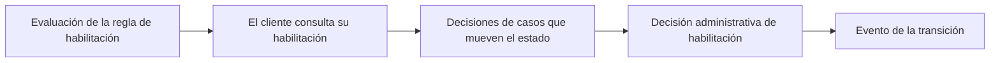

<!-- Generado por scripts/processes/generate-process-docs.ts desde src/modules/workflow-catalog/definitions. No editar a mano. -->

# P-05 · Elegibilidad y ciclo de vida del cliente

`customer_eligibility_lifecycle` · v1 · prioridad **P1** · tipo `back_office` · dueño `OPERATIONS_MANAGER` · bloques `ATLAS_BACKEND`

Cálculo de la habilitación crediticia con la regla eligibility-v1 (quince condiciones, lista completa de bloqueadores) y transiciones del estado del cliente por la máquina de estados: promoción automática desde under_review, decisión administrativa y decisiones de casos de revisión.

## Por qué existe

La habilitación no es una bandera que cualquiera escribe: se calcula con quince condiciones verificables y cada cálculo deja una fila de evidencia con la versión de la regla. Así se puede contestar «por qué se habilitó a este cliente tal día» con un dato, y ningún servicio puede saltarse la máquina de estados.

## Quién lo inicia y quién lo cierra

Lo inicia el sistema al reevaluar (envío del alta, resolución de riesgo o identidad, cada consulta de habilitación de la app) o una persona interna con una decisión administrativa. Lo cierra la promoción automática a active cuando sólo falta el estado, o la decisión de un analista (aprobar, rechazar, observar, suspender, reincorporar).

## Cuándo empieza y cuándo termina

Empieza con un cliente en under_review que ya envió su alta. Termina cuando lifecycle_status queda en active (único estado que habilita crédito), observed, rejected, suspended o blocked, con su fila en customer_status_events y una evaluación en customer_eligibility_evaluations con decision_source automatic, manual_decision o manual_override.

## Qué pasa cuando falla

Una transición ilegal responde 422 INVALID_STATUS_TRANSITION y no se fuerza. Si falta cualquier condición el cliente sigue en under_review con sus bloqueadores a la vista en la app. El cliente no se entera del cambio: los eventos customer.lifecycle.* se escriben en el outbox pero no están registrados ni tienen canal de aviso.

## Qué indicador dice que va bien

Tiempo desde el envío del alta hasta active o rejected, número de clientes en under_review con sólo ACCOUNT_NOT_ACTIVE pendiente (deberían promocionarse solos) y proporción de aprobaciones con decision_source manual_override en customer_eligibility_evaluations.

## Resultado

- **Éxito:** El cliente queda active y elegible (eligible = true, sin bloqueadores) con la evidencia de la evaluación registrada.
- **Fracaso:** El cliente queda rejected, blocked u observed, o atascado en under_review con bloqueadores que nadie resuelve.

## Dónde vive cada instancia

`ATLAS_BACKEND` · `customer.customers` · estado en `lifecycle_status` · abiertas: `under_review`, `observed`, `suspended`

## Etapas

| Etapa | Nombre | Actor | Cliente | Pantalla | Pasos |
|---|---|---|---|---|---|
| `eligibility_evaluation` | Evaluación de la regla de habilitación | system | BLOCK | — | 1 |
| `eligibility_customer_view` | El cliente consulta su habilitación | customer | CONSUMER_APP | **sin pantalla declarada** | 2 |
| `eligibility_case_decisions` | Decisiones de casos que mueven el estado | internal_user | ADMIN_PORTAL | `/internal/operations/work-queue` | 3 |
| `eligibility_admin_decision` | Decisión administrativa de habilitación | internal_user | ADMIN_PORTAL | **sin pantalla declarada** | 1 |
| `eligibility_lifecycle_event` | Evento de la transición | system | BLOCK | — | 1 |

### Evaluación de la regla de habilitación (`eligibility_evaluation`)

Quince condiciones (C1–C15); la regla nunca corta en el primer bloqueador. Sólo desde under_review y con ACCOUNT_NOT_ACTIVE como único bloqueador promueve a active sola.

| Paso | Tipo | Bloque | Operación | Roles | Eventos |
|---|---|---|---|---|---|
| Reevaluar y registrar la habilitación | event | ATLAS_BACKEND | La reevaluación la invocan otros casos de uso en su propia transacción (CustomerEligibilityService); no es una llamada HTTP. | — | customer.lifecycle.active |

### El cliente consulta su habilitación (`eligibility_customer_view`)

La app lee la habilitación y los bloqueadores para decidir si muestra «Solicitar crédito». Cada consulta deja evidencia.

| Paso | Tipo | Bloque | Operación | Roles | Eventos |
|---|---|---|---|---|---|
| Consultar la habilitación | http | ATLAS_BACKEND | `GET /customers/:customerId/eligibility` | customer, internal_operator, risk_analyst, compliance_analyst, fraud_analyst, admin, platform_admin | — |
| Leer el perfil y estado del cliente | http | ATLAS_BACKEND | `GET /customers/:customerId/me` | customer, internal_operator, risk_analyst, compliance_analyst, admin, platform_admin | — |

### Decisiones de casos que mueven el estado (`eligibility_case_decisions`)

Desde la cola de trabajo, la decisión de un caso de revisión manual puede llevar al cliente a otro estado (nextCustomerStatus) pasando por la máquina de estados.

| Paso | Tipo | Bloque | Operación | Roles | Eventos |
|---|---|---|---|---|---|
| Ver la cola de trabajo | http | ATLAS_BACKEND | `GET /operations/work-queue` | internal_operator, risk_analyst, compliance_analyst, admin, platform_admin | — |
| Decidir un caso de revisión manual con cambio de estado | http | ATLAS_BACKEND | `POST /operations/manual-review-cases/:caseId/decision` | internal_operator, risk_analyst, admin, platform_admin | — |
| Decidir un caso de fraude | http | ATLAS_BACKEND | `POST /operations/fraud-cases/:caseId/decision` | fraud_analyst, admin, platform_admin | — |

### Decisión administrativa de habilitación (`eligibility_admin_decision`)

Aprobar, rechazar, observar, suspender o reincorporar. Toda decisión negativa exige nota; aprobar con bloqueadores queda como excepción (manual_override). Sin pantalla en el portal hoy.

| Paso | Tipo | Bloque | Operación | Roles | Eventos |
|---|---|---|---|---|---|
| Decidir la habilitación | http | ATLAS_BACKEND | `POST /operations/customers/:customerId/eligibility/decision` | internal_operator, risk_analyst, compliance_analyst, admin, platform_admin | customer.lifecycle.active, customer.lifecycle.rejected, customer.lifecycle.observed, customer.lifecycle.suspended |

### Evento de la transición (`eligibility_lifecycle_event`)

Cada transición escribe customer.lifecycle.<estado> en el outbox en la misma transacción. No está en el registro de eventos: se marca procesado sin avisar a nadie.

| Paso | Tipo | Bloque | Operación | Roles | Eventos |
|---|---|---|---|---|---|
| Escribir el evento de ciclo de vida | event | ATLAS_BACKEND | Lo escribe CustomerLifecycleRepository en la transacción del cambio de estado; no hay llamada HTTP. | — | customer.lifecycle.active |

## Fuentes

- `src/modules/customers/customer-eligibility.constants.ts`
- `src/modules/customers/customer-eligibility.controller.ts`
- `src/modules/customers/application/customer-eligibility.service.ts`
- `src/modules/customers/application/customer-eligibility.evaluator.ts`
- `src/modules/customers/application/customer-eligibility-decision.service.ts`
- `src/modules/customers/application/customer-lifecycle.service.ts`
- `src/modules/customers/repositories/customer-lifecycle.repository.ts`
- `src/modules/customers/customers.controller.ts`
- `src/modules/operations/operations.controller.ts`
- `src/modules/operations/operations.service.ts`
- `src/modules/fraud/fraud.service.ts`
- `src/modules/fraud/fraud.schemas.ts`
- `docs/architecture/onboarding-flujo-corregido.md`
- `AtlasAdminPortal/src/features/operations-cases/work-queue-page.tsx`
- `AtlasAdminPortal/src/features/operations-cases/manual-review-decision-form.tsx`
- `AtlasFrontend/apps/consumer-app/src/api/endpoints/customer.ts`
- `_plan-documentar-procesos-y-cableado-portal-2026-09-26/datos/cableado.json`
