<!-- Generado por scripts/processes/generate-process-docs.ts desde src/modules/workflow-catalog/definitions. No editar a mano. -->

# C-03 · Ciclo de vida completo del cliente

`customer_full_lifecycle` · v1 · prioridad **P1** · tipo `customer_journey` · dueño `OPERATIONS_MANAGER` · bloques `ATLAS_BACKEND`

Todo lo que un cliente recorre en Atlas, de la primera pantalla al cierre: textos legales, alta, verificación de contacto, identidad, domicilio, perfil financiero, referencias, encuesta, consentimientos, evidencia externa, envío a revisión, decisión del operador, riesgo, elegibilidad, solicitud y decisión de crédito, línea, préstamos y calendario, avisos de pago con comprobante, notificaciones y derechos sobre sus datos personales.

## Por qué existe

Es el mapa completo de lo que un cliente vive en Atlas, de los textos legales al cierre: sirve para ver de un vistazo cómo encajan los procesos más pequeños (alta, identidad, crédito, pagos, privacidad) y para el QA de punta a punta.

## Quién lo inicia y quién lo cierra

Lo inicia el cliente en la app; intervienen el operador interno (revisión, habilitación), el Motor (riesgo y crédito) y el propio cliente al pagar y ejercer sus derechos; lo cierra el cierre de cuenta o la solicitud de supresión.

## Cuándo empieza y cuándo termina

Empieza con la aceptación de los textos legales y el registro, y termina con la cuenta cerrada o con los derechos del titular atendidos (derecho de supresión o portabilidad).

## Qué pasa cuando falla

Cada fallo lo gestiona el proceso pequeño que lo contiene (P-01…P-11); este recorrido compuesto sólo enlaza a ellos, así que un fallo se busca en el proceso que lo nombra.

## Qué indicador dice que va bien

Clientes que completan el recorrido sin intervención manual y tiempo desde registro hasta primera compra; ambos agregados de los procesos que lo componen.

## Resultado

- **Éxito:** El cliente queda activo con su expediente completo, su elegibilidad resuelta y —si su producto lo permite— una solicitud de crédito con decisión y una línea vigente.
- **Fracaso:** El expediente queda incompleto, la revisión lo rechaza o lo bloquea, el riesgo lo deja fuera de elegibilidad, o la solicitud se rechaza.

## Dónde vive cada instancia

`ATLAS_BACKEND` · `customer.customers` · estado en `lifecycle_status` · abiertas: `registered`, `onboarding_in_progress`, `under_review`, `observed`, `active`

## Etapas

```mermaid
flowchart LR
  legal_preview["Textos legales y capacidades"]
  account_creation["Alta de la cuenta"]
  contact_verification["Verificación de contacto"]
  identity_capture["Identidad y documentos"]
  address_capture["Domicilio y geolocalización"]
  financial_profile["Perfil financiero"]
  social_capture["Referencias y red de contactos"]
  consumer_survey["Encuesta de consumo"]
  consents_and_privacy["Consentimientos y privacidad"]
  external_evidence["Evidencia externa"]
  submission["Envío a revisión"]
  operator_review["Revisión del operador"]
  risk_assessment["Riesgo y calificación"]
  eligibility["Elegibilidad y oferta"]
  credit_application["Solicitud de crédito"]
  credit_decision["Decisión de crédito"]
  credit_line["Línea de crédito"]
  loan_servicing["Préstamos y calendario"]
  payment_claims["Avisos de pago"]
  engagement["Notificaciones y telemetría"]
  privacy_exit["Derechos y cierre"]
  legal_preview --> account_creation
  account_creation --> contact_verification
  contact_verification --> identity_capture
  identity_capture --> address_capture
  address_capture --> financial_profile
  financial_profile --> social_capture
  social_capture --> consumer_survey
  consumer_survey --> consents_and_privacy
  consents_and_privacy --> external_evidence
  external_evidence --> submission
  submission --> operator_review
  operator_review --> risk_assessment
  risk_assessment --> eligibility
  eligibility --> credit_application
  credit_application --> credit_decision
  credit_decision --> credit_line
  credit_line --> loan_servicing
  loan_servicing --> payment_claims
  payment_claims --> engagement
  engagement --> privacy_exit
```

| Etapa | Nombre | Actor | Cliente | Pantalla | Pasos |
|---|---|---|---|---|---|
| `legal_preview` | Textos legales y capacidades | customer | CONSUMER_APP | **sin pantalla declarada** | 3 |
| `account_creation` | Alta de la cuenta | customer | CONSUMER_APP | **sin pantalla declarada** | 4 |
| `contact_verification` | Verificación de contacto | customer | CONSUMER_APP | **sin pantalla declarada** | 5 |
| `identity_capture` | Identidad y documentos | customer | CONSUMER_APP | **sin pantalla declarada** | 4 |
| `address_capture` | Domicilio y geolocalización | customer | CONSUMER_APP | **sin pantalla declarada** | 3 |
| `financial_profile` | Perfil financiero | customer | CONSUMER_APP | **sin pantalla declarada** | 3 |
| `social_capture` | Referencias y red de contactos | customer | CONSUMER_APP | **sin pantalla declarada** | 3 |
| `consumer_survey` | Encuesta de consumo | customer | CONSUMER_APP | **sin pantalla declarada** | 2 |
| `consents_and_privacy` | Consentimientos y privacidad | customer | CONSUMER_APP | **sin pantalla declarada** | 2 |
| `external_evidence` | Evidencia externa | customer | CONSUMER_APP | **sin pantalla declarada** | 4 |
| `submission` | Envío a revisión | customer | CONSUMER_APP | **sin pantalla declarada** | 4 |
| `operator_review` | Revisión del operador | internal_user | ADMIN_PORTAL | **sin pantalla declarada** | 6 |
| `risk_assessment` | Riesgo y calificación | system | BLOCK | — | 3 |
| `eligibility` | Elegibilidad y oferta | customer | CONSUMER_APP | **sin pantalla declarada** | 2 |
| `credit_application` | Solicitud de crédito | customer | CONSUMER_APP | **sin pantalla declarada** | 2 |
| `credit_decision` | Decisión de crédito | internal_user | ADMIN_PORTAL | **sin pantalla declarada** | 2 |
| `credit_line` | Línea de crédito | customer | CONSUMER_APP | **sin pantalla declarada** | 2 |
| `loan_servicing` | Préstamos y calendario | customer | CONSUMER_APP | **sin pantalla declarada** | 3 |
| `payment_claims` | Avisos de pago | customer | CONSUMER_APP | **sin pantalla declarada** | 3 |
| `engagement` | Notificaciones y telemetría | customer | CONSUMER_APP | **sin pantalla declarada** | 7 |
| `privacy_exit` | Derechos y cierre | customer | CONSUMER_APP | **sin pantalla declarada** | 3 |

### Textos legales y capacidades (`legal_preview`)

Lo que la app consulta ANTES de pedir un solo dato: qué se va a consentir y por qué canal se puede verificar.

| Paso | Tipo | Bloque | Operación | Roles | Eventos |
|---|---|---|---|---|---|
| Consentimientos vigentes | http | ATLAS_BACKEND | `GET /consent-documents/active` | — | — |
| Canales de verificación disponibles | http | ATLAS_BACKEND | `GET /customer-onboarding/verification-channels` | — | — |
| Catálogo de la encuesta de consumo | http | ATLAS_BACKEND | `GET /customer-onboarding/consumer-survey/catalog` | — | — |

### Alta de la cuenta (`account_creation`)

Crea el cliente, sus credenciales y su primera sesión en una sola transacción.

| Paso | Tipo | Bloque | Operación | Roles | Eventos |
|---|---|---|---|---|---|
| Iniciar el alta | http | ATLAS_BACKEND | `POST /customer-onboarding/start` | — | customer.registered |
| Iniciar sesión | http | ATLAS_BACKEND | `POST /auth/login` | — | — |
| Identidad de la sesión | http | ATLAS_BACKEND | `GET /auth/me` | — | — |
| Abrir sesión de app | http | ATLAS_BACKEND | `POST /customers/:customerId/sessions/start` | — | — |

### Verificación de contacto (`contact_verification`)

Alta del método de contacto y confirmación por código de un solo uso. Sólo se guarda el hash del código.

| Paso | Tipo | Bloque | Operación | Roles | Eventos |
|---|---|---|---|---|---|
| Registrar método de contacto | http | ATLAS_BACKEND | `POST /customer-onboarding/:customerId/contact-methods` | — | — |
| Pedir el código | http | ATLAS_BACKEND | `POST /customer-onboarding/:customerId/contact-verification/request` | — | — |
| Confirmar el código | http | ATLAS_BACKEND | `POST /customer-onboarding/:customerId/contact-verification/submit` | — | — |
| Verificación por WhatsApp — envío | http | ATLAS_BACKEND | `POST /whatsapp/verification/start` | — | — |
| Verificación por WhatsApp — confirmación | http | ATLAS_BACKEND | `POST /whatsapp/verification/confirm` | — | — |

### Identidad y documentos (`identity_capture`)

Cédula, selfie y su verificación. Es el bloque con más dato personal del recorrido.

| Paso | Tipo | Bloque | Operación | Roles | Eventos |
|---|---|---|---|---|---|
| URL firmada para subir documentos | http | ATLAS_BACKEND | `POST /customer-onboarding/:customerId/documents/upload-url` | — | — |
| Paquete de identidad | http | ATLAS_BACKEND | `POST /customer-onboarding/:customerId/identity-package` | — | — |
| Verificar identidad | http | ATLAS_BACKEND | `POST /customer-onboarding/:customerId/identity-verification` | — | — |
| Documentos de evidencia del expediente | http | ATLAS_BACKEND | `GET /customer-onboarding/:customerId/evidence-documents` | — | — |

### Domicilio y geolocalización (`address_capture`)

Dirección declarada, su posición y las señales de ubicación que la respaldan.

| Paso | Tipo | Bloque | Operación | Roles | Eventos |
|---|---|---|---|---|---|
| Paquete de domicilio | http | ATLAS_BACKEND | `POST /customer-onboarding/:customerId/address-package` | — | — |
| Señales de ubicación | http | ATLAS_BACKEND | `POST /customers/:customerId/location-pings` | — | — |
| Libreta de direcciones | http | ATLAS_BACKEND | `POST /customers/:customerId/address-book` | — | — |

### Perfil financiero (`financial_profile`)

Ingresos, gastos y capacidad declarada, más el extracto bancario que los respalda.

| Paso | Tipo | Bloque | Operación | Roles | Eventos |
|---|---|---|---|---|---|
| Declarar perfil financiero | http | ATLAS_BACKEND | `PUT /customer-onboarding/:customerId/financial-profile` | — | — |
| Subir extracto bancario | http | ATLAS_BACKEND | `POST /customers/:customerId/bank-statements` | — | — |
| Estado del último extracto | http | ATLAS_BACKEND | `GET /customers/:customerId/bank-statements/latest` | — | — |

### Referencias y red de contactos (`social_capture`)

Personas que responden por el cliente y la instantánea de su libreta, con su consentimiento.

| Paso | Tipo | Bloque | Operación | Roles | Eventos |
|---|---|---|---|---|---|
| Agregar referencia | http | ATLAS_BACKEND | `POST /customer-onboarding/:customerId/reference-contacts` | — | — |
| Referencias registradas | http | ATLAS_BACKEND | `GET /customer-onboarding/:customerId/reference-contacts` | — | — |
| Instantánea de la libreta | http | ATLAS_BACKEND | `POST /customer-onboarding/:customerId/contacts-snapshot` | — | — |

### Encuesta de consumo (`consumer_survey`)

Hábitos de gasto declarados. Alimentan la segmentación y la oferta.

| Paso | Tipo | Bloque | Operación | Roles | Eventos |
|---|---|---|---|---|---|
| Respuestas actuales | http | ATLAS_BACKEND | `GET /customer-onboarding/:customerId/consumer-survey` | — | — |
| Guardar respuestas | http | ATLAS_BACKEND | `PUT /customer-onboarding/:customerId/consumer-survey` | — | — |

### Consentimientos y privacidad (`consents_and_privacy`)

Decisiones del cliente sobre el uso de sus datos, por propósito y por versión del texto.

| Paso | Tipo | Bloque | Operación | Roles | Eventos |
|---|---|---|---|---|---|
| Decidir sobre consentimientos | http | ATLAS_BACKEND | `POST /customers/:customerId/privacy/consent-decisions` | — | — |
| Consentimiento para evidencia externa | http | ATLAS_BACKEND | `POST /external-data/consents` | — | — |

### Evidencia externa (`external_evidence`)

Consulta a proveedores: primero el costo, después la consulta, después las features derivadas.

| Paso | Tipo | Bloque | Operación | Roles | Eventos |
|---|---|---|---|---|---|
| Vista previa de costo | http | ATLAS_BACKEND | `POST /external-data/requests/preview` | — | — |
| Consultar al proveedor | http | ATLAS_BACKEND | `POST /external-data/requests` | — | external.request.completed |
| Features derivadas | http | ATLAS_BACKEND | `GET /external-data/users/:customerId/features` | — | — |
| Observaciones registradas | http | ATLAS_BACKEND | `GET /external-data/users/:customerId/observations` | — | — |

### Envío a revisión (`submission`)

El cliente da por completo su expediente y lo entrega.

| Paso | Tipo | Bloque | Operación | Roles | Eventos |
|---|---|---|---|---|---|
| Enviar el expediente | http | ATLAS_BACKEND | `POST /customer-onboarding/:customerId/submit` | — | onboarding.submitted |
| Estado del onboarding | http | ATLAS_BACKEND | `GET /customer-onboarding/:customerId/status` | — | — |
| Observaciones al cliente | http | ATLAS_BACKEND | `GET /customer-onboarding/:customerId/observations` | — | — |
| Avance sobre el catálogo de flujos | http | ATLAS_BACKEND | `GET /customers/:customerId/workflow-progress` | — | — |

### Revisión del operador (`operator_review`)

Un actor DISTINTO del cliente resuelve identidad, cumplimiento y habilitación. Su token no es el del cliente.

| Paso | Tipo | Bloque | Operación | Roles | Eventos |
|---|---|---|---|---|---|
| Cola de verificación de contacto pendiente | http | ATLAS_BACKEND | `GET /operations/customers/pending-contact-verification` | internal_operator, compliance_analyst, risk_analyst, admin | — |
| Decidir sobre la identidad | http | ATLAS_BACKEND | `POST /operations/customers/:customerId/identity-verification/decision` | internal_operator, compliance_analyst, risk_analyst, admin | — |
| Tamizaje de cumplimiento | http | ATLAS_BACKEND | `POST /operations/customers/:customerId/compliance/screening` | internal_operator, compliance_analyst, risk_analyst, admin | — |
| Resolver coincidencias | http | ATLAS_BACKEND | `POST /operations/customers/:customerId/compliance/clear-matches` | internal_operator, compliance_analyst, risk_analyst, admin | — |
| Resumen de investigación | http | ATLAS_BACKEND | `GET /operations/customers/:customerId/investigation-summary` | internal_operator, compliance_analyst, risk_analyst, admin | — |
| Decidir la habilitación | http | ATLAS_BACKEND | `POST /operations/customers/:customerId/eligibility/decision` | internal_operator, compliance_analyst, risk_analyst, admin | customer.eligibility.decided |

### Riesgo y calificación (`risk_assessment`)

Evaluación de riesgo y calificación crediticia con las reglas y la política vigentes.

| Paso | Tipo | Bloque | Operación | Roles | Eventos |
|---|---|---|---|---|---|
| Evaluar riesgo | http | ATLAS_BACKEND | `POST /customers/:customerId/risk-assessments` | — | risk.assessed |
| Calificar al cliente | http | ATLAS_BACKEND | `POST /operations/credit-rating/customers/:customerId/rate` | risk_analyst, admin, system | — |
| Calificación del cliente | http | ATLAS_BACKEND | `GET /customers/:customerId/credit-rating` | — | — |

### Elegibilidad y oferta (`eligibility`)

Si el cliente puede pedir crédito y qué productos le corresponden.

| Paso | Tipo | Bloque | Operación | Roles | Eventos |
|---|---|---|---|---|---|
| Veredicto de elegibilidad | http | ATLAS_BACKEND | `GET /customers/:customerId/eligibility` | — | — |
| Productos disponibles | http | ATLAS_BACKEND | `GET /customers/:customerId/credit-products` | — | — |

### Solicitud de crédito (`credit_application`)

El cliente pide, dentro de las condiciones que el producto permite.

| Paso | Tipo | Bloque | Operación | Roles | Eventos |
|---|---|---|---|---|---|
| Solicitar crédito | http | ATLAS_BACKEND | `POST /customers/:customerId/credit-applications` | — | credit.application.created |
| Solicitudes del cliente | http | ATLAS_BACKEND | `GET /customers/:customerId/credit-applications` | — | — |

### Decisión de crédito (`credit_decision`)

Un operador autorizado decide. El cliente no decide su propio crédito.

| Paso | Tipo | Bloque | Operación | Roles | Eventos |
|---|---|---|---|---|---|
| Detalle de la solicitud | http | ATLAS_BACKEND | `GET /operations/credit/applications/:applicationId` | internal_operator, risk_analyst, admin | — |
| Decidir la solicitud | http | ATLAS_BACKEND | `POST /operations/credit/applications/:applicationId/decision` | internal_operator, risk_analyst, admin | credit.application.decided |

### Línea de crédito (`credit_line`)

El cupo vigente del cliente y su historia.

| Paso | Tipo | Bloque | Operación | Roles | Eventos |
|---|---|---|---|---|---|
| Línea vigente | http | ATLAS_BACKEND | `GET /customers/:customerId/credit-line` | — | — |
| Historia de la línea | http | ATLAS_BACKEND | `GET /customers/:customerId/credit-line/history` | — | — |

### Préstamos y calendario (`loan_servicing`)

Lo que el cliente debe, cuándo y en qué lo gasta.

| Paso | Tipo | Bloque | Operación | Roles | Eventos |
|---|---|---|---|---|---|
| Préstamos del cliente | http | ATLAS_BACKEND | `GET /customers/:customerId/loans` | — | — |
| Calendario de pagos | http | ATLAS_BACKEND | `GET /customers/:customerId/payment-calendar` | — | — |
| Gasto por categoría | http | ATLAS_BACKEND | `GET /customers/:customerId/spending-by-category` | — | — |

### Avisos de pago (`payment_claims`)

El cliente avisa que pagó y adjunta el comprobante. Avisar no es haber pagado: lo verifica el otro lado.

| Paso | Tipo | Bloque | Operación | Roles | Eventos |
|---|---|---|---|---|---|
| Instrucciones de pago de la cuota | http | ATLAS_BACKEND | `GET /mobile/customers/:customerId/payment-claims/instructions/:installmentId` | — | — |
| Avisar el pago | http | ATLAS_BACKEND | `POST /mobile/customers/:customerId/payment-claims` | — | payment.claim.created |
| Adjuntar comprobante | http | ATLAS_BACKEND | `POST /mobile/customers/:customerId/payment-claims/proof-tickets` | — | — |

### Notificaciones y telemetría (`engagement`)

Cómo la app se mantiene al día y qué reporta de vuelta.

| Paso | Tipo | Bloque | Operación | Roles | Eventos |
|---|---|---|---|---|---|
| Registrar el dispositivo para avisos | http | ATLAS_BACKEND | `POST /customers/:customerId/device-tokens` | — | — |
| Preferencias de aviso | http | ATLAS_BACKEND | `PATCH /customers/:customerId/notification-preferences` | — | — |
| Avisos sin leer | http | ATLAS_BACKEND | `GET /customers/:customerId/notifications/unread-count` | — | — |
| Bandeja de avisos | http | ATLAS_BACKEND | `GET /customers/:customerId/notifications` | — | — |
| Marcar como leído | http | ATLAS_BACKEND | `POST /customers/:customerId/notifications/:notificationId/read` | — | — |
| Telemetría de uso | http | ATLAS_BACKEND | `POST /customers/:customerId/telemetry/batch` | — | — |
| Latido de sesión | http | ATLAS_BACKEND | `POST /customers/:customerId/sessions/:sessionId/heartbeat` | — | — |

### Derechos y cierre (`privacy_exit`)

Lo que el cliente puede exigir sobre sus datos, y cómo cierra.

| Paso | Tipo | Bloque | Operación | Roles | Eventos |
|---|---|---|---|---|---|
| Ejercer derechos sobre los datos | http | ATLAS_BACKEND | `POST /customers/:customerId/privacy/data-subject-requests` | — | privacy.data_subject_request.created |
| Cerrar la sesión de app | http | ATLAS_BACKEND | `POST /customers/:customerId/sessions/:sessionId/end` | — | — |
| Cerrar sesión | http | ATLAS_BACKEND | `POST /auth/logout` | — | — |

## Fuentes

- `src/database/seeders/demo/flujo-cliente-completo.seed-data.ts`
