<!-- Generado por scripts/processes/generate-process-docs.ts desde src/modules/workflow-catalog/definitions. No editar a mano. -->

# P-02 · Alta por fases y captura KYC del cliente

`customer_onboarding_kyc` · v1 · prioridad **P0** · tipo `customer_journey` · dueño `OPERATIONS_MANAGER` · bloques `ATLAS_BACKEND`

Registro progresivo del cliente con cuenta: carnet y selfie, datos personales, domicilio, situación económica, referencias, permisos del teléfono y encuesta de hábitos, con guardado parcial, hasta el envío del paquete a revisión. Incluye la mirada del equipo interno sobre el expediente.

## Por qué existe

Para decidir si a una persona se le puede dar crédito hace falta saber quién es, dónde vive, de qué vive y a quién se puede llamar. Este proceso reúne esa evidencia en un solo expediente, en cuatro fases y con guardado parcial, para que la persona pueda dejarlo y retomarlo sin perder lo cargado.

## Quién lo inicia y quién lo cierra

Lo inicia el cliente desde el centro de registro de la app, una vez que ya tiene cuenta y contacto verificado, y lo cierra él mismo al pulsar «Enviar a revisión». El operador interno sólo mira: revisa el expediente, las imágenes del carnet y el resumen de investigación desde la cola de trabajo del portal.

## Cuándo empieza y cuándo termina

Empieza cuando la app lee el estado del alta y encuentra la primera sección pendiente (el orden vive en ONBOARDING_SECTION_CODES: contacto, identidad, datos personales, domicilio, economía, referencias, permisos del teléfono y encuesta). Termina cuando el envío deja al cliente en under_review, cierra el flujo como completed y dispara la evaluación de riesgo.

## Qué pasa cuando falla

Si falta una sección, el envío responde 422 ONBOARDING_INCOMPLETE con la lista de secciones pendientes y el cliente sigue editando. Un envío repetido responde ONBOARDING_ALREADY_SUBMITTED. Quien deja el alta a medias no recibe aviso: el job mark_abandoned_onboardings marca el flujo como abandonado tras 30 días sin actividad, sin tocar el estado del cliente.

## Qué indicador dice que va bien

Tasa de flujos de alta cerrados como completed frente a abandoned en onboarding_flows (completion_status, total_duration_seconds) y tiempo por fase en onboarding_step_events; un aumento de 422 ONBOARDING_INCOMPLETE en el envío indica que la app deja pasar secciones incompletas.

## Resultado

- **Éxito:** El paquete del alta está completo y enviado: el cliente queda en under_review y el flujo de alta cerrado como completed.
- **Fracaso:** El alta se queda a medias (flujo abandoned tras 30 días sin actividad) o el envío se rechaza por secciones incompletas.

## Dónde vive cada instancia

`ATLAS_BACKEND` · `telemetry.onboarding_flows` · estado en `completion_status` · abiertas: `in_progress`

## Etapas

```mermaid
flowchart LR
  kyc_registration_center["Centro de registro"]
  kyc_identity_capture["Fase identidad: carnet y selfie"]
  kyc_personal_data["Datos personales"]
  kyc_situation["Fase situación: domicilio, economía y referencias"]
  kyc_device_permissions["Permisos del teléfono"]
  kyc_consumer_survey["Fase hábitos: encuesta de consumo"]
  kyc_submission["Envío a revisión"]
  kyc_abandonment["Cierre de altas abandonadas"]
  kyc_back_office_review["Revisión del expediente por el equipo interno"]
  kyc_compliance_screening["Cribado de listas restrictivas"]
  kyc_registration_center --> kyc_identity_capture
  kyc_identity_capture --> kyc_personal_data
  kyc_personal_data --> kyc_situation
  kyc_situation --> kyc_device_permissions
  kyc_device_permissions --> kyc_consumer_survey
  kyc_consumer_survey --> kyc_submission
  kyc_submission --> kyc_abandonment
  kyc_abandonment --> kyc_back_office_review
  kyc_back_office_review --> kyc_compliance_screening
```

| Etapa | Nombre | Actor | Cliente | Pantalla | Pasos |
|---|---|---|---|---|---|
| `kyc_registration_center` | Centro de registro | customer | CONSUMER_APP | **sin pantalla declarada** | 1 |
| `kyc_identity_capture` | Fase identidad: carnet y selfie | customer | CONSUMER_APP | **sin pantalla declarada** | 3 |
| `kyc_personal_data` | Datos personales | customer | CONSUMER_APP | **sin pantalla declarada** | 1 |
| `kyc_situation` | Fase situación: domicilio, economía y referencias | customer | CONSUMER_APP | **sin pantalla declarada** | 6 |
| `kyc_device_permissions` | Permisos del teléfono | customer | CONSUMER_APP | **sin pantalla declarada** | 2 |
| `kyc_consumer_survey` | Fase hábitos: encuesta de consumo | customer | CONSUMER_APP | **sin pantalla declarada** | 3 |
| `kyc_submission` | Envío a revisión | customer | CONSUMER_APP | **sin pantalla declarada** | 2 |
| `kyc_abandonment` | Cierre de altas abandonadas | system | BLOCK | — | 2 |
| `kyc_back_office_review` | Revisión del expediente por el equipo interno | internal_user | ADMIN_PORTAL | `/internal/operations/work-queue` | 1 |
| `kyc_investigation_summary` | Resumen de investigación del cliente | internal_user | ADMIN_PORTAL | `/internal/operations/customers/[customerId]/investigation-summary` | 4 |
| `kyc_customer_file` | Expediente de archivos del cliente | internal_user | ADMIN_PORTAL | `/internal/files/cliente/[customerId]` | 1 |
| `kyc_compliance_screening` | Cribado de listas restrictivas | internal_user | ADMIN_PORTAL | **sin pantalla declarada** | 2 |

### Centro de registro (`kyc_registration_center`)

La app lee el avance del alta y abre la primera sección pendiente. Es el punto de retorno cada vez que el cliente vuelve.

| Paso | Tipo | Bloque | Operación | Roles | Eventos |
|---|---|---|---|---|---|
| Consultar el avance del alta | http | ATLAS_BACKEND | `GET /customer-onboarding/:customerId/status` | customer, internal_operator, risk_analyst, admin, platform_admin | — |

### Fase identidad: carnet y selfie (`kyc_identity_capture`)

El carnet va ANTES que los datos personales: el cliente sube anverso, reverso y selfie al almacén y registra el paquete. La verificación del carnet es el proceso P-03.

| Paso | Tipo | Bloque | Operación | Roles | Eventos |
|---|---|---|---|---|---|
| Pedir permiso de subida | http | ATLAS_BACKEND | `POST /customer-onboarding/:customerId/documents/upload-url` | customer, internal_operator, risk_analyst, admin, platform_admin | — |
| Subir la imagen al almacén | external | ATLAS_BACKEND | La subida va del teléfono al almacén de objetos con la URL firmada; no pasa por la API de Atlas. | — | — |
| Registrar el paquete de identidad | http | ATLAS_BACKEND | `POST /customer-onboarding/:customerId/identity-package` | customer, internal_operator, risk_analyst, admin, platform_admin | — |

### Datos personales (`kyc_personal_data`)

Nombre, apellido y fecha de nacimiento (18 a 100 años); guardado parcial.

| Paso | Tipo | Bloque | Operación | Roles | Eventos |
|---|---|---|---|---|---|
| Guardar los datos personales | http | ATLAS_BACKEND | `PATCH /customer-onboarding/:customerId/profile` | customer, internal_operator, risk_analyst, admin, platform_admin | — |

### Fase situación: domicilio, economía y referencias (`kyc_situation`)

Domicilio, seis atributos económicos obligatorios y al menos dos referencias personales.

| Paso | Tipo | Bloque | Operación | Roles | Eventos |
|---|---|---|---|---|---|
| Entregar el paquete de domicilio | http | ATLAS_BACKEND | `POST /customer-onboarding/:customerId/address-package` | customer, internal_operator, risk_analyst, admin, platform_admin | — |
| Registrar la situación laboral y económica | http | ATLAS_BACKEND | `PUT /customer-onboarding/:customerId/financial-profile` | customer, internal_operator, risk_analyst, admin, platform_admin | — |
| Registrar referencias personales | http | ATLAS_BACKEND | `POST /customer-onboarding/:customerId/reference-contacts` | customer, internal_operator, risk_analyst, admin, platform_admin | — |
| Listar las referencias | http | ATLAS_BACKEND | `GET /customer-onboarding/:customerId/reference-contacts` | customer, internal_operator, risk_analyst, admin, platform_admin | — |
| Quitar una referencia | http | ATLAS_BACKEND | `DELETE /customer-onboarding/:customerId/reference-contacts/:referenceId` | customer, internal_operator, risk_analyst, admin, platform_admin | — |
| Aportar una evidencia de apoyo | http | ATLAS_BACKEND | `POST /customer-onboarding/:customerId/supporting-evidence` | customer | — |

### Permisos del teléfono (`kyc_device_permissions`)

La sección se cierra con una DECISIÓN (sí o no) sobre la agenda y la ubicación; con la agenda concedida la app envía un resumen agregado, nunca los contactos.

| Paso | Tipo | Bloque | Operación | Roles | Eventos |
|---|---|---|---|---|---|
| Registrar la decisión sobre agenda y ubicación | http | ATLAS_BACKEND | `POST /customers/:customerId/privacy/consent-decisions` | customer, internal_operator, compliance_analyst, admin, platform_admin | — |
| Enviar el resumen agregado de la agenda | http | ATLAS_BACKEND | `POST /customer-onboarding/:customerId/contacts-snapshot` | customer, internal_operator, risk_analyst, admin, platform_admin | — |

### Fase hábitos: encuesta de consumo (`kyc_consumer_survey`)

Seis preguntas de hábitos de consumo, con guardado parcial.

| Paso | Tipo | Bloque | Operación | Roles | Eventos |
|---|---|---|---|---|---|
| Leer el catálogo de la encuesta | http | ATLAS_BACKEND | `GET /customer-onboarding/consumer-survey/catalog` | customer, internal_operator, risk_analyst, admin, platform_admin | — |
| Leer las respuestas guardadas | http | ATLAS_BACKEND | `GET /customer-onboarding/:customerId/consumer-survey` | customer, internal_operator, risk_analyst, admin, platform_admin | — |
| Guardar las respuestas | http | ATLAS_BACKEND | `PUT /customer-onboarding/:customerId/consumer-survey` | customer, internal_operator, risk_analyst, admin, platform_admin | — |

### Envío a revisión (`kyc_submission`)

Único punto donde se valida la completitud. Pasa al cliente a under_review, cierra el flujo, dispara la evaluación de riesgo (P-04) y reevalúa la elegibilidad.

| Paso | Tipo | Bloque | Operación | Roles | Eventos |
|---|---|---|---|---|---|
| Enviar el paquete a revisión | http | ATLAS_BACKEND | `POST /customer-onboarding/:customerId/submit` | customer, internal_operator, risk_analyst, admin, platform_admin | customer.lifecycle.under_review |
| Consultar las observaciones | http | ATLAS_BACKEND | `GET /customer-onboarding/:customerId/observations` | customer, internal_operator, risk_analyst, admin, platform_admin | — |

### Cierre de altas abandonadas (`kyc_abandonment`)

Marca como abandoned los flujos sin actividad en 30 días. Marca el flujo, no al cliente: puede volver y retomar.

| Paso | Tipo | Bloque | Operación | Roles | Eventos |
|---|---|---|---|---|---|
| Marcar altas abandonadas | job | ATLAS_BACKEND | job `mark_abandoned_onboardings` | — | — |
| Marcar altas abandonadas a mano | http | ATLAS_BACKEND | `POST /customer-onboarding/jobs/mark-abandoned` | admin, platform_admin, system | — |

### Revisión del expediente por el equipo interno (`kyc_back_office_review`)

El operador localiza al cliente en la cola de trabajo y abre su resumen de investigación con las imágenes del carnet.

| Paso | Tipo | Bloque | Operación | Roles | Eventos |
|---|---|---|---|---|---|
| Ver la cola de trabajo | http | ATLAS_BACKEND | `GET /operations/work-queue` | internal_operator, risk_analyst, compliance_analyst, admin, platform_admin | — |

### Resumen de investigación del cliente (`kyc_investigation_summary`)

Expediente del cliente con sus documentos; desde aquí el operador puede resolver la identidad (P-03).

| Paso | Tipo | Bloque | Operación | Roles | Eventos |
|---|---|---|---|---|---|
| Abrir el resumen de investigación | http | ATLAS_BACKEND | `GET /operations/customers/:customerId/investigation-summary` | internal_operator, risk_analyst, compliance_analyst, admin, platform_admin | — |
| Listar los documentos del cliente | http | ATLAS_BACKEND | `GET /customer-onboarding/:customerId/evidence-documents` | internal_operator, risk_analyst, admin, platform_admin | — |
| Ver un documento | http | ATLAS_BACKEND | `GET /customer-onboarding/:customerId/evidence-documents/:documentId/content` | internal_operator, risk_analyst, admin, platform_admin | — |
| Ver el resumen de comportamiento del alta | http | ATLAS_BACKEND | `GET /operations/customers/:customerId/behavior-summary` | internal_operator, risk_analyst, compliance_analyst, admin, platform_admin | — |

### Expediente de archivos del cliente (`kyc_customer_file`)

Vista de archivos del cliente en el portal, enlazada desde el resumen de investigación.

| Paso | Tipo | Bloque | Operación | Roles | Eventos |
|---|---|---|---|---|---|
| Revisar el expediente de archivos | manual | ATLAS_BACKEND | Consulta humana del expediente en el portal; sus lecturas pertenecen al módulo de archivos, no a este proceso. | — | — |

### Cribado de listas restrictivas (`kyc_compliance_screening`)

Coteja por hash nombre, teléfono y correo contra las listas vigentes; una coincidencia bloquea la habilitación (COMPLIANCE_MATCH_PENDING). Hoy sólo existe por HTTP: sin pantalla y sin job que lo dispare.

| Paso | Tipo | Bloque | Operación | Roles | Eventos |
|---|---|---|---|---|---|
| Ejecutar el cribado | http | ATLAS_BACKEND | `POST /operations/customers/:customerId/compliance/screening` | compliance_analyst, risk_analyst, admin, platform_admin, system | — |
| Descartar coincidencias | http | ATLAS_BACKEND | `POST /operations/customers/:customerId/compliance/clear-matches` | compliance_analyst, admin, platform_admin | — |

## Fuentes

- `src/modules/customer-onboarding/customer-onboarding-status.controller.ts`
- `src/modules/customer-onboarding/application/customer-onboarding-status.service.ts`
- `src/modules/customer-onboarding/customer-onboarding-profile.controller.ts`
- `src/modules/customer-onboarding/customer-packages.controller.ts`
- `src/modules/customer-onboarding/customer-supporting-evidence.controller.ts`
- `src/modules/customer-onboarding/consumer-survey/consumer-survey.controller.ts`
- `src/modules/customer-onboarding/customer-evidence-view.controller.ts`
- `src/modules/customer-onboarding/customer-verification.controller.ts`
- `src/modules/customer-onboarding/application/customer-compliance-screening.service.ts`
- `src/modules/customer-onboarding/application/onboarding-abandonment.service.ts`
- `src/modules/customers/customer-eligibility.constants.ts`
- `src/modules/operations/operations.controller.ts`
- `src/modules/runtime-jobs/scheduled-jobs.catalog.ts`
- `docs/architecture/onboarding-flujo-corregido.md`
- `AtlasFrontend/apps/consumer-app/src/api/endpoints/onboarding.ts`
- `AtlasAdminPortal/src/features/operations-cases/services.ts`
- `AtlasAdminPortal/src/features/operations-cases/identity-evidence-panel.tsx`
- `memoria atlas-alta-por-fases-y-bitacora`
- `_plan-alta-por-fases-y-bitacora-2026-09-17/PLAN.md`
- `_plan-documentar-procesos-y-cableado-portal-2026-09-26/datos/cableado.json`
