<!-- Generado por scripts/processes/generate-process-docs.ts desde src/modules/workflow-catalog/definitions. No editar a mano. -->

# C-04 · Cliente y comercio: del alta del partner a la compra verificada

`customer_partner_commerce` · v1 · prioridad **P1** · tipo `partner_journey` · dueño `OPERATIONS_MANAGER` · bloques `ATLAS_BACKEND`

El recorrido completo del comercio y su cruce con el cliente: alta del partner, representante legal, registro comercial, verificación de contacto, sucursales y terminales, emisión de QR, envío a revisión, KYB y decisión del operador, alta de usuarios del comercio, resolución del QR en la caja, solicitud de crédito en el punto de venta, aceptación por el comercio, aviso de pago con comprobante, verificación y cartera, y soporte del comercio.

## Por qué existe

Muestra cómo se cruzan el comercio y el cliente: sin un comercio activo con QR aprobados no hay dónde comprar, y sin la verificación del comprobante por el comercio la cuota no se da por pagada.

## Quién lo inicia y quién lo cierra

Lo inicia el comercio al empezar su alta; intervienen el operador interno (KYB y aprobación del QR), el cliente (compra y aviso de pago) y el comercio (aceptación y verificación); lo cierra la cuota verificada en cartera.

## Cuándo empieza y cuándo termina

Empieza con POST /partner-onboarding/start y termina cuando una compra del cliente en ese comercio tiene su pago verificado y conciliado en la cartera.

## Qué pasa cuando falla

Un KYB observado o un QR rechazado deja al comercio sin poder vender y aparece en la cola del portal; un comprobante rechazado devuelve el aviso de pago al cliente con el motivo.

## Qué indicador dice que va bien

Comercios que pasan de alta a activos en 10 días y avisos de pago verificados en menos de 48 h.

## Resultado

- **Éxito:** El comercio queda activo con sus QR aprobados y sus usuarios operando, y una compra del cliente llega a aceptada con su pago verificado.
- **Fracaso:** El KYB rechaza o bloquea al comercio, sus QR no se aprueban, la solicitud del cliente en la caja se rechaza, o el pago avisado no se verifica.

## Dónde vive cada instancia

`ATLAS_BACKEND` · `partner.partner_profiles` · estado en `onboarding_status`

## Etapas

```mermaid
flowchart LR
  partner_signup["Alta del comercio"]
  partner_identity["Identidad del negocio"]
  partner_contact["Verificación de contacto del comercio"]
  partner_network["Sucursales y terminales"]
  partner_qr["Códigos QR de cobro"]
  partner_submission["Envío a revisión"]
  partner_review["KYB y decisión del operador"]
  merchant_users["Usuarios del comercio"]
  point_of_sale["El encuentro en la caja"]
  pos_credit["Crédito en el punto de venta"]
  payment_settlement["Aviso de pago y verificación"]
  partner_portfolio["Cartera del comercio"]
  partner_support["Soporte del comercio"]
  partner_signup --> partner_identity
  partner_identity --> partner_contact
  partner_contact --> partner_network
  partner_network --> partner_qr
  partner_qr --> partner_submission
  partner_submission --> partner_review
  partner_review --> merchant_users
  merchant_users --> point_of_sale
  point_of_sale --> pos_credit
  pos_credit --> payment_settlement
  payment_settlement --> partner_portfolio
  partner_portfolio --> partner_support
```

| Etapa | Nombre | Actor | Cliente | Pantalla | Pasos |
|---|---|---|---|---|---|
| `partner_signup` | Alta del comercio | merchant_user | ERP_PORTAL | `/portal-comercio/expediente` | 3 |
| `partner_identity` | Identidad del negocio | merchant_user | ERP_PORTAL | `/portal-comercio/expediente` | 4 |
| `partner_contact` | Verificación de contacto del comercio | merchant_user | ERP_PORTAL | `/portal-comercio/expediente` | 2 |
| `partner_network` | Sucursales y terminales | merchant_user | ERP_PORTAL | `/portal-comercio/expediente` | 6 |
| `partner_qr` | Códigos QR de cobro | merchant_user | ERP_PORTAL | `/portal-comercio/expediente` | 4 |
| `partner_submission` | Envío a revisión | merchant_user | ERP_PORTAL | `/portal-comercio/expediente` | 1 |
| `partner_review` | KYB y decisión del operador | internal_user | ADMIN_PORTAL | `/internal/operations/partners` | 6 |
| `merchant_users` | Usuarios del comercio | merchant_user | ERP_PORTAL | **sin pantalla declarada** | 7 |
| `point_of_sale` | El encuentro en la caja | customer | CONSUMER_APP | **sin pantalla declarada** | 1 |
| `pos_credit` | Crédito en el punto de venta | customer | CONSUMER_APP | **sin pantalla declarada** | 5 |
| `payment_settlement` | Aviso de pago y verificación | customer | CONSUMER_APP | **sin pantalla declarada** | 5 |
| `partner_portfolio` | Cartera del comercio | merchant_user | ERP_PORTAL | `/portal-comercio/cartera` | 1 |
| `partner_support` | Soporte del comercio | merchant_user | ERP_PORTAL | `/portal-comercio/soporte` | 6 |

### Alta del comercio (`partner_signup`)

El comercio se registra y abre su expediente.

| Paso | Tipo | Bloque | Operación | Roles | Eventos |
|---|---|---|---|---|---|
| Iniciar el alta del comercio | http | ATLAS_BACKEND | `POST /partner-onboarding/start` | — | — |
| Mi comercio | http | ATLAS_BACKEND | `GET /partner-onboarding/mine` | — | — |
| Estado del alta | http | ATLAS_BACKEND | `GET /partner-onboarding/:partnerId/status` | — | — |

### Identidad del negocio (`partner_identity`)

Quién responde por el comercio y con qué papeles. Es el bloque que sostiene el KYB.

| Paso | Tipo | Bloque | Operación | Roles | Eventos |
|---|---|---|---|---|---|
| URL firmada para documentos | http | ATLAS_BACKEND | `POST /partner-onboarding/:partnerId/documents/upload-url` | — | — |
| Representante legal | http | ATLAS_BACKEND | `POST /partner-onboarding/:partnerId/legal-representative` | — | — |
| Registro comercial | http | ATLAS_BACKEND | `POST /partner-onboarding/:partnerId/commercial-registry` | — | — |
| Perfil comercial | http | ATLAS_BACKEND | `PATCH /partner-onboarding/:partnerId/commercial-profile` | — | — |

### Verificación de contacto del comercio (`partner_contact`)

Mismo mecanismo que el del cliente, sobre el contacto del comercio.

| Paso | Tipo | Bloque | Operación | Roles | Eventos |
|---|---|---|---|---|---|
| Pedir el código | http | ATLAS_BACKEND | `POST /partner-onboarding/:partnerId/contact-verification/request` | — | — |
| Confirmar el código | http | ATLAS_BACKEND | `POST /partner-onboarding/:partnerId/contact-verification/submit` | — | — |

### Sucursales y terminales (`partner_network`)

La red física del comercio: dónde cobra y con qué.

| Paso | Tipo | Bloque | Operación | Roles | Eventos |
|---|---|---|---|---|---|
| Crear sucursal | http | ATLAS_BACKEND | `POST /partner-onboarding/:partnerId/branches` | — | — |
| Sucursales del comercio | http | ATLAS_BACKEND | `GET /partner-onboarding/:partnerId/branches` | — | — |
| Corregir sucursal | http | ATLAS_BACKEND | `PATCH /partner-onboarding/:partnerId/branches/:branchId` | — | — |
| Alta de terminal de venta | http | ATLAS_BACKEND | `POST /partner-onboarding/:partnerId/branches/:branchId/pos-terminals` | — | — |
| Terminales del comercio | http | ATLAS_BACKEND | `GET /partner-onboarding/:partnerId/pos-terminals` | — | — |
| Cambiar estado de una terminal | http | ATLAS_BACKEND | `PATCH /partner-onboarding/:partnerId/pos-terminals/:terminalId` | — | — |

### Códigos QR de cobro (`partner_qr`)

El instrumento con el que el cliente llega. Cada QR se revisa antes de servir.

| Paso | Tipo | Bloque | Operación | Roles | Eventos |
|---|---|---|---|---|---|
| URL firmada para la imagen del QR | http | ATLAS_BACKEND | `POST /partner-onboarding/:partnerId/qr-codes/upload-url` | — | — |
| Declarar un QR | http | ATLAS_BACKEND | `POST /partner-onboarding/:partnerId/qr-codes` | — | — |
| QR del comercio | http | ATLAS_BACKEND | `GET /partner-onboarding/:partnerId/qr-codes` | — | — |
| Contenido del QR | http | ATLAS_BACKEND | `GET /partner-onboarding/:partnerId/qr-codes/:qrId/content` | — | — |

### Envío a revisión (`partner_submission`)

El comercio da por completo su expediente.

| Paso | Tipo | Bloque | Operación | Roles | Eventos |
|---|---|---|---|---|---|
| Enviar el expediente del comercio | http | ATLAS_BACKEND | `POST /partner-onboarding/:partnerId/submit` | — | — |

### KYB y decisión del operador (`partner_review`)

Atlas revisa al comercio. Actor distinto, token distinto, autorización distinta.

| Paso | Tipo | Bloque | Operación | Roles | Eventos |
|---|---|---|---|---|---|
| Cola de comercios por revisar | http | ATLAS_BACKEND | `GET /operations/partners/queue` | internal_operator, compliance_analyst, risk_analyst, admin | — |
| Revisión KYB | http | ATLAS_BACKEND | `POST /operations/partners/:partnerId/kyb-review` | internal_operator, compliance_analyst, risk_analyst, admin | — |
| QR pendientes de aprobación | http | ATLAS_BACKEND | `GET /operations/partners/qr-codes/pending` | internal_operator, compliance_analyst, risk_analyst, admin | — |
| Aprobar o rechazar un QR | http | ATLAS_BACKEND | `POST /operations/partners/:partnerId/qr-codes/:qrId/review` | internal_operator, compliance_analyst, risk_analyst, admin | — |
| Decidir el alta del comercio | http | ATLAS_BACKEND | `POST /operations/partners/:partnerId/decision` | internal_operator, compliance_analyst, risk_analyst, admin | — |
| Vincular cuenta ERP | http | ATLAS_BACKEND | `PATCH /operations/partners/:partnerId/erp-account` | internal_operator, compliance_analyst, risk_analyst, admin | — |

### Usuarios del comercio (`merchant_users`)

Quién opera la caja. El comercio pide el alta y Atlas la aprueba.

| Paso | Tipo | Bloque | Operación | Roles | Eventos |
|---|---|---|---|---|---|
| Pedir alta de un usuario | http | ATLAS_BACKEND | `POST /merchant/users/provisioning-requests` | — | — |
| Solicitudes de alta | http | ATLAS_BACKEND | `GET /merchant/users/provisioning-requests` | — | — |
| Aprobar el alta | http | ATLAS_BACKEND | `POST /merchant/users/provisioning-requests/:requestId/approve` | internal_operator, admin, platform_admin | — |
| Login del usuario del comercio | http | ATLAS_BACKEND | `POST /merchant/auth/login` | — | — |
| Identidad del usuario del comercio | http | ATLAS_BACKEND | `GET /merchant/auth/me` | — | — |
| Usuarios activos del comercio | http | ATLAS_BACKEND | `GET /merchant/users` | — | — |
| Habilitar o suspender un usuario | http | ATLAS_BACKEND | `PATCH /merchant/users/:merchantUserId/status` | — | — |

### El encuentro en la caja (`point_of_sale`)

Aquí se cruzan los dos recorridos: el CLIENTE escanea el QR del COMERCIO. Es el único paso que ejecuta un actor distinto al de su etapa anterior.

| Paso | Tipo | Bloque | Operación | Roles | Eventos |
|---|---|---|---|---|---|
| Resolver el QR escaneado | http | ATLAS_BACKEND | `POST /merchant-qr/resolve` | customer | — |

### Crédito en el punto de venta (`pos_credit`)

El cliente pide en la caja y el comercio acepta. Dos actores, dos autorizaciones.

| Paso | Tipo | Bloque | Operación | Roles | Eventos |
|---|---|---|---|---|---|
| Productos disponibles en la caja | http | ATLAS_BACKEND | `GET /customers/:customerId/credit-products` | customer | — |
| Solicitar el crédito de la compra | http | ATLAS_BACKEND | `POST /customers/:customerId/credit-applications` | customer | — |
| Solicitudes que llegan al comercio | http | ATLAS_BACKEND | `GET /merchant/partners/:partnerId/credit-applications` | merchant_user | — |
| El comercio acepta la compra | http | ATLAS_BACKEND | `POST /merchant/partners/:partnerId/credit-applications/:applicationId/acceptance` | merchant_user | — |
| Aceptación comercial en operaciones | http | ATLAS_BACKEND | `POST /operations/credit/applications/:applicationId/business-acceptance` | internal_operator, admin | — |

### Aviso de pago y verificación (`payment_settlement`)

El cliente avisa, el comercio verifica. Avisar no es pagar: el estado sólo cambia cuando el otro lado lo confirma contra el comprobante.

| Paso | Tipo | Bloque | Operación | Roles | Eventos |
|---|---|---|---|---|---|
| El cliente avisa el pago | http | ATLAS_BACKEND | `POST /mobile/customers/:customerId/payment-claims` | customer | — |
| Comprobante del pago | http | ATLAS_BACKEND | `POST /mobile/customers/:customerId/payment-claims/proof-tickets` | customer | — |
| Avisos que llegan al comercio | http | ATLAS_BACKEND | `GET /merchant/partners/:partnerId/payment-claims` | merchant_user | — |
| Ver el comprobante | http | ATLAS_BACKEND | `GET /merchant/partners/:partnerId/payment-claims/:claimId/proof` | merchant_user | — |
| El comercio verifica el pago | http | ATLAS_BACKEND | `POST /merchant/partners/:partnerId/payment-claims/:claimId/verification` | merchant_user | — |

### Cartera del comercio (`partner_portfolio`)

Lo que el comercio tiene por cobrar y lo que ya cobró.

| Paso | Tipo | Bloque | Operación | Roles | Eventos |
|---|---|---|---|---|---|
| Cartera de avisos de pago | http | ATLAS_BACKEND | `GET /merchant/partners/:partnerId/payment-claims/portfolio` | — | — |

### Soporte del comercio (`partner_support`)

Cómo el comercio pide ayuda y cómo se cierra el caso.

| Paso | Tipo | Bloque | Operación | Roles | Eventos |
|---|---|---|---|---|---|
| Preguntas frecuentes | http | ATLAS_BACKEND | `GET /merchant/support/faq` | — | — |
| Categorías de caso | http | ATLAS_BACKEND | `GET /merchant/support/categories` | — | — |
| Abrir un caso | http | ATLAS_BACKEND | `POST /merchant/support/cases` | — | support.case.created |
| Seguimiento del caso | http | ATLAS_BACKEND | `GET /merchant/support/cases/:caseId` | — | — |
| Pedir el cierre | http | ATLAS_BACKEND | `POST /merchant/support/cases/:caseId/close-request` | — | — |
| Valorar la atención | http | ATLAS_BACKEND | `POST /merchant/support/cases/:caseId/feedback` | — | — |

## Fuentes

- `src/database/seeders/demo/flujo-cliente-partner.seed-data.ts`
