<!-- Generado por scripts/processes/generate-process-docs.ts desde src/modules/workflow-catalog/definitions. No editar a mano. -->

# P-11 · Derechos del titular (ARCO), retención y supresión

`customer_privacy_dsr` · v1 · prioridad **P0** · tipo `back_office` · dueño `COMPLIANCE_MANAGER` · bloques `ATLAS_BACKEND`, `DECISION_ENGINE`

El cliente pide desde la app ver, corregir, llevarse, limitar o borrar sus datos, o retirar consentimientos; la solicitud queda registrada con plazo de 15 días. En paralelo, la retención programada purga telemetría cruda, y el Motor resuelve por su lado las solicitudes sobre decisiones automatizadas.

## Por qué existe

La persona tiene derecho a saber qué datos suyos guarda Atlas, a corregirlos, a llevárselos, a limitar su uso y a pedir que se borren; y Atlas tiene que poder demostrar que atendió cada pedido dentro del plazo. Además, la telemetría cruda (GPS, dispositivo, interacción con formularios) no debe guardarse más de lo que dice su política.

## Quién lo inicia y quién lo cierra

Lo inicia el cliente desde la pantalla «Privacidad» de la app, eligiendo el derecho que quiere ejercer, o el propio sistema con la tarea programada de retención. Lo cierra la jefatura de cumplimiento (COMPLIANCE_MANAGER) desde «Solicitudes de privacidad» del portal: la toma, la atiende y la completa o rechaza con motivo; el analista de cumplimiento vigila la cola y los plazos. En el Motor, cumplimiento u operaciones atienden la parte de decisiones automatizadas.

## Cuándo empieza y cuándo termina

Empieza cuando la app registra la solicitud (estado `received`, vencimiento a 15 días naturales desde la recepción). Pasa a `in_progress` cuando alguien de cumplimiento la toma y termina en `completed` o `rejected` con motivo, fecha de cierre y responsable (`resolved_at`, `handled_by`, `resolution_notes`), más su espejo en el Motor en FULFILLED o REJECTED si toca decisiones automatizadas. Completar no borra datos: la supresión se hace a mano.

## Qué pasa cuando falla

Si falta la clave de idempotencia responde 400; si un cliente intenta pedir sobre otra cuenta, 403; si el cliente no existe, 404. Al atenderla, un salto de estado no permitido responde 409 y cerrar sin motivo 422. El riesgo que queda es el plazo: no hay aviso programado, así que las vencidas se ven en la cola del portal (resaltadas y contadas en el resumen), no llegan solas a nadie. Un borrado en el Motor con decisiones previas se rechaza a propósito por obligación legal de conservar la evidencia.

## Qué indicador dice que va bien

Solicitudes abiertas (`received` o `in_progress`) con más de 15 días desde la recepción —el `summary.overdue` de la cola, debe ser cero— y tiempo medio entre `requested_at` y `resolved_at`, ambos leídos de `data_subject_requests`; para la retención, que cada corrida de `apply_retention_policies` termine sin políticas activas sin destino ejecutable.

## Resultado

- **Éxito:** La solicitud del titular queda resuelta y fechada en Atlas y en el Motor dentro del plazo, y la retención purga sólo lo que su política permite.
- **Fracaso:** La solicitud vence sin respuesta, se borra algo que la ley obliga a conservar o queda una copia fuera del borrado.

## Dónde vive cada instancia

`ATLAS_BACKEND` · `privacy.data_subject_requests` · estado en `status` · abiertas: `received`, `in_progress`

## Etapas

```mermaid
flowchart LR
  dsr_request["Solicitud del titular"]
  dsr_consent_revocation["Retiro de consentimientos"]
  dsr_internal_resolution["Atención interna de la solicitud"]
  dsr_motor_decisions["Solicitud sobre decisiones automatizadas en el Motor"]
  dsr_retention_job["Retención programada"]
  dsr_retention_manual["Retención lanzada a mano"]
  dsr_request --> dsr_consent_revocation
  dsr_consent_revocation --> dsr_internal_resolution
  dsr_internal_resolution --> dsr_motor_decisions
  dsr_motor_decisions --> dsr_retention_job
  dsr_retention_job --> dsr_retention_manual
```

| Etapa | Nombre | Actor | Cliente | Pantalla | Pasos |
|---|---|---|---|---|---|
| `dsr_request` | Solicitud del titular | customer | CONSUMER_APP | **sin pantalla declarada** | 1 |
| `dsr_consent_revocation` | Retiro de consentimientos | customer | CONSUMER_APP | **sin pantalla declarada** | 1 |
| `dsr_internal_resolution` | Atención interna de la solicitud | internal_user | ADMIN_PORTAL | `/internal/governance/privacy-requests` | 4 |
| `dsr_motor_decisions` | Solicitud sobre decisiones automatizadas en el Motor | internal_user | MOTOR_PORTAL | `/data-subject-requests` | 2 |
| `dsr_retention_job` | Retención programada | system | BLOCK | — | 1 |
| `dsr_retention_manual` | Retención lanzada a mano | internal_user | ADMIN_PORTAL | `/internal/operations/runtime-jobs` | 1 |

### Solicitud del titular (`dsr_request`)

En la pantalla «Privacidad» de la app el cliente elige el derecho (ver, corregir, llevarse, limitar, retirar consentimientos o borrar la cuenta) y lo envía.

| Paso | Tipo | Bloque | Operación | Roles | Eventos |
|---|---|---|---|---|---|
| Registrar la solicitud del titular | http | ATLAS_BACKEND | `POST /customers/:customerId/privacy/data-subject-requests` | customer, internal_operator, compliance_analyst, admin, platform_admin | — |

### Retiro de consentimientos (`dsr_consent_revocation`)

Desde la misma pantalla el cliente puede revocar permisos ya dados. Una revocación marca al cliente para revisión (`requires_review`).

| Paso | Tipo | Bloque | Operación | Roles | Eventos |
|---|---|---|---|---|---|
| Registrar la revocación de un consentimiento | http | ATLAS_BACKEND | `POST /customers/:customerId/privacy/consent-decisions` | customer, internal_operator, compliance_analyst, admin, platform_admin | — |

### Atención interna de la solicitud (`dsr_internal_resolution`)

En «Solicitudes de privacidad» del portal, cumplimiento ve la cola con el plazo legal de cada solicitud (las vencidas resaltadas), la toma, la atiende a mano y la cierra como completada o rechazada con motivo. Cada paso queda en el historial con autor y fecha. Completar no borra datos.

| Paso | Tipo | Bloque | Operación | Roles | Eventos |
|---|---|---|---|---|---|
| Ver la cola de solicitudes y sus plazos | http | ATLAS_BACKEND | `GET /operations/privacy/data-subject-requests` | compliance_analyst, readonly_auditor, admin, platform_admin | — |
| Abrir la solicitud con su historial | http | ATLAS_BACKEND | `GET /operations/privacy/data-subject-requests/:requestId` | compliance_analyst, readonly_auditor, admin, platform_admin | — |
| Tomar la solicitud | http | ATLAS_BACKEND | `POST /operations/privacy/data-subject-requests/:requestId/transition` | compliance_analyst, admin, platform_admin | — |
| Completar o rechazar la solicitud con motivo | http | ATLAS_BACKEND | `POST /operations/privacy/data-subject-requests/:requestId/transition` | compliance_analyst, admin, platform_admin | — |

### Solicitud sobre decisiones automatizadas en el Motor (`dsr_motor_decisions`)

Cumplimiento u operaciones cargan la solicitud en el portal del Motor con la referencia del titular; el Motor la resuelve contra su historial de decisiones (acceso y portabilidad se cumplen, borrado con decisiones se rechaza por retención legal, revisión humana queda recibida).

| Paso | Tipo | Bloque | Operación | Roles | Eventos |
|---|---|---|---|---|---|
| Registrar y resolver la solicitud en el Motor | http | DECISION_ENGINE | `POST /v1/data-subject-requests` | COMPLIANCE, OPERATIONS, AUDITOR | — |
| Consultar el historial de solicitudes del titular | http | DECISION_ENGINE | `POST /v1/data-subject-requests/history` | COMPLIANCE, OPERATIONS, AUDITOR | — |

### Retención programada (`dsr_retention_job`)

Tarea programada que aplica las políticas de retención activas sobre telemetría cruda (GPS, dispositivo, interacción de formularios, registros de tareas y de tráfico). Las políticas sin destino ejecutable quedan declaradas con su motivo.

| Paso | Tipo | Bloque | Operación | Roles | Eventos |
|---|---|---|---|---|---|
| Aplicar políticas de retención | job | ATLAS_BACKEND | job `apply_retention_policies` | — | — |

### Retención lanzada a mano (`dsr_retention_manual`)

Un administrador puede lanzar la misma retención desde la pantalla de tareas de mantenimiento del portal, por ejemplo en modo de prueba.

| Paso | Tipo | Bloque | Operación | Roles | Eventos |
|---|---|---|---|---|---|
| Lanzar la retención desde el portal | http | ATLAS_BACKEND | `POST /operations/jobs/apply-retention-policies` | admin, platform_admin, system | — |

## Fuentes

- `src/modules/customer-privacy/customer-privacy.controller.ts`
- `src/modules/customer-privacy/customer-privacy.service.ts`
- `src/modules/customer-privacy/customer-privacy.repository.ts`
- `src/modules/customer-privacy/customer-privacy.schemas.ts`
- `src/modules/customer-privacy/operations-privacy-requests.controller.ts`
- `src/modules/customer-privacy/operations-privacy-requests.service.ts`
- `src/modules/customer-privacy/data-subject-request.state.ts`
- `src/database/models/data-subject-requests.model.ts`
- `src/modules/runtime-jobs/scheduled-jobs.catalog.ts`
- `src/modules/runtime-jobs/runtime-jobs.controller.ts`
- `src/modules/runtime-jobs/retention-targets.ts`
- `AtlasDecisionEngineBackend/src/modules/data-subject/data-subject.controller.ts`
- `AtlasDecisionEngineBackend/src/modules/data-subject/data-subject.service.ts`
- `AtlasDecisionEngineFrontend/src/app/(portal)/data-subject-requests/page.next.tsx`
- `AtlasFrontend/apps/consumer-app/app/(app)/privacidad.tsx`
- `AtlasAdminPortal/src/app/internal/operations/runtime-jobs/page.tsx`
- `AtlasAdminPortal/src/app/internal/governance/privacy-requests/page.tsx`
- `memoria atlas-plan-promesas-reales (frente 4: la cadena de supresión no ejecuta borrado local ni encadena al Motor)`
- `memoria atlas-motor-imagenes-persistidas (el Motor copia carnet y selfie a su MinIO)`
- `_plan-documentar-procesos-y-cableado-portal-2026-09-26/datos/procesos.json (P-11)`
