<!-- Generado por scripts/processes/generate-process-docs.ts desde src/modules/workflow-catalog/definitions. No editar a mano. -->

# P-12 · Soporte: casos, chat, mesa de ayuda, SLA y base de conocimiento

`customer_support_case` · v1 · prioridad **P0** · tipo `back_office` · dueño `OPERATIONS_MANAGER` · bloques `ATLAS_BACKEND`, `ERP_BACKEND`

Del pedido de ayuda del cliente (app) o del comercio (portal de comercio) al caso resuelto con código de resolución y causa raíz, pasando por la mesa de soporte del portal admin, el chat, el escalado y el barrido de plazos (SLA).

## Por qué existe

Un cliente o un comercio con un problema necesita que alguien lo escuche y lo resuelva a tiempo. El soporte convierte cada pedido en un expediente trazable: el caso es el expediente y el chat sólo un canal, así que cerrar la conversación no cierra el caso y cada resolución queda con motivo, código de resolución y causa raíz medibles.

## Quién lo inicia y quién lo cierra

Lo inicia el cliente desde «Soporte» en la app o el usuario del comercio desde /portal-comercio/soporte; lo toma un agente de soporte desde la mesa del portal admin (/internal/support), que lo resuelve y lo cierra. El cliente puede pedir el cierre, calificarlo o reabrirlo; un administrador da de alta a los agentes y el sistema vigila los plazos.

## Cuándo empieza y cuándo termina

Empieza cuando se abre un canal de chat o un caso (estado NEW) y termina cuando el agente lo resuelve con código de resolución y causa raíz (RESOLVED) y lo cierra (CLOSED). CLOSED sólo sale hacia REOPENED; DUPLICATE y CANCELLED también cierran el expediente sin resolverlo.

## Qué pasa cuando falla

Sin catálogo de categorías sembrado toda apertura de caso falla con SUPPORT_CATEGORY_NOT_FOUND; un agente sin perfil en la mesa recibe 403 SUPPORT_AGENT_PROFILE_REQUIRED aunque sea administrador. Si el caso supera su plazo, el barrido programado sweep_support_sla lo marca y publica support.sla.breached; antes de que existiera ese job, los plazos vencían sin que nadie se enterara. Desde el 2026-09-29 el aviso previo (support.sla.warning) y el incumplimiento llegan además a operaciones como mensaje de bandeja.

## Qué indicador dice que va bien

Porcentaje de casos resueltos dentro de su plazo (eventos support.sla.breached frente a casos resueltos), casos abiertos por estado en la mesa, proporción de canales con caso asociado (support_channels.case_id) y calificación del cliente tras el cierre.

## Resultado

- **Éxito:** El caso queda RESOLVED y luego CLOSED con código de resolución y causa raíz, dentro de su plazo, y el cliente lo califica.
- **Fracaso:** El caso no llega a abrirse (sin categoría), se queda sin agente, vence su plazo o se cierra sin resolución registrada.

## Dónde vive cada instancia

`ATLAS_BACKEND` · `support.support_cases` · estado en `status` · abiertas: `NEW`, `TRIAGED`, `ASSIGNED`, `IN_PROGRESS`, `WAITING_CUSTOMER`, `WAITING_INTERNAL`, `WAITING_PARTNER`, `ESCALATED`, `ON_HOLD`, `REOPENED`

## Etapas

```mermaid
flowchart LR
  support_self_service["Autoayuda en la app"]
  support_customer_contact["El cliente escribe a soporte"]
  support_merchant_contact["El comercio pide ayuda"]
  support_desk_intake["La mesa recibe el trabajo"]
  support_case_handling["Atención del caso"]
  support_sla_watch["Vigilancia de plazos"]
  support_sla_manual_sweep["Barrido de plazos a mano"]
  support_resolution["Resolución y cierre"]
  support_customer_followup["El cliente cierra el ciclo"]
  support_agent_admin["Alta de agentes de la mesa"]
  support_knowledge_admin["Gestión de la base de conocimiento"]
  support_integrity_check["Verificación de la transcripción"]
  support_self_service --> support_customer_contact
  support_customer_contact --> support_merchant_contact
  support_merchant_contact --> support_desk_intake
  support_desk_intake --> support_case_handling
  support_case_handling --> support_sla_watch
  support_sla_watch --> support_sla_manual_sweep
  support_sla_manual_sweep --> support_resolution
  support_resolution --> support_customer_followup
  support_customer_followup --> support_agent_admin
  support_agent_admin --> support_knowledge_admin
  support_knowledge_admin --> support_integrity_check
```

| Etapa | Nombre | Actor | Cliente | Pantalla | Pasos |
|---|---|---|---|---|---|
| `support_self_service` | Autoayuda en la app | customer | CONSUMER_APP | **sin pantalla declarada** | 5 |
| `support_customer_contact` | El cliente escribe a soporte | customer | CONSUMER_APP | **sin pantalla declarada** | 5 |
| `support_merchant_contact` | El comercio pide ayuda | merchant_user | ERP_PORTAL | `/portal-comercio/soporte` | 4 |
| `support_desk_intake` | La mesa recibe el trabajo | internal_user | ADMIN_PORTAL | `/internal/support` | 4 |
| `support_case_handling` | Atención del caso | internal_user | ADMIN_PORTAL | `/internal/support/cases/[caseId]` | 11 |
| `support_sla_watch` | Vigilancia de plazos | system | BLOCK | — | 1 |
| `support_sla_manual_sweep` | Barrido de plazos a mano | internal_user | ADMIN_PORTAL | `/internal/support` | 1 |
| `support_resolution` | Resolución y cierre | internal_user | ADMIN_PORTAL | `/internal/support/cases/[caseId]` | 3 |
| `support_customer_followup` | El cliente cierra el ciclo | customer | CONSUMER_APP | **sin pantalla declarada** | 6 |
| `support_agent_admin` | Alta de agentes de la mesa | internal_user | ADMIN_PORTAL | `/internal/support/agents` | 3 |
| `support_knowledge_admin` | Gestión de la base de conocimiento | internal_user | ADMIN_PORTAL | `/internal/support/knowledge` | 5 |
| `support_integrity_check` | Verificación de la transcripción | internal_user | ADMIN_PORTAL | `/internal/support/cases/[caseId]` | 1 |

### Autoayuda en la app (`support_self_service`)

El cliente abre «Soporte» en la app: ve las preguntas frecuentes, los motivos disponibles y busca en la base de conocimiento antes de escribir a nadie.

| Paso | Tipo | Bloque | Operación | Roles | Eventos |
|---|---|---|---|---|---|
| Ver las preguntas frecuentes | http | ATLAS_BACKEND | `GET /mobile/support/faq` | customer, internal_operator, admin, platform_admin | — |
| Listar los motivos de contacto | http | ATLAS_BACKEND | `GET /mobile/support/categories` | customer, internal_operator, admin, platform_admin | — |
| Buscar en la base de conocimiento | http | ATLAS_BACKEND | `GET /mobile/support/knowledge/search` | customer, internal_operator, admin, platform_admin | — |
| Leer un artículo por su clave | http | ATLAS_BACKEND | `GET /mobile/support/knowledge/articles/:articleKey` | customer, internal_operator, admin, platform_admin | — |
| Calificar si el artículo ayudó | http | ATLAS_BACKEND | `POST /mobile/support/knowledge/articles/:articleId/feedback` | customer, internal_operator, admin, platform_admin | — |

### El cliente escribe a soporte (`support_customer_contact`)

Si la autoayuda no alcanza, la app abre un canal de chat (con categoría si el cliente eligió motivo), envía mensajes y adjuntos. El caso formal (POST /mobile/support/cases) existe pero la app no lo llama.

| Paso | Tipo | Bloque | Operación | Roles | Eventos |
|---|---|---|---|---|---|
| Abrir el canal de chat | http | ATLAS_BACKEND | `POST /support/channels` | customer, merchant, internal_operator, risk_analyst, compliance_analyst, fraud_analyst, admin, platform_admin | support.channel.opened |
| Abrir un caso con motivo desde la app | http | ATLAS_BACKEND | `POST /mobile/support/cases` | customer, internal_operator, admin, platform_admin | support.case.created, support.complaint.created, support.security.escalated |
| Enviar un mensaje | http | ATLAS_BACKEND | `POST /support/channels/:channelId/messages` | customer, merchant, internal_operator, risk_analyst, compliance_analyst, fraud_analyst, admin, platform_admin | support.message.created |
| Adjuntar una imagen | http | ATLAS_BACKEND | `POST /support/channels/:channelId/attachments/ticket` | customer, merchant, internal_operator, risk_analyst, compliance_analyst, fraud_analyst, admin, platform_admin | — |
| Terminar la conversación | http | ATLAS_BACKEND | `POST /support/channels/:channelId/close` | customer, merchant, internal_operator, risk_analyst, compliance_analyst, fraud_analyst, admin, platform_admin | support.channel.closed |

### El comercio pide ayuda (`support_merchant_contact`)

El usuario del comercio abre un caso con motivo o un chat desde el portal de comercio; el ERP lo reenvía a Atlas por su pasarela de soporte.

| Paso | Tipo | Bloque | Operación | Roles | Eventos |
|---|---|---|---|---|---|
| Listar los motivos del comercio | http | ERP_BACKEND | `GET /merchant/support/categories` | — | — |
| Abrir un caso con motivo | http | ERP_BACKEND | `POST /merchant/support/cases` | — | — |
| Abrir el chat del comercio | http | ERP_BACKEND | `POST /support/channels` | — | — |
| Enviar un mensaje del comercio | http | ERP_BACKEND | `POST /support/channels/:channelId/messages` | — | — |

### La mesa recibe el trabajo (`support_desk_intake`)

El agente se marca disponible, ve la cola de canales y casos y toma una conversación. Exige perfil de agente, también para supervisores.

| Paso | Tipo | Bloque | Operación | Roles | Eventos |
|---|---|---|---|---|---|
| Marcar disponibilidad | http | ATLAS_BACKEND | `POST /internal/support/desk/presence` | internal_operator, risk_analyst, compliance_analyst, fraud_analyst, admin, platform_admin | — |
| Ver la cola de trabajo | http | ATLAS_BACKEND | `GET /internal/support/desk/queue` | internal_operator, risk_analyst, compliance_analyst, fraud_analyst, admin, platform_admin | — |
| Listar casos | http | ATLAS_BACKEND | `GET /internal/support/cases` | internal_operator, risk_analyst, compliance_analyst, fraud_analyst, admin, platform_admin | — |
| Tomar un canal | http | ATLAS_BACKEND | `POST /internal/support/desk/channels/:channelId/claim` | internal_operator, risk_analyst, compliance_analyst, fraud_analyst, admin, platform_admin | — |

### Atención del caso (`support_case_handling`)

En la ficha del caso el agente lo clasifica, se lo asigna o lo transfiere, deja notas internas, responde en el chat y escala si hace falta.

| Paso | Tipo | Bloque | Operación | Roles | Eventos |
|---|---|---|---|---|---|
| Abrir la ficha del caso | http | ATLAS_BACKEND | `GET /internal/support/cases/:caseId` | internal_operator, risk_analyst, compliance_analyst, fraud_analyst, admin, platform_admin | — |
| Ver la historia del caso | http | ATLAS_BACKEND | `GET /internal/support/cases/:caseId/timeline` | internal_operator, risk_analyst, compliance_analyst, fraud_analyst, admin, platform_admin | — |
| Consultar el catálogo de motivos y colas | http | ATLAS_BACKEND | `GET /internal/support/categories` | internal_operator, risk_analyst, compliance_analyst, fraud_analyst, admin, platform_admin | — |
| Consultar las colas | http | ATLAS_BACKEND | `GET /internal/support/queues` | internal_operator, risk_analyst, compliance_analyst, fraud_analyst, admin, platform_admin | — |
| Clasificar el caso | http | ATLAS_BACKEND | `POST /internal/support/cases/:caseId/triage` | internal_operator, risk_analyst, compliance_analyst, fraud_analyst, admin, platform_admin | — |
| Asignarse el caso | http | ATLAS_BACKEND | `POST /internal/support/cases/:caseId/claim` | internal_operator, risk_analyst, compliance_analyst, fraud_analyst, admin, platform_admin | support.case.assigned |
| Transferir el caso | http | ATLAS_BACKEND | `POST /internal/support/cases/:caseId/transfer` | internal_operator, risk_analyst, compliance_analyst, fraud_analyst, admin, platform_admin | — |
| Dejar una nota interna | http | ATLAS_BACKEND | `POST /internal/support/cases/:caseId/notes` | internal_operator, risk_analyst, compliance_analyst, fraud_analyst, admin, platform_admin | — |
| Enlazar el caso con otro objeto | http | ATLAS_BACKEND | `POST /internal/support/cases/:caseId/links` | internal_operator, risk_analyst, compliance_analyst, fraud_analyst, admin, platform_admin | — |
| Responder en el chat | http | ATLAS_BACKEND | `POST /support/channels/:channelId/messages` | customer, merchant, internal_operator, risk_analyst, compliance_analyst, fraud_analyst, admin, platform_admin | support.message.created |
| Escalar el caso | http | ATLAS_BACKEND | `POST /internal/support/cases/:caseId/escalate` | internal_operator, risk_analyst, compliance_analyst, fraud_analyst, admin, platform_admin | support.case.escalated, support.security.escalated |

### Vigilancia de plazos (`support_sla_watch`)

Cada intervalo el sistema recorre los relojes de plazo: primero avisa de los que están por vencer (SLA_WARNING en la historia y evento support.sla.warning, que llega a operaciones como mensaje de bandeja) y después marca los vencidos y publica support.sla.breached (mismo aviso interno).

| Paso | Tipo | Bloque | Operación | Roles | Eventos |
|---|---|---|---|---|---|
| Barrido programado de plazos | job | ATLAS_BACKEND | job `sweep_support_sla` | — | support.sla.warning, support.sla.breached |

### Barrido de plazos a mano (`support_sla_manual_sweep`)

Un administrador puede forzar el barrido de vencidos. Ninguna pantalla del portal lo ofrece.

| Paso | Tipo | Bloque | Operación | Roles | Eventos |
|---|---|---|---|---|---|
| Forzar el barrido de vencidos | http | ATLAS_BACKEND | `POST /internal/support/desk/sla/sweep` | admin, platform_admin | support.sla.breached |

### Resolución y cierre (`support_resolution`)

El agente resuelve con código de resolución y causa raíz elegidos del catálogo, y luego cierra el caso. Los casos de seguridad, fraude, reclamo formal o privacidad no se cierran solos.

| Paso | Tipo | Bloque | Operación | Roles | Eventos |
|---|---|---|---|---|---|
| Consultar códigos de resolución y causa raíz | http | ATLAS_BACKEND | `GET /internal/support/codes` | internal_operator, risk_analyst, compliance_analyst, fraud_analyst, admin, platform_admin | — |
| Resolver el caso | http | ATLAS_BACKEND | `POST /internal/support/cases/:caseId/resolve` | internal_operator, risk_analyst, compliance_analyst, fraud_analyst, admin, platform_admin | support.case.resolved |
| Cerrar el caso | http | ATLAS_BACKEND | `POST /internal/support/cases/:caseId/close` | internal_operator, risk_analyst, compliance_analyst, fraud_analyst, admin, platform_admin | support.case.closed |

### El cliente cierra el ciclo (`support_customer_followup`)

Desde el detalle del caso en la app el cliente pide el cierre, califica la atención o reabre si el problema volvió. El comercio tiene los equivalentes en su portal.

| Paso | Tipo | Bloque | Operación | Roles | Eventos |
|---|---|---|---|---|---|
| Ver mis casos | http | ATLAS_BACKEND | `GET /mobile/support/cases` | customer, internal_operator, admin, platform_admin | — |
| Ver el detalle de un caso | http | ATLAS_BACKEND | `GET /mobile/support/cases/:caseId` | customer, internal_operator, admin, platform_admin | — |
| Pedir el cierre | http | ATLAS_BACKEND | `POST /mobile/support/cases/:caseId/close-request` | customer, internal_operator, admin, platform_admin | — |
| Calificar la atención | http | ATLAS_BACKEND | `POST /mobile/support/cases/:caseId/feedback` | customer, internal_operator, admin, platform_admin | — |
| Reabrir el caso | http | ATLAS_BACKEND | `POST /mobile/support/cases/:caseId/reopen` | customer, internal_operator, admin, platform_admin | support.case.reopened |
| Calificar la atención (comercio) | http | ERP_BACKEND | `POST /merchant/support/cases/:caseId/feedback` | — | — |

### Alta de agentes de la mesa (`support_agent_admin`)

Un administrador crea, lista y retira perfiles de agente; sin perfil nadie opera la mesa.

| Paso | Tipo | Bloque | Operación | Roles | Eventos |
|---|---|---|---|---|---|
| Listar agentes | http | ATLAS_BACKEND | `GET /internal/support/desk/agents` | admin, platform_admin | — |
| Dar de alta un agente | http | ATLAS_BACKEND | `POST /internal/support/desk/agents` | admin, platform_admin | — |
| Retirar un agente | http | ATLAS_BACKEND | `DELETE /internal/support/desk/agents/:agentProfileId` | admin, platform_admin | — |

### Gestión de la base de conocimiento (`support_knowledge_admin`)

Crear artículos, versionarlos, pasarlos a revisión, aprobarlos y publicarlos. Hoy no hay pantalla en el portal admin: sólo por API.

| Paso | Tipo | Bloque | Operación | Roles | Eventos |
|---|---|---|---|---|---|
| Crear un artículo | http | ATLAS_BACKEND | `POST /admin/support/knowledge/articles` | internal_operator, compliance_analyst, risk_analyst, admin, platform_admin | — |
| Redactar una versión | http | ATLAS_BACKEND | `POST /admin/support/knowledge/articles/:articleId/versions` | internal_operator, compliance_analyst, risk_analyst, admin, platform_admin | — |
| Enviar a revisión | http | ATLAS_BACKEND | `POST /admin/support/knowledge/versions/:versionId/submit-review` | internal_operator, compliance_analyst, risk_analyst, admin, platform_admin | — |
| Aprobar la versión | http | ATLAS_BACKEND | `POST /admin/support/knowledge/versions/:versionId/approve` | internal_operator, compliance_analyst, risk_analyst, admin, platform_admin | — |
| Publicar la versión | http | ATLAS_BACKEND | `POST /admin/support/knowledge/versions/:versionId/publish` | internal_operator, compliance_analyst, risk_analyst, admin, platform_admin | support.knowledge.published |

### Verificación de la transcripción (`support_integrity_check`)

Recalcula la cadena de hashes de un canal y dice en qué posición dejó de cuadrar; un resultado inválido es un incidente de seguridad. Ninguna pantalla lo llama.

| Paso | Tipo | Bloque | Operación | Roles | Eventos |
|---|---|---|---|---|---|
| Verificar la integridad del canal | http | ATLAS_BACKEND | `GET /internal/support/desk/channels/:channelId/integrity` | internal_operator, risk_analyst, compliance_analyst, fraud_analyst, admin, platform_admin | — |

## Fuentes

- `src/modules/support/README.md`
- `src/modules/support/support.constants.ts`
- `src/modules/support/mobile-support.controller.ts`
- `src/modules/support/merchant-support.controller.ts`
- `src/modules/support/support-chat.controller.ts`
- `src/modules/support/support-attachments.controller.ts`
- `src/modules/support/internal-support.controller.ts`
- `src/modules/support/internal-support-desk.controller.ts`
- `src/modules/support/internal-support-catalog.controller.ts`
- `src/modules/support/support-knowledge-admin.controller.ts`
- `src/modules/support/application/support-sla.service.ts`
- `src/modules/runtime-jobs/scheduled-jobs.catalog.ts (sweep_support_sla)`
- `src/database/models/support-cases.model.ts`
- `memoria atlas-soporte-reason-codes`
- `_auditoria-soporte-reason-codes-2026-09-04/HALLAZGOS.md`
- `AtlasAdminPortal/src/features/support/services.ts`
- `AtlasERPFrontend/components/screens/MerchantSupportScreen.tsx`
- `AtlasFrontend/apps/consumer-app/app/(app)/soporte/index.tsx`
