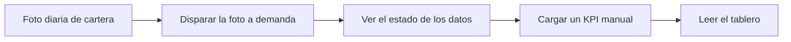

<!-- Generado por scripts/processes/generate-process-docs.ts desde src/modules/workflow-catalog/definitions. No editar a mano. -->

# P-24 · Tableros: KPIs, cargas manuales y fotos (snapshots)

`dashboards_kpi_and_manual_inputs` · v1 · prioridad **P2** · tipo `system_job` · dueño `FINANCE_MANAGER` · bloques `DASHBOARDS`

La foto diaria de cartera que alimenta la historia de los cinco tableros (Contabilidad, Finanzas, Riesgo, Ventas y Dirección), su disparo manual, la carga a mano de los KPI declarados como manuales y la lectura de cada tablero con comparación contra el período anterior.

## Por qué existe

Las bases de origen sobrescriben mora, tramo y saldo pendiente en cada barrido y no guardan historia: sin una foto propia cada día, cualquier tendencia calculada hoy mentiría sobre ayer. Los tableros guardan esas fotos y los KPI que sólo existen fuera del sistema se cargan a mano con justificación.

## Quién lo inicia y quién lo cierra

La foto diaria la inicia y la cierra el propio servicio de tableros (tarea snapshot_portfolio_daily a las 02:00 de La Paz). La carga manual y el disparo a demanda los hace quien administra el tablero: SUPER_ADMIN en todos, FINANCE_MANAGER sólo en Contabilidad y Finanzas, o cualquiera con el permiso reporting.manage en los que puede ver.

## Cuándo empieza y cuándo termina

Cada corrida abre una fila en snapshot_run con estado running antes de empezar y la cierra en ok (con las filas escritas) o failed (con el error); nunca queda sin cerrar. Una carga manual termina con la fila escrita en manual_input con su justificación y quién la hizo.

## Qué pasa cuando falla

Una foto fallida no lanza excepción: queda failed en snapshot_run con su mensaje y el portal marca los paneles como rancios. Sin la fuente del núcleo configurada la tarea no corre y no se cuenta como fallo. Cargar a mano un KPI que calcula el sistema responde KPI_NOT_MANUAL; en un tablero ajeno, DASHBOARD_FORBIDDEN.

## Qué indicador dice que va bien

Una corrida ok por día en snapshot_run (panel «estado de los datos», GET /snapshots/runs) sin failed consecutivas, y ninguna serie diaria con huecos desde el despliegue; las filas marcadas is_seed deben separarse de las reales.

## Resultado

- **Éxito:** La foto del día queda ok en snapshot_run, los KPI se leen con su comparación y las cifras manuales llevan justificación.
- **Fracaso:** La foto queda failed (el panel se marca rancio) o la carga manual se rechaza por KPI calculado o tablero ajeno.

## Dónde vive cada instancia

`DASHBOARDS` · `dashboards.snapshot_run` · estado en `status` · abiertas: `running`

## Etapas

| Etapa | Nombre | Actor | Cliente | Pantalla | Pasos |
|---|---|---|---|---|---|
| `dashboards_daily_snapshot` | Foto diaria de cartera | system | BLOCK | — | 1 |
| `dashboards_snapshot_on_demand` | Disparar la foto a demanda | internal_user | DASHBOARDS_PORTAL | **sin pantalla declarada** | 1 |
| `dashboards_data_status` | Ver el estado de los datos | internal_user | DASHBOARDS_PORTAL | `/tableros/[slug]` | 1 |
| `dashboards_manual_input` | Cargar un KPI manual | internal_user | DASHBOARDS_PORTAL | **sin pantalla declarada** | 2 |
| `dashboards_board_reading` | Leer el tablero | internal_user | DASHBOARDS_PORTAL | `/tableros/[slug]` | 5 |

### Foto diaria de cartera (`dashboards_daily_snapshot`)

Tarea programada del rol worker: si la fuente del núcleo está configurada, escribe una fila por crédito y día sin datos personales y los KPI del día, dejando constancia en snapshot_run.

| Paso | Tipo | Bloque | Operación | Roles | Eventos |
|---|---|---|---|---|---|
| Tomar la foto de cartera | job | DASHBOARDS | job `snapshot_portfolio_daily` | — | — |

### Disparar la foto a demanda (`dashboards_snapshot_on_demand`)

Quien administra el tablero relanza la foto después de un fallo. Mismo camino que la tarea programada. Sin pantalla en el portal de tableros.

| Paso | Tipo | Bloque | Operación | Roles | Eventos |
|---|---|---|---|---|---|
| Lanzar una foto | http | DASHBOARDS | `POST /snapshots/run/:job` | reporting.manage | — |

### Ver el estado de los datos (`dashboards_data_status`)

El panel «estado de los datos» lista las últimas corridas para saber si lo que se ve está al día.

| Paso | Tipo | Bloque | Operación | Roles | Eventos |
|---|---|---|---|---|---|
| Últimas corridas | http | DASHBOARDS | `GET /snapshots/runs` | — | — |

### Cargar un KPI manual (`dashboards_manual_input`)

Para cifras que no salen de ninguna base: valor, fecha, justificación y referencia a la evidencia. Administrar es por tablero, no global. Sin pantalla en el portal de tableros.

| Paso | Tipo | Bloque | Operación | Roles | Eventos |
|---|---|---|---|---|---|
| Registrar la cifra | http | DASHBOARDS | `POST /manual-inputs` | reporting.manage | — |
| Ver las cargas manuales | http | DASHBOARDS | `GET /manual-inputs` | reporting.manage, FINANCE_MANAGER, SUPER_ADMIN | — |

### Leer el tablero (`dashboards_board_reading`)

La persona abre su tablero: lectura de apertura estructurada, cada KPI con su comparación obligatoria contra el período anterior, su serie de evolución y su reparto por dimensión.

| Paso | Tipo | Bloque | Operación | Roles | Eventos |
|---|---|---|---|---|---|
| Tableros visibles | http | DASHBOARDS | `GET /dashboards` | — | — |
| Lectura de apertura | http | DASHBOARDS | `GET /dashboards/:code/reading` | — | — |
| Último valor con comparación | http | DASHBOARDS | `GET /kpis/:code/latest` | — | — |
| Evolución | http | DASHBOARDS | `GET /kpis/:code/series` | — | — |
| Reparto por dimensión | http | DASHBOARDS | `GET /kpis/:code/breakdown` | — | — |

## Fuentes

- `AtlasDashboardsBackend/docs/adr/0003-historia-por-snapshots.md`
- `AtlasDashboardsBackend/docs/adr/0009-finanzas-y-riesgo-son-dos-tableros.md`
- `AtlasDashboardsBackend/src/modules/snapshots/snapshots.service.ts`
- `AtlasDashboardsBackend/src/modules/snapshots/snapshots.controller.ts`
- `AtlasDashboardsBackend/src/modules/snapshots/snapshot-jobs.ts`
- `AtlasDashboardsBackend/src/modules/manual-inputs/manual-inputs.service.ts`
- `AtlasDashboardsBackend/src/modules/access/dashboard-access.map.ts`
- `AtlasDashboardsBackend/prisma/schema.prisma`
- `AtlasDashboardsFrontend/src/features/dashboards/services.ts`
- `memoria atlas-dashboards-plan`
- `memoria atlas-dashboards-rediseno`
- `memoria atlas-finanzas-tablero-rehecho`
