<!-- Generado por scripts/processes/generate-process-docs.ts desde src/modules/workflow-catalog/definitions. No editar a mano. -->

# P-37 · Gobierno de datos, calidad, exportaciones, reportes, consentimientos y contenido de la app

`data_governance_quality_reports` · v1 · prioridad **P2** · tipo `back_office` · dueño `DATA_GOVERNANCE_MANAGER` · bloques `ATLAS_BACKEND`

Gobierno del dato y de lo que se publica: paquete de políticas de datos, reglas de calidad recalculadas por un job que abre incidencias para que alguien las resuelva, consulta de exportaciones, reportes calculados en vivo, documentos de consentimiento versionados, contenidos de la app y la lista de comprobación de preparación de salida.

## Por qué existe

Lo que Atlas guarda y lo que le dice al cliente tiene que ser correcto y gobernado: políticas de datos con retención, reglas de calidad cuyas incidencias alguien resuelve, textos legales versionados que el cliente acepta en el alta, y contenidos de la app que negocio edita sin pasar por ingeniería.

## Quién lo inicia y quién lo cierra

Lo inicia gobierno de datos al definir el paquete de políticas o una regla, o el job recalculate_data_quality al abrir incidencias; lo cierran analistas y operadores internos al resolver o ignorar cada incidencia, publicar un documento legal o guardar un contenido de la app.

## Cuándo empieza y cuándo termina

Empieza con una política, una regla, un reporte o un documento definidos; termina con la incidencia resuelta o ignorada, el reporte calculado (en vivo, sin guardar), el documento de consentimiento en published con su versión, y la preparación de salida sin controles bloqueados.

## Qué pasa cuando falla

Una incidencia abierta queda en «Incidencias de calidad» hasta que alguien la resuelve y cuenta en la preparación de salida; un reporte no se guarda, así que no hay histórico que recuperar. Hoy no hay botón para publicar un documento legal aunque el portal tiene el gancho escrito, y las exportaciones sólo se consultan: nadie las crea.

## Qué indicador dice que va bien

Incidencias de calidad pendientes (sin revisar o reconocidas: todas las que no están resolved, ignored ni closed), reglas sin evaluar, documentos legales vigentes por código y los controles de la preparación de salida en ok, warning o blocked.

## Resultado

- **Éxito:** Las políticas están vigentes, las incidencias de calidad se resuelven, los documentos legales están publicados y la preparación de salida no tiene bloqueos.
- **Fracaso:** Las incidencias se acumulan sin dueño, un texto legal nuevo no llega a publicarse o la preparación de salida queda bloqueada.

## Dónde vive cada instancia

`ATLAS_BACKEND` · `audit.data_quality_issues` · estado en `issue_status` · abiertas: `open`, `acknowledged`

## Etapas

```mermaid
flowchart LR
  governance_policies["Políticas de datos"]
  quality_recalculation["Recalcular la calidad"]
  quality_issues["Incidencias de calidad"]
  exports_and_reports["Exportaciones y reportes"]
  consent_documents["Documentos de consentimiento"]
  app_content["Contenido de la app"]
  release_readiness_check["Preparación de salida"]
  governance_policies --> quality_recalculation
  quality_recalculation --> quality_issues
  quality_issues --> exports_and_reports
  exports_and_reports --> consent_documents
  consent_documents --> app_content
  app_content --> release_readiness_check
```

| Etapa | Nombre | Actor | Cliente | Pantalla | Pasos |
|---|---|---|---|---|---|
| `governance_policies` | Políticas de datos | internal_user | ADMIN_PORTAL | `/internal/governance/policies` | 3 |
| `quality_recalculation` | Recalcular la calidad | system | BLOCK | — | 1 |
| `quality_issues` | Incidencias de calidad | internal_user | ADMIN_PORTAL | `/internal/data-quality/issues` | 3 |
| `exports_and_reports` | Exportaciones y reportes | internal_user | ADMIN_PORTAL | `/internal/reports/[reportId]` | 4 |
| `consent_documents` | Documentos de consentimiento | internal_user | ADMIN_PORTAL | `/internal/settings/consent-documents` | 4 |
| `app_content` | Contenido de la app | internal_user | ADMIN_PORTAL | `/internal/settings/app-content` | 3 |
| `release_readiness_check` | Preparación de salida | internal_user | ADMIN_PORTAL | `/internal/release-readiness` | 1 |

### Políticas de datos (`governance_policies`)

Gobierno de datos consulta las políticas vigentes y publica el paquete de políticas (con clave de idempotencia).

| Paso | Tipo | Bloque | Operación | Roles | Eventos |
|---|---|---|---|---|---|
| Ver las políticas | http | ATLAS_BACKEND | `GET /operations/data-governance/policies` | internal_operator, risk_analyst, compliance_analyst, admin, platform_admin | — |
| Ver una política | http | ATLAS_BACKEND | `GET /internal/governance/policies/:policyId` | internal_operator, risk_analyst, compliance_analyst, admin, platform_admin, system_admin, qa_engineer, devops, readonly_auditor | — |
| Publicar el paquete de políticas | http | ATLAS_BACKEND | `POST /operations/data-governance/policy-package` | admin, platform_admin | — |

### Recalcular la calidad (`quality_recalculation`)

El job evalúa las reglas de calidad y abre incidencias por registro que no las cumple.

| Paso | Tipo | Bloque | Operación | Roles | Eventos |
|---|---|---|---|---|---|
| Recalcular la calidad de datos | job | ATLAS_BACKEND | job `recalculate_data_quality` | — | — |

### Incidencias de calidad (`quality_issues`)

El analista revisa las reglas y reconoce, resuelve o descarta cada incidencia pendiente, siempre con motivo y notas.

| Paso | Tipo | Bloque | Operación | Roles | Eventos |
|---|---|---|---|---|---|
| Ver las reglas de calidad | http | ATLAS_BACKEND | `GET /internal/data-quality/rules` | internal_operator, risk_analyst, compliance_analyst, admin, platform_admin, system_admin, qa_engineer, devops, readonly_auditor | — |
| Listar incidencias | http | ATLAS_BACKEND | `GET /operations/data-quality/issues` | internal_operator, risk_analyst, compliance_analyst, admin, platform_admin | — |
| Reconocer, resolver o descartar una incidencia | http | ATLAS_BACKEND | `POST /operations/data-quality/issues/:issueId/resolve` | internal_operator, risk_analyst, compliance_analyst, admin, platform_admin | — |

### Exportaciones y reportes (`exports_and_reports`)

El operador consulta exportaciones y calcula un reporte en vivo sobre los datos de su tenant (persisted: false, sin histórico).

| Paso | Tipo | Bloque | Operación | Roles | Eventos |
|---|---|---|---|---|---|
| Listar exportaciones | http | ATLAS_BACKEND | `GET /internal/exports` | internal_operator, risk_analyst, compliance_analyst, admin, platform_admin, system_admin, qa_engineer, devops, readonly_auditor | — |
| Ver una exportación | http | ATLAS_BACKEND | `GET /internal/exports/:exportId` | internal_operator, risk_analyst, compliance_analyst, admin, platform_admin, system_admin, qa_engineer, devops, readonly_auditor | — |
| Listar reportes | http | ATLAS_BACKEND | `GET /internal/reports` | internal_operator, risk_analyst, compliance_analyst, admin, platform_admin, system_admin, qa_engineer, devops, readonly_auditor | — |
| Calcular un reporte | http | ATLAS_BACKEND | `POST /internal/reports/:reportId/run` | internal_operator, risk_analyst, compliance_analyst, admin, platform_admin, system_admin, qa_engineer, devops, readonly_auditor | — |

### Documentos de consentimiento (`consent_documents`)

Cumplimiento crea una versión nueva de un documento legal y la edita; la versión published es la que la app muestra y el cliente acepta en el alta.

| Paso | Tipo | Bloque | Operación | Roles | Eventos |
|---|---|---|---|---|---|
| Listar documentos | http | ATLAS_BACKEND | `GET /operations/consent-documents` | internal_operator, compliance_analyst, risk_analyst, admin, platform_admin | — |
| Crear una versión | http | ATLAS_BACKEND | `POST /operations/consent-documents` | internal_operator, compliance_analyst, risk_analyst, admin, platform_admin | — |
| Editar o publicar una versión | http | ATLAS_BACKEND | `PATCH /operations/consent-documents/:documentId` | internal_operator, compliance_analyst, risk_analyst, admin, platform_admin | — |
| Documento vigente para la app | http | ATLAS_BACKEND | `GET /consent-documents/active` | internal_operator, compliance_analyst, risk_analyst, admin, platform_admin | — |

### Contenido de la app (`app_content`)

Negocio edita los textos que lee el cliente en la app sin pasar por ingeniería.

| Paso | Tipo | Bloque | Operación | Roles | Eventos |
|---|---|---|---|---|---|
| Listar contenidos | http | ATLAS_BACKEND | `GET /operations/app-content` | internal_operator, risk_analyst, compliance_analyst, readonly_auditor, admin, platform_admin | — |
| Guardar un contenido | http | ATLAS_BACKEND | `PUT /operations/app-content` | admin, platform_admin | — |
| Borrar un contenido | http | ATLAS_BACKEND | `DELETE /operations/app-content/:contentId` | admin, platform_admin | — |

### Preparación de salida (`release_readiness_check`)

Lista de comprobación: catálogo de rutas y de datos poblados, suites QA, reglas e incidencias de calidad y corridas de jobs.

| Paso | Tipo | Bloque | Operación | Roles | Eventos |
|---|---|---|---|---|---|
| Leer la preparación de salida | http | ATLAS_BACKEND | `GET /internal/release-readiness` | internal_operator, risk_analyst, compliance_analyst, admin, platform_admin, system_admin, qa_engineer, devops, readonly_auditor | — |

## Fuentes

- `src/modules/catalog-management/catalog-governance.controller.ts`
- `src/modules/data-quality/data-quality.controller.ts`
- `src/modules/data-quality/data-quality.schemas.ts`
- `src/modules/internal-portal/internal-portal.controller.ts`
- `src/modules/internal-portal/application/portal-reports.service.ts`
- `src/modules/consents/consent-operations.controller.ts`
- `src/modules/app-content/app-content-operations.controller.ts`
- `src/modules/runtime-jobs/scheduled-jobs.catalog.ts`
- `/private/tmp/fi-root-20260926/AtlasAdminPortal/src/features/consent-documents/hooks.ts`
- `_plan-documentar-procesos-y-cableado-portal-2026-09-26/datos/procesos.json (P-37)`
