<!-- Generado por scripts/processes/generate-process-docs.ts desde src/modules/workflow-catalog/definitions. No editar a mano. -->

# P-26 · Gobierno de artefactos del Motor: versión, compilación, suite bloqueante, dos firmas, despliegue y binding

`decision_artifact_governance` · v1 · prioridad **P1** · tipo `back_office` · dueño `MOTOR:RISK_APPROVER` · bloques `DECISION_ENGINE`, `ATLAS_BACKEND`

Cómo una versión de un artefacto de decisión pasa de borrador a desplegada: edición del grafo, validación y compilación, suite de pruebas bloqueante, envío a revisión, pasos de aprobación en orden (QA y aprobador de riesgo, más cumplimiento si se pide) sin que el autor firme, despliegue por ambiente que crea el vínculo de ejecución, y la elección del artefacto en Atlas.

## Por qué existe

Un artefacto del Motor es la política que aprueba o rechaza crédito, identidad y riesgo. Cambiarla sin control es cambiar a quién se le presta: por eso cada versión se compila, se prueba con una suite bloqueante y la firman personas distintas de su autor antes de desplegarse, y todo queda en la cadena de auditoría.

## Quién lo inicia y quién lo cierra

Lo inicia un analista de riesgo o de fraude del Motor al crear o clonar una versión; firman en orden un QA_ANALYST y un RISK_APPROVER (y COMPLIANCE si se pidió), nunca el autor; despliega un PLATFORM_ADMIN que tampoco sea el autor; y en Atlas un operador o analista de riesgo elige ese artefacto para su tipo de decisión.

## Cuándo empieza y cuándo termina

Empieza con la versión en DRAFT (único estado editable) y termina con la versión DEPLOYED_TO_DEV, _TEST, _STAGING o _PROD, con su decision_runtime_binding apuntando al despliegue activo y el artefacto asignado en /internal/settings/decision-artifacts de Atlas. Sembrar una versión no es desplegarla.

## Qué pasa cuando falla

Enviar a revisión sin compilar da VERSION_NOT_REVIEWABLE; sin la suite bloqueante en verde, BLOCKING_TESTS_NOT_PASSED; si el autor firma o despliega, SEPARATION_OF_DUTIES_VIOLATION; un paso fuera de orden, APPROVAL_STEP_OUT_OF_ORDER. Un revisor puede pedir cambios (CHANGES_REQUESTED) o rechazar (REJECTED). Sin vínculo de ejecución, decidir responde ACTIVE_DEPLOYMENT_NOT_FOUND.

## Qué indicador dice que va bien

Solicitudes de aprobación abiertas y su antigüedad (GET /v1/approval-requests), versiones IN_REVIEW sin movimiento, y que cada tipo de decisión de Atlas apunte a un artefacto que el Motor publica y tiene desplegado en el ambiente (pantalla de artefactos activos del portal admin).

## Resultado

- **Éxito:** La versión queda desplegada en su ambiente con vínculo de ejecución activo y Atlas la usa para su tipo de decisión.
- **Fracaso:** La versión queda en CHANGES_REQUESTED o REJECTED, o no se admite a revisión por no compilar o no pasar su suite bloqueante.

## Dónde vive cada instancia

`DECISION_ENGINE` · `public.decision_artifact_version` · estado en `status` · abiertas: `DRAFT`, `VALIDATION_FAILED`, `VALIDATED`, `COMPILED`, `IN_REVIEW`, `CHANGES_REQUESTED`, `APPROVED`

## Etapas

```mermaid
flowchart LR
  governance_artifact_creation["Crear el artefacto o clonar una versión"]
  governance_version_editing["Editar el grafo"]
  governance_validate_compile["Validar y compilar"]
  governance_blocking_suite["Suite de regresión bloqueante"]
  governance_submit_for_review["Enviar a revisión"]
  governance_approval["Firmar la aprobación"]
  governance_deployment["Desplegar por ambiente"]
  governance_atlas_binding["Elegir el artefacto en Atlas"]
  governance_artifact_creation --> governance_version_editing
  governance_version_editing --> governance_validate_compile
  governance_validate_compile --> governance_blocking_suite
  governance_blocking_suite --> governance_submit_for_review
  governance_submit_for_review --> governance_approval
  governance_approval --> governance_deployment
  governance_deployment --> governance_atlas_binding
```

| Etapa | Nombre | Actor | Cliente | Pantalla | Pasos |
|---|---|---|---|---|---|
| `governance_artifact_creation` | Crear el artefacto o clonar una versión | internal_user | MOTOR_PORTAL | `/artifacts` | 2 |
| `governance_version_editing` | Editar el grafo | internal_user | MOTOR_PORTAL | `/artifact-versions/[versionId]/graph` | 3 |
| `governance_validate_compile` | Validar y compilar | internal_user | MOTOR_PORTAL | `/artifact-versions/[versionId]/compile` | 3 |
| `governance_blocking_suite` | Suite de regresión bloqueante | internal_user | MOTOR_PORTAL | `/artifact-versions/[versionId]/test-suites` | 5 |
| `governance_submit_for_review` | Enviar a revisión | internal_user | MOTOR_PORTAL | `/reviews` | 1 |
| `governance_approval` | Firmar la aprobación | internal_user | MOTOR_PORTAL | `/approval-requests/[requestId]` | 3 |
| `governance_deployment` | Desplegar por ambiente | internal_user | MOTOR_PORTAL | `/deployments` | 5 |
| `governance_atlas_binding` | Elegir el artefacto en Atlas | internal_user | ADMIN_PORTAL | `/internal/settings/decision-artifacts` | 3 |

### Crear el artefacto o clonar una versión (`governance_artifact_creation`)

El analista crea el artefacto con su primera versión, o clona una versión existente para abrir un borrador nuevo.

| Paso | Tipo | Bloque | Operación | Roles | Eventos |
|---|---|---|---|---|---|
| Crear el artefacto | http | DECISION_ENGINE | `POST /v1/artifacts` | RISK_ANALYST, FRAUD_ANALYST | — |
| Clonar una versión | http | DECISION_ENGINE | `POST /v1/artifact-versions/:versionId/clone` | RISK_ANALYST, FRAUD_ANALYST | — |

### Editar el grafo (`governance_version_editing`)

Sólo un borrador es editable. El analista edita nodos y aristas, las notas y la base de tratamiento de datos.

| Paso | Tipo | Bloque | Operación | Roles | Eventos |
|---|---|---|---|---|---|
| Leer el grafo | http | DECISION_ENGINE | `GET /v1/artifact-versions/:versionId/graph` | RISK_ANALYST, FRAUD_ANALYST, QA_ANALYST, COMPLIANCE, AUDITOR | — |
| Guardar el grafo | http | DECISION_ENGINE | `PUT /v1/artifact-versions/:versionId/graph` | RISK_ANALYST, FRAUD_ANALYST | — |
| Notas de la versión | http | DECISION_ENGINE | `PATCH /v1/artifact-versions/:versionId/notes` | RISK_ANALYST, FRAUD_ANALYST | — |

### Validar y compilar (`governance_validate_compile`)

Estructura, expresiones, determinismo y contrato de salida. Un fallo deja VALIDATION_FAILED con informe por nodo; si pasa, COMPILED con su compilado inmutable.

| Paso | Tipo | Bloque | Operación | Roles | Eventos |
|---|---|---|---|---|---|
| Validar | http | DECISION_ENGINE | `POST /v1/artifact-versions/:versionId/validate` | RISK_ANALYST, FRAUD_ANALYST, QA_ANALYST | — |
| Compilar | http | DECISION_ENGINE | `POST /v1/artifact-versions/:versionId/compile` | RISK_ANALYST, FRAUD_ANALYST, QA_ANALYST | — |
| Validar y compilar de una vez | http | DECISION_ENGINE | `POST /v1/artifact-versions/:versionId/validate-and-compile` | RISK_ANALYST, FRAUD_ANALYST, QA_ANALYST | — |

### Suite de regresión bloqueante (`governance_blocking_suite`)

La versión necesita al menos una suite marcada bloqueante y en verde para admitirse a revisión. El analista o QA crea la suite, sus casos y lanza la corrida.

| Paso | Tipo | Bloque | Operación | Roles | Eventos |
|---|---|---|---|---|---|
| Crear la suite | http | DECISION_ENGINE | `POST /v1/artifact-versions/:versionId/test-suites` | QA_ANALYST, RISK_ANALYST, FRAUD_ANALYST | — |
| Añadir casos | http | DECISION_ENGINE | `POST /v1/test-suites/:suiteId/cases` | QA_ANALYST, RISK_ANALYST, FRAUD_ANALYST | — |
| Lanzar la corrida | http | DECISION_ENGINE | `POST /v1/test-suites/:suiteId/runs` | QA_ANALYST, RISK_ANALYST, FRAUD_ANALYST | — |
| Ejecutar la corrida | job | DECISION_ENGINE | job `test-run` | QA_ANALYST, RISK_ANALYST, FRAUD_ANALYST | — |
| Ver el resultado | http | DECISION_ENGINE | `GET /v1/test-runs/:runId` | QA_ANALYST, RISK_ANALYST, FRAUD_ANALYST, COMPLIANCE, AUDITOR | — |

### Enviar a revisión (`governance_submit_for_review`)

Crea la solicitud de aprobación con sus pasos (QA, aprobador de riesgo y, si se pide, cumplimiento), pasa la versión a IN_REVIEW y audita APPROVAL_REQUEST_CREATED en la misma transacción.

| Paso | Tipo | Bloque | Operación | Roles | Eventos |
|---|---|---|---|---|---|
| Enviar la versión a revisión | http | DECISION_ENGINE | `POST /v1/artifact-versions/:versionId/submit-for-review` | RISK_ANALYST, FRAUD_ANALYST | — |

### Firmar la aprobación (`governance_approval`)

Cada paso lo firma el rol exigido, en orden y nunca el autor. Aprobar el último paso deja la versión APPROVED; pedir cambios o rechazar cierra la solicitud. Las firmas son de personas desde el portal del Motor: no hay aprobadores de máquina.

| Paso | Tipo | Bloque | Operación | Roles | Eventos |
|---|---|---|---|---|---|
| Bandeja de solicitudes | http | DECISION_ENGINE | `GET /v1/approval-requests` | RISK_ANALYST, FRAUD_ANALYST, QA_ANALYST, RISK_APPROVER, COMPLIANCE, AUDITOR | — |
| Leer la solicitud | http | DECISION_ENGINE | `GET /v1/approval-requests/:requestId` | RISK_ANALYST, FRAUD_ANALYST, QA_ANALYST, RISK_APPROVER, COMPLIANCE, AUDITOR | — |
| Firmar el paso | http | DECISION_ENGINE | `POST /v1/approval-steps/:stepId/decisions` | QA_ANALYST, RISK_APPROVER, COMPLIANCE | — |

### Desplegar por ambiente (`governance_deployment`)

Un PLATFORM_ADMIN que no sea el autor despliega el compilado en un ambiente activo: el despliegue anterior queda SUPERSEDED, se escribe decision_runtime_binding y la versión pasa a DEPLOYED_TO_<ambiente>. Revertir y suspender quedan a mano.

| Paso | Tipo | Bloque | Operación | Roles | Eventos |
|---|---|---|---|---|---|
| Ambientes | http | DECISION_ENGINE | `GET /v1/environments` | PLATFORM_ADMIN, RISK_ANALYST, QA_ANALYST, AUDITOR | — |
| Desplegar la versión | http | DECISION_ENGINE | `POST /v1/artifact-versions/:versionId/deployments` | PLATFORM_ADMIN | — |
| Despliegues | http | DECISION_ENGINE | `GET /v1/deployments` | PLATFORM_ADMIN, RISK_ANALYST, QA_ANALYST, COMPLIANCE, AUDITOR, OPERATIONS | — |
| Revertir | http | DECISION_ENGINE | `POST /v1/deployments/:deploymentId/rollback` | PLATFORM_ADMIN | — |
| Suspender | http | DECISION_ENGINE | `POST /v1/deployments/:deploymentId/suspend` | PLATFORM_ADMIN | — |

### Elegir el artefacto en Atlas (`governance_atlas_binding`)

En el portal admin se elige qué artefacto (y versión fijada, si se quiere) decide cada tipo: crédito, identidad, riesgo. Atlas valida el código contra el catálogo que publica el Motor y rechaza el que no existe.

| Paso | Tipo | Bloque | Operación | Roles | Eventos |
|---|---|---|---|---|---|
| Ver la asignación vigente | http | ATLAS_BACKEND | `GET /internal/decision-artifacts` | internal_operator, risk_analyst, admin, platform_admin | — |
| Asignar el artefacto | http | ATLAS_BACKEND | `POST /internal/decision-artifacts` | internal_operator, risk_analyst, admin, platform_admin | — |
| Observar los artefactos activos | http | ATLAS_BACKEND | `GET /systems/decision-engine/artifacts` | internal_operator, risk_analyst, admin, platform_admin | — |

## Fuentes

- `AtlasDecisionEngineBackend/docs/business/critical-workflows.md §1 y §3`
- `AtlasDecisionEngineBackend/docs/governance/review-process.md`
- `AtlasDecisionEngineBackend/src/modules/artifacts/artifact.controller.ts`
- `AtlasDecisionEngineBackend/src/modules/artifacts/version-state.service.ts`
- `AtlasDecisionEngineBackend/src/modules/governance/governance.controller.ts`
- `AtlasDecisionEngineBackend/src/modules/governance/governance.service.ts`
- `AtlasDecisionEngineBackend/src/modules/testing/testing.controller.ts`
- `AtlasDecisionEngineBackend/src/modules/testing/test-run-worker.service.ts`
- `AtlasDecisionEngineBackend/src/modules/deployments/deployment.controller.ts`
- `AtlasDecisionEngineBackend/src/modules/deployments/deployment.service.ts`
- `AtlasDecisionEngineBackend/prisma/schema.prisma (VersionStatus, ApprovalRequestStatus, DeploymentStatus)`
- `src/modules/decision-engine/decision-artifact-binding.controller.ts`
- `AtlasAdminPortal/src/shared/decision-engine/engine-links.ts`
- `CLAUDE.md §5 (dos personas firman; sembrar no es desplegar)`
- `memoria atlas-motor-crear-artefacto`
