<!-- Generado por scripts/processes/generate-process-docs.ts desde src/modules/workflow-catalog/definitions. No editar a mano. -->

# P-27 · Ejecución de una decisión y revisión manual en el Motor con callback a Atlas

`decision_execution_and_manual_review` · v1 · prioridad **P0** · tipo `integration` · dueño `MOTOR:RISK_ANALYST` · bloques `DECISION_ENGINE`, `ATLAS_BACKEND`

Atlas pide una decisión al Motor por código de artefacto con clave de idempotencia; el Motor resuelve el despliegue activo, ejecuta el compilado y guarda ejecución, variables, traza y razones en una transacción. Sólo si el grafo pasó por un nodo MANUAL_REVIEW se abre un caso con cola, prioridad y SLA; el analista lo toma y lo resuelve en el portal del Motor, y la resolución vuelve a Atlas por el callback de su cola.

## Por qué existe

Las decisiones de crédito, identidad, riesgo de alta y KYB de comercios se toman en el Motor con una política versionada y auditable. Cuando la política no puede decidir sola deriva a una persona, y esa resolución tiene que volver a Atlas: si no vuelve, el cliente se queda en revisión para siempre y no puede pedir crédito.

## Quién lo inicia y quién lo cierra

Lo inicia AtlasBackend, como sistema, al pedir la decisión (POST /v1/decisions/:artifactCode con la llave de ejecución). Si se abre un caso, lo toma y lo resuelve un analista del Motor (OPERATIONS, RISK_ANALYST o FRAUD_ANALYST) y lo cierra AtlasBackend al aplicar la resolución que le llega por el callback de la cola.

## Cuándo empieza y cuándo termina

Empieza con la petición de decisión y termina con la ejecución SUCCEEDED, NO_DECISION o FAILED. Si hubo nodo MANUAL_REVIEW, sigue con el caso OPEN → ASSIGNED → RESOLVED_APPROVED, RESOLVED_DECLINED o CANCELLED y acaba cuando Atlas recibe el aviso en /internal/{identity,risk,credit}/manual-review-callback. Un rechazo directo no abre caso.

## Qué pasa cuando falla

Sin despliegue activo en el ambiente el Motor responde ACTIVE_DEPLOYMENT_NOT_FOUND; repetir la misma clave devuelve la misma ejecución y una clave con otro contenido da IDEMPOTENCY_PAYLOAD_MISMATCH. Si el aviso a Atlas falla, la resolución se mantiene y queda el evento MANUAL_REVIEW_CALLBACK_FAILED en la auditoría del Motor; sin ATLAS_BACKEND_BASE_URL o ENGINE_CALLBACK_API_KEY sólo se avisa en el registro.

## Qué indicador dice que va bien

Casos OPEN o ASSIGNED fuera de su SLA (due_at) en la cola del Motor, eventos MANUAL_REVIEW_CALLBACK_FAILED en cero, y solicitudes de Atlas en revisión cuya ejecución ya tiene caso resuelto (señal de un aviso perdido).

## Resultado

- **Éxito:** La decisión se devuelve con sus razones y, si hubo revisión, la resolución del analista queda aplicada en Atlas.
- **Fracaso:** La decisión falla (sin despliegue activo, idempotencia en conflicto) o la resolución no llega a Atlas y el caso de allá sigue en revisión.

## Dónde vive cada instancia

`DECISION_ENGINE` · `public.decision_manual_review_case` · estado en `status` · abiertas: `OPEN`, `ASSIGNED`

## Etapas

```mermaid
flowchart LR
  execution_decision_request["Pedir la decisión"]
  execution_persist_and_case["Guardar la ejecución y abrir el caso"]
  execution_atlas_observes["Atlas ve la solicitud en su bandeja"]
  execution_manual_review_triage["Tomar el caso"]
  execution_manual_review_resolve["Resolver el caso"]
  execution_callback_to_atlas["Avisar a Atlas"]
  execution_decision_request --> execution_persist_and_case
  execution_persist_and_case --> execution_atlas_observes
  execution_atlas_observes --> execution_manual_review_triage
  execution_manual_review_triage --> execution_manual_review_resolve
  execution_manual_review_resolve --> execution_callback_to_atlas
```

| Etapa | Nombre | Actor | Cliente | Pantalla | Pasos |
|---|---|---|---|---|---|
| `execution_decision_request` | Pedir la decisión | system | BLOCK | — | 1 |
| `execution_persist_and_case` | Guardar la ejecución y abrir el caso | system | BLOCK | — | 1 |
| `execution_atlas_observes` | Atlas ve la solicitud en su bandeja | internal_user | ADMIN_PORTAL | `/internal/operations/work-queue` | 1 |
| `execution_manual_review_triage` | Tomar el caso | internal_user | MOTOR_PORTAL | `/manual-reviews` | 3 |
| `execution_manual_review_resolve` | Resolver el caso | internal_user | MOTOR_PORTAL | `/manual-reviews/[caseId]` | 1 |
| `execution_callback_to_atlas` | Avisar a Atlas | system | BLOCK | — | 4 |

### Pedir la decisión (`execution_decision_request`)

AtlasBackend llama al Motor con requestId, idempotencyKey, environmentCode y subjectReference. El Motor reserva la clave con un lease corto, resuelve el despliegue activo por decision_runtime_binding y resuelve las variables antes de abrir la transacción.

| Paso | Tipo | Bloque | Operación | Roles | Eventos |
|---|---|---|---|---|---|
| Ejecutar el artefacto | http | DECISION_ENGINE | `POST /v1/decisions/:artifactCode` | DECISION_RUNTIME | — |

### Guardar la ejecución y abrir el caso (`execution_persist_and_case`)

En una sola transacción se guardan ejecución, variables, traza y razones. Sólo si el grafo pasó por un nodo MANUAL_REVIEW se crea el caso con cola, prioridad, SLA y evidencia; un rechazo directo no lo abre.

| Paso | Tipo | Bloque | Operación | Roles | Eventos |
|---|---|---|---|---|---|
| Abrir el caso de revisión | event | DECISION_ENGINE | Ocurre dentro de la misma transacción que guarda la ejecución (execution-writer.service.ts); no es una llamada aparte. | — | — |

### Atlas ve la solicitud en su bandeja (`execution_atlas_observes`)

La bandeja de trabajo del portal admin muestra el caso local que ancla la solicitud; cuando el Motor abrió caso, resolver aquí está bloqueado y se enlaza al Motor (necesita NEXT_PUBLIC_DECISION_ENGINE_URL).

| Paso | Tipo | Bloque | Operación | Roles | Eventos |
|---|---|---|---|---|---|
| Bandeja de trabajo de Atlas | http | ATLAS_BACKEND | `GET /operations/work-queue` | — | — |

### Tomar el caso (`execution_manual_review_triage`)

El analista mira la cola del Motor por prioridad y SLA y se asigna el caso para que dos personas no trabajen el mismo.

| Paso | Tipo | Bloque | Operación | Roles | Eventos |
|---|---|---|---|---|---|
| Cola de revisión | http | DECISION_ENGINE | `GET /v1/manual-reviews` | OPERATIONS, RISK_ANALYST, FRAUD_ANALYST | — |
| Leer el caso | http | DECISION_ENGINE | `GET /v1/manual-reviews/:caseId` | OPERATIONS, RISK_ANALYST, FRAUD_ANALYST | — |
| Asignarse el caso | http | DECISION_ENGINE | `POST /v1/manual-reviews/:caseId/assign` | OPERATIONS, RISK_ANALYST, FRAUD_ANALYST | — |

### Resolver el caso (`execution_manual_review_resolve`)

El analista aprueba, rechaza o cancela con motivo obligatorio. La resolución se confirma primero y el aviso a Atlas sale después, fuera de la transacción.

| Paso | Tipo | Bloque | Operación | Roles | Eventos |
|---|---|---|---|---|---|
| Resolver | http | DECISION_ENGINE | `POST /v1/manual-reviews/:caseId/resolve` | OPERATIONS, RISK_ANALYST, FRAUD_ANALYST | MANUAL_REVIEW_CALLBACK_FAILED |

### Avisar a Atlas (`execution_callback_to_atlas`)

El Motor manda executionId, decisión, motivo y quién resolvió a la ruta de la cola, con x-tenant-id y x-engine-callback-key y 10 s de espera. Atlas localiza el intento, el caso de riesgo o la solicitud por la ejecución. CANCEL no se aplica: la solicitud queda como está.

| Paso | Tipo | Bloque | Operación | Roles | Eventos |
|---|---|---|---|---|---|
| Callback de identidad | http | ATLAS_BACKEND | `POST /internal/identity/manual-review-callback` | — | — |
| Callback de riesgo de alta | http | ATLAS_BACKEND | `POST /internal/risk/manual-review-callback` | — | — |
| Callback de crédito | http | ATLAS_BACKEND | `POST /internal/credit/manual-review-callback` | — | — |
| Tirón del KYB de comercios | job | ATLAS_BACKEND | job `sync_partner_kyb_reviews` | — | — |

## Fuentes

- `AtlasDecisionEngineBackend/docs/business/critical-workflows.md §2 y §4`
- `AtlasDecisionEngineBackend/src/modules/runtime/runtime.controller.ts`
- `AtlasDecisionEngineBackend/src/modules/runtime/execution-writer.service.ts`
- `AtlasDecisionEngineBackend/src/modules/runtime/idempotency.service.ts`
- `AtlasDecisionEngineBackend/src/modules/manual-review/manual-review.controller.ts`
- `AtlasDecisionEngineBackend/src/modules/manual-review/manual-review.service.ts`
- `AtlasDecisionEngineBackend/src/modules/manual-review/manual-review.dto.ts`
- `AtlasDecisionEngineBackend/prisma/schema.prisma (ExecutionStatus, ManualReviewStatus)`
- `src/modules/decision-engine/decision-engine.client.ts`
- `src/modules/credit/credit-review-callback.controller.ts`
- `src/modules/risk/risk-review-callback.controller.ts`
- `src/modules/customer-onboarding/identity-review-callback.controller.ts`
- `src/common/utils/auth/engine-callback-key.util.ts`
- `AtlasAdminPortal/src/shared/decision-engine/engine-links.ts`
- `memoria atlas-portal-motor-duplicacion (que DECIDA no implica que ABRA CASO)`
- `memoria atlas-identidad-cola-humana`
