<!-- Generado por scripts/processes/generate-process-docs.ts desde src/modules/workflow-catalog/definitions. No editar a mano. -->

# P-28 · Calidad de decisiones: desenlaces observados, monitoreo de modelo y reclamaciones

`decision_quality_and_monitoring` · v1 · prioridad **P1** · tipo `system_job` · dueño `MOTOR:RISK_ANALYST` · bloques `ATLAS_BACKEND`, `DECISION_ENGINE`

AtlasBackend registra en el Motor cada crédito desembolsado y, al vencer cada ventana, su desenlace (bueno, malo, rechazado que habría sido bueno…). El Motor cierra la ventana, calcula cosechas, cobertura, rendimiento, estabilidad e impacto adverso, evalúa cada 6 horas la degradación de lo desplegado, y deja reproducir una decisión concreta ante una reclamación.

## Por qué existe

Una política de crédito puede degradarse sin que nadie lo note: el Motor sólo sabe si aprobar fue un acierto cuando le cuentan cómo terminó el crédito. Con esos desenlaces mide tasa de malos, estabilidad y discriminación, y ante una reclamación se puede recuperar y reproducir exactamente la decisión que se tomó.

## Quién lo inicia y quién lo cierra

Lo inician los trabajos de AtlasBackend register_engine_facilities y dispatch_loan_outcomes, como sistema; el Motor lo continúa con su evaluación periódica. Lo cierran personas del Motor: el analista de riesgo que revisa la calidad, cumplimiento o un aprobador de riesgo que mira el impacto adverso, y el auditor que responde a una reclamación.

## Cuándo empieza y cuándo termina

Empieza cuando un crédito desembolsado se registra en el Motor (POST /v1/outcomes/facilities), que programa sus ventanas de observación, y cada desenlace entra por POST /v1/outcomes/batch cerrando su ventana. Termina con la evaluación de monitoreo guardada y, en una reclamación, con la ejecución recuperada y la cadena de auditoría verificada.

## Qué pasa cuando falla

Si la entrega al Motor falla, el lote entero no se marca enviado y se reintenta (el Motor deduplica por ejecución y ventana); tras seis intentos se deja de reintentar y se pide una mirada humana. Un desenlace para un crédito que el Motor no conoce se rechaza fila a fila. Sin desenlaces, la cobertura cae y la matriz de cosechas queda vacía.

## Qué indicador dice que va bien

Cobertura de desenlaces (GET /v1/model-monitoring/coverage) sin ventanas vencidas pendientes (GET /v1/outcomes/pending), estado de entrega de desenlaces al día en la cartera del portal admin, y evaluaciones de monitoreo sin alertas de deriva. Ojo: en local casi toda la población del Motor es siembra.

## Resultado

- **Éxito:** Cada crédito tiene sus desenlaces observados, las ventanas se cierran a tiempo y las métricas de calidad se calculan sobre población real.
- **Fracaso:** Los desenlaces no llegan (ventanas vencidas, cobertura en BREACH) o se calculan sobre población sembrada.

## Dónde vive cada instancia

`DECISION_ENGINE` · `public.decision_outcome_observation` · estado en `label`

## Etapas

```mermaid
flowchart LR
  quality_facility_registration["Registrar los créditos desembolsados"]
  quality_outcome_dispatch["Entregar los desenlaces"]
  quality_monitoring_evaluation["Evaluar la degradación"]
  quality_admin_delivery_status["Atlas vigila la entrega"]
  quality_review["Revisar la calidad de las decisiones"]
  quality_model_monitoring["Monitoreo del modelo"]
  quality_claim_response["Responder a una reclamación"]
  quality_facility_registration --> quality_outcome_dispatch
  quality_outcome_dispatch --> quality_monitoring_evaluation
  quality_monitoring_evaluation --> quality_admin_delivery_status
  quality_admin_delivery_status --> quality_review
  quality_review --> quality_model_monitoring
  quality_model_monitoring --> quality_claim_response
```

| Etapa | Nombre | Actor | Cliente | Pantalla | Pasos |
|---|---|---|---|---|---|
| `quality_facility_registration` | Registrar los créditos desembolsados | system | BLOCK | — | 2 |
| `quality_outcome_dispatch` | Entregar los desenlaces | system | BLOCK | — | 3 |
| `quality_monitoring_evaluation` | Evaluar la degradación | system | BLOCK | — | 1 |
| `quality_admin_delivery_status` | Atlas vigila la entrega | internal_user | ADMIN_PORTAL | `/internal/operations/portfolio` | 1 |
| `quality_review` | Revisar la calidad de las decisiones | internal_user | MOTOR_PORTAL | `/decision-quality` | 4 |
| `quality_model_monitoring` | Monitoreo del modelo | internal_user | MOTOR_PORTAL | `/model-monitoring` | 5 |
| `quality_claim_response` | Responder a una reclamación | internal_user | MOTOR_PORTAL | `/executions/[executionId]` | 3 |

### Registrar los créditos desembolsados (`quality_facility_registration`)

AtlasBackend da de alta en el Motor cada crédito concedido; el Motor programa sus ventanas de observación.

| Paso | Tipo | Bloque | Operación | Roles | Eventos |
|---|---|---|---|---|---|
| Trabajo de registro de créditos | job | ATLAS_BACKEND | job `register_engine_facilities` | — | — |
| Alta de créditos en el Motor | http | DECISION_ENGINE | `POST /v1/outcomes/facilities` | OPERATIONS, RISK_ANALYST | — |

### Entregar los desenlaces (`quality_outcome_dispatch`)

dispatch_loan_outcomes toma los desenlaces encolados por el libro de préstamos y los manda en lote; el lote es todo o nada al marcarlo y se reintenta hasta seis veces.

| Paso | Tipo | Bloque | Operación | Roles | Eventos |
|---|---|---|---|---|---|
| Trabajo de despacho de desenlaces | job | ATLAS_BACKEND | job `dispatch_loan_outcomes` | — | — |
| Cargar desenlaces por crédito | http | DECISION_ENGINE | `POST /v1/outcomes/batch` | OPERATIONS, RISK_ANALYST, COMPLIANCE | — |
| Cargar desenlaces por ejecución (camino antiguo) | http | DECISION_ENGINE | `POST /v1/model-monitoring/outcomes` | OPERATIONS, RISK_ANALYST, COMPLIANCE | — |

### Evaluar la degradación (`quality_monitoring_evaluation`)

El Motor mide cada 6 horas (MONITORING_EVALUATION_INTERVAL_MS) la degradación de las versiones desplegadas y guarda su veredicto.

| Paso | Tipo | Bloque | Operación | Roles | Eventos |
|---|---|---|---|---|---|
| Evaluación periódica | job | DECISION_ENGINE | job `monitoring-evaluation` | — | — |

### Atlas vigila la entrega (`quality_admin_delivery_status`)

La pantalla de cartera del portal admin dice si la entrega de desenlaces va al día y enlaza a «Calidad de decisiones» del Motor.

| Paso | Tipo | Bloque | Operación | Roles | Eventos |
|---|---|---|---|---|---|
| Estado de entrega de desenlaces | http | ATLAS_BACKEND | `GET /operations/loans/outcome-status` | — | — |

### Revisar la calidad de las decisiones (`quality_review`)

El analista mira ventanas pendientes, cosechas, cobertura de desenlaces y el análisis de corte.

| Paso | Tipo | Bloque | Operación | Roles | Eventos |
|---|---|---|---|---|---|
| Ventanas pendientes | http | DECISION_ENGINE | `GET /v1/outcomes/pending` | OPERATIONS, RISK_ANALYST, COMPLIANCE, AUDITOR, RISK_APPROVER | — |
| Matriz de cosechas | http | DECISION_ENGINE | `GET /v1/outcomes/vintage` | RISK_ANALYST, COMPLIANCE, AUDITOR, RISK_APPROVER | — |
| Cobertura de desenlaces | http | DECISION_ENGINE | `GET /v1/model-monitoring/coverage` | RISK_ANALYST, COMPLIANCE, AUDITOR, RISK_APPROVER, OPERATIONS | — |
| Análisis de corte | http | DECISION_ENGINE | `GET /v1/model-monitoring/cutoff-analysis` | RISK_ANALYST, COMPLIANCE, AUDITOR, RISK_APPROVER | — |

### Monitoreo del modelo (`quality_model_monitoring`)

Rendimiento, estabilidad de la población, comparación A/B e impacto adverso por atributo protegido (los atributos los carga cumplimiento).

| Paso | Tipo | Bloque | Operación | Roles | Eventos |
|---|---|---|---|---|---|
| Rendimiento | http | DECISION_ENGINE | `POST /v1/model-monitoring/performance` | RISK_ANALYST, COMPLIANCE, AUDITOR, RISK_APPROVER | — |
| Estabilidad | http | DECISION_ENGINE | `POST /v1/model-monitoring/stability` | RISK_ANALYST, COMPLIANCE, AUDITOR, RISK_APPROVER | — |
| Comparación A/B | http | DECISION_ENGINE | `GET /v1/model-monitoring/ab` | RISK_ANALYST, COMPLIANCE, AUDITOR, RISK_APPROVER | — |
| Cargar atributos protegidos | http | DECISION_ENGINE | `POST /v1/model-monitoring/attributes` | COMPLIANCE | — |
| Impacto adverso | http | DECISION_ENGINE | `POST /v1/model-monitoring/adverse-impact` | COMPLIANCE, AUDITOR, RISK_APPROVER | — |

### Responder a una reclamación (`quality_claim_response`)

Se localiza la ejecución por requestId o referencia del sujeto, se recuperan sus variables, la ruta recorrida y las razones, y se verifica la cadena de auditoría del tenant. El compilado es inmutable, así que la decisión se puede reproducir.

| Paso | Tipo | Bloque | Operación | Roles | Eventos |
|---|---|---|---|---|---|
| Buscar la ejecución | http | DECISION_ENGINE | `GET /v1/audit/executions` | AUDITOR, COMPLIANCE, RISK_ANALYST, OPERATIONS | — |
| Recuperar la ejecución | http | DECISION_ENGINE | `GET /v1/audit/executions/:executionId` | AUDITOR, COMPLIANCE, RISK_ANALYST, OPERATIONS | — |
| Verificar la cadena de auditoría | http | DECISION_ENGINE | `GET /v1/audit/chain/verify` | AUDITOR, COMPLIANCE, RISK_ANALYST, OPERATIONS | — |

## Fuentes

- `AtlasDecisionEngineBackend/docs/business/critical-workflows.md §5`
- `AtlasDecisionEngineBackend/src/modules/outcome-ingestion/outcome-ingestion.controller.ts`
- `AtlasDecisionEngineBackend/src/modules/model-monitoring/model-monitoring.controller.ts`
- `AtlasDecisionEngineBackend/src/modules/model-monitoring/monitoring-evaluator.service.ts`
- `AtlasDecisionEngineBackend/src/modules/audit-query/audit-query.controller.ts`
- `AtlasDecisionEngineBackend/src/common/jobs/job-names.ts`
- `AtlasDecisionEngineBackend/prisma/schema.prisma (ObservedOutcomeLabel, OutcomeWindowSchedule)`
- `src/modules/decision-engine/outcome-dispatch.service.ts`
- `src/modules/decision-engine/decision-engine.client.ts`
- `src/modules/runtime-jobs/scheduled-jobs.catalog.ts`
- `AtlasAdminPortal/src/features/portfolio-operations/portfolio-delivery.tsx`
- `memoria atlas-datos-demo-en-base (métricas sobre siembra)`
- `memoria atlas-dashboards-plan (matriz de cosechas vacía)`
