<!-- Generado por scripts/processes/generate-process-docs.ts desde src/modules/workflow-catalog/definitions. No editar a mano. -->

# P-38 · Despliegue y release: Actions → Coolify (dev), rama test (Contabo), migraciones al desplegar, verificación desde la red de Pablo

`deploy_and_release` · v1 · prioridad **P2** · tipo `system_job` · dueño `SYSTEMS_ADMIN` · bloques `ATLAS_BACKEND`, `DECISION_ENGINE`, `ERP_BACKEND`, `DASHBOARDS`

De un push a dev al servicio comprobado: el workflow deploy-dev.yml entra por Tailscale a Coolify del H310 y espera a que el despliegue termine en finished, el job migrate aplica las migraciones, el smoke comprueba liveness, readiness y el commit servido, la rama test se adelanta desde origin/dev para el Coolify de Contabo, y la última palabra la da la comprobación desde la red de Pablo.

## Por qué existe

El verde de GitHub no significaba desplegado: el workflow terminaba a los 10 s aunque el build muriera a los veinte minutos y el contenedor viejo siguiera sirviendo. Hace falta una cadena que sólo dé por hecho un despliegue cuando el servicio nuevo responde con su cuerpo y su commit, y se abre desde donde Pablo prueba.

## Quién lo inicia y quién lo cierra

Lo inicia una persona o sesión al empujar a dev (o origin/dev:test) con sus rutas; lo ejecutan GitHub Actions y Coolify, y lo cierra el smoke con el commit correcto más la comprobación desde la red de Pablo con comprobar-desde-mi-red.sh. Configuración del host y emergencias las decide Pablo.

## Cuándo empieza y cuándo termina

Empieza con el push a dev y termina cuando el despliegue llega a finished en la cola de Coolify, las migraciones están aplicadas, /api/v1/health devuelve en su cuerpo el nombre del servicio, estado ok y el commit empujado y la URL abre desde la red de Pablo; en test, cuando origin/test avanza al sha verificado.

## Qué pasa cuando falla

Un build que muere no retira los contenedores viejos: el servicio sigue sano con código antiguo. Un 137 a los pocos segundos es el enfriamiento de 10 minutos del guardián del H310: se espera, nunca se matan builds. Una migración que falla deja la API sin arrancar. Coolify no espera al CI, y cada despliegue deja unos 12 s sin API.

## Qué indicador dice que va bien

Despliegues en finished frente a failed en application_deployment_queues, commit servido igual al empujado en /health, ninguna muerte del guardián en los últimos 12 minutos y comprobar-desde-mi-red.sh sin ROJO.

## Resultado

- **Éxito:** El commit empujado es el que sirve cada bloque, con sus migraciones aplicadas, y se abre desde la red de Pablo.
- **Fracaso:** El despliegue falla o se queda con el contenedor viejo, la migración tumba la API, o la URL no abre desde la red de Pablo.

## Etapas

```mermaid
flowchart LR
  deploy_push["Push a dev"]
  deploy_coolify["Despliegue en Coolify"]
  deploy_migrate["Migraciones al desplegar"]
  deploy_smoke["Smoke del servicio publicado"]
  deploy_release_readiness["Preparación de salida"]
  deploy_promote_test["Promoción a test (Contabo)"]
  deploy_network_check["Comprobación desde la red de Pablo"]
  deploy_push --> deploy_coolify
  deploy_coolify --> deploy_migrate
  deploy_migrate --> deploy_smoke
  deploy_smoke --> deploy_release_readiness
  deploy_release_readiness --> deploy_promote_test
  deploy_promote_test --> deploy_network_check
```

| Etapa | Nombre | Actor | Cliente | Pantalla | Pasos |
|---|---|---|---|---|---|
| `deploy_push` | Push a dev | system | BLOCK | — | 2 |
| `deploy_coolify` | Despliegue en Coolify | system | BLOCK | — | 2 |
| `deploy_migrate` | Migraciones al desplegar | system | BLOCK | — | 1 |
| `deploy_smoke` | Smoke del servicio publicado | system | BLOCK | — | 6 |
| `deploy_release_readiness` | Preparación de salida | internal_user | ADMIN_PORTAL | `/internal/release-readiness` | 1 |
| `deploy_promote_test` | Promoción a test (Contabo) | system | BLOCK | — | 1 |
| `deploy_network_check` | Comprobación desde la red de Pablo | system | BLOCK | — | 1 |

### Push a dev (`deploy_push`)

Se commitea con rutas y se empuja a dev; antes se mira que la cola de Coolify esté vacía y que el guardián no haya matado builds en 12 minutos.

| Paso | Tipo | Bloque | Operación | Roles | Eventos |
|---|---|---|---|---|---|
| Empujar a dev | manual | ATLAS_BACKEND | Es un git push desde el árbol de trabajo; no hay puerta: el CI es informe posterior, no compuerta. | — | — |
| CI como informe | external | ATLAS_BACKEND | Corre en GitHub Actions por el evento pull_request del PR #24, en paralelo al despliegue y sin bloquearlo. | — | — |

### Despliegue en Coolify (`deploy_coolify`)

deploy-dev.yml une el runner a la tailnet, pide el despliegue a la API de Coolify y consulta el estado cada 10 s hasta finished, failed o cancelled; Coolify serializa los builds por servidor.

| Paso | Tipo | Bloque | Operación | Roles | Eventos |
|---|---|---|---|---|---|
| Pedir el despliegue y esperar | external | ATLAS_BACKEND | Llamada del workflow de Actions a la API de Coolify (100.101.207.88:8000) por Tailscale, fuera de los bloques de Atlas. | — | — |
| Respetar el enfriamiento del guardián | manual | ATLAS_BACKEND | Decisión humana sobre el host: nunca matar-builds ni tocar /run/h310-guardian/enfriamiento; la emergencia la decide Pablo. | — | — |

### Migraciones al desplegar (`deploy_migrate`)

El job de un solo disparo migrate corre migrate.js up y seed pull --if-empty después de que Coolify retiró los contenedores viejos.

| Paso | Tipo | Bloque | Operación | Roles | Eventos |
|---|---|---|---|---|---|
| Aplicar migraciones | external | ATLAS_BACKEND | Es el servicio migrate del compose de Coolify, no una llamada: si falla, la API no arranca y es servicio caído. | — | — |

### Smoke del servicio publicado (`deploy_smoke`)

post-deploy-smoke.mjs espera liveness y readiness y exige service atlas-backend, status ok y el commit empujado en /health.

| Paso | Tipo | Bloque | Operación | Roles | Eventos |
|---|---|---|---|---|---|
| Liveness | http | ATLAS_BACKEND | `GET /health/liveness` | — | — |
| Readiness | http | ATLAS_BACKEND | `GET /health/readiness` | — | — |
| Cuerpo de /health | http | ATLAS_BACKEND | `GET /health` | — | — |
| Salud del Motor | http | DECISION_ENGINE | `GET /health` | — | — |
| Salud del ERP | http | ERP_BACKEND | `GET /health` | — | — |
| Salud de Tableros | http | DASHBOARDS | `GET /health` | — | — |

### Preparación de salida (`deploy_release_readiness`)

Lista de comprobación del portal: catálogos poblados, suites QA, calidad de datos y corridas de jobs.

| Paso | Tipo | Bloque | Operación | Roles | Eventos |
|---|---|---|---|---|---|
| Leer la preparación de salida | http | ATLAS_BACKEND | `GET /internal/release-readiness` | internal_operator, risk_analyst, compliance_analyst, admin, platform_admin, system_admin, qa_engineer, devops, readonly_auditor | — |

### Promoción a test (Contabo) (`deploy_promote_test`)

Se adelanta la rama test desde la referencia REMOTA tras comprobar que el avance es limpio; el Coolify de Contabo (161.97.85.216) despliega las ramas test.

| Paso | Tipo | Bloque | Operación | Roles | Eventos |
|---|---|---|---|---|---|
| git push origin origin/dev:test | manual | ATLAS_BACKEND | Es un push entre ramas desde la referencia remota, nunca dev:test ni --force; lo hace una persona o sesión. | — | — |

### Comprobación desde la red de Pablo (`deploy_network_check`)

comprobar-desde-mi-red.sh en el Mac de Pablo: un 403 de FortiGuard, un 502/504 o un cuerpo sin su firma es ROJO.

| Paso | Tipo | Bloque | Operación | Roles | Eventos |
|---|---|---|---|---|---|
| Comprobar las URL desde la red de Pablo | manual | ATLAS_BACKEND | Se ejecuta en el Mac de Pablo porque su filtro web bloquea *.sslip.io; desde el VPS todo daba 200. | — | — |

## Fuentes

- `.github/workflows/deploy-dev.yml`
- `.github/workflows/ci.yml`
- `docker-compose.coolify.yml`
- `scripts/post-deploy-smoke.mjs`
- `src/modules/health/health.controller.ts`
- `src/modules/internal-portal/application/portal-reports.service.ts`
- `/Users/pablo/Documents/GitHub/atlas/CLAUDE.md §1, §3 y §4`
- `/Users/pablo/Documents/GitHub/atlas/_herramientas/comprobar-desde-mi-red.sh`
- `memoria atlas-autodeploy-actions-coolify`
- `memoria atlas-despliegue-sin-puerta-ni-suelo`
- `memoria atlas-migraciones-al-vps`
- `memoria atlas-caida-en-cada-despliegue`
- `memoria atlas-test-contabo-coolify`
- `_plan-documentar-procesos-y-cableado-portal-2026-09-26/datos/procesos.json (P-38)`
