<!-- Generado por scripts/processes/generate-process-docs.ts desde src/modules/workflow-catalog/definitions. No editar a mano. -->

# P-15 · Señales del dispositivo: agenda, ubicación, sesiones y telemetría

`device_signals_and_sessions` · v1 · prioridad **P1** · tipo `system_job` · dueño `FRAUD_ANALYST` · bloques `ATLAS_BACKEND`

El cliente decide si comparte agenda y ubicación; la app abre y cierra sesiones, envía telemetría, el resumen agregado de contactos y, con consentimiento, la agenda completa y el rastro de ubicación. Un job caduca las sesiones abiertas y fraude lo investiga desde el portal.

## Por qué existe

Fraude y riesgo necesitan saber qué dispositivo usa la persona, si su ubicación simulada o real cuadra con su domicilio y cómo usa la app. Este proceso recoge esas señales sólo con consentimiento propio, cifra la agenda porque sus contactos no consintieron nada y calcula la distancia en el servidor para no enseñar al teléfono dónde decir que está.

## Quién lo inicia y quién lo cierra

Lo inicia el cliente al decidir en la pantalla de permisos si comparte agenda y ubicación, y cada vez que abre la app (sesión). Lo cierra la propia app al terminar la sesión o, si no lo hace, el job que caduca sesiones; fraude y operaciones lo consultan desde las pantallas de investigación.

## Cuándo empieza y cuándo termina

Empieza con las decisiones de consentimiento `device_address_book` y `location_tracking` y el inicio de sesión (`active`). Termina con la sesión `ended` por la app o `expired` por el job, y con los datos guardados: agenda cifrada, rastro de ubicación, telemetría y resumen agregado de contactos.

## Qué pasa cuando falla

Sin consentimiento vigente la agenda y la ubicación responden 422 CONSENT_NOT_GRANTED; un dispositivo o sesión ajenos, 403. Si la app no cierra la sesión queda abierta hasta el job, que caduca por la última actividad (el último latido o, sin latidos, la hora de inicio); como la app todavía no envía latidos, en la práctica sigue contando desde el inicio. Fraude se entera sólo mirando las pantallas de investigación: el resumen de comportamiento no tiene pantalla.

## Qué indicador dice que va bien

Sesiones `active` con más antigüedad que el máximo de inactividad (120 minutos por defecto) deberían ser cero tras cada pasada del job; además, proporción de clientes con consentimiento de ubicación que tienen puntos recientes en `telemetry.customer_location_pings`.

## Resultado

- **Éxito:** Las señales llegan con consentimiento, cada sesión termina (por la app o por el job) y fraude puede investigarlas.
- **Fracaso:** Señales rechazadas por falta de consentimiento o dispositivo ajeno, o sesiones que quedan abiertas hasta caducar.

## Dónde vive cada instancia

`ATLAS_BACKEND` · `telemetry.customer_sessions` · estado en `session_status` · abiertas: `active`

## Etapas

```mermaid
flowchart LR
  signals_consent["Consentimiento de agenda y ubicación"]
  signals_session_open["Apertura de sesión"]
  signals_collection["Envío de señales desde el teléfono"]
  signals_withdrawal["Retirada de la agenda"]
  signals_session_close["Cierre de sesión por la app"]
  signals_session_expiry["Caducidad de sesiones abiertas"]
  signals_expiry_manual["Caducar sesiones a mano"]
  signals_session_investigation["Investigación de una sesión"]
  signals_customer_investigation["Investigación del cliente"]
  signals_behavior_summary["Resumen de comportamiento"]
  signals_consent --> signals_session_open
  signals_session_open --> signals_collection
  signals_collection --> signals_withdrawal
  signals_withdrawal --> signals_session_close
  signals_session_close --> signals_session_expiry
  signals_session_expiry --> signals_expiry_manual
  signals_expiry_manual --> signals_session_investigation
  signals_session_investigation --> signals_customer_investigation
  signals_customer_investigation --> signals_behavior_summary
```

| Etapa | Nombre | Actor | Cliente | Pantalla | Pasos |
|---|---|---|---|---|---|
| `signals_consent` | Consentimiento de agenda y ubicación | customer | CONSUMER_APP | `/permisos` | 1 |
| `signals_session_open` | Apertura de sesión | customer | CONSUMER_APP | **sin pantalla declarada** | 3 |
| `signals_collection` | Envío de señales desde el teléfono | customer | CONSUMER_APP | **sin pantalla declarada** | 4 |
| `signals_withdrawal` | Retirada de la agenda | customer | CONSUMER_APP | **sin pantalla declarada** | 1 |
| `signals_session_close` | Cierre de sesión por la app | customer | CONSUMER_APP | **sin pantalla declarada** | 1 |
| `signals_session_expiry` | Caducidad de sesiones abiertas | system | BLOCK | — | 1 |
| `signals_expiry_manual` | Caducar sesiones a mano | internal_user | ADMIN_PORTAL | `/internal/operations/runtime-jobs` | 1 |
| `signals_session_investigation` | Investigación de una sesión | internal_user | ADMIN_PORTAL | `/internal/operations/sessions/[sessionId]/investigation-summary` | 1 |
| `signals_customer_investigation` | Investigación del cliente | internal_user | ADMIN_PORTAL | `/internal/operations/customers/[customerId]/investigation-summary` | 1 |
| `signals_behavior_summary` | Resumen de comportamiento | internal_user | ADMIN_PORTAL | `/internal/operations/customers/[customerId]/investigation-summary` | 1 |

### Consentimiento de agenda y ubicación (`signals_consent`)

La pantalla de permisos recoge dos decisiones (dos permisos del sistema distintos) y la app las registra como consentimientos con el documento vigente de cada finalidad.

| Paso | Tipo | Bloque | Operación | Roles | Eventos |
|---|---|---|---|---|---|
| Registrar las decisiones de agenda y ubicación | http | ATLAS_BACKEND | `POST /customers/:customerId/privacy/consent-decisions` | customer, internal_operator, compliance_analyst, admin, platform_admin | — |

### Apertura de sesión (`signals_session_open`)

Al entrar, la app abre la sesión y vincula el dispositivo; un cliente bloqueado no abre sesión.

| Paso | Tipo | Bloque | Operación | Roles | Eventos |
|---|---|---|---|---|---|
| Abrir la sesión | http | ATLAS_BACKEND | `POST /customers/:customerId/sessions/start` | customer, internal_operator, risk_analyst, compliance_analyst, fraud_analyst, admin, platform_admin, system | — |
| Latido de sesión | http | ATLAS_BACKEND | `POST /customers/:customerId/sessions/:sessionId/heartbeat` | customer, internal_operator, risk_analyst, compliance_analyst, fraud_analyst, admin, platform_admin, system | — |
| Estado de la sesión del cliente | http | ATLAS_BACKEND | `GET /customers/:customerId/session-state` | customer, internal_operator, risk_analyst, compliance_analyst, fraud_analyst, admin, platform_admin, system | — |

### Envío de señales desde el teléfono (`signals_collection`)

Telemetría de uso por lotes; resumen agregado de contactos (siempre, sin nombres ni teléfonos); y, sólo con consentimiento, la agenda completa cifrada y el rastro de ubicación (5 min en primer plano, 15 min y 100 m en segundo).

| Paso | Tipo | Bloque | Operación | Roles | Eventos |
|---|---|---|---|---|---|
| Enviar un lote de telemetría | http | ATLAS_BACKEND | `POST /customers/:customerId/telemetry/batch` | customer, internal_operator, risk_analyst, admin, platform_admin | — |
| Resumen agregado de contactos | http | ATLAS_BACKEND | `POST /customer-onboarding/:customerId/contacts-snapshot` | customer, internal_operator, risk_analyst, admin, platform_admin | — |
| Sincronizar la agenda completa | http | ATLAS_BACKEND | `POST /customers/:customerId/address-book` | customer, internal_operator, risk_analyst, admin, platform_admin | — |
| Enviar puntos de ubicación | http | ATLAS_BACKEND | `POST /customers/:customerId/location-pings` | customer, internal_operator, risk_analyst, admin, platform_admin | — |

### Retirada de la agenda (`signals_withdrawal`)

Al retirar el consentimiento de agenda, la app pide el borrado y el servidor borra físicamente los contactos, que es lo que promete el texto del consentimiento.

| Paso | Tipo | Bloque | Operación | Roles | Eventos |
|---|---|---|---|---|---|
| Borrar la agenda guardada | http | ATLAS_BACKEND | `DELETE /customers/:customerId/address-book` | customer, internal_operator, risk_analyst, admin, platform_admin | — |

### Cierre de sesión por la app (`signals_session_close`)

La app cierra la sesión saliente al terminar o cambiar de cuenta; la sesión pasa a `ended`.

| Paso | Tipo | Bloque | Operación | Roles | Eventos |
|---|---|---|---|---|---|
| Cerrar la sesión | http | ATLAS_BACKEND | `POST /customers/:customerId/sessions/:sessionId/end` | customer, internal_operator, risk_analyst, compliance_analyst, fraud_analyst, admin, platform_admin, system | — |

### Caducidad de sesiones abiertas (`signals_session_expiry`)

Cada intervalo (5 minutos por defecto) el job marca `expired` las sesiones `active` sin actividad (último latido o, sin latidos, el inicio) durante más del máximo de inactividad (120 minutos por defecto).

| Paso | Tipo | Bloque | Operación | Roles | Eventos |
|---|---|---|---|---|---|
| Caducar sesiones | job | ATLAS_BACKEND | job `expire_stale_sessions` | — | — |

### Caducar sesiones a mano (`signals_expiry_manual`)

Desde «Jobs de ejecución» un administrador adelanta la pasada del job, con opción de ensayo sin escribir.

| Paso | Tipo | Bloque | Operación | Roles | Eventos |
|---|---|---|---|---|---|
| Lanzar la caducidad de sesiones | http | ATLAS_BACKEND | `POST /operations/jobs/expire-stale-sessions` | admin, platform_admin, system | — |

### Investigación de una sesión (`signals_session_investigation`)

Fraude y operaciones revisan una sesión concreta. Las coordenadas GPS no se devuelven al portal, sólo si hubo observación.

| Paso | Tipo | Bloque | Operación | Roles | Eventos |
|---|---|---|---|---|---|
| Resumen de investigación de la sesión | http | ATLAS_BACKEND | `GET /operations/sessions/:sessionId/investigation-summary` | internal_operator, risk_analyst, compliance_analyst, fraud_analyst, admin, platform_admin, system | — |

### Investigación del cliente (`signals_customer_investigation`)

Resumen de investigación del cliente, abierto desde su ficha en operaciones.

| Paso | Tipo | Bloque | Operación | Roles | Eventos |
|---|---|---|---|---|---|
| Resumen de investigación del cliente | http | ATLAS_BACKEND | `GET /operations/customers/:customerId/investigation-summary` | internal_operator, risk_analyst, compliance_analyst, admin, platform_admin | — |

### Resumen de comportamiento (`signals_behavior_summary`)

Resumen del uso de la app por el cliente. La ruta existe y ninguna pantalla la llama (triaje de cableado, categoría D).

| Paso | Tipo | Bloque | Operación | Roles | Eventos |
|---|---|---|---|---|---|
| Leer el resumen de comportamiento | http | ATLAS_BACKEND | `GET /operations/customers/:customerId/behavior-summary` | internal_operator, risk_analyst, compliance_analyst, admin, platform_admin | — |

## Fuentes

- `src/modules/sessions/sessions.controller.ts`
- `src/modules/sessions/application/session-heartbeat.service.ts`
- `src/modules/sessions/application/session-end.service.ts`
- `src/modules/customer-device-signals/customer-device-signals.controller.ts`
- `src/modules/customer-device-signals/application/device-signals-access.service.ts`
- `src/modules/customer-telemetry/customer-telemetry.service.ts`
- `src/modules/customer-onboarding/customer-packages.controller.ts`
- `src/modules/operations/operations.controller.ts`
- `src/modules/runtime-jobs/runtime-jobs.service.ts`
- `src/modules/runtime-jobs/scheduled-jobs.catalog.ts`
- `src/config/env.runtime-jobs.schema.ts`
- `AtlasFrontend/apps/consumer-app/src/session/device-signals.ts`
- `AtlasFrontend/apps/consumer-app/src/session/session.tsx`
- `AtlasAdminPortal/src/features/operations-sessions/services.ts`
- `AtlasAdminPortal/src/features/operations-cases/services.ts`
- `AtlasAdminPortal/src/features/runtime-jobs/runtime-job-catalog.ts`
- `memoria atlas-agenda-del-dispositivo`
- `memoria atlas-rastreo-de-ubicacion`
- `_plan-documentar-procesos-y-cableado-portal-2026-09-26/datos/cableado.json`
