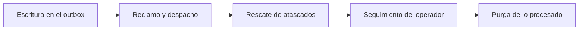

<!-- Generado por scripts/processes/generate-process-docs.ts desde src/modules/workflow-catalog/definitions. No editar a mano. -->

# P-32 · Eventos de dominio: outbox, relay, inbox y reintentos

`domain_events_outbox` · v1 · prioridad **P2** · tipo `system_job` · dueño `SYSTEMS_ADMIN` · bloques `ATLAS_BACKEND`

Cómo viaja un evento de dominio: el servicio lo escribe en outbox_events dentro de su propia transacción, los jobs lo reclaman con lease y lo despachan a cada consumidor con recibo de inbox, reintentan con espera creciente, rescatan lo atascado y purgan lo ya procesado; el operador lo sigue y lo reintenta o cancela desde el portal.

## Por qué existe

Desacopla los procesos de negocio y permite reintentos auditables sin perder eventos: si el evento se escribe en la misma transacción que el cambio, no hay pago confirmado sin su evento ni evento de un pago que no ocurrió, y un consumidor que ya lo procesó no lo repite.

## Quién lo inicia y quién lo cierra

Lo inicia cualquier servicio de negocio al escribir en outbox_events; lo cierran los jobs process_events y process_outbox al despacharlo, o un operador interno que lo reintenta o cancela desde «Eventos». Nadie lo inicia a mano salvo la publicación manual de un operador.

## Cuándo empieza y cuándo termina

Empieza con la fila en pending dentro de la transacción del servicio y termina en processed (con recibo en inbox_receipts por consumidor), en failed tras agotar max_attempts, o en cancelled por un operador; la purga borra lo procesado pasado su período de retención.

## Qué pasa cuando falla

Un fallo reintenta con espera de attempts² minutos (tope 60) y al agotar intentos pasa a failed, que es la cola de muertos; si el proceso muere a mitad, reclaim_stuck_events rescata lo que quedó en processing. Un evento sin registro lo marca procesado process_outbox sin avisar a nadie: esa es la trampa conocida.

## Qué indicador dice que va bien

Filas en pending y processing más viejas que el intervalo del job, filas en failed, y para los avisos la prueba real: notification_messages.outbox_event_id con una entrega sent o delivered; «Trabajo pendiente» de Flujos lo da por código de evento.

## Resultado

- **Éxito:** Cada evento llega a sus consumidores una sola vez y queda processed con su recibo de inbox.
- **Fracaso:** El evento se queda en failed o atascado en processing, o se marca procesado sin que nadie se entere.

## Dónde vive cada instancia

`ATLAS_BACKEND` · `platform_ops.outbox_events` · estado en `status` · abiertas: `pending`, `processing`, `failed`

## Etapas

| Etapa | Nombre | Actor | Cliente | Pantalla | Pasos |
|---|---|---|---|---|---|
| `outbox_write` | Escritura en el outbox | system | BLOCK | — | 2 |
| `outbox_dispatch` | Reclamo y despacho | system | BLOCK | — | 2 |
| `outbox_recovery` | Rescate de atascados | system | BLOCK | — | 1 |
| `outbox_operator_follow_up` | Seguimiento del operador | internal_user | ADMIN_PORTAL | `/internal/events` | 5 |
| `outbox_purge` | Purga de lo procesado | system | BLOCK | — | 1 |

### Escritura en el outbox (`outbox_write`)

El servicio de negocio escribe el evento en outbox_events en la misma transacción que el cambio que lo origina.

| Paso | Tipo | Bloque | Operación | Roles | Eventos |
|---|---|---|---|---|---|
| Escribir el evento en la transacción del servicio | event | ATLAS_BACKEND | No es una llamada: lo escribe el propio servicio de negocio dentro de su transacción (patrón outbox transaccional). | — | — |
| Publicar un evento a mano | http | ATLAS_BACKEND | `POST /operations/events` | internal_operator, risk_analyst, compliance_analyst, fraud_analyst, admin, platform_admin, system | — |

### Reclamo y despacho (`outbox_dispatch`)

process_events reclama los códigos del registro con lease y owner_token y despacha a cada consumidor con recibo de inbox; process_outbox atiende los que no están en el registro.

| Paso | Tipo | Bloque | Operación | Roles | Eventos |
|---|---|---|---|---|---|
| Despachar eventos registrados | job | ATLAS_BACKEND | job `process_events` | — | — |
| Drenar el resto del outbox | job | ATLAS_BACKEND | job `process_outbox` | — | — |

### Rescate de atascados (`outbox_recovery`)

Devuelve a pending los eventos que quedaron en processing porque el proceso murió a la mitad.

| Paso | Tipo | Bloque | Operación | Roles | Eventos |
|---|---|---|---|---|---|
| Rescatar eventos atascados | job | ATLAS_BACKEND | job `reclaim_stuck_events` | — | — |

### Seguimiento del operador (`outbox_operator_follow_up`)

El operador consulta los eventos, ve el catálogo y reintenta o cancela los que fallaron.

| Paso | Tipo | Bloque | Operación | Roles | Eventos |
|---|---|---|---|---|---|
| Listar eventos | http | ATLAS_BACKEND | `GET /operations/events` | internal_operator, risk_analyst, compliance_analyst, fraud_analyst, admin, platform_admin, system | — |
| Ver el catálogo de eventos | http | ATLAS_BACKEND | `GET /operations/events/catalog` | internal_operator, risk_analyst, compliance_analyst, fraud_analyst, admin, platform_admin, system | — |
| Ver un evento | http | ATLAS_BACKEND | `GET /operations/events/:eventId` | internal_operator, risk_analyst, compliance_analyst, fraud_analyst, admin, platform_admin, system | — |
| Reintentar un evento | http | ATLAS_BACKEND | `POST /operations/events/:eventId/retry` | internal_operator, risk_analyst, compliance_analyst, fraud_analyst, admin, platform_admin, system | — |
| Cancelar un evento | http | ATLAS_BACKEND | `POST /operations/events/:eventId/cancel` | internal_operator, risk_analyst, compliance_analyst, fraud_analyst, admin, platform_admin, system | — |

### Purga de lo procesado (`outbox_purge`)

Borra las filas processed pasado su período de retención, para que el outbox no crezca para siempre.

| Paso | Tipo | Bloque | Operación | Roles | Eventos |
|---|---|---|---|---|---|
| Purgar el outbox procesado | job | ATLAS_BACKEND | job `purge_processed_outbox` | — | — |

## Fuentes

- `src/modules/events/events.controller.ts`
- `src/modules/events/events.service.ts`
- `src/platform/events/outbox-relay.service.ts`
- `src/modules/runtime-jobs/scheduled-jobs.catalog.ts`
- `src/database/models/outbox-events.model.ts`
- `memoria atlas-eventos-de-dominio-sin-aviso`
- `memoria atlas-flujos-revision-humana`
- `_plan-documentar-procesos-y-cableado-portal-2026-09-26/datos/procesos.json (P-32)`
