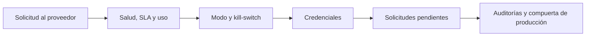

<!-- Generado por scripts/processes/generate-process-docs.ts desde src/modules/workflow-catalog/definitions. No editar a mano. -->

# P-36 · Proveedores externos: salud, kill-switch, credenciales, auditorías y compuerta de producción

`external_providers_operations` · v1 · prioridad **P2** · tipo `back_office` · dueño `SYSTEMS_ADMIN` · bloques `ATLAS_BACKEND`, `EXTERNAL_PROVIDERS_MOCK`

Operación de los proveedores de datos externos: una solicitud sale al proveedor (o al mock en dev/test), el administrador vigila salud, SLA y uso, ajusta el modo de cada proveedor, corta con el kill-switch, rota o revoca credenciales, atiende solicitudes que piden aprobación o reintento, y revisa las auditorías y la compuerta de producción.

## Por qué existe

Las consultas a terceros de identidad, buró, telco, pagos o redes cuestan dinero, llevan datos personales y pueden caerse: hace falta ver su salud, poder cortarlas al instante, rotar sus credenciales, auditar idempotencia y saneamiento, y una compuerta que diga si un proveedor está listo para producción.

## Quién lo inicia y quién lo cierra

Lo inicia el sistema al pedir datos a un proveedor durante un proceso de cliente; lo opera un administrador (rol de sesión admin o platform_admin) o un analista de riesgo o cumplimiento en modo lectura, y lo cierra el administrador al aprobar, reintentar o dar por lista la compuerta de producción.

## Cuándo empieza y cuándo termina

Empieza con una solicitud de datos externos por proveedor y termina con su respuesta registrada y el estado del proveedor (modo mock, sandbox o live, o cortado por kill-switch) al día, credenciales vigentes y la compuerta de producción revisada.

## Qué pasa cuando falla

Un proveedor caído o lento se ve en salud y SLA; el kill-switch lo corta sin desplegar; una solicitud que exige aprobación manual espera en «Solicitudes» y una fallida se reintenta o se reconstruyen sus rasgos. En dev y test responden nueve adaptadores de prueba a propósito, y el tablero llegó a mostrar «Responde · 0 ms» sin medir nada.

## Qué indicador dice que va bien

Proveedores sanos frente a degradados, cumplimiento de SLA, coste de uso, credenciales pendientes de rotación y el veredicto de la compuerta de producción; todo en «Proveedores externos» y sus pestañas de auditoría.

## Resultado

- **Éxito:** Cada proveedor responde con su modo correcto, sus credenciales están vigentes y la compuerta de producción dice si puede pasar a live.
- **Fracaso:** Un proveedor caído o caro sigue recibiendo consultas, una credencial expira sin rotar, o se pasa a producción sin compuerta.

## Dónde vive cada instancia

`ATLAS_BACKEND` · `integrations.data_providers` · estado en `provider_status`

## Etapas

| Etapa | Nombre | Actor | Cliente | Pantalla | Pasos |
|---|---|---|---|---|---|
| `provider_request` | Solicitud al proveedor | system | BLOCK | — | 3 |
| `provider_monitoring` | Salud, SLA y uso | internal_user | ADMIN_PORTAL | `/internal/external-providers` | 4 |
| `provider_runtime_control` | Modo y kill-switch | internal_user | ADMIN_PORTAL | `/internal/external-providers` | 4 |
| `provider_credentials` | Credenciales | internal_user | ADMIN_PORTAL | `/internal/external-providers` | 4 |
| `provider_requests_follow_up` | Solicitudes pendientes | internal_user | ADMIN_PORTAL | `/internal/external-providers/requests` | 4 |
| `provider_audits_and_gate` | Auditorías y compuerta de producción | internal_user | ADMIN_PORTAL | `/internal/external-providers/audits` | 5 |

### Solicitud al proveedor (`provider_request`)

Un proceso de cliente pide datos externos; con consentimiento, la solicitud sale al proveedor (o al mock en dev/test).

| Paso | Tipo | Bloque | Operación | Roles | Eventos |
|---|---|---|---|---|---|
| Previsualizar la solicitud | http | ATLAS_BACKEND | `POST /external-data/requests/preview` | customer, internal_operator, risk_analyst, compliance_analyst, fraud_analyst, admin, platform_admin, system | — |
| Crear la solicitud de datos | http | ATLAS_BACKEND | `POST /external-data/requests` | customer, internal_operator, risk_analyst, compliance_analyst, fraud_analyst, admin, platform_admin, system | — |
| Llamada al proveedor | external | EXTERNAL_PROVIDERS_MOCK | Es la llamada saliente al tercero (o al repo AtlasExternalProvidersMock en dev/test), no una ruta de Atlas. | customer, internal_operator, risk_analyst, compliance_analyst, fraud_analyst, admin, platform_admin, system | — |

### Salud, SLA y uso (`provider_monitoring`)

El administrador vigila el tablero de proveedores: salud, disponibilidad, SLA, uso y coste.

| Paso | Tipo | Bloque | Operación | Roles | Eventos |
|---|---|---|---|---|---|
| Ver el tablero | http | ATLAS_BACKEND | `GET /admin/external-providers/dashboard` | admin, platform_admin, risk_analyst, compliance_analyst | — |
| Ver la salud | http | ATLAS_BACKEND | `GET /admin/external-providers/health` | admin, platform_admin, risk_analyst, compliance_analyst | — |
| Ver el SLA | http | ATLAS_BACKEND | `GET /admin/external-providers/sla` | admin, platform_admin, risk_analyst, compliance_analyst | — |
| Ver el uso | http | ATLAS_BACKEND | `GET /admin/external-providers/usage` | admin, platform_admin, risk_analyst, compliance_analyst | — |

### Modo y kill-switch (`provider_runtime_control`)

El administrador cambia el modo de un proveedor, lo prueba, ajusta su política de coste o lo corta con el kill-switch.

| Paso | Tipo | Bloque | Operación | Roles | Eventos |
|---|---|---|---|---|---|
| Cambiar el modo del proveedor | http | ATLAS_BACKEND | `PATCH /admin/external-providers/:providerCode/runtime` | admin, platform_admin | — |
| Cortar el proveedor | http | ATLAS_BACKEND | `POST /admin/external-providers/:providerCode/kill-switch` | admin, platform_admin, risk_analyst, compliance_analyst | — |
| Probar el proveedor | http | ATLAS_BACKEND | `POST /admin/external-providers/:providerCode/test` | admin, platform_admin, risk_analyst, compliance_analyst | — |
| Ajustar la política de coste | http | ATLAS_BACKEND | `PATCH /admin/external-providers/:providerCode/cost-policy/:queryType` | admin, platform_admin | — |

### Credenciales (`provider_credentials`)

El administrador ve qué credenciales están por rotar y las rota, revoca o invalida su token.

| Paso | Tipo | Bloque | Operación | Roles | Eventos |
|---|---|---|---|---|---|
| Credenciales por rotar | http | ATLAS_BACKEND | `GET /admin/external-providers/credentials/pending-rotation` | admin, platform_admin, risk_analyst, compliance_analyst | — |
| Rotar credenciales | http | ATLAS_BACKEND | `POST /admin/external-providers/:providerCode/credentials/rotate` | admin, platform_admin | — |
| Revocar credenciales | http | ATLAS_BACKEND | `POST /admin/external-providers/:providerCode/credentials/revoke` | admin, platform_admin | — |
| Invalidar el token | http | ATLAS_BACKEND | `POST /admin/external-providers/:providerCode/credentials/invalidate-token` | admin, platform_admin | — |

### Solicitudes pendientes (`provider_requests_follow_up`)

El administrador aprueba las solicitudes que exigen aprobación manual y reintenta o reconstruye las fallidas.

| Paso | Tipo | Bloque | Operación | Roles | Eventos |
|---|---|---|---|---|---|
| Listar solicitudes | http | ATLAS_BACKEND | `GET /admin/external-providers/requests` | admin, platform_admin, risk_analyst, compliance_analyst | — |
| Aprobar una solicitud | http | ATLAS_BACKEND | `POST /admin/external-providers/requests/:requestId/approve` | admin, platform_admin | — |
| Reintentar una solicitud | http | ATLAS_BACKEND | `POST /admin/external-providers/requests/:requestId/retry` | admin, platform_admin, risk_analyst, compliance_analyst | — |
| Reconstruir rasgos | http | ATLAS_BACKEND | `POST /admin/external-providers/requests/:requestId/rebuild-features` | admin, platform_admin, risk_analyst, compliance_analyst | — |

### Auditorías y compuerta de producción (`provider_audits_and_gate`)

El administrador revisa calidad, idempotencia y saneamiento y la compuerta que dice si un proveedor puede pasar a live.

| Paso | Tipo | Bloque | Operación | Roles | Eventos |
|---|---|---|---|---|---|
| Auditoría de calidad | http | ATLAS_BACKEND | `GET /admin/external-providers/quality-audit` | admin, platform_admin, risk_analyst, compliance_analyst | — |
| Auditoría de idempotencia | http | ATLAS_BACKEND | `GET /admin/external-providers/idempotency-audit` | admin, platform_admin, risk_analyst, compliance_analyst | — |
| Auditoría de saneamiento | http | ATLAS_BACKEND | `GET /admin/external-providers/sanitization-audit` | admin, platform_admin, risk_analyst, compliance_analyst | — |
| Preparación por proveedor | http | ATLAS_BACKEND | `GET /admin/external-providers/readiness` | admin, platform_admin, risk_analyst, compliance_analyst | — |
| Compuerta de producción | http | ATLAS_BACKEND | `GET /admin/external-providers/production-gate` | admin, platform_admin, risk_analyst, compliance_analyst | — |

## Fuentes

- `src/modules/external-data/external-data.controller.ts`
- `src/modules/external-data/controllers/provider-auth.controller.ts`
- `src/modules/external-data/controllers/external-providers-dashboard.controller.ts`
- `src/database/models/data-providers.model.ts`
- `memoria atlas-conectores-externos-mock`
- `memoria atlas-mock-proveedores-externos`
- `memoria atlas-portal-tablero-proveedores`
- `_plan-documentar-procesos-y-cableado-portal-2026-09-26/datos/procesos.json (P-36)`
