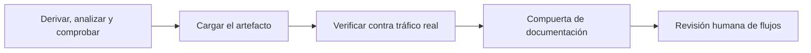

<!-- Generado por scripts/processes/generate-process-docs.ts desde src/modules/workflow-catalog/definitions. No editar a mano. -->

# P-31 · Flujos: derivar → analizar → comprobar → cargar → verificar → compuerta → revisión humana

`flow_intelligence_cycle` · v1 · prioridad **P2** · tipo `system_job` · dueño `SYSTEMS_ADMIN` · bloques `ATLAS_BACKEND`

El ciclo de Flow Intelligence: el repositorio AtlasFlowIntelligence deriva el inventario federado de rutas y pantallas, lo analiza con el compilador, lo compara con la línea base; el cargador lo sube al catálogo de flujos, se verifica contra el tráfico real, la compuerta de documentación dice qué falta mirar y una persona revisa los flujos críticos inciertos.

## Por qué existe

Nadie sabía qué pantalla llama a qué ruta, qué tablas escribe ni si se había visto funcionar: el mapa de flujos une los catálogos que ya existían con las pantallas de los cinco clientes y hace ruidosa la deriva (llamadas a rutas inexistentes, escrituras públicas, menús sin permiso).

## Quién lo inicia y quién lo cierra

Lo inicia el sistema: un push a dev o el cron 06:17 en GitHub Actions del repo AtlasFlowIntelligence. La carga la lanza un administrador de sistemas con load.mjs y su sesión con PIN; lo cierra la persona de gobierno (permiso systems.flows.review) que firma los flujos críticos en la cola de revisión.

## Cuándo empieza y cuándo termina

Empieza con derive.mjs sobre los repos en dev y termina con el artefacto cargado (declaredCount igual al del manifiesto y artifact_generated_at no anterior al último), la verificación hecha y FLOW_DOCUMENTATION_GATE en verde; los flujos CRITICAL/HIGH inciertos quedan APPROVED o REJECTED.

## Qué pasa cuando falla

El gate de Actions falla sólo por hallazgos nuevos respecto a la línea base; sin el secret ATLAS_REPOS_TOKEN corre con los repos públicos y lo avisa. Una carga truncada o vieja la rechaza el servidor. Hoy el gate está en rojo desde el 2026-09-21 por seis llamadas sin ruta y el 26-09 no arrancó por facturación de GitHub.

## Qué indicador dice que va bien

Compuerta de documentación en verde, flujos VERIFIED frente a BROKEN (107 de 112 en la primera verificación), frescura FRESH frente a STALE, y cola de revisión vacía; lo ve el administrador en «Flujos» y «Compuerta».

## Resultado

- **Éxito:** El artefacto vigente está cargado, verificado contra tráfico real, la compuerta pasa y los flujos críticos inciertos están firmados.
- **Fracaso:** El gate queda en rojo, la carga se rechaza o el catálogo de flujos se queda viejo sin que la compuerta lo diga.

## Dónde vive cada instancia

`ATLAS_BACKEND` · `platform_ops.system_flow_catalog` · estado en `review_status` · abiertas: `NEEDS_REVIEW`

## Etapas

| Etapa | Nombre | Actor | Cliente | Pantalla | Pasos |
|---|---|---|---|---|---|
| `flows_derive_and_check` | Derivar, analizar y comprobar | system | BLOCK | — | 3 |
| `flows_load` | Cargar el artefacto | system | BLOCK | — | 5 |
| `flows_verify` | Verificar contra tráfico real | system | BLOCK | — | 1 |
| `flows_gate` | Compuerta de documentación | internal_user | ADMIN_PORTAL | `/internal/flows/gate` | 4 |
| `flows_human_review` | Revisión humana de flujos | internal_user | ADMIN_PORTAL | `/internal/flows/review` | 2 |

### Derivar, analizar y comprobar (`flows_derive_and_check`)

FLOW_CONSISTENCY_CHECK clona los repos en dev, regenera el artefacto, lo analiza con el compilador y lo compara con flow-model/baseline.json.

| Paso | Tipo | Bloque | Operación | Roles | Eventos |
|---|---|---|---|---|---|
| Derivar el inventario federado | external | ATLAS_BACKEND | Corre en GitHub Actions del repo AtlasFlowIntelligence (push a dev o cron 17 6 * * *), fuera de cualquier bloque. | — | — |
| Analizar handler → servicio → tabla | external | ATLAS_BACKEND | Paso del mismo workflow de Actions; no llama a ningún bloque ni escribe en ninguna base. | — | — |
| Comparar con la línea base | external | ATLAS_BACKEND | Es el gate de Actions del repo AtlasFlowIntelligence; su salida es un artifact del run, no una llamada. | — | — |

### Cargar el artefacto (`flows_load`)

load.mjs lee primero el contrato de carga y sube rutas, pantallas y hallazgos por bloque, con declaredCount y la fecha del artefacto. Lo ejecuta un administrador con su sesión y PIN.

| Paso | Tipo | Bloque | Operación | Roles | Eventos |
|---|---|---|---|---|---|
| Leer el contrato de carga | http | ATLAS_BACKEND | `GET /systems/flows/import/contract` | system_admin, platform_admin, admin, qa_engineer, devops, risk_analyst, compliance_analyst, readonly_auditor, internal_operator | — |
| Cargar flujos (rutas) | http | ATLAS_BACKEND | `POST /systems/flows/import/endpoints` | system_admin, platform_admin, admin | — |
| Cargar pantallas | http | ATLAS_BACKEND | `POST /systems/flows/import/screens` | system_admin, platform_admin, admin | — |
| Cargar hallazgos | http | ATLAS_BACKEND | `POST /systems/flows/import/findings` | system_admin, platform_admin, admin | — |
| Historial de cargas | http | ATLAS_BACKEND | `GET /systems/flows/imports` | system_admin, platform_admin, admin, qa_engineer, devops, risk_analyst, compliance_analyst, readonly_auditor, internal_operator | — |

### Verificar contra tráfico real (`flows_verify`)

Cruza los flujos con system_action_logs de los últimos 30 días: método, ruta y código HTTP.

| Paso | Tipo | Bloque | Operación | Roles | Eventos |
|---|---|---|---|---|---|
| Verificar flujos | http | ATLAS_BACKEND | `POST /systems/flows/verify` | system_admin, platform_admin, admin | — |

### Compuerta de documentación (`flows_gate`)

El administrador mira qué no se ha podido comprobar: hallazgos sin cargar, deriva cortada, menús sin permiso y trabajo pendiente.

| Paso | Tipo | Bloque | Operación | Roles | Eventos |
|---|---|---|---|---|---|
| Leer la compuerta | http | ATLAS_BACKEND | `GET /systems/flows/documentation-gate` | system_admin, platform_admin, admin, qa_engineer, devops, risk_analyst, compliance_analyst, readonly_auditor, internal_operator | — |
| Ver la deriva de permisos del menú | http | ATLAS_BACKEND | `GET /systems/flows/rbac-drift` | system_admin, platform_admin, admin, qa_engineer, devops, risk_analyst, compliance_analyst, readonly_auditor, internal_operator | — |
| Ver el trabajo pendiente | http | ATLAS_BACKEND | `GET /systems/flows/pending-work` | system_admin, platform_admin, admin, qa_engineer, devops, risk_analyst, compliance_analyst, readonly_auditor, internal_operator | — |
| Ver procesos de negocio contra el catálogo | http | ATLAS_BACKEND | `GET /systems/flows/business` | system_admin, platform_admin, admin, qa_engineer, devops, risk_analyst, compliance_analyst, readonly_auditor, internal_operator | — |

### Revisión humana de flujos (`flows_human_review`)

La persona con systems.flows.review firma los flujos CRITICAL/HIGH con análisis incierto; decidir exige la huella de dependencias que traía la cola.

| Paso | Tipo | Bloque | Operación | Roles | Eventos |
|---|---|---|---|---|---|
| Leer la cola de revisión | http | ATLAS_BACKEND | `GET /systems/flows/review-queue` | system_admin, platform_admin, admin, qa_engineer, devops, risk_analyst, compliance_analyst, readonly_auditor, internal_operator | — |
| Firmar un flujo | http | ATLAS_BACKEND | `PATCH /systems/flows/:flowId/review` | system_admin, platform_admin, admin, qa_engineer, devops, risk_analyst, compliance_analyst, readonly_auditor, internal_operator | — |

## Fuentes

- `/private/tmp/fi-root-20260926/AtlasFlowIntelligence/.github/workflows/flow-consistency-check.yml`
- `/private/tmp/fi-root-20260926/AtlasFlowIntelligence/tools/README.md`
- `src/modules/systems-ops/system-flows.controller.ts`
- `src/modules/systems-ops/system-flows-review.controller.ts`
- `src/modules/systems-ops/systems-ops.constants.ts`
- `memoria atlas-flow-intelligence-ya-existe`
- `memoria atlas-flujos-revision-humana`
- `_plan-documentar-procesos-y-cableado-portal-2026-09-26/datos/procesos.json (P-31)`
