<!-- Generado por scripts/processes/generate-process-docs.ts desde src/modules/workflow-catalog/definitions. No editar a mano. -->

# P-03 · Verificación de identidad (carnet + selfie) con el Motor y arbitraje humano

`identity_verification` · v1 · prioridad **P0** · tipo `integration` · dueño `RISK_ANALYST` · bloques `ATLAS_BACKEND`, `DECISION_ENGINE`

La app registra el carnet y la selfie en el expediente y pregunta al Motor si la persona es quien dice ser. El artefacto IDENTIDAD_CARNET_MOVIL responde verificado, rechazado o revisión humana; en el último caso un analista resuelve en la cola IDENTIDAD del Motor y la resolución vuelve a Atlas por un aviso firmado con clave de servicio.

## Por qué existe

Prestar a alguien que no es quien dice ser es la pérdida más directa del negocio. Una foto del carnet sola no prueba nada, así que la decisión cruza el documento, su autenticidad, el parecido con la selfie, el registro estatal, la agenda y cómo se hizo el alta, y la política que decide vive versionada en el Motor para poder cambiarla sin publicar la app.

## Quién lo inicia y quién lo cierra

Lo inicia el cliente desde la app al enviar anverso, dorso y selfie. Lo cierra el Motor de forma automática (verificado o rechazado) o, cuando deriva a revisión humana, un analista de riesgo, fraude u operaciones que resuelve el caso en la cola IDENTIDAD del portal del Motor; un analista interno de Atlas sólo decide intentos que el Motor no delegó.

## Cuándo empieza y cuándo termina

Empieza cuando la app envía las imágenes y recibe un identificador con el estado PENDING (la respuesta no espera al veredicto). Termina cuando el intento queda VERIFIED o REJECTED: en el acto si decide el Motor, o cuando llega el aviso de la revisión humana, que además mueve al cliente a activo u observado. La app consulta el estado en bucle hasta ver un veredicto.

## Qué pasa cuando falla

Si el Motor no responde, el intento queda UNAVAILABLE, que no es un rechazo y la app no debe pintarlo como tal; sin Motor configurado la petición responde 503. Si el aviso de vuelta falla, la resolución del analista se conserva en el Motor y el fallo queda en su auditoría, pero el intento sigue IN_REVIEW en Atlas. Hoy nadie avisa al cliente del veredicto: kyc.approved y kyc.rejected tienen canales y ningún código los emite.

## Qué indicador dice que va bien

Reparto de final_result en identity_verification_attempts (VERIFIED, REJECTED, IN_REVIEW, UNAVAILABLE) y antigüedad de los intentos que siguen IN_REVIEW con executionId del Motor; un IN_REVIEW que envejece con el caso ya resuelto en el Motor delata un aviso perdido. La tasa de UNAVAILABLE mide la disponibilidad del Motor, no el fraude.

## Resultado

- **Éxito:** El intento de identidad queda VERIFIED (o REJECTED con motivo) y, si pasó por una persona, el expediente del cliente refleja su decisión.
- **Fracaso:** El intento se queda en PENDING, UNAVAILABLE o IN_REVIEW sin que nadie lo resuelva, o la resolución del Motor no vuelve a Atlas.

## Dónde vive cada instancia

`ATLAS_BACKEND` · `customer.identity_verification_attempts` · estado en `final_result` · abiertas: `PENDING`, `IN_REVIEW`, `UNAVAILABLE`, `pending_review`

## Etapas

```mermaid
flowchart LR
  identity_evidence_registration["Registro del carnet y la selfie en el expediente"]
  identity_engine_request["Pregunta al Motor"]
  identity_engine_decision["Decisión automática del Motor"]
  identity_result_polling["Consulta del resultado"]
  identity_registry_check["Contraste con el registro estatal"]
  identity_motor_human_review["Revisión humana en la cola IDENTIDAD del Motor"]
  identity_review_callback["Vuelta de la resolución a Atlas"]
  identity_atlas_review["Decisión de identidad desde el portal admin"]
  identity_manual_apply["Aplicar a mano una resolución de revisión"]
  identity_evidence_registration --> identity_engine_request
  identity_engine_request --> identity_engine_decision
  identity_engine_decision --> identity_result_polling
  identity_result_polling --> identity_registry_check
  identity_registry_check --> identity_motor_human_review
  identity_motor_human_review --> identity_review_callback
  identity_review_callback --> identity_atlas_review
  identity_atlas_review --> identity_manual_apply
```

| Etapa | Nombre | Actor | Cliente | Pantalla | Pasos |
|---|---|---|---|---|---|
| `identity_evidence_registration` | Registro del carnet y la selfie en el expediente | customer | CONSUMER_APP | **sin pantalla declarada** | 2 |
| `identity_engine_request` | Pregunta al Motor | customer | CONSUMER_APP | **sin pantalla declarada** | 1 |
| `identity_engine_decision` | Decisión automática del Motor | system | BLOCK | enlace: `{MOTOR}/workers/identity-verification` | 2 |
| `identity_result_polling` | Consulta del resultado | customer | CONSUMER_APP | **sin pantalla declarada** | 1 |
| `identity_registry_check` | Contraste con el registro estatal | customer | CONSUMER_APP | **sin pantalla declarada** | 1 |
| `identity_motor_human_review` | Revisión humana en la cola IDENTIDAD del Motor | internal_user | MOTOR_PORTAL | enlace: `{MOTOR}/manual-reviews` | 5 |
| `identity_review_callback` | Vuelta de la resolución a Atlas | system | BLOCK | — | 1 |
| `identity_atlas_review` | Decisión de identidad desde el portal admin | internal_user | ADMIN_PORTAL | `/internal/operations/customers/[customerId]/investigation-summary` | 4 |
| `identity_manual_apply` | Aplicar a mano una resolución de revisión | internal_user | ADMIN_PORTAL | **sin pantalla declarada** | 1 |

### Registro del carnet y la selfie en el expediente (`identity_evidence_registration`)

La app sube las imágenes al almacén con un permiso firmado y registra el paquete de identidad. Es el registro de la evidencia; todavía no pregunta si la persona es quien dice ser.

| Paso | Tipo | Bloque | Operación | Roles | Eventos |
|---|---|---|---|---|---|
| Pedir permiso de subida de cada imagen | http | ATLAS_BACKEND | `POST /customer-onboarding/:customerId/documents/upload-url` | customer, internal_operator, risk_analyst, admin, platform_admin | — |
| Entregar el paquete de identidad | http | ATLAS_BACKEND | `POST /customer-onboarding/:customerId/identity-package` | customer, internal_operator, risk_analyst, admin, platform_admin | — |

### Pregunta al Motor (`identity_engine_request`)

La app envía carnet y selfie para que el Motor decida. La respuesta llega enseguida con un identificador y estado PENDING: el veredicto se calcula después.

| Paso | Tipo | Bloque | Operación | Roles | Eventos |
|---|---|---|---|---|---|
| Enviar carnet y selfie para verificar | http | ATLAS_BACKEND | `POST /mobile/identity-verifications` | customer, internal_operator, risk_analyst, admin, platform_admin | — |

### Decisión automática del Motor (`identity_engine_decision`)

El artefacto de identidad asignado (IDENTIDAD_CARNET_MOVIL por omisión) llama al worker de identidad y aplica su política: VERIFICADO, RECHAZADO o REVISION_HUMANA, que abre un caso en la cola IDENTIDAD.

| Paso | Tipo | Bloque | Operación | Roles | Eventos |
|---|---|---|---|---|---|
| Ejecutar el artefacto de identidad | http | DECISION_ENGINE | `POST /v1/decisions/:artifactCode` | — | — |
| Lectura, autenticidad y comparación de rostros | external | DECISION_ENGINE | Lo invoca el propio grafo del artefacto dentro del Motor; Atlas no hace una llamada HTTP separada al worker. | — | — |

### Consulta del resultado (`identity_result_polling`)

La app pregunta por el identificador hasta ver un veredicto. IN_REVIEW significa que lo mira una persona; UNAVAILABLE, que no se pudo preguntar al Motor.

| Paso | Tipo | Bloque | Operación | Roles | Eventos |
|---|---|---|---|---|---|
| Consultar el estado de la verificación | http | ATLAS_BACKEND | `GET /mobile/identity-verifications/:verificationId` | customer, internal_operator, risk_analyst, admin, platform_admin | — |

### Contraste con el registro estatal (`identity_registry_check`)

Camino del proveedor: consulta el registro estatal con los datos declarados. FOUND verifica, NOT_FOUND rechaza y devuelve al cliente a observado, y una coincidencia parcial o una caída del proveedor deja el intento pending_review para un analista.

| Paso | Tipo | Bloque | Operación | Roles | Eventos |
|---|---|---|---|---|---|
| Verificar la identidad contra el registro externo | http | ATLAS_BACKEND | `POST /customer-onboarding/:customerId/identity-verification` | customer, internal_operator, risk_analyst, admin, platform_admin | — |

### Revisión humana en la cola IDENTIDAD del Motor (`identity_motor_human_review`)

Un analista abre el caso, mira las imágenes guardadas y resuelve. Sólo la resolución de esta cola avisa a Atlas; la bandeja de revisiones del worker etiqueta el corpus pero no cierra el intento.

| Paso | Tipo | Bloque | Operación | Roles | Eventos |
|---|---|---|---|---|---|
| Listar los casos abiertos | http | DECISION_ENGINE | `GET /v1/manual-reviews` | OPERATIONS, RISK_ANALYST, FRAUD_ANALYST | — |
| Abrir el caso | http | DECISION_ENGINE | `GET /v1/manual-reviews/:caseId` | OPERATIONS, RISK_ANALYST, FRAUD_ANALYST | — |
| Ver las imágenes de la ejecución | http | DECISION_ENGINE | `GET /v1/workers/identity-verification/runs/:requestId/images/:kind` | OPERATIONS, RISK_ANALYST, FRAUD_ANALYST | — |
| Tomar o asignar el caso | http | DECISION_ENGINE | `POST /v1/manual-reviews/:caseId/assign` | OPERATIONS, RISK_ANALYST, FRAUD_ANALYST | — |
| Resolver el caso | http | DECISION_ENGINE | `POST /v1/manual-reviews/:caseId/resolve` | OPERATIONS, RISK_ANALYST, FRAUD_ANALYST | — |

### Vuelta de la resolución a Atlas (`identity_review_callback`)

El Motor avisa con clave de servicio y el executionId; Atlas resuelve exactamente ese intento, su documento y todas sus evidencias pendientes, y mueve al cliente a activo u observado.

| Paso | Tipo | Bloque | Operación | Roles | Eventos |
|---|---|---|---|---|---|
| Aplicar la resolución del Motor | http | ATLAS_BACKEND | `POST /internal/identity/manual-review-callback` | — | — |

### Decisión de identidad desde el portal admin (`identity_atlas_review`)

El analista interno mira las evidencias en el resumen de investigación del cliente y aprueba o rechaza en bloque. Sólo vale para intentos que el Motor no delegó: si el Motor abrió caso responde 409 y se resuelve allí.

| Paso | Tipo | Bloque | Operación | Roles | Eventos |
|---|---|---|---|---|---|
| Abrir el resumen de investigación | http | ATLAS_BACKEND | `GET /operations/customers/:customerId/investigation-summary` | internal_operator, risk_analyst, compliance_analyst, admin, platform_admin | — |
| Listar las evidencias de identidad | http | ATLAS_BACKEND | `GET /customer-onboarding/:customerId/evidence-documents` | internal_operator, risk_analyst, admin, platform_admin | — |
| Ver los bytes de una evidencia | http | ATLAS_BACKEND | `GET /customer-onboarding/:customerId/evidence-documents/:documentId/content` | internal_operator, risk_analyst, admin, platform_admin | — |
| Aprobar o rechazar la identidad | http | ATLAS_BACKEND | `POST /operations/customers/:customerId/identity-verification/decision` | internal_operator, risk_analyst, compliance_analyst, admin, platform_admin | — |

### Aplicar a mano una resolución de revisión (`identity_manual_apply`)

Ruta para que un analista aplique al expediente una decisión humana indicando quién la tomó. No la llama ninguna pantalla: el aviso del Motor la sustituyó en el día a día.

| Paso | Tipo | Bloque | Operación | Roles | Eventos |
|---|---|---|---|---|---|
| Aplicar la resolución manual de identidad | http | ATLAS_BACKEND | `POST /customer-onboarding/:customerId/identity-manual-review` | internal_operator, risk_analyst, admin, platform_admin | — |

## Fuentes

- `src/modules/mobile-identity/mobile-identity.controller.ts`
- `src/modules/mobile-identity/mobile-identity.service.ts`
- `src/modules/mobile-identity/mobile-identity.schemas.ts`
- `src/modules/customer-onboarding/identity-review-callback.controller.ts`
- `src/modules/customer-onboarding/application/identity-manual-review-outcome.service.ts`
- `src/modules/customer-onboarding/customer-verification.controller.ts`
- `src/modules/customer-onboarding/application/customer-verification.service.ts`
- `src/modules/customer-onboarding/customer-onboarding-profile.controller.ts`
- `src/modules/customer-onboarding/customer-onboarding.controller.ts`
- `src/modules/customer-onboarding/customer-evidence-view.controller.ts`
- `src/common/utils/identity/identity-result.util.ts`
- `src/modules/notifications/notification-rules.service.ts`
- `AtlasDecisionEngineBackend/src/modules/manual-review/manual-review.service.ts`
- `AtlasDecisionEngineBackend/docs/artifacts/identidad-carnet-movil.md`
- `AtlasAdminPortal/src/features/operations-cases/identity-evidence-panel.tsx`
- `AtlasFrontend/apps/consumer-app/src/api/endpoints/identity-engine.ts`
- `memoria atlas-identidad-cola-humana`
- `memoria atlas-escaner-carnet-implementado`
- `memoria atlas-fraude-documental-identidad`
- `memoria atlas-motor-imagenes-persistidas`
- `memoria atlas-motor-evidencia-obligatoria`
- `_plan-escaner-carnet-2026-09-26/plan.md`
