<!-- Generado por scripts/processes/generate-process-docs.ts desde src/modules/workflow-catalog/definitions. No editar a mano. -->

# P-09 · Pago de cuota con QR del comercio, comprobante y verificación

`installment_payment_claims` · v1 · prioridad **P0** · tipo `customer_journey` · dueño `OPERATIONS_MANAGER` · bloques `ATLAS_BACKEND`, `ERP_BACKEND`

El cliente ve el QR bancario activo del comercio para su cuota, transfiere desde su banco, sube el comprobante y avisa; el comercio lo verifica desde el portal del comercio y, al confirmarlo, Atlas registra el pago en la cuota y avisa al cliente y al ERP.

## Por qué existe

La cuota se paga por transferencia a la cuenta del comercio, y ese dinero sólo lo ve el comercio en su extracto. El proceso convierte «ya pagué» en un pago registrado: el cliente avisa con comprobante y el comercio, que es quien puede comprobarlo, lo confirma o lo rechaza con motivo.

## Quién lo inicia y quién lo cierra

Lo inicia el cliente desde la pantalla «Pagar» de la app, con el QR activo del comercio de su crédito. Lo cierra una persona del comercio (rol merchant) al verificar o rechazar el comprobante en «Gestión POS › Comprobantes por verificar» del portal del comercio.

## Cuándo empieza y cuándo termina

Empieza cuando la app pide la instrucción de pago de una cuota no pagada. Termina cuando el aviso queda `verified` (se registra el pago en la cuota con el código del aviso como clave de idempotencia) o `rejected` con motivo; mientras tanto el aviso está `pending_verification` y no se admite otro para la misma cuota.

## Qué pasa cuando falla

Sin QR activo la instrucción devuelve `paymentQr: null` con el motivo; un crédito sin comercio responde 422 LOAN_WITHOUT_PARTNER antes de crear un aviso huérfano; un comprobante que no está en el almacén da 422 EVIDENCE_OBJECT_NOT_FOUND y la misma imagen dos veces choca con el índice único de evidencias. Si el comercio no mira su cola el aviso queda pendiente sin plazo ni alerta, y el portal interno no ve esa cola.

## Qué indicador dice que va bien

Avisos en `pending_verification` y su antigüedad por comercio, y proporción verificados frente a rechazados, leídos de `credit.loan_payment_claims`. Al 2026-09-14 había cero avisos en el servidor: ningún recorrido real verificado todavía, así que el primer indicador es que existan.

## Resultado

- **Éxito:** El comercio verifica el comprobante, el pago queda aplicado a la cuota y el cliente y el ERP reciben la confirmación.
- **Fracaso:** El aviso se rechaza con motivo, no llega a crearse (sin comercio, sin comprobante) o queda pendiente sin que nadie lo verifique.

## Dónde vive cada instancia

`ATLAS_BACKEND` · `credit.loan_payment_claims` · estado en `status` · abiertas: `pending_verification`

## Etapas

```mermaid
flowchart LR
  pay_instruction["Instrucción de pago de la cuota"]
  pay_bank_transfer["Transferencia desde el banco del cliente"]
  pay_claim_submission["Comprobante y aviso de pago"]
  pay_notice_delivery["Entrega del aviso al comercio y al ERP"]
  pay_merchant_verification["Verificación del comercio"]
  pay_merchant_portfolio["Cartera del comercio"]
  pay_decision_delivery["La decisión llega al cliente y al ERP"]
  pay_customer_result["El cliente ve su cuota al día"]
  pay_internal_oversight["Seguimiento interno de avisos"]
  pay_instruction --> pay_bank_transfer
  pay_bank_transfer --> pay_claim_submission
  pay_claim_submission --> pay_notice_delivery
  pay_notice_delivery --> pay_merchant_verification
  pay_merchant_verification --> pay_merchant_portfolio
  pay_merchant_portfolio --> pay_decision_delivery
  pay_decision_delivery --> pay_customer_result
  pay_customer_result --> pay_internal_oversight
```

| Etapa | Nombre | Actor | Cliente | Pantalla | Pasos |
|---|---|---|---|---|---|
| `pay_instruction` | Instrucción de pago de la cuota | customer | CONSUMER_APP | `/pagar/[installmentId]` | 1 |
| `pay_bank_transfer` | Transferencia desde el banco del cliente | customer | CONSUMER_APP | **sin pantalla declarada** | 1 |
| `pay_claim_submission` | Comprobante y aviso de pago | customer | CONSUMER_APP | `/pagar/[installmentId]` | 3 |
| `pay_notice_delivery` | Entrega del aviso al comercio y al ERP | system | BLOCK | — | 3 |
| `pay_merchant_verification` | Verificación del comercio | merchant_user | ERP_PORTAL | `/portal-comercio/gestion-pos` | 3 |
| `pay_core_decision` | Atlas aplica la decisión del comercio | system | BLOCK | — | 3 |
| `pay_merchant_portfolio` | Cartera del comercio | merchant_user | ERP_PORTAL | `/portal-comercio/cartera` | 2 |
| `pay_decision_delivery` | La decisión llega al cliente y al ERP | system | BLOCK | — | 3 |
| `pay_customer_result` | El cliente ve su cuota al día | customer | CONSUMER_APP | `/pagos` | 1 |
| `pay_internal_oversight` | Seguimiento interno de avisos | internal_user | ADMIN_PORTAL | **sin pantalla declarada** | 1 |

### Instrucción de pago de la cuota (`pay_instruction`)

La app pide cómo pagar la cuota: importe, QR bancario ACTIVO de la empresa del comercio (embebido como imagen en la respuesta) y, si lo hay, el aviso ya abierto.

| Paso | Tipo | Bloque | Operación | Roles | Eventos |
|---|---|---|---|---|---|
| Leer la instrucción de pago | http | ATLAS_BACKEND | `GET /mobile/customers/:customerId/payment-claims/instructions/:installmentId` | customer, internal_operator, admin, platform_admin | — |

### Transferencia desde el banco del cliente (`pay_bank_transfer`)

El cliente escanea el QR con la app de su banco y transfiere. Ocurre fuera de Atlas.

| Paso | Tipo | Bloque | Operación | Roles | Eventos |
|---|---|---|---|---|---|
| Pagar con el QR en la app del banco | manual | ATLAS_BACKEND | El pago lo hace el cliente en su propio banco hacia la cuenta del comercio; Atlas no lo ve ni lo ejecuta. | — | — |

### Comprobante y aviso de pago (`pay_claim_submission`)

El cliente sube la captura del comprobante y avisa. Esto NO salda nada: crea el aviso pendiente y lo publica hacia el comercio.

| Paso | Tipo | Bloque | Operación | Roles | Eventos |
|---|---|---|---|---|---|
| Pedir el ticket de subida del comprobante | http | ATLAS_BACKEND | `POST /mobile/customers/:customerId/payment-claims/proof-tickets` | customer, internal_operator, admin, platform_admin | — |
| Subir el comprobante al almacén | external | ATLAS_BACKEND | La app sube los bytes directamente al almacén de objetos con la URL firmada; no pasa por la API de Atlas. | — | — |
| Avisar el pago | http | ATLAS_BACKEND | `POST /mobile/customers/:customerId/payment-claims` | customer, internal_operator, admin, platform_admin | payment.reported |

### Entrega del aviso al comercio y al ERP (`pay_notice_delivery`)

El evento `payment.reported` sale por el outbox: el ERP lo recibe firmado para su cobertura y el consumidor de eventos genera el aviso en la bandeja.

| Paso | Tipo | Bloque | Operación | Roles | Eventos |
|---|---|---|---|---|---|
| Despachar el evento del aviso | job | ATLAS_BACKEND | job `process_outbox` | — | — |
| El ERP registra el aviso | http | ERP_BACKEND | `POST /integration/core/events` | — | — |
| Aviso en la bandeja del cliente | job | ATLAS_BACKEND | job `process_events` | — | — |

### Verificación del comercio (`pay_merchant_verification`)

La persona del comercio abre «Comprobantes por verificar», ve la imagen del comprobante, lo busca en su extracto y confirma o rechaza con motivo.

| Paso | Tipo | Bloque | Operación | Roles | Eventos |
|---|---|---|---|---|---|
| Listar los comprobantes por verificar | http | ERP_BACKEND | `GET /merchant-credit/:partnerId/payment-claims` | merchant, MERCHANT_ADMIN, MERCHANT_OPERATIONS, OPERATIONS, ADMIN | — |
| Ver el comprobante | http | ERP_BACKEND | `GET /merchant-credit/:partnerId/payment-claims/:claimId/proof` | merchant, MERCHANT_ADMIN, MERCHANT_OPERATIONS, OPERATIONS, ADMIN | — |
| Confirmar o rechazar el comprobante | http | ERP_BACKEND | `POST /merchant-credit/:partnerId/payment-claims/:claimId/verification` | merchant, MERCHANT_ADMIN, MERCHANT_OPERATIONS, OPERATIONS, ADMIN | — |

### Atlas aplica la decisión del comercio (`pay_core_decision`)

Lo que el portal del comercio pide por la pasarela del ERP lo resuelve el núcleo: al confirmar registra el pago en la cuota y marca el aviso `verified`; al rechazar lo marca `rejected` con motivo.

| Paso | Tipo | Bloque | Operación | Roles | Eventos |
|---|---|---|---|---|---|
| Cola de avisos del comercio | http | ATLAS_BACKEND | `GET /merchant/partners/:partnerId/payment-claims` | merchant, internal_operator, admin, platform_admin | — |
| Bytes del comprobante | http | ATLAS_BACKEND | `GET /merchant/partners/:partnerId/payment-claims/:claimId/proof` | merchant, internal_operator, admin, platform_admin | — |
| Registrar la decisión y, si se confirma, el pago | http | ATLAS_BACKEND | `POST /merchant/partners/:partnerId/payment-claims/:claimId/verification` | merchant, internal_operator, admin, platform_admin | payment.confirmed, payment.rejected |

### Cartera del comercio (`pay_merchant_portfolio`)

El comercio consulta sus créditos, cuotas y pagos, con los avisos pendientes contados.

| Paso | Tipo | Bloque | Operación | Roles | Eventos |
|---|---|---|---|---|---|
| Ver la cartera en el portal del comercio | http | ERP_BACKEND | `GET /merchant-credit/:partnerId/portfolio` | merchant, MERCHANT_ADMIN, MERCHANT_OPERATIONS, OPERATIONS, ADMIN | — |
| Cartera calculada por el núcleo | http | ATLAS_BACKEND | `GET /merchant/partners/:partnerId/payment-claims/portfolio` | merchant, internal_operator, admin, platform_admin | — |

### La decisión llega al cliente y al ERP (`pay_decision_delivery`)

`payment.confirmed` o `payment.rejected` salen por el outbox con la versión de la cuota: el ERP concilia su cobertura y el cliente recibe el aviso por bandeja, push y correo.

| Paso | Tipo | Bloque | Operación | Roles | Eventos |
|---|---|---|---|---|---|
| Despachar el evento de la decisión | job | ATLAS_BACKEND | job `process_outbox` | — | — |
| El ERP concilia la cuota | http | ERP_BACKEND | `POST /integration/core/events` | — | — |
| Avisar al cliente | job | ATLAS_BACKEND | job `process_events` | — | — |

### El cliente ve su cuota al día (`pay_customer_result`)

En «Pagos» la cuota aparece pagada, o el aviso rechazado con el motivo del comercio para volver a intentarlo.

| Paso | Tipo | Bloque | Operación | Roles | Eventos |
|---|---|---|---|---|---|
| Leer el calendario de pagos | http | ATLAS_BACKEND | `GET /customers/:customerId/payment-calendar` | customer, internal_operator, risk_analyst, admin, platform_admin | — |

### Seguimiento interno de avisos (`pay_internal_oversight`)

Operaciones podría consultar la cola de avisos de un comercio (la ruta admite roles internos), pero el portal interno no tiene ninguna pantalla que lo haga: los avisos atascados o sin comercio no se ven.

| Paso | Tipo | Bloque | Operación | Roles | Eventos |
|---|---|---|---|---|---|
| Consultar la cola de un comercio | http | ATLAS_BACKEND | `GET /merchant/partners/:partnerId/payment-claims` | merchant, internal_operator, admin, platform_admin | — |

## Fuentes

- `src/modules/loan-payment-claims/mobile-payment-claims.controller.ts`
- `src/modules/loan-payment-claims/merchant-payment-claims.controller.ts`
- `src/modules/loan-payment-claims/loan-payment-claims.service.ts`
- `src/modules/loan-payment-claims/partner-payment-claims.service.ts`
- `src/modules/loan-payment-claims/payment-instruction.service.ts`
- `src/modules/loan-payment-claims/payment-claims.shared.ts`
- `src/database/migrations/20260825040000-create-loan-payment-claims.ts`
- `src/modules/notifications/notification-rules.service.ts`
- `AtlasERPBackend/src/modules/partner-onboarding-gateway/merchant-credit-gateway.controller.ts`
- `AtlasERPBackend/src/modules/b2b-sales-crm/controllers/core-events.controller.ts`
- `AtlasERPBackend/src/modules/b2b-sales-crm/integration/core-payment-events.service.ts`
- `AtlasERPFrontend/components/screens/MerchantPosScreen.tsx`
- `AtlasFrontend/apps/consumer-app/app/(app)/pagar/[installmentId].tsx`
- `memoria atlas-flujo-pago-qr-comprobante`
- `_plan-documentar-procesos-y-cableado-portal-2026-09-26/datos/procesos.json (P-09)`
