<!-- Generado por scripts/processes/generate-process-docs.ts desde src/modules/workflow-catalog/definitions. No editar a mano. -->

# P-34 · Usuarios internos, roles, permisos, acceso con PIN y sincronización del catálogo RBAC

`internal_users_rbac` · v1 · prioridad **P2** · tipo `back_office` · dueño `INTERNAL_IDENTITY_ADMIN` · bloques `ATLAS_BACKEND`

El ciclo de vida del personal interno: alta con contraseña y roles, asignación y retiro de roles con la regla de roles privilegiados, suspensión o bloqueo, acceso al portal con contraseña más PIN por correo, y el volcado del catálogo de permisos del código a la base por migración.

## Por qué existe

Controla quién puede operar Atlas y deja evidencia de cada asignación de privilegios: sin él cualquiera con acceso al portal podría darse roles críticos, y un permiso declarado en el código no serviría de nada porque sin migración no llega a la base y el portal responde 403 a todos.

## Quién lo inicia y quién lo cierra

Lo inicia un administrador de identidad interna (INTERNAL_IDENTITY_ADMIN, SYSTEMS_ADMIN o SUPER_ADMIN) al dar de alta a una persona con motivo; tocar un rol privilegiado exige SUPER_ADMIN. Lo cierra la propia persona al entrar con contraseña y PIN, o el administrador al suspenderla.

## Cuándo empieza y cuándo termina

Empieza con el alta (contraseña de al menos 10 caracteres, entre 1 y 8 roles y un motivo) y termina con el usuario activo entrando con PIN; un permiso nuevo empieza en internal-rbac.catalog.*.ts y termina volcado a la base por la migración sync-internal-rbac-catalog-N al desplegar.

## Qué pasa cuando falla

Un login fallido repetido bloquea la cuenta hasta locked_until (401 ACCOUNT_LOCKED con la hora de vuelta) aunque el usuario figure activo; un administrador la desbloquea antes desde la ficha del usuario, con motivo. Un permiso sin migración responde 403 en todos los entornos (pasó con partner.qr.review). Sin correo real el PIN no llega y nadie entra.

## Qué indicador dice que va bien

Usuarios activos con al menos un rol, cuentas con locked_until vigente, altas sin primer acceso y permisos del código que faltan en la base; el administrador ve usuarios y roles en «Usuarios» y «Roles» del portal.

## Resultado

- **Éxito:** La persona entra al portal con contraseña y PIN y ve sólo lo que sus roles permiten; el catálogo de permisos del código coincide con la base.
- **Fracaso:** La persona no puede entrar (bloqueo, PIN que no llega), tiene privilegios de más, o un permiso declarado no existe en la base.

## Dónde vive cada instancia

`ATLAS_BACKEND` · `iam.internal_users` · estado en `status` · abiertas: `invited`, `locked`, `suspended`

## Etapas

```mermaid
flowchart LR
  internal_user_creation["Alta del usuario interno"]
  internal_role_assignment["Roles y estado"]
  internal_access_catalog["Consulta de roles y permisos"]
  internal_login_with_pin["Acceso con contraseña y PIN"]
  internal_account_unlock["Desbloqueo de una cuenta"]
  rbac_catalog_sync["Sincronización del catálogo RBAC"]
  internal_user_creation --> internal_role_assignment
  internal_role_assignment --> internal_access_catalog
  internal_access_catalog --> internal_login_with_pin
  internal_login_with_pin --> internal_account_unlock
  internal_account_unlock --> rbac_catalog_sync
```

| Etapa | Nombre | Actor | Cliente | Pantalla | Pasos |
|---|---|---|---|---|---|
| `internal_user_creation` | Alta del usuario interno | internal_user | ADMIN_PORTAL | `/internal/settings/users/new` | 2 |
| `internal_role_assignment` | Roles y estado | internal_user | ADMIN_PORTAL | `/internal/settings/users/[internalUserId]` | 4 |
| `internal_access_catalog` | Consulta de roles y permisos | internal_user | ADMIN_PORTAL | `/internal/settings/roles` | 3 |
| `internal_login_with_pin` | Acceso con contraseña y PIN | internal_user | ADMIN_PORTAL | `/internal/login` | 5 |
| `internal_account_unlock` | Desbloqueo de una cuenta | internal_user | ADMIN_PORTAL | `/internal/settings/users/[internalUserId]` | 1 |
| `rbac_catalog_sync` | Sincronización del catálogo RBAC | system | BLOCK | — | 1 |

### Alta del usuario interno (`internal_user_creation`)

El administrador da de alta a la persona con correo, nombre, departamento, contraseña inicial, roles y motivo; asignar un rol privilegiado exige SUPER_ADMIN.

| Paso | Tipo | Bloque | Operación | Roles | Eventos |
|---|---|---|---|---|---|
| Crear el usuario interno | http | ATLAS_BACKEND | `POST /internal/auth/signup` | SUPER_ADMIN, SYSTEMS_ADMIN, INTERNAL_IDENTITY_ADMIN | — |
| Alta del primer superadministrador | manual | ATLAS_BACKEND | No existe guion de bootstrap: la ruta de alta exige una sesión con permiso, así que el primer administrador se crea por SQL. | SUPER_ADMIN, SYSTEMS_ADMIN, INTERNAL_IDENTITY_ADMIN | — |

### Roles y estado (`internal_role_assignment`)

El administrador reemplaza los roles de una persona o cambia su estado (active, invited, suspended, locked, disabled); quitar un rol privilegiado exige lo mismo que asignarlo.

| Paso | Tipo | Bloque | Operación | Roles | Eventos |
|---|---|---|---|---|---|
| Listar usuarios internos | http | ATLAS_BACKEND | `GET /internal/users` | SUPER_ADMIN, SYSTEMS_ADMIN, INTERNAL_IDENTITY_ADMIN | — |
| Ver un usuario interno | http | ATLAS_BACKEND | `GET /internal/users/:internalUserId` | SUPER_ADMIN, SYSTEMS_ADMIN, INTERNAL_IDENTITY_ADMIN | — |
| Reemplazar los roles | http | ATLAS_BACKEND | `PATCH /internal/users/:internalUserId/roles` | SUPER_ADMIN, SYSTEMS_ADMIN, INTERNAL_IDENTITY_ADMIN | — |
| Editar o suspender | http | ATLAS_BACKEND | `PATCH /internal/users/:internalUserId` | SUPER_ADMIN, SYSTEMS_ADMIN, INTERNAL_IDENTITY_ADMIN | — |

### Consulta de roles y permisos (`internal_access_catalog`)

El administrador consulta los 20 roles internos y los permisos que concede cada uno.

| Paso | Tipo | Bloque | Operación | Roles | Eventos |
|---|---|---|---|---|---|
| Listar roles | http | ATLAS_BACKEND | `GET /internal/roles` | SUPER_ADMIN, SYSTEMS_ADMIN, INTERNAL_IDENTITY_ADMIN | — |
| Ver un rol | http | ATLAS_BACKEND | `GET /internal/roles/:roleId` | SUPER_ADMIN, SYSTEMS_ADMIN, INTERNAL_IDENTITY_ADMIN | — |
| Listar permisos | http | ATLAS_BACKEND | `GET /internal/permissions` | SUPER_ADMIN, SYSTEMS_ADMIN, INTERNAL_IDENTITY_ADMIN | — |

### Acceso con contraseña y PIN (`internal_login_with_pin`)

La persona entra al portal: la contraseña responde 200 con pinChallengeRequired y el PIN llega a su correo; todo actor interno exige segundo factor, sin excepción de rol.

| Paso | Tipo | Bloque | Operación | Roles | Eventos |
|---|---|---|---|---|---|
| Entrar con contraseña | http | ATLAS_BACKEND | `POST /internal/auth/login` | — | — |
| Confirmar el PIN | http | ATLAS_BACKEND | `POST /internal/auth/login/pin` | — | — |
| Leer el perfil de acceso | http | ATLAS_BACKEND | `GET /internal/auth/me` | — | — |
| Refrescar la sesión | http | ATLAS_BACKEND | `POST /internal/auth/refresh` | — | — |
| Cerrar sesión | http | ATLAS_BACKEND | `POST /internal/auth/logout` | — | — |

### Desbloqueo de una cuenta (`internal_account_unlock`)

Un «no me deja entrar» casi siempre es locked_until en iam.auth_credentials; el bloqueo expira solo, y un administrador lo levanta antes desde la ficha del usuario.

| Paso | Tipo | Bloque | Operación | Roles | Eventos |
|---|---|---|---|---|---|
| Desbloquear la cuenta | http | ATLAS_BACKEND | `POST /internal/users/:internalUserId/unlock` | SUPER_ADMIN, SYSTEMS_ADMIN, INTERNAL_IDENTITY_ADMIN | — |

### Sincronización del catálogo RBAC (`rbac_catalog_sync`)

Un permiso o rol nuevo en internal-rbac.catalog.*.ts sólo llega a la base con una migración nueva que repita el volcado (syncInternalRbacCatalog), aplicada por el job migrate al desplegar.

| Paso | Tipo | Bloque | Operación | Roles | Eventos |
|---|---|---|---|---|---|
| Migración sync-internal-rbac-catalog-N | manual | ATLAS_BACKEND | Es una migración revisada en PR que corre en el despliegue (P-38), no una llamada: el volcado 20260821040000 ya corrió y no se repite solo. | — | — |

## Fuentes

- `src/modules/internal-users/internal-auth.controller.ts`
- `src/modules/internal-users/internal-users.controller.ts`
- `src/modules/internal-users/internal-access-catalog.controller.ts`
- `src/modules/internal-users/internal-users.schemas.ts`
- `src/modules/internal-users/internal-users.policy.ts`
- `src/modules/internal-users/internal-rbac.permissions.ts`
- `src/database/migrations/20260915140000-sync-internal-rbac-catalog-2.ts`
- `memoria atlas-crear-superadmin-interno`
- `memoria atlas-reactivar-cuenta-interna`
- `CLAUDE.md §2 (permiso nuevo en internal-rbac.* no llega solo a la base)`
- `_plan-documentar-procesos-y-cableado-portal-2026-09-26/datos/procesos.json (P-34)`
