<!-- Generado por scripts/processes/generate-process-docs.ts desde src/modules/workflow-catalog/definitions. No editar a mano. -->

# P-10 · Cartera: pagos, reversos, castigo, mora y calificación

`loan_servicing_collections` · v1 · prioridad **P0** · tipo `back_office` · dueño `OPERATIONS_MANAGER` · bloques `ATLAS_BACKEND`, `DECISION_ENGINE`

Vida del préstamo activo: el cliente consulta sus cuotas, operaciones registra o revierte pagos y castiga lo incobrable, los barridos programados recalculan la mora y la calificación, y los desenlaces se entregan al Motor.

## Por qué existe

Sin este proceso un préstamo vencido seguiría figurando al corriente: la mora se congelaba en el valor del día del desembolso, la cartera en mora era invisible, la línea de crédito no se enteraba y el Motor medía su acierto sobre una muestra congelada. Aquí la cuota, la mora, la calificación y el desenlace se mantienen solos.

## Quién lo inicia y quién lo cierra

Lo abre el desembolso de un préstamo (queda `active`). Lo mueven el cliente al pagar, operaciones al registrar o revertir un pago, los jobs de mora y calificación, y lo cierra el último pago (`paid_off`) o un administrador que castiga el préstamo (`written_off`).

## Cuándo empieza y cuándo termina

Empieza con un préstamo `active` y cuotas `pending`. Cada barrido pasa a `overdue` las cuotas vencidas con saldo y mueve el tramo de mora; termina cuando todas las cuotas están pagadas (préstamo `paid_off`) o el préstamo se castiga y sus cuotas pasan a `written_off` conservando sus importes.

## Qué pasa cuando falla

Un pago sobre un préstamo no activo da 409 LOAN_NOT_COLLECTABLE y uno mayor que lo adeudado 422 PAYMENT_EXCEEDS_OUTSTANDING. Registrar, revertir, castigar y el barrido manual no tienen pantalla en el portal interno, así que hoy sólo se hacen con una llamada directa. Si la entrega al Motor se atasca, la pantalla de cartera enseña los desenlaces agotados.

## Qué indicador dice que va bien

Que la entrega de desenlaces al Motor vaya al día (estado y pendientes agotados en «Calificación de cartera») y la distribución de la cartera por categoría de riesgo y previsión; además, días de atraso y tramo de mora de `credit.loans` recalculados en cada barrido.

## Resultado

- **Éxito:** Las cuotas se cobran, la mora y la calificación reflejan la realidad y los desenlaces llegan al Motor.
- **Fracaso:** El préstamo se castiga, un pago se revierte o la entrega de desenlaces al Motor se agota sin que nadie la reintente.

## Dónde vive cada instancia

`ATLAS_BACKEND` · `credit.loans` · estado en `status` · abiertas: `active`

## Etapas

```mermaid
flowchart LR
  servicing_customer_view["El cliente consulta sus créditos"]
  servicing_customer_payment["Pago de cuota por el cliente"]
  servicing_manual_payment["Registro y reverso de pagos por operaciones"]
  servicing_delinquency["Barrido de mora"]
  servicing_delinquency_manual["Barrido de mora a mano"]
  servicing_debt_rating["Calificación de la deuda y del cliente"]
  servicing_rating_review["Calificación de cartera en el portal"]
  servicing_rating_detail["Detalle e historia de la calificación"]
  servicing_outcome_delivery["Entrega de desenlaces al Motor"]
  servicing_outcome_monitoring["Vigilancia de la entrega"]
  servicing_jobs_manual["Adelantar jobs de cartera"]
  servicing_engine_quality["Medida del acierto en el Motor"]
  servicing_write_off["Castigo del préstamo"]
  servicing_customer_view --> servicing_customer_payment
  servicing_customer_payment --> servicing_manual_payment
  servicing_manual_payment --> servicing_delinquency
  servicing_delinquency --> servicing_delinquency_manual
  servicing_delinquency_manual --> servicing_debt_rating
  servicing_debt_rating --> servicing_rating_review
  servicing_rating_review --> servicing_rating_detail
  servicing_rating_detail --> servicing_outcome_delivery
  servicing_outcome_delivery --> servicing_outcome_monitoring
  servicing_outcome_monitoring --> servicing_jobs_manual
  servicing_jobs_manual --> servicing_engine_quality
  servicing_engine_quality --> servicing_write_off
```

| Etapa | Nombre | Actor | Cliente | Pantalla | Pasos |
|---|---|---|---|---|---|
| `servicing_customer_view` | El cliente consulta sus créditos | customer | CONSUMER_APP | `/pagos` | 7 |
| `servicing_customer_payment` | Pago de cuota por el cliente | customer | CONSUMER_APP | `/pagar/[installmentId]` | 1 |
| `servicing_manual_payment` | Registro y reverso de pagos por operaciones | internal_user | ADMIN_PORTAL | `/internal/operations/loans/[loanId]` | 2 |
| `servicing_delinquency` | Barrido de mora | system | BLOCK | — | 1 |
| `servicing_delinquency_manual` | Barrido de mora a mano | internal_user | ADMIN_PORTAL | `/internal/operations/runtime-jobs` | 1 |
| `servicing_debt_rating` | Calificación de la deuda y del cliente | system | BLOCK | — | 1 |
| `servicing_rating_review` | Calificación de cartera en el portal | internal_user | ADMIN_PORTAL | `/internal/operations/portfolio` | 4 |
| `servicing_rating_detail` | Detalle e historia de la calificación | internal_user | ADMIN_PORTAL | `/internal/operations/loans/[loanId]` | 5 |
| `servicing_outcome_delivery` | Entrega de desenlaces al Motor | system | BLOCK | — | 4 |
| `servicing_outcome_monitoring` | Vigilancia de la entrega | internal_user | ADMIN_PORTAL | `/internal/operations/portfolio` | 2 |
| `servicing_jobs_manual` | Adelantar jobs de cartera | internal_user | ADMIN_PORTAL | `/internal/operations/runtime-jobs` | 2 |
| `servicing_engine_quality` | Medida del acierto en el Motor | internal_user | MOTOR_PORTAL | enlace: `{MOTOR}/decision-quality` | 2 |
| `servicing_write_off` | Castigo del préstamo | internal_user | ADMIN_PORTAL | `/internal/operations/loans/[loanId]` | 1 |

### El cliente consulta sus créditos (`servicing_customer_view`)

La app carga préstamos, gasto por categoría, calificación y calendario de pagos a la vez; una calificación ausente (cliente nuevo) no tumba la pantalla.

| Paso | Tipo | Bloque | Operación | Roles | Eventos |
|---|---|---|---|---|---|
| Listar los préstamos | http | ATLAS_BACKEND | `GET /customers/:customerId/loans` | customer, internal_operator, risk_analyst, admin, platform_admin | — |
| Detalle del préstamo | http | ATLAS_BACKEND | `GET /loans/:loanId` | customer, internal_operator, risk_analyst, admin, platform_admin | — |
| Calendario de pagos | http | ATLAS_BACKEND | `GET /customers/:customerId/payment-calendar` | customer, internal_operator, risk_analyst, admin, platform_admin | — |
| Gasto por categoría | http | ATLAS_BACKEND | `GET /customers/:customerId/spending-by-category` | customer, internal_operator, risk_analyst, admin, platform_admin | — |
| Mi calificación | http | ATLAS_BACKEND | `GET /customers/:customerId/credit-rating` | customer, internal_operator, risk_analyst, compliance_analyst, admin, platform_admin | — |
| Política de mora | http | ATLAS_BACKEND | `GET /policies/delinquency` | customer, internal_operator, risk_analyst, admin, platform_admin | — |
| Informe de gasto en PDF | http | ATLAS_BACKEND | `GET /customers/:customerId/spending-report.pdf` | customer, internal_operator, risk_analyst, admin, platform_admin | — |

### Pago de cuota por el cliente (`servicing_customer_payment`)

El camino normal de cobro es el aviso con comprobante que verifica el comercio (proceso P-09); al confirmarse, registra el pago aquí con idempotencia.

| Paso | Tipo | Bloque | Operación | Roles | Eventos |
|---|---|---|---|---|---|
| Pago con QR y comprobante (P-09) | manual | ATLAS_BACKEND | Lo recorre el proceso installment_payment_claims (P-09); aquí sólo se registra que es la entrada habitual de pagos. | — | — |

### Registro y reverso de pagos por operaciones (`servicing_manual_payment`)

Operaciones registra un pago recibido por otro medio o revierte uno aplicado por error. Ninguna pantalla del portal interno llama a estas rutas.

| Paso | Tipo | Bloque | Operación | Roles | Eventos |
|---|---|---|---|---|---|
| Registrar un pago | http | ATLAS_BACKEND | `POST /loans/:loanId/payments` | internal_operator, admin, platform_admin | — |
| Revertir un pago | http | ATLAS_BACKEND | `POST /loans/:loanId/payments/:paymentId/reversal` | internal_operator, admin, platform_admin | — |

### Barrido de mora (`servicing_delinquency`)

Recalcula días de atraso, mueve el tramo (current → dpd_1_29 … dpd_90_plus), marca `overdue` las cuotas vencidas con saldo, recalcula la línea de crédito si el tramo empeora o mejora y encola los desenlaces de cosecha para el Motor.

| Paso | Tipo | Bloque | Operación | Roles | Eventos |
|---|---|---|---|---|---|
| Barrido de mora programado | job | ATLAS_BACKEND | job `sweep_loan_delinquency` | — | — |

### Barrido de mora a mano (`servicing_delinquency_manual`)

La misma pasada, lanzada por una persona. No tiene pantalla: el portal quitó el botón y la pantalla de jobs no lo incluye.

| Paso | Tipo | Bloque | Operación | Roles | Eventos |
|---|---|---|---|---|---|
| Lanzar el barrido de mora | http | ATLAS_BACKEND | `POST /operations/loans/delinquency-sweep` | internal_operator, risk_analyst, admin, platform_admin | — |

### Calificación de la deuda y del cliente (`servicing_debt_rating`)

La categoría de riesgo y la previsión se derivan de los días de atraso; corren solas cada intervalo del job.

| Paso | Tipo | Bloque | Operación | Roles | Eventos |
|---|---|---|---|---|---|
| Barrido de calificación programado | job | ATLAS_BACKEND | job `sweep_debt_ratings` | — | — |

### Calificación de cartera en el portal (`servicing_rating_review`)

Operaciones y riesgo ven la cartera por categoría y previsión, y recalifican a mano para adelantarse a un cierre (toda la cartera, un crédito o un cliente).

| Paso | Tipo | Bloque | Operación | Roles | Eventos |
|---|---|---|---|---|---|
| Resumen de la cartera por categoría | http | ATLAS_BACKEND | `GET /operations/credit-rating/portfolio-summary` | risk_analyst, internal_operator, compliance_analyst, admin, platform_admin | — |
| Recalificar la cartera | http | ATLAS_BACKEND | `POST /operations/credit-rating/sweep` | risk_analyst, internal_operator, admin, platform_admin | — |
| Recalificar un crédito | http | ATLAS_BACKEND | `POST /operations/credit-rating/loans/:loanId/rate` | risk_analyst, internal_operator, admin, platform_admin | — |
| Recalificar un cliente | http | ATLAS_BACKEND | `POST /operations/credit-rating/customers/:customerId/rate` | risk_analyst, internal_operator, admin, platform_admin | — |

### Detalle e historia de la calificación (`servicing_rating_detail`)

Calificación vigente e historia de un crédito o un cliente, y la escala de categorías. Las rutas existen y nadie las llama: la pantalla de cartera sólo muestra el resumen.

| Paso | Tipo | Bloque | Operación | Roles | Eventos |
|---|---|---|---|---|---|
| Escala de calificación | http | ATLAS_BACKEND | `GET /operations/rating-scale` | internal_operator, risk_analyst, compliance_analyst, admin, platform_admin | — |
| Calificación de un crédito | http | ATLAS_BACKEND | `GET /operations/loans/:loanId/rating` | internal_operator, risk_analyst, compliance_analyst, admin, platform_admin | — |
| Historia de calificación de un crédito | http | ATLAS_BACKEND | `GET /operations/loans/:loanId/rating-history` | internal_operator, risk_analyst, compliance_analyst, admin, platform_admin | — |
| Calificación de un cliente | http | ATLAS_BACKEND | `GET /operations/customers/:customerId/credit-rating` | internal_operator, risk_analyst, compliance_analyst, admin, platform_admin | — |
| Historia de calificación de un cliente | http | ATLAS_BACKEND | `GET /operations/customers/:customerId/credit-rating-history` | internal_operator, risk_analyst, compliance_analyst, admin, platform_admin | — |

### Entrega de desenlaces al Motor (`servicing_outcome_delivery`)

Primero se da de alta cada crédito concedido en el Motor (sin alta no se le puede atribuir un desenlace); después se entregan en lote los desenlaces que encoló el barrido de mora.

| Paso | Tipo | Bloque | Operación | Roles | Eventos |
|---|---|---|---|---|---|
| Alta de créditos en el Motor | job | ATLAS_BACKEND | job `register_engine_facilities` | — | — |
| El Motor registra los créditos | http | DECISION_ENGINE | `POST /v1/outcomes/facilities` | — | — |
| Despacho de desenlaces | job | ATLAS_BACKEND | job `dispatch_loan_outcomes` | — | — |
| El Motor recibe el lote de desenlaces | http | DECISION_ENGINE | `POST /v1/outcomes/batch` | — | — |

### Vigilancia de la entrega (`servicing_outcome_monitoring`)

La pantalla de cartera dice si la entrega va al día y lista los desenlaces que agotaron sus reintentos; entregar a mano se hace desde la pantalla de jobs.

| Paso | Tipo | Bloque | Operación | Roles | Eventos |
|---|---|---|---|---|---|
| Estado de la entrega | http | ATLAS_BACKEND | `GET /operations/loans/outcome-status` | internal_operator, risk_analyst, compliance_analyst, admin, platform_admin | — |
| Desenlaces agotados | http | ATLAS_BACKEND | `GET /operations/loans/outcome-backlog` | risk_analyst, admin, platform_admin | — |

### Adelantar jobs de cartera (`servicing_jobs_manual`)

Desde «Jobs de ejecución» un administrador adelanta la entrega de desenlaces o la calificación sin esperar al intervalo.

| Paso | Tipo | Bloque | Operación | Roles | Eventos |
|---|---|---|---|---|---|
| Entregar desenlaces ahora | http | ATLAS_BACKEND | `POST /operations/jobs/dispatch-loan-outcomes` | admin, platform_admin, system | — |
| Calificar ahora | http | ATLAS_BACKEND | `POST /operations/jobs/sweep-debt-ratings` | admin, platform_admin, system | — |

### Medida del acierto en el Motor (`servicing_engine_quality`)

Lo que se entrega se mide en el Motor: ventanas pendientes y matriz de cosechas en «Calidad de decisión».

| Paso | Tipo | Bloque | Operación | Roles | Eventos |
|---|---|---|---|---|---|
| Ventanas pendientes de desenlace | http | DECISION_ENGINE | `GET /v1/outcomes/pending` | — | — |
| Matriz de cosechas | http | DECISION_ENGINE | `GET /v1/outcomes/vintage` | — | — |

### Castigo del préstamo (`servicing_write_off`)

Un administrador castiga un préstamo activo incobrable: las cuotas pasan a `written_off` y dejan de ser cobrables, pero conservan sus importes. Sin pantalla en el portal interno.

| Paso | Tipo | Bloque | Operación | Roles | Eventos |
|---|---|---|---|---|---|
| Castigar el préstamo | http | ATLAS_BACKEND | `POST /loans/:loanId/write-off` | admin, platform_admin | — |

## Fuentes

- `src/modules/loans/loan-payments.controller.ts`
- `src/modules/loans/loans-operations.controller.ts`
- `src/modules/loans/loans.controller.ts`
- `src/modules/loans/application/loan-payment.service.ts`
- `src/modules/loans/application/loan-writeoff.service.ts`
- `src/modules/loans/application/loan-delinquency.service.ts`
- `src/modules/credit-rating/credit-rating.controller.ts`
- `src/modules/credit-rating/credit-rating-operations.controller.ts`
- `src/modules/runtime-jobs/scheduled-jobs.catalog.ts`
- `src/modules/runtime-jobs/runtime-decision-jobs.controller.ts`
- `src/modules/decision-engine/decision-engine.client.ts`
- `src/database/migrations/20260811090000-create-loan-book.ts`
- `AtlasAdminPortal/src/features/portfolio-operations/portfolio-page.tsx`
- `AtlasAdminPortal/src/features/portfolio-operations/services.ts`
- `AtlasAdminPortal/src/features/runtime-jobs/runtime-job-catalog.ts`
- `AtlasFrontend/apps/consumer-app/src/features/use-credit-book.ts`
- `AtlasDecisionEngineFrontend/src/features/decision-quality/decision-quality.api.ts`
- `_plan-produccion-siete-repos-2026-09-24/06_PLAN_DAG_PRIORIDADES.md (DEC-21)`
- `memoria atlas-portal-motor-duplicacion-2`
