<!-- Generado por scripts/processes/generate-process-docs.ts desde src/modules/workflow-catalog/definitions. No editar a mano. -->

# P-19 · CRM del comercio: alta comercial, calificación, propuesta, pricing y contratación

`merchant_contract_and_pricing` · v1 · prioridad **P1** · tipo `back_office` · dueño `ERP:COMMERCIAL_MANAGER` · bloques `ERP_BACKEND`, `ATLAS_BACKEND`

El ejecutivo comercial crea la cuenta B2B y la califica; arma la propuesta con su comisión por venta (MDR); si la comisión está por debajo del mínimo la aprueba Gerencia o Finanzas; Legal crea el contrato desde la propuesta aceptada y lo firma. Atlas publica el texto legal por defecto y recibe la comisión pactada para enseñarla en el portal del comercio.

## Por qué existe

La comisión que Atlas cobra al comercio por cada venta a crédito es un término comercial: tiene que pactarse, aprobarse si baja del mínimo y quedar congelada en un contrato firmado. Sin esto una venta no sabría qué comisión aplicar y la misma pregunta tendría dos respuestas; por eso el porcentaje plano del portal admin se retiró y el ERP es la autoridad del término.

## Quién lo inicia y quién lo cierra

Lo inicia un ejecutivo comercial del ERP (COMMERCIAL_EXECUTIVE) al crear la cuenta B2B; aprueba las comisiones bajo el mínimo Gerencia comercial o Finanzas (COMMERCIAL_MANAGER, FINANCE); lo cierra Legal (LEGAL) al firmar y activar el contrato. El texto legal por defecto lo publica Operaciones de Atlas desde el portal admin.

## Cuándo empieza y cuándo termina

Empieza con la cuenta en LEAD (POST /b2b/accounts) y pasa a QUALIFIED (o DISQUALIFIED con motivo); la propuesta va de DRAFT, con PENDING_APPROVAL si la comisión baja del mínimo, a SENT y ACCEPTED, y la oportunidad a CONTRACTING. Termina con el contrato y su versión en ACTIVE y la oportunidad en CLOSED_WON; la cuenta pasa a CUSTOMER al activar el onboarding.

## Qué pasa cuando falla

Una propuesta con aprobación pendiente no se puede enviar; una oportunidad no pasa a CONTRACTING sin propuesta aceptada; un contrato sin versión inicial no se firma (409). Una regla de comisión creada sobre el id del contrato en vez del de su versión devolvía 404 y listaba vacío: nunca se pudo pactar una comisión desde el ERP hasta que el listado empezó a devolver currentVersionId.

## Qué indicador dice que va bien

Propuestas en PENDING_APPROVAL y su antigüedad (GET /b2b/proposals/approvals), contratos firmados frente a propuestas aceptadas, y comercios con contrato activo cuya regla general de comisión llegó a Atlas (partner_profiles.mdr_rate_percent con fecha efectiva).

## Resultado

- **Éxito:** Contrato y versión ACTIVE con sus términos y reglas MDR, oportunidad CLOSED_WON y la comisión general proyectada en Atlas.
- **Fracaso:** La cuenta se descalifica, la propuesta se rechaza o su comisión no se aprueba, o el contrato no llega a firmarse.

## Dónde vive cada instancia

`ERP_BACKEND` · `atlas_sales.b2b_accounts` · estado en `lifecycle_status` · abiertas: `LEAD`, `QUALIFIED`

## Etapas

```mermaid
flowchart LR
  crm_account["Alta comercial de la cuenta"]
  crm_qualify["Calificación y oportunidad"]
  crm_proposal["Propuesta y pricing"]
  crm_pricing_approval["Aprobación de la comisión bajo el mínimo"]
  crm_contract["Contratación"]
  crm_mdr_rules["Reglas de comisión por venta"]
  crm_mdr_projection["Atlas recibe la comisión pactada"]
  crm_legal_template["Atlas publica el contrato legal por defecto"]
  crm_contract_to_onboarding["El contrato llega al alta del comercio"]
  crm_account --> crm_qualify
  crm_qualify --> crm_proposal
  crm_proposal --> crm_pricing_approval
  crm_pricing_approval --> crm_contract
  crm_contract --> crm_mdr_rules
  crm_mdr_rules --> crm_mdr_projection
  crm_mdr_projection --> crm_legal_template
  crm_legal_template --> crm_contract_to_onboarding
```

| Etapa | Nombre | Actor | Cliente | Pantalla | Pasos |
|---|---|---|---|---|---|
| `crm_account` | Alta comercial de la cuenta | internal_user | ERP_PORTAL | `/operaciones/crm/cuentas/crear` | 3 |
| `crm_qualify` | Calificación y oportunidad | internal_user | ERP_PORTAL | `/operaciones/crm/cuentas/calificar` | 3 |
| `crm_proposal` | Propuesta y pricing | internal_user | ERP_PORTAL | `/operaciones/crm/propuestas` | 5 |
| `crm_pricing_approval` | Aprobación de la comisión bajo el mínimo | internal_user | ERP_PORTAL | `/operaciones/crm/aprobaciones` | 2 |
| `crm_contract` | Contratación | internal_user | ERP_PORTAL | `/operaciones/crm/contratos` | 3 |
| `crm_mdr_rules` | Reglas de comisión por venta | internal_user | ERP_PORTAL | `/operaciones/crm/contratos` | 3 |
| `crm_mdr_projection` | Atlas recibe la comisión pactada | system | BLOCK | — | 2 |
| `crm_legal_template` | Atlas publica el contrato legal por defecto | internal_user | ADMIN_PORTAL | `/internal/settings/partner-contracts` | 3 |
| `crm_contract_to_onboarding` | El contrato llega al alta del comercio | internal_user | ERP_PORTAL | `/operaciones/crm/onboarding` | 3 |

### Alta comercial de la cuenta (`crm_account`)

El ejecutivo crea la cuenta B2B (valida duplicados por NIT o nombre) en LEAD con su contacto principal.

| Paso | Tipo | Bloque | Operación | Roles | Eventos |
|---|---|---|---|---|---|
| Crear la cuenta B2B | http | ERP_BACKEND | `POST /b2b/accounts` | COMMERCIAL_EXECUTIVE, COMMERCIAL_MANAGER, ADMIN | — |
| Registrar el contacto principal | http | ERP_BACKEND | `POST /b2b/accounts/:accountId/contacts` | COMMERCIAL_EXECUTIVE, COMMERCIAL_MANAGER, ADMIN | — |
| Ver las cuentas | http | ERP_BACKEND | `GET /b2b/accounts` | COMMERCIAL_EXECUTIVE, COMMERCIAL_MANAGER, FINANCE, LEGAL, OPERATIONS, ADMIN | — |

### Calificación y oportunidad (`crm_qualify`)

Con fit, la cuenta pasa a QUALIFIED y opcionalmente abre una oportunidad en DISCOVERY; sin fit, DISQUALIFIED con motivo.

| Paso | Tipo | Bloque | Operación | Roles | Eventos |
|---|---|---|---|---|---|
| Calificar la cuenta | http | ERP_BACKEND | `POST /b2b/accounts/:accountId/qualify` | COMMERCIAL_EXECUTIVE, COMMERCIAL_MANAGER, ADMIN | — |
| Abrir la oportunidad | http | ERP_BACKEND | `POST /b2b/opportunities` | COMMERCIAL_EXECUTIVE, COMMERCIAL_MANAGER, ADMIN | — |
| Avanzar la oportunidad | http | ERP_BACKEND | `PATCH /b2b/opportunities/:id/stage` | COMMERCIAL_EXECUTIVE, COMMERCIAL_MANAGER, ADMIN | — |

### Propuesta y pricing (`crm_proposal`)

El ejecutivo arma la propuesta con líneas (MDR, suscripción, cargos). Si la comisión queda bajo el mínimo configurado nace una solicitud MDR_BELOW_MINIMUM y la propuesta no se puede enviar.

| Paso | Tipo | Bloque | Operación | Roles | Eventos |
|---|---|---|---|---|---|
| Crear la propuesta | http | ERP_BACKEND | `POST /b2b/proposals` | COMMERCIAL_EXECUTIVE, COMMERCIAL_MANAGER, ADMIN | — |
| Editar la propuesta | http | ERP_BACKEND | `PATCH /b2b/proposals/:proposalId` | COMMERCIAL_EXECUTIVE, COMMERCIAL_MANAGER, ADMIN | — |
| Enviar la propuesta | http | ERP_BACKEND | `PATCH /b2b/proposals/:proposalId/send` | COMMERCIAL_EXECUTIVE, COMMERCIAL_MANAGER, ADMIN | — |
| Registrar que el comercio acepta | http | ERP_BACKEND | `PATCH /b2b/proposals/:proposalId/accept` | COMMERCIAL_EXECUTIVE, COMMERCIAL_MANAGER, ADMIN | — |
| Registrar que el comercio rechaza | http | ERP_BACKEND | `PATCH /b2b/proposals/:proposalId/reject` | COMMERCIAL_EXECUTIVE, COMMERCIAL_MANAGER, ADMIN | — |

### Aprobación de la comisión bajo el mínimo (`crm_pricing_approval`)

Una sola cola para propuestas y reglas de comisión bajo el mínimo. Aprobada, la propuesta vuelve a DRAFT y puede enviarse.

| Paso | Tipo | Bloque | Operación | Roles | Eventos |
|---|---|---|---|---|---|
| Ver las aprobaciones pendientes | http | ERP_BACKEND | `GET /b2b/proposals/approvals` | COMMERCIAL_MANAGER, FINANCE, LEGAL, ADMIN | — |
| Aprobar o rechazar la excepción de comisión | http | ERP_BACKEND | `PATCH /b2b/proposals/approvals/:id/decision` | COMMERCIAL_MANAGER, FINANCE, ADMIN | — |

### Contratación (`crm_contract`)

Legal crea el contrato desde la propuesta aceptada: nace b2b_contract con su versión inicial y las líneas se congelan como términos comerciales. Al firmar, contrato y versión pasan a ACTIVE y la oportunidad a CLOSED_WON.

| Paso | Tipo | Bloque | Operación | Roles | Eventos |
|---|---|---|---|---|---|
| Crear el contrato desde la propuesta | http | ERP_BACKEND | `POST /b2b/contracts/from-proposal` | LEGAL, COMMERCIAL_MANAGER, ADMIN | — |
| Firmar y activar el contrato | http | ERP_BACKEND | `PATCH /b2b/contracts/:contractId/sign-and-activate` | LEGAL, COMMERCIAL_MANAGER, ADMIN | merchant.mdr.updated |
| Ver los contratos | http | ERP_BACKEND | `GET /b2b/contracts` | COMMERCIAL_EXECUTIVE, COMMERCIAL_MANAGER, LEGAL, FINANCE, ADMIN | — |

### Reglas de comisión por venta (`crm_mdr_rules`)

«Comisión por venta (MDR)» en CRM › Contratos: reglas por versión contractual, sucursal, categoría y segmento de riesgo. Bajo el mínimo piden motivo y aprobación.

| Paso | Tipo | Bloque | Operación | Roles | Eventos |
|---|---|---|---|---|---|
| Ver las reglas de comisión | http | ERP_BACKEND | `GET /b2b/contracts/mdr-rules` | COMMERCIAL_MANAGER, FINANCE, ADMIN | — |
| Crear una regla de comisión | http | ERP_BACKEND | `POST /b2b/contracts/mdr-rules` | COMMERCIAL_MANAGER, FINANCE, ADMIN | merchant.mdr.updated |
| Cambiar una regla de comisión | http | ERP_BACKEND | `PATCH /b2b/contracts/mdr-rules/:ruleId` | COMMERCIAL_MANAGER, FINANCE, ADMIN | merchant.mdr.updated |

### Atlas recibe la comisión pactada (`crm_mdr_projection`)

El worker de outbox del ERP entrega merchant.mdr.updated firmado a AtlasBackend, que proyecta la regla general en partner_profiles.mdr_rate_percent: lo que ve el portal del comercio.

| Paso | Tipo | Bloque | Operación | Roles | Eventos |
|---|---|---|---|---|---|
| Entregar el evento a Atlas | job | ERP_BACKEND | job `worker-outbox` | — | — |
| Recibir y proyectar la comisión | http | ATLAS_BACKEND | `POST /internal/integration/erp/events` | — | — |

### Atlas publica el contrato legal por defecto (`crm_legal_template`)

Ajustes › Contratos de comercio en el portal admin: cada publicación crea una versión y archiva la anterior; las archivadas no se ocultan porque prueban qué texto regía cada día.

| Paso | Tipo | Bloque | Operación | Roles | Eventos |
|---|---|---|---|---|---|
| Ver las versiones del contrato | http | ATLAS_BACKEND | `GET /operations/partner-contract-templates` | internal_operator, risk_analyst, compliance_analyst, admin, platform_admin | — |
| Publicar una versión nueva | http | ATLAS_BACKEND | `POST /operations/partner-contract-templates` | internal_operator, risk_analyst, compliance_analyst, admin, platform_admin | — |
| Marcar la versión predeterminada | http | ATLAS_BACKEND | `PATCH /operations/partner-contract-templates/:templateId/default` | internal_operator, risk_analyst, compliance_analyst, admin, platform_admin | — |

### El contrato llega al alta del comercio (`crm_contract_to_onboarding`)

En el caso de onboarding se enseña el texto legal por defecto de Atlas y se pacta la versión contractual vigente: sin ella la activación del comercio responde 409.

| Paso | Tipo | Bloque | Operación | Roles | Eventos |
|---|---|---|---|---|---|
| Leer el contrato legal por defecto | http | ERP_BACKEND | `GET /b2b/onboarding/legal-contract-template` | OPERATIONS, LEGAL, ADMIN, COMMERCIAL_MANAGER, COMMERCIAL_EXECUTIVE | — |
| Plantilla vigente de Atlas | http | ATLAS_BACKEND | `GET /operations/partner-contract-templates/default` | internal_operator, risk_analyst, compliance_analyst, admin, platform_admin | — |
| Pactar la versión contractual del alta | http | ERP_BACKEND | `PATCH /b2b/onboarding/cases/:onboardingCaseId/contract` | OPERATIONS, LEGAL, ADMIN, COMMERCIAL_MANAGER | — |

## Fuentes

- `AtlasERPBackend/docs/architecture/flows.md (Alta comercial, Calificación, Propuesta y pricing, Contratación)`
- `AtlasERPBackend/src/modules/b2b-sales-crm/b2b-sales-crm.enums.ts`
- `AtlasERPBackend/src/modules/b2b-sales-crm/services/b2b-pipeline.service.ts`
- `AtlasERPBackend/src/modules/b2b-sales-crm/services/b2b-contracts.service.ts`
- `AtlasERPBackend/src/modules/b2b-sales-crm/services/mdr-updated-publisher.support.ts`
- `AtlasERPBackend/src/modules/b2b-sales-crm/controllers/b2b-accounts.controller.ts`
- `AtlasERPBackend/src/modules/b2b-sales-crm/controllers/proposals.controller.ts`
- `AtlasERPBackend/src/modules/b2b-sales-crm/controllers/contracts.controller.ts`
- `src/modules/partner-onboarding/partner-contract-templates.controller.ts`
- `src/modules/erp-integration/erp-event-inbox.service.ts (merchant.mdr.updated)`
- `AtlasAdminPortal/src/app/internal/settings/partner-contracts/page.tsx`
- `AtlasERPFrontend/app/operaciones/crm/contratos/page.tsx`
- `_plan-produccion-siete-repos-2026-09-24/04_DOMINIO_Y_AUTORIDAD.md (DEC-01)`
- `memoria atlas-erp-uuid-de-otra-entidad`
- `memoria atlas-onboarding-cadena-comercios`
- `memoria atlas-alta-comercio-por-cola`
