<!-- Generado por scripts/processes/generate-process-docs.ts desde src/modules/workflow-catalog/definitions. No editar a mano. -->

# P-16 · Alta de comercio: ERP pide → Motor decide (KYB) → Portal concede → ERP acusa y opera

`merchant_onboarding_chain` · v1 · prioridad **P0** · tipo `integration` · dueño `OPERATIONS_MANAGER` · bloques `ERP_BACKEND`, `ATLAS_BACKEND`, `DECISION_ENGINE`

La cadena completa del alta de un comercio: el ERP abre el caso y pide la verificación, AtlasBackend ejecuta PARTNER_KYB_REVIEW en el Motor, una persona del Motor resuelve lo dudoso, el portal admin concede las identidades que el ERP encoló, el ERP acusa las credenciales, pacta contrato y checklist, y activa el comercio.

## Por qué existe

Un comercio no puede vender a crédito con Atlas hasta estar verificado, tener personas con acceso y un contrato vigente. La cadena reparte ese trabajo con una regla fija: el ERP origina y pide, el Motor decide, el portal concede la identidad y el ERP recibe el acuse y opera; ningún tramo hace el trabajo del siguiente, así no existen dos orígenes de la misma decisión.

## Quién lo inicia y quién lo cierra

Lo inicia una persona de Operaciones del ERP al abrir el caso de onboarding de una cuenta B2B; el comercio completa su expediente desde «Mi empresa»; el Motor decide y, si hay señales, un analista del Motor resuelve en su cola; Operaciones de comercios (MERCHANT_OPERATIONS) concede los accesos en el portal admin; lo cierra Operaciones del ERP al activar el comercio.

## Cuándo empieza y cuándo termina

Empieza con el caso en OPEN (POST /b2b/onboarding/cases) y avanza por EN_VERIFICACION, REVISION_MANUAL o RECHAZADO, VERIFICADO, ALTA_PENDIENTE y LISTO; termina en COMPLETED cuando la activación encuentra APROBADO del Motor, checklist completo y contrato vigente: la cuenta pasa a CUSTOMER y sus sucursales pendientes a ACTIVE con permiso de originar ventas a plazos.

## Qué pasa cuando falla

Con el Motor caído la verificación responde 503 DECISION_ENGINE_UNAVAILABLE y el caso vuelve a su estado anterior: nunca se aprueba solo. Sin expediente en Atlas la verificación responde 409 y el comercio debe abrirlo desde su portal. Sin APROBADO del Motor la activación responde 409 (compuerta dura). Un desenlace desconocido se trata como REVISION_MANUAL. La versión desplegada del artefacto (v470) no abre caso en su nodo REVISAR, así que REVISION_MANUAL llega sin caso que alguien mire.

## Qué indicador dice que va bien

El mini-tablero de la cola del ERP (GET /b2b/onboarding/cases/summary): abiertos, esperando Motor, revisión manual, esperando credenciales, listos para activar y activados, contados con la misma regla que la activación; y el tiempo entre OPEN y COMPLETED por caso. Un caso que se queda en REVISION_MANUAL sin código de caso del Motor es la señal de alarma.

## Resultado

- **Éxito:** Caso COMPLETED con decision_outcome APROBADO, credenciales concedidas y acusadas, contrato vigente pactado y la cuenta del comercio en CUSTOMER con sus sucursales activas.
- **Fracaso:** El Motor rechaza o deja el expediente en revisión sin caso, el portal rechaza el acceso pedido, o la activación se bloquea por checklist pendiente o contrato no vigente.

## Dónde vive cada instancia

`ERP_BACKEND` · `atlas_sales.merchant_onboarding_cases` · estado en `status` · abiertas: `OPEN`, `IN_PROGRESS`, `BLOCKED`, `EN_VERIFICACION`, `REVISION_MANUAL`, `RECHAZADO`, `VERIFICADO`, `ALTA_PENDIENTE`, `LISTO`

## Etapas

```mermaid
flowchart LR
  onb_case_open["El ERP abre el caso de onboarding"]
  onb_merchant_dossier["El comercio completa su expediente"]
  onb_erp_request_kyb["El ERP enlaza el expediente y pide la verificación"]
  onb_motor_decision["El Motor decide"]
  onb_motor_manual_review["Un analista del Motor resuelve lo dudoso"]
  onb_verdict_sync["El veredicto vuelve al expediente y al caso"]
  onb_admin_observe["Operaciones de Atlas vigila la cola de expedientes"]
  onb_erp_request_access["El ERP pide el acceso de las personas del comercio"]
  onb_portal_grant["El portal admin concede el acceso"]
  onb_erp_acknowledge["El ERP acusa las credenciales"]
  onb_erp_contract_checklist["El ERP pacta contrato, comisión y checklist"]
  onb_erp_activate["El ERP activa el comercio"]
  onb_case_open --> onb_merchant_dossier
  onb_merchant_dossier --> onb_erp_request_kyb
  onb_erp_request_kyb --> onb_motor_decision
  onb_motor_decision --> onb_motor_manual_review
  onb_motor_manual_review --> onb_verdict_sync
  onb_verdict_sync --> onb_admin_observe
  onb_admin_observe --> onb_erp_request_access
  onb_erp_request_access --> onb_portal_grant
  onb_portal_grant --> onb_erp_acknowledge
  onb_erp_acknowledge --> onb_erp_contract_checklist
  onb_erp_contract_checklist --> onb_erp_activate
```

| Etapa | Nombre | Actor | Cliente | Pantalla | Pasos |
|---|---|---|---|---|---|
| `onb_case_open` | El ERP abre el caso de onboarding | internal_user | ERP_PORTAL | `/operaciones/crm/onboarding/crear` | 3 |
| `onb_merchant_dossier` | El comercio completa su expediente | merchant_user | ERP_PORTAL | `/portal-comercio/expediente` | 8 |
| `onb_erp_request_kyb` | El ERP enlaza el expediente y pide la verificación | internal_user | ERP_PORTAL | `/operaciones/crm/onboarding` | 5 |
| `onb_motor_decision` | El Motor decide | system | BLOCK | — | 1 |
| `onb_motor_manual_review` | Un analista del Motor resuelve lo dudoso | internal_user | MOTOR_PORTAL | enlace: `{MOTOR}/manual-reviews` | 3 |
| `onb_verdict_sync` | El veredicto vuelve al expediente y al caso | system | BLOCK | — | 5 |
| `onb_admin_observe` | Operaciones de Atlas vigila la cola de expedientes | internal_user | ADMIN_PORTAL | `/internal/operations/partners` | 2 |
| `onb_erp_request_access` | El ERP pide el acceso de las personas del comercio | internal_user | ERP_PORTAL | `/operaciones/crm/onboarding` | 2 |
| `onb_portal_grant` | El portal admin concede el acceso | internal_user | ADMIN_PORTAL | `/internal/merchant-users` | 3 |
| `onb_erp_acknowledge` | El ERP acusa las credenciales | internal_user | ERP_PORTAL | `/operaciones/crm/onboarding` | 2 |
| `onb_erp_contract_checklist` | El ERP pacta contrato, comisión y checklist | internal_user | ERP_PORTAL | `/operaciones/crm/onboarding` | 8 |
| `onb_erp_activate` | El ERP activa el comercio | internal_user | ERP_PORTAL | `/operaciones/crm/onboarding` | 1 |

### El ERP abre el caso de onboarding (`onb_case_open`)

Operaciones del ERP abre el caso de una cuenta B2B con su checklist. Un caso COMPLETED no vuelve a la cola: la cola sólo muestra trabajo pendiente.

| Paso | Tipo | Bloque | Operación | Roles | Eventos |
|---|---|---|---|---|---|
| Abrir el caso de onboarding | http | ERP_BACKEND | `POST /b2b/onboarding/cases` | OPERATIONS, LEGAL, ADMIN | — |
| Ver la cola de casos | http | ERP_BACKEND | `GET /b2b/onboarding/cases` | OPERATIONS, LEGAL, ADMIN, COMMERCIAL_EXECUTIVE | — |
| Leer el mini-tablero de la cola | http | ERP_BACKEND | `GET /b2b/onboarding/cases/summary` | OPERATIONS, LEGAL, ADMIN, COMMERCIAL_EXECUTIVE | — |

### El comercio completa su expediente (`onb_merchant_dossier`)

Desde «Mi empresa» del portal del comercio, el comercio abre su expediente en Atlas (vía la pasarela del ERP), carga representante, registro y ficha, y lo envía. Enviar dispara la misma verificación que pide el ERP.

| Paso | Tipo | Bloque | Operación | Roles | Eventos |
|---|---|---|---|---|---|
| Abrir el expediente (pasarela del ERP) | http | ERP_BACKEND | `POST /partner-onboarding/start` | merchant, MERCHANT_ADMIN, MERCHANT_OPERATIONS, ADMIN | — |
| Crear el expediente del comercio | http | ATLAS_BACKEND | `POST /partner-onboarding/start` | merchant, internal_operator, risk_analyst, admin, platform_admin | — |
| Declarar el representante legal | http | ERP_BACKEND | `POST /partner-onboarding/:partnerId/legal-representative` | merchant, MERCHANT_ADMIN, MERCHANT_OPERATIONS, ADMIN | — |
| Registrar la matrícula de comercio | http | ERP_BACKEND | `POST /partner-onboarding/:partnerId/commercial-registry` | merchant, MERCHANT_ADMIN, MERCHANT_OPERATIONS, ADMIN | — |
| Completar la ficha comercial | http | ERP_BACKEND | `PATCH /partner-onboarding/:partnerId/commercial-profile` | merchant, MERCHANT_ADMIN, MERCHANT_OPERATIONS, ADMIN | — |
| Ver qué falta para enviar | http | ERP_BACKEND | `GET /partner-onboarding/:partnerId/status` | merchant, MERCHANT_ADMIN, MERCHANT_OPERATIONS, ADMIN | — |
| Enviar el expediente (pasarela del ERP) | http | ERP_BACKEND | `POST /partner-onboarding/:partnerId/submit` | merchant, MERCHANT_ADMIN, MERCHANT_OPERATIONS, ADMIN | — |
| Enviar el expediente a verificación | http | ATLAS_BACKEND | `POST /partner-onboarding/:partnerId/submit` | merchant, internal_operator, risk_analyst, admin, platform_admin | — |

### El ERP enlaza el expediente y pide la verificación (`onb_erp_request_kyb`)

El ERP busca el expediente del comercio por su cuenta o NIT, escribe el puente de una vía y pide la verificación. El caso queda EN_VERIFICACION mientras dura la llamada; si falla, vuelve a donde estaba.

| Paso | Tipo | Bloque | Operación | Roles | Eventos |
|---|---|---|---|---|---|
| Enlazar el caso con el expediente de Atlas | http | ERP_BACKEND | `POST /b2b/onboarding/cases/:onboardingCaseId/partner-link` | OPERATIONS, ADMIN, COMMERCIAL_MANAGER | — |
| Buscar el expediente por cuenta del ERP o NIT | http | ATLAS_BACKEND | `GET /operations/partners` | internal_operator, risk_analyst, admin, platform_admin | — |
| Escribir el puente expediente → cuenta del ERP | http | ATLAS_BACKEND | `PATCH /operations/partners/:partnerId/erp-account` | internal_operator, risk_analyst, admin, platform_admin | — |
| Pedir la verificación del comercio | http | ERP_BACKEND | `POST /b2b/onboarding/cases/:onboardingCaseId/kyb-review` | OPERATIONS, ADMIN, COMMERCIAL_MANAGER | — |
| Ejecutar la verificación KYB | http | ATLAS_BACKEND | `POST /operations/partners/:partnerId/kyb-review` | internal_operator, risk_analyst, admin, platform_admin | — |

### El Motor decide (`onb_motor_decision`)

AtlasBackend ejecuta el artefacto PARTNER_KYB_REVIEW contra el despliegue activo. Tres desenlaces: APROBADO, RECHAZADO o REVISION_MANUAL.

| Paso | Tipo | Bloque | Operación | Roles | Eventos |
|---|---|---|---|---|---|
| Ejecutar PARTNER_KYB_REVIEW | http | DECISION_ENGINE | `POST /v1/decisions/:artifactCode` | DECISION_RUNTIME | — |

### Un analista del Motor resuelve lo dudoso (`onb_motor_manual_review`)

Cuando el Motor abre caso (cola MERCHANT_KYB), un analista lo toma y lo resuelve en el portal del Motor. El portal admin sólo enlaza: no decide.

| Paso | Tipo | Bloque | Operación | Roles | Eventos |
|---|---|---|---|---|---|
| Ver la cola de revisión manual | http | DECISION_ENGINE | `GET /v1/manual-reviews` | OPERATIONS, RISK_ANALYST, FRAUD_ANALYST | — |
| Tomar el caso | http | DECISION_ENGINE | `POST /v1/manual-reviews/:caseId/assign` | OPERATIONS, RISK_ANALYST, FRAUD_ANALYST | — |
| Resolver el caso | http | DECISION_ENGINE | `POST /v1/manual-reviews/:caseId/resolve` | OPERATIONS, RISK_ANALYST, FRAUD_ANALYST | — |

### El veredicto vuelve al expediente y al caso (`onb_verdict_sync`)

Un job de AtlasBackend trae cada 5 minutos la resolución de los casos abiertos del Motor al expediente; el ERP la lee del estado del expediente al sincronizar.

| Paso | Tipo | Bloque | Operación | Roles | Eventos |
|---|---|---|---|---|---|
| Traer las resoluciones del Motor | job | ATLAS_BACKEND | job `sync_partner_kyb_reviews` | — | — |
| Leer un caso del Motor | http | DECISION_ENGINE | `GET /v1/manual-reviews/:caseId` | OPERATIONS, RISK_ANALYST, FRAUD_ANALYST | — |
| Sincronizar el veredicto en el caso del ERP | http | ERP_BACKEND | `POST /b2b/onboarding/cases/:onboardingCaseId/kyb-review/sync` | OPERATIONS, ADMIN, COMMERCIAL_MANAGER, COMMERCIAL_EXECUTIVE | — |
| Leer el estado del expediente | http | ATLAS_BACKEND | `GET /partner-onboarding/:partnerId/status` | — | — |
| Acusar en lote los casos que esperan | http | ERP_BACKEND | `POST /b2b/onboarding/cases/reconcile-pending` | OPERATIONS, ADMIN, COMMERCIAL_MANAGER, COMMERCIAL_EXECUTIVE | — |

### Operaciones de Atlas vigila la cola de expedientes (`onb_admin_observe`)

La cola de expedientes en under_review, el más antiguo primero. Puede volver a pedir la verificación; decidir a mano es la degradación, sólo cuando el Motor no abrió caso.

| Paso | Tipo | Bloque | Operación | Roles | Eventos |
|---|---|---|---|---|---|
| Ver la cola de expedientes en revisión | http | ATLAS_BACKEND | `GET /operations/partners/queue` | internal_operator, risk_analyst, admin, platform_admin | — |
| Decidir a mano (degradación) | http | ATLAS_BACKEND | `POST /operations/partners/:partnerId/decision` | internal_operator, risk_analyst, admin, platform_admin | — |

### El ERP pide el acceso de las personas del comercio (`onb_erp_request_access`)

«Dar acceso a una persona»: el ERP crea el usuario del comercio en INVITED y encola la petición en Atlas dentro de la misma transacción. Quien pide no concede.

| Paso | Tipo | Bloque | Operación | Roles | Eventos |
|---|---|---|---|---|---|
| Dar acceso a una persona del comercio | http | ERP_BACKEND | `POST /b2b/onboarding/merchant-users` | OPERATIONS, ADMIN | — |
| Encolar la petición de alta de identidad | http | ATLAS_BACKEND | `POST /merchant/users/provisioning-requests` | OPERATIONS_MANAGER, SUPER_ADMIN | — |

### El portal admin concede el acceso (`onb_portal_grant`)

Operaciones de comercios revisa la cola de peticiones y concede o rechaza. Conceder crea la identidad y manda la contraseña provisional una sola vez.

| Paso | Tipo | Bloque | Operación | Roles | Eventos |
|---|---|---|---|---|---|
| Ver las peticiones de alta | http | ATLAS_BACKEND | `GET /merchant/users/provisioning-requests` | OPERATIONS_MANAGER, MERCHANT_OPERATIONS, AUDITOR_READONLY, SUPER_ADMIN | — |
| Conceder el acceso | http | ATLAS_BACKEND | `POST /merchant/users/provisioning-requests/:requestId/approve` | MERCHANT_OPERATIONS, SUPER_ADMIN | — |
| Rechazar el acceso | http | ATLAS_BACKEND | `POST /merchant/users/provisioning-requests/:requestId/reject` | MERCHANT_OPERATIONS, SUPER_ADMIN | — |

### El ERP acusa las credenciales (`onb_erp_acknowledge`)

AtlasBackend no llama de vuelta: el ERP pregunta en qué quedó cada petición y lo aplica. Con todas resueltas y al menos una concedida, el caso pasa a LISTO.

| Paso | Tipo | Bloque | Operación | Roles | Eventos |
|---|---|---|---|---|---|
| Acusar las credenciales del caso | http | ERP_BACKEND | `POST /b2b/onboarding/cases/:onboardingCaseId/identity/reconcile` | OPERATIONS, ADMIN, COMMERCIAL_MANAGER, COMMERCIAL_EXECUTIVE | — |
| Consultar una petición de alta | http | ATLAS_BACKEND | `GET /merchant/users/provisioning-requests/:requestId` | OPERATIONS_MANAGER, MERCHANT_OPERATIONS, AUDITOR_READONLY, SUPER_ADMIN | — |

### El ERP pacta contrato, comisión y checklist (`onb_erp_contract_checklist`)

Operaciones y Legal eligen la versión contractual del comercio, pactan la comisión por venta y cierran el checklist con su evidencia. El texto legal por defecto lo publica Atlas.

| Paso | Tipo | Bloque | Operación | Roles | Eventos |
|---|---|---|---|---|---|
| Leer el contrato legal por defecto de Atlas | http | ERP_BACKEND | `GET /b2b/onboarding/legal-contract-template` | OPERATIONS, LEGAL, ADMIN, COMMERCIAL_MANAGER, COMMERCIAL_EXECUTIVE | — |
| Plantilla legal vigente | http | ATLAS_BACKEND | `GET /operations/partner-contract-templates/default` | internal_operator, risk_analyst, compliance_analyst, admin, platform_admin | — |
| Ver las versiones de contrato del comercio | http | ERP_BACKEND | `GET /b2b/onboarding/cases/:onboardingCaseId/contract-options` | OPERATIONS, LEGAL, ADMIN, COMMERCIAL_MANAGER, COMMERCIAL_EXECUTIVE | — |
| Pactar la versión de contrato del alta | http | ERP_BACKEND | `PATCH /b2b/onboarding/cases/:onboardingCaseId/contract` | OPERATIONS, LEGAL, ADMIN, COMMERCIAL_MANAGER | — |
| Pactar la comisión por venta del caso | http | ERP_BACKEND | `POST /b2b/onboarding/cases/:onboardingCaseId/mdr-rules` | COMMERCIAL_MANAGER, FINANCE, ADMIN | — |
| Pedir permiso para subir la evidencia | http | ERP_BACKEND | `POST /b2b/onboarding/cases/:onboardingCaseId/checklist/:checklistItemId/evidence/upload-url` | OPERATIONS, LEGAL, ADMIN | — |
| Adjuntar la evidencia del requisito | http | ERP_BACKEND | `POST /b2b/onboarding/cases/:onboardingCaseId/checklist/:checklistItemId/evidence` | OPERATIONS, LEGAL, ADMIN | — |
| Completar o dispensar un requisito | http | ERP_BACKEND | `PATCH /b2b/onboarding/cases/:onboardingCaseId/checklist` | OPERATIONS, LEGAL, ADMIN | — |

### El ERP activa el comercio (`onb_erp_activate`)

La activación comprueba primero el APROBADO del Motor (compuerta dura), luego el checklist y el contrato vigente. Pasa la cuenta a CUSTOMER y las sucursales pendientes a ACTIVE.

| Paso | Tipo | Bloque | Operación | Roles | Eventos |
|---|---|---|---|---|---|
| Activar el comercio | http | ERP_BACKEND | `PATCH /b2b/onboarding/cases/:onboardingCaseId/activate` | OPERATIONS, ADMIN | — |

## Fuentes

- `AtlasERPBackend/src/modules/b2b-sales-crm/domain/onboarding-lifecycle.ts`
- `AtlasERPBackend/src/modules/b2b-sales-crm/services/b2b-onboarding.service.ts`
- `AtlasERPBackend/src/modules/b2b-sales-crm/controllers/onboarding.controller.ts`
- `AtlasERPBackend/src/modules/partner-onboarding-gateway/partner-onboarding-gateway.controller.ts`
- `src/modules/partner-onboarding/partner-operations.controller.ts`
- `src/modules/partner-onboarding/partner-onboarding.controller.ts`
- `src/modules/partner-onboarding/application/partner-kyb-sync.service.ts`
- `src/modules/merchant-identity/merchant-users.controller.ts`
- `src/modules/runtime-jobs/scheduled-jobs.catalog.ts (sync_partner_kyb_reviews)`
- `AtlasDecisionEngineBackend/src/modules/runtime/runtime.controller.ts`
- `AtlasDecisionEngineBackend/src/modules/manual-review/manual-review.controller.ts`
- `AtlasERPFrontend/app/operaciones/crm/onboarding/page.tsx`
- `AtlasAdminPortal/src/features/partner-decisions/partner-decisions-page.tsx`
- `AtlasAdminPortal/src/app/internal/merchant-users/page.tsx`
- `commit b4b979e (PARTNER_KYB_REVIEW portado como guion; v470 con REVISAR como RESULT)`
- `memoria atlas-onboarding-cadena-comercios`
- `memoria atlas-alta-comercio-por-cola`
- `memoria atlas-portal-motor-duplicacion-2`
- `memoria atlas-portal-comercio-cinco-entradas`
