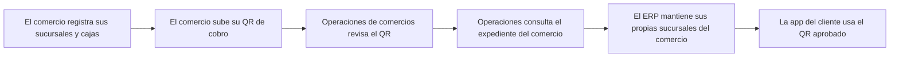

<!-- Generado por scripts/processes/generate-process-docs.ts desde src/modules/workflow-catalog/definitions. No editar a mano. -->

# P-17 · QR de cobro, sucursales, terminales POS y expediente del comercio

`merchant_qr_pos_and_file` · v1 · prioridad **P0** · tipo `back_office` · dueño `OPERATIONS_MANAGER` · bloques `ERP_BACKEND`, `ATLAS_BACKEND`

El comercio registra sus sucursales y cajas y sube su QR de cobro desde «Mi empresa» del portal del comercio; el ERP lo reenvía a AtlasBackend, que decodifica la imagen, la guarda en el expediente del comercio y la deja en pending_review. Una persona con partner.qr.review la aprueba o rechaza en el portal admin; sólo el QR activo llega a la app del cliente.

## Por qué existe

El QR de cobro decide a qué cuenta transfiere el dinero un cliente, y la caja decide qué comercio vende a crédito. Sin una revisión humana del QR, cualquiera que controle el portal de un comercio podría desviar cobros; sin cajas activas, el QR de mostrador no resuelve. Además cada archivo que sube el comercio tiene que quedar en su expediente, visible para Operaciones.

## Quién lo inicia y quién lo cierra

Lo inicia la persona del comercio desde «Mi empresa» (pestañas «Mi QR de cobro» y «Sucursales») del portal del comercio; lo cierra una persona de Operaciones de comercios (rol MERCHANT_OPERATIONS, permiso partner.qr.review) al aprobar o rechazar el QR en el portal admin. El cliente final sólo consume el resultado desde la app.

## Cuándo empieza y cuándo termina

Empieza cuando el comercio sube un QR y queda en pending_review (POST /partner-onboarding/:partnerId/qr-codes); termina cuando la revisión lo deja active con verified_at y revisor (el anterior del mismo ámbito pasa a replaced) o rejected con la nota que el comercio lee. La app sólo ve el QR active.

## Qué pasa cuando falla

Una imagen sin código se rechaza al subirla (QR_OBJECT_NOT_AN_IMAGE, QR_IMAGE_UNREADABLE); un expediente en under_review no admite QR nuevo (PARTNER_NOT_EDITABLE_IN_STATUS). Revisar un QR ya decidido responde 409 QR_NOT_PENDING_REVIEW. Una caja suspendida hace que el QR de mostrador responda 422 QR_EXPIRED y la app lo rechaza. Si nadie revisa, el QR queda en la cola del portal admin, el más antiguo primero.

## Qué indicador dice que va bien

Cantidad y antigüedad de los QR en pending_review (GET /operations/partners/qr-codes/pending), comercios aprobados sin QR bancario activo de empresa, y cajas activas que resuelven en /merchant-qr/resolve frente a las que responden QR_EXPIRED.

## Resultado

- **Éxito:** El QR queda active con verified_at y revisor, las cajas del comercio están activas y la app del cliente enseña el QR bancario aprobado de la empresa.
- **Fracaso:** El QR se rechaza al subirlo o en la revisión, se queda en pending_review sin nadie que lo mire, o la caja está suspendida y el QR de mostrador no resuelve.

## Dónde vive cada instancia

`ATLAS_BACKEND` · `partner.partner_qr_codes` · estado en `status` · abiertas: `pending_review`

## Etapas

| Etapa | Nombre | Actor | Cliente | Pantalla | Pasos |
|---|---|---|---|---|---|
| `qr_branches_and_pos` | El comercio registra sus sucursales y cajas | merchant_user | ERP_PORTAL | `/portal-comercio/expediente` | 12 |
| `qr_upload` | El comercio sube su QR de cobro | merchant_user | ERP_PORTAL | `/portal-comercio/expediente` | 10 |
| `qr_review` | Operaciones de comercios revisa el QR | internal_user | ADMIN_PORTAL | `/internal/operations/partners` | 2 |
| `qr_file_view` | Operaciones consulta el expediente del comercio | internal_user | ADMIN_PORTAL | `/internal/files` | 3 |
| `qr_erp_branches` | El ERP mantiene sus propias sucursales del comercio | internal_user | ERP_PORTAL | `/operaciones/crm/sucursales` | 3 |
| `qr_consumer_sees` | La app del cliente usa el QR aprobado | customer | CONSUMER_APP | **sin pantalla declarada** | 3 |

### El comercio registra sus sucursales y cajas (`qr_branches_and_pos`)

Pestaña «Sucursales» de «Mi empresa»: el comercio registra sus locales en el expediente, les da de alta cajas (terminales POS) y las suspende o reactiva desde la fila. Cada caja lleva su QR de mostrador.

| Paso | Tipo | Bloque | Operación | Roles | Eventos |
|---|---|---|---|---|---|
| Registrar una sucursal (pasarela del ERP) | http | ERP_BACKEND | `POST /partner-onboarding/:partnerId/branches` | merchant, MERCHANT_ADMIN, MERCHANT_OPERATIONS, ADMIN | — |
| Crear la sucursal del expediente | http | ATLAS_BACKEND | `POST /partner-onboarding/:partnerId/branches` | merchant, internal_operator, risk_analyst, admin, platform_admin | — |
| Editar o enlazar una sucursal (pasarela del ERP) | http | ERP_BACKEND | `PATCH /partner-onboarding/:partnerId/branches/:branchId` | merchant, MERCHANT_ADMIN, MERCHANT_OPERATIONS, ADMIN | — |
| Actualizar la sucursal del expediente | http | ATLAS_BACKEND | `PATCH /partner-onboarding/:partnerId/branches/:branchId` | merchant, internal_operator, risk_analyst, admin, platform_admin | — |
| Ver las sucursales (pasarela del ERP) | http | ERP_BACKEND | `GET /partner-onboarding/:partnerId/branches` | merchant, MERCHANT_ADMIN, MERCHANT_OPERATIONS, ADMIN | — |
| Listar las sucursales del expediente | http | ATLAS_BACKEND | `GET /partner-onboarding/:partnerId/branches` | merchant, internal_operator, risk_analyst, admin, platform_admin | — |
| Registrar una caja (pasarela del ERP) | http | ERP_BACKEND | `POST /partner-onboarding/:partnerId/branches/:branchId/pos-terminals` | merchant, MERCHANT_ADMIN, MERCHANT_OPERATIONS, ADMIN | — |
| Crear el terminal POS | http | ATLAS_BACKEND | `POST /partner-onboarding/:partnerId/branches/:branchId/pos-terminals` | merchant, internal_operator, risk_analyst, admin, platform_admin | — |
| Ver las cajas (pasarela del ERP) | http | ERP_BACKEND | `GET /partner-onboarding/:partnerId/pos-terminals` | merchant, MERCHANT_ADMIN, MERCHANT_OPERATIONS, ADMIN | — |
| Listar los terminales POS | http | ATLAS_BACKEND | `GET /partner-onboarding/:partnerId/pos-terminals` | merchant, internal_operator, risk_analyst, admin, platform_admin | — |
| Suspender o reactivar una caja (pasarela del ERP) | http | ERP_BACKEND | `PATCH /partner-onboarding/:partnerId/pos-terminals/:terminalId` | merchant, MERCHANT_ADMIN, MERCHANT_OPERATIONS, ADMIN | — |
| Cambiar el estado del terminal | http | ATLAS_BACKEND | `PATCH /partner-onboarding/:partnerId/pos-terminals/:terminalId` | merchant, internal_operator, risk_analyst, admin, platform_admin | — |

### El comercio sube su QR de cobro (`qr_upload`)

Pestaña «Mi QR de cobro»: la imagen va directa al almacén con una URL firmada (sin la credencial del portal) y después se registra; manda el servidor, que decodifica la imagen y rechaza la que no lleva código. Un QR no se edita: se reemplaza.

| Paso | Tipo | Bloque | Operación | Roles | Eventos |
|---|---|---|---|---|---|
| Pedir permiso de subida (pasarela del ERP) | http | ERP_BACKEND | `POST /partner-onboarding/:partnerId/qr-codes/upload-url` | merchant, MERCHANT_ADMIN, MERCHANT_OPERATIONS, ADMIN | — |
| Emitir la URL firmada de subida | http | ATLAS_BACKEND | `POST /partner-onboarding/:partnerId/qr-codes/upload-url` | merchant, internal_operator, risk_analyst, admin, platform_admin | — |
| Subir la imagen al almacén | external | ATLAS_BACKEND | El navegador sube los bytes directo a MinIO con la URL firmada; ni el ERP ni AtlasBackend están en medio de esa transferencia. | merchant, MERCHANT_ADMIN, MERCHANT_OPERATIONS, ADMIN | — |
| Registrar el QR subido (pasarela del ERP) | http | ERP_BACKEND | `POST /partner-onboarding/:partnerId/qr-codes` | merchant, MERCHANT_ADMIN, MERCHANT_OPERATIONS, ADMIN | — |
| Registrar el QR y dejarlo en revisión | http | ATLAS_BACKEND | `POST /partner-onboarding/:partnerId/qr-codes` | merchant, internal_operator, risk_analyst, admin, platform_admin | — |
| Guardar el QR en el expediente del comercio | event | ATLAS_BACKEND | Gancho interno alRegistrarArchivoDelComercio dentro del registro del QR: no es una llamada HTTP ni un evento del outbox, y es tolerante a fallo. | merchant, MERCHANT_ADMIN, MERCHANT_OPERATIONS, ADMIN | — |
| Ver mis QR (pasarela del ERP) | http | ERP_BACKEND | `GET /partner-onboarding/:partnerId/qr-codes` | merchant, MERCHANT_ADMIN, MERCHANT_OPERATIONS, ADMIN | — |
| Listar los QR del expediente | http | ATLAS_BACKEND | `GET /partner-onboarding/:partnerId/qr-codes` | merchant, internal_operator, risk_analyst, admin, platform_admin | — |
| Ver la imagen del QR (pasarela del ERP) | http | ERP_BACKEND | `GET /partner-onboarding/:partnerId/qr-codes/:qrId/content` | merchant, MERCHANT_ADMIN, MERCHANT_OPERATIONS, ADMIN | — |
| Servir la imagen del QR | http | ATLAS_BACKEND | `GET /partner-onboarding/:partnerId/qr-codes/:qrId/content` | merchant, internal_operator, risk_analyst, admin, platform_admin | — |

### Operaciones de comercios revisa el QR (`qr_review`)

Cola de QR en pending_review del portal admin, aparte de la de expedientes: un comercio ya aprobado cambia su QR cuando quiere y también pasa por una persona. Aprobar activa y archiva el anterior del mismo ámbito; rechazar exige nota.

| Paso | Tipo | Bloque | Operación | Roles | Eventos |
|---|---|---|---|---|---|
| Ver la cola de QR por revisar | http | ATLAS_BACKEND | `GET /operations/partners/qr-codes/pending` | internal_operator, risk_analyst, admin, platform_admin | — |
| Aprobar o rechazar el QR | http | ATLAS_BACKEND | `POST /operations/partners/:partnerId/qr-codes/:qrId/review` | internal_operator, risk_analyst, admin, platform_admin | — |

### Operaciones consulta el expediente del comercio (`qr_file_view`)

Operaciones › Archivos, con el filtro «Tipo» Comercio: carpetas qr, documentos y otros del comercio, con todo lo que subió.

| Paso | Tipo | Bloque | Operación | Roles | Eventos |
|---|---|---|---|---|---|
| Listar expedientes de comercios | http | ATLAS_BACKEND | `GET /expedientes` | internal_operator, risk_analyst, compliance_analyst, fraud_analyst, admin, platform_admin | — |
| Ver las carpetas y archivos del comercio | http | ATLAS_BACKEND | `GET /expedientes/:id/nodos` | internal_operator, risk_analyst, compliance_analyst, fraud_analyst, admin, platform_admin | — |
| Abrir un archivo del comercio | http | ATLAS_BACKEND | `GET /expedientes/:id/nodos/:nodoId/contenido` | internal_operator, risk_analyst, compliance_analyst, fraud_analyst, admin, platform_admin | — |

### El ERP mantiene sus propias sucursales del comercio (`qr_erp_branches`)

CRM › Sucursales del ERP: las sucursales comerciales de la cuenta B2B, cuya columna importante es can_originate_bnpl (se habilita al activar el comercio). Es el otro libro de sucursales.

| Paso | Tipo | Bloque | Operación | Roles | Eventos |
|---|---|---|---|---|---|
| Listar las sucursales del ERP | http | ERP_BACKEND | `GET /b2b/onboarding/branches` | OPERATIONS, ADMIN, COMMERCIAL_EXECUTIVE, COMMERCIAL_MANAGER, FINANCE | — |
| Crear una sucursal en el ERP | http | ERP_BACKEND | `POST /b2b/onboarding/branches` | OPERATIONS, ADMIN, MERCHANT_ADMIN | — |
| Cambiar el estado de una sucursal del ERP | http | ERP_BACKEND | `PATCH /b2b/onboarding/branches/:branchId/status` | OPERATIONS, ADMIN, MERCHANT_ADMIN | — |

### La app del cliente usa el QR aprobado (`qr_consumer_sees`)

El cliente escanea el QR de caja y la app lo resuelve al comercio verificado; para pagar una cuota la app recibe embebido el QR bancario activo de la empresa. Sólo lo active llega aquí.

| Paso | Tipo | Bloque | Operación | Roles | Eventos |
|---|---|---|---|---|---|
| Resolver el QR de caja | http | ATLAS_BACKEND | `POST /merchant-qr/resolve` | customer, internal_operator, risk_analyst, admin, platform_admin | — |
| Obtener el QR bancario del comercio de una caja | http | ATLAS_BACKEND | `POST /merchant-qr/payment` | customer, internal_operator, risk_analyst, admin, platform_admin | — |
| Instrucciones de pago de una cuota | http | ATLAS_BACKEND | `GET /mobile/customers/:customerId/payment-claims/instructions/:installmentId` | customer, internal_operator, admin, platform_admin | — |

## Fuentes

- `src/modules/partner-onboarding/partner-commerce.controller.ts`
- `src/modules/partner-onboarding/partner-operations.controller.ts`
- `src/modules/partner-onboarding/merchant-qr.controller.ts`
- `src/modules/partner-onboarding/application/partner-qr.service.ts`
- `src/modules/partner-onboarding/application/partner-qr-review.service.ts`
- `src/modules/partner-onboarding/partner-commercial-network.repository.ts`
- `src/modules/partner-onboarding/partner-onboarding.repository.ts (PAYMENT_QR_EDITABLE_STATUSES)`
- `src/modules/internal-users/internal-rbac.permissions.ts (partner.qr.review → MERCHANT_OPERATIONS)`
- `src/modules/expedientes/expedientes.controller.ts`
- `src/database/models/partner-qr-codes.model.ts`
- `AtlasERPBackend/src/modules/partner-onboarding-gateway/partner-onboarding-gateway.controller.ts`
- `AtlasERPFrontend/components/screens/PartnerDossierScreen.tsx`
- `AtlasERPFrontend/components/screens/MerchantStructureScreen.tsx`
- `AtlasAdminPortal/src/features/partner-decisions/partner-decisions-page.tsx`
- `AtlasFrontend/apps/consumer-app/src/api/endpoints/loans.ts`
- `AtlasFrontend/apps/consumer-app/src/api/endpoints/payment-claims.ts`
- `memoria atlas-expediente-del-comercio`
- `memoria atlas-portal-comercio-cinco-entradas`
- `memoria atlas-flujo-pago-qr-comprobante`
