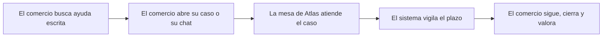

<!-- Generado por scripts/processes/generate-process-docs.ts desde src/modules/workflow-catalog/definitions. No editar a mano. -->

# P-22 · Soporte al comercio desde el ERP (pasarela) hacia la mesa de Atlas

`merchant_support` · v1 · prioridad **P1** · tipo `integration` · dueño `OPERATIONS_MANAGER` · bloques `ERP_BACKEND`, `ATLAS_BACKEND`

El comercio consulta la ayuda y abre un caso con motivo o un chat desde «Soporte y tutoriales» de su portal; el ERP lo reenvía a AtlasBackend, donde el caso entra en la misma mesa que los de clientes. Un agente lo clasifica, lo toma, responde y lo resuelve; el comercio pide el cierre y lo valora.

## Por qué existe

El comercio también necesita ayuda con su operación (cobros, cajas, su expediente) y no tiene por qué tener otro canal distinto del de los clientes. Su caso viaja por la pasarela del ERP a la misma mesa de soporte de Atlas, con el aislamiento entre comercios resuelto en el servidor: el identificador de comercio que llega en el cuerpo se comprueba contra el dueño del expediente, no se cree.

## Quién lo inicia y quién lo cierra

Lo inicia la persona del comercio desde /portal-comercio/soporte del ERP; lo atiende un agente de soporte de Atlas (rol SUPPORT_AGENT, con perfil de agente en la mesa) desde /internal/support, que lo resuelve con código de resolución y causa raíz; el comercio pide el cierre y lo valora, y el agente o el sistema lo cierran.

## Cuándo empieza y cuándo termina

Empieza cuando el comercio abre un caso con motivo (POST /merchant/support/cases por la pasarela) y el caso nace en NEW; pasa por TRIAGED, ASSIGNED, IN_PROGRESS o WAITING_PARTNER; termina en RESOLVED y CLOSED. Pedir el cierre de un caso ya resuelto lo cierra de inmediato; en otro estado queda registrado como petición.

## Qué pasa cuando falla

Sin catálogo de categorías sembrado, abrir el caso falla con SUPPORT_CATEGORY_NOT_FOUND. Un comercio que pide un caso de otro comercio no lo ve. Valorar antes de la resolución responde 409 SUPPORT_FEEDBACK_TOO_EARLY. Si el caso supera su plazo, el barrido sweep_support_sla publica support.sla.breached. Si el ERP no reenvía, el comercio ve el error de la pasarela y el caso no existe en Atlas.

## Qué indicador dice que va bien

Casos abiertos de comercios por estado y antigüedad en la mesa, porcentaje resuelto dentro del plazo (support.sla.breached frente a resueltos), y la valoración del comercio tras el cierre.

## Resultado

- **Éxito:** El caso del comercio queda RESOLVED y CLOSED con código de resolución y causa raíz, dentro de su plazo, y el comercio lo valora.
- **Fracaso:** El caso no llega a abrirse (sin categoría o sin pasarela), se queda sin agente, vence su plazo o se cierra sin resolución.

## Dónde vive cada instancia

`ATLAS_BACKEND` · `support.support_cases` · estado en `status` · abiertas: `NEW`, `TRIAGED`, `ASSIGNED`, `IN_PROGRESS`, `WAITING_CUSTOMER`, `WAITING_INTERNAL`, `WAITING_PARTNER`, `ESCALATED`, `ON_HOLD`, `REOPENED`

## Etapas

| Etapa | Nombre | Actor | Cliente | Pantalla | Pasos |
|---|---|---|---|---|---|
| `msup_self_help` | El comercio busca ayuda escrita | merchant_user | ERP_PORTAL | `/portal-comercio/soporte` | 6 |
| `msup_open` | El comercio abre su caso o su chat | merchant_user | ERP_PORTAL | `/portal-comercio/soporte` | 6 |
| `msup_desk` | La mesa de Atlas atiende el caso | internal_user | ADMIN_PORTAL | `/internal/support` | 6 |
| `msup_sla` | El sistema vigila el plazo | system | BLOCK | — | 1 |
| `msup_follow_and_close` | El comercio sigue, cierra y valora | merchant_user | ERP_PORTAL | `/portal-comercio/soporte` | 9 |

### El comercio busca ayuda escrita (`msup_self_help`)

Pestaña «Soporte» de «Soporte y tutoriales»: preguntas frecuentes para comercios, motivos disponibles y búsqueda en la base de conocimiento, antes de escribir a nadie.

| Paso | Tipo | Bloque | Operación | Roles | Eventos |
|---|---|---|---|---|---|
| Ver las preguntas frecuentes (pasarela del ERP) | http | ERP_BACKEND | `GET /merchant/support/faq` | merchant, MERCHANT_ADMIN, MERCHANT_OPERATIONS, ADMIN | — |
| Preguntas frecuentes para comercios | http | ATLAS_BACKEND | `GET /merchant/support/faq` | merchant, internal_operator, admin, platform_admin | — |
| Ver los motivos (pasarela del ERP) | http | ERP_BACKEND | `GET /merchant/support/categories` | merchant, MERCHANT_ADMIN, MERCHANT_OPERATIONS, ADMIN | — |
| Motivos de contacto del comercio | http | ATLAS_BACKEND | `GET /merchant/support/categories` | merchant, internal_operator, admin, platform_admin | — |
| Buscar en la ayuda (pasarela del ERP) | http | ERP_BACKEND | `GET /merchant/support/knowledge/search` | merchant, MERCHANT_ADMIN, MERCHANT_OPERATIONS, ADMIN | — |
| Buscar en la base de conocimiento | http | ATLAS_BACKEND | `GET /merchant/support/knowledge/search` | merchant, internal_operator, admin, platform_admin | — |

### El comercio abre su caso o su chat (`msup_open`)

El caso con motivo nace en Atlas con el comercio como parte; el partnerProfileId del cuerpo se comprueba contra el dueño del expediente. El chat es un canal opcional atado al caso.

| Paso | Tipo | Bloque | Operación | Roles | Eventos |
|---|---|---|---|---|---|
| Abrir un caso (pasarela del ERP) | http | ERP_BACKEND | `POST /merchant/support/cases` | merchant, MERCHANT_ADMIN, MERCHANT_OPERATIONS, ADMIN | — |
| Crear el caso del comercio | http | ATLAS_BACKEND | `POST /merchant/support/cases` | merchant, internal_operator, admin, platform_admin | support.case.created, support.complaint.created, support.security.escalated |
| Abrir el chat (pasarela del ERP) | http | ERP_BACKEND | `POST /support/channels` | merchant, MERCHANT_ADMIN, MERCHANT_OPERATIONS, ADMIN | — |
| Abrir el canal de conversación | http | ATLAS_BACKEND | `POST /support/channels` | customer, merchant, internal_operator, risk_analyst, compliance_analyst, fraud_analyst, admin, platform_admin | support.channel.opened |
| Escribir en el chat (pasarela del ERP) | http | ERP_BACKEND | `POST /support/channels/:channelId/messages` | merchant, MERCHANT_ADMIN, MERCHANT_OPERATIONS, ADMIN | — |
| Registrar el mensaje del comercio | http | ATLAS_BACKEND | `POST /support/channels/:channelId/messages` | customer, merchant, internal_operator, risk_analyst, compliance_analyst, fraud_analyst, admin, platform_admin | support.message.created |

### La mesa de Atlas atiende el caso (`msup_desk`)

El caso del comercio aparece en /internal/support junto a los de clientes. El agente lo clasifica, lo toma, deja notas y lo resuelve con código de resolución y causa raíz; puede escalarlo. El detalle de la mesa está en el proceso P-12.

| Paso | Tipo | Bloque | Operación | Roles | Eventos |
|---|---|---|---|---|---|
| Ver la cola de casos | http | ATLAS_BACKEND | `GET /internal/support/cases` | internal_operator, risk_analyst, compliance_analyst, fraud_analyst, admin, platform_admin | — |
| Abrir la ficha del caso | http | ATLAS_BACKEND | `GET /internal/support/cases/:caseId` | internal_operator, risk_analyst, compliance_analyst, fraud_analyst, admin, platform_admin | — |
| Clasificar el caso | http | ATLAS_BACKEND | `POST /internal/support/cases/:caseId/triage` | internal_operator, risk_analyst, compliance_analyst, fraud_analyst, admin, platform_admin | — |
| Tomar el caso | http | ATLAS_BACKEND | `POST /internal/support/cases/:caseId/claim` | internal_operator, risk_analyst, compliance_analyst, fraud_analyst, admin, platform_admin | support.case.assigned |
| Escalar el caso | http | ATLAS_BACKEND | `POST /internal/support/cases/:caseId/escalate` | internal_operator, risk_analyst, compliance_analyst, fraud_analyst, admin, platform_admin | support.case.escalated |
| Resolver el caso | http | ATLAS_BACKEND | `POST /internal/support/cases/:caseId/resolve` | internal_operator, risk_analyst, compliance_analyst, fraud_analyst, admin, platform_admin | support.case.resolved |

### El sistema vigila el plazo (`msup_sla`)

Barrido programado de plazos de la mesa: marca los casos vencidos y lo publica.

| Paso | Tipo | Bloque | Operación | Roles | Eventos |
|---|---|---|---|---|---|
| Barrer los plazos de soporte | job | ATLAS_BACKEND | job `sweep_support_sla` | — | support.sla.breached |

### El comercio sigue, cierra y valora (`msup_follow_and_close`)

El comercio ve sus casos y el detalle de cada uno, pide el cierre (inmediato si ya está resuelto) y valora la atención cuando está resuelto.

| Paso | Tipo | Bloque | Operación | Roles | Eventos |
|---|---|---|---|---|---|
| Ver mis casos (pasarela del ERP) | http | ERP_BACKEND | `GET /merchant/support/partners/:partnerProfileId/cases` | merchant, MERCHANT_ADMIN, MERCHANT_OPERATIONS, ADMIN | — |
| Casos del comercio | http | ATLAS_BACKEND | `GET /merchant/support/partners/:partnerProfileId/cases` | merchant, internal_operator, admin, platform_admin | — |
| Ver un caso (pasarela del ERP) | http | ERP_BACKEND | `GET /merchant/support/cases/:caseId` | merchant, MERCHANT_ADMIN, MERCHANT_OPERATIONS, ADMIN | — |
| Detalle del caso para el comercio | http | ATLAS_BACKEND | `GET /merchant/support/cases/:caseId` | merchant, internal_operator, admin, platform_admin | — |
| Pedir el cierre (pasarela del ERP) | http | ERP_BACKEND | `POST /merchant/support/cases/:caseId/close-request` | merchant, MERCHANT_ADMIN, MERCHANT_OPERATIONS, ADMIN | — |
| Registrar la petición de cierre | http | ATLAS_BACKEND | `POST /merchant/support/cases/:caseId/close-request` | merchant, internal_operator, admin, platform_admin | — |
| Valorar la atención (pasarela del ERP) | http | ERP_BACKEND | `POST /merchant/support/cases/:caseId/feedback` | merchant, MERCHANT_ADMIN, MERCHANT_OPERATIONS, ADMIN | — |
| Registrar la valoración | http | ATLAS_BACKEND | `POST /merchant/support/cases/:caseId/feedback` | merchant, internal_operator, admin, platform_admin | — |
| La mesa cierra el caso | http | ATLAS_BACKEND | `POST /internal/support/cases/:caseId/close` | internal_operator, risk_analyst, compliance_analyst, fraud_analyst, admin, platform_admin | support.case.closed |

## Fuentes

- `AtlasERPBackend/src/modules/partner-onboarding-gateway/support-gateway.controller.ts`
- `src/modules/support/merchant-support.controller.ts`
- `src/modules/support/support-chat.controller.ts`
- `src/modules/support/internal-support.controller.ts`
- `src/modules/support/support.constants.ts (SUPPORT_CASE_STATUSES)`
- `src/modules/support/application/support-case-creation-events.service.ts`
- `src/modules/support/application/support-case-customer.service.ts`
- `src/modules/support/application/support-case-closure.service.ts`
- `src/modules/runtime-jobs/scheduled-jobs.catalog.ts (sweep_support_sla)`
- `src/modules/workflow-catalog/definitions/processes/customer-support-case.process.fixtures.ts (P-12)`
- `AtlasERPFrontend/components/screens/MerchantSupportScreen.tsx`
- `AtlasAdminPortal/src/app/internal/support/page.tsx`
- `AtlasAIService/docs/support/support-channel-map.md`
