<!-- Generado por scripts/processes/generate-process-docs.ts desde src/modules/workflow-catalog/definitions. No editar a mano. -->

# P-18 · Usuarios del comercio: provisión por cola, acceso y recuperación de contraseña

`merchant_users_and_access` · v1 · prioridad **P1** · tipo `integration` · dueño `OPERATIONS_MANAGER` · bloques `ERP_BACKEND`, `ATLAS_BACKEND`

El ERP registra a una persona del comercio y encola su alta de identidad en Atlas; Operaciones de comercios la concede o rechaza desde el portal admin; el ERP acusa el resultado. La persona entra al portal del comercio con la sesión que emite Atlas por la pasarela del ERP y, si olvida la contraseña, la recupera sola.

## Por qué existe

Antes el portal admin daba de alta usuarios de comercio a mano y nada los ataba con la fila del ERP: un carácter distinto en el correo dejaba a la persona con sesión y un 403 en el portal del comercio. Ahora la identidad sólo nace al conceder una petición que el ERP encoló, quien pide no concede, y la contraseña provisional la genera Atlas y viaja una sola vez.

## Quién lo inicia y quién lo cierra

Lo inicia un ejecutivo u Operaciones del ERP con «Dar acceso a una persona» en el caso de onboarding (rol Atlas OPERATIONS_MANAGER, permiso merchant.users.request); lo concede o rechaza Operaciones de comercios en el portal admin (MERCHANT_OPERATIONS, permiso merchant.users.manage); lo cierra el ERP al acusar el resultado, y la persona del comercio al iniciar sesión.

## Cuándo empieza y cuándo termina

Empieza cuando el ERP crea el usuario en INVITED y encola la petición en pending (POST /b2b/onboarding/merchant-users). Termina cuando la petición queda provisioned con su identidad activa y el ERP la acusa (usuario ACTIVE con user_id), o rejected con motivo (usuario DISABLED). Después la identidad puede pasar a suspended o disabled desde el portal admin.

## Qué pasa cuando falla

Si Atlas rechaza la petición al encolarla (correo con otra pendiente: 409), la fila del ERP se deshace y el ejecutivo ve el motivo de Atlas. Conceder dos veces responde 409 ALREADY_DECIDED. Si el correo de credenciales falla, la concesión no se deshace. El login con identidad no activa responde 401; la recuperación responde siempre lo mismo y deja el motivo real sólo en el registro del servidor.

## Qué indicador dice que va bien

Peticiones en pending y su antigüedad en la cola del portal admin, usuarios del ERP en INVITED sin user_id (credenciales pedidas y no acusadas), y la proporción de logins de comercio con 401 frente a los correctos.

## Resultado

- **Éxito:** La petición queda provisioned, el usuario del ERP ACTIVE con su user_id acusado y la persona inicia sesión en el portal del comercio.
- **Fracaso:** La petición se rechaza o se queda pending, el ERP no acusa y el usuario sigue INVITED, o la persona no logra entrar ni recuperar el acceso.

## Dónde vive cada instancia

`ATLAS_BACKEND` · `iam.merchant_user_provisioning_requests` · estado en `status` · abiertas: `pending`

## Etapas

```mermaid
flowchart LR
  mu_erp_request["El ERP pide el acceso"]
  mu_portal_grant["El portal admin concede o rechaza"]
  mu_erp_acknowledge["El ERP acusa el resultado"]
  mu_merchant_login["La persona del comercio inicia sesión"]
  mu_password_recovery["El comercio recupera su contraseña"]
  mu_lifecycle["Operaciones de comercios gobierna el acceso"]
  mu_erp_request --> mu_portal_grant
  mu_portal_grant --> mu_erp_acknowledge
  mu_erp_acknowledge --> mu_merchant_login
  mu_merchant_login --> mu_password_recovery
  mu_password_recovery --> mu_lifecycle
```

| Etapa | Nombre | Actor | Cliente | Pantalla | Pasos |
|---|---|---|---|---|---|
| `mu_erp_request` | El ERP pide el acceso | internal_user | ERP_PORTAL | `/operaciones/crm/onboarding` | 2 |
| `mu_portal_grant` | El portal admin concede o rechaza | internal_user | ADMIN_PORTAL | `/internal/merchant-users` | 4 |
| `mu_erp_acknowledge` | El ERP acusa el resultado | internal_user | ERP_PORTAL | `/operaciones/crm/onboarding` | 3 |
| `mu_merchant_login` | La persona del comercio inicia sesión | merchant_user | ERP_PORTAL | `/login` | 8 |
| `mu_password_recovery` | El comercio recupera su contraseña | merchant_user | ERP_PORTAL | `/recuperar-acceso` | 4 |
| `mu_lifecycle` | Operaciones de comercios gobierna el acceso | internal_user | ADMIN_PORTAL | `/internal/merchant-users` | 3 |

### El ERP pide el acceso (`mu_erp_request`)

«Dar acceso a una persona» en la fila del caso de onboarding. La fila del CRM y la petición en Atlas van juntas o no van: si Atlas rechaza, la fila se deshace.

| Paso | Tipo | Bloque | Operación | Roles | Eventos |
|---|---|---|---|---|---|
| Registrar a la persona del comercio | http | ERP_BACKEND | `POST /b2b/onboarding/merchant-users` | OPERATIONS, ADMIN | — |
| Encolar la petición de alta | http | ATLAS_BACKEND | `POST /merchant/users/provisioning-requests` | OPERATIONS_MANAGER, SUPER_ADMIN | — |

### El portal admin concede o rechaza (`mu_portal_grant`)

Cola de peticiones en /internal/merchant-users: pendientes primero, la más antigua arriba. Conceder crea la identidad con los datos de la petición en una transacción con cerrojo y manda la contraseña provisional.

| Paso | Tipo | Bloque | Operación | Roles | Eventos |
|---|---|---|---|---|---|
| Ver la cola de peticiones | http | ATLAS_BACKEND | `GET /merchant/users/provisioning-requests` | OPERATIONS_MANAGER, MERCHANT_OPERATIONS, AUDITOR_READONLY, SUPER_ADMIN | — |
| Conceder el acceso | http | ATLAS_BACKEND | `POST /merchant/users/provisioning-requests/:requestId/approve` | MERCHANT_OPERATIONS, SUPER_ADMIN | — |
| Enviar las credenciales iniciales | external | ATLAS_BACKEND | Correo con la contraseña provisional (sendInitialCredentials) enviado después del commit; su fallo no deshace la concesión. | MERCHANT_OPERATIONS, SUPER_ADMIN | — |
| Rechazar la petición | http | ATLAS_BACKEND | `POST /merchant/users/provisioning-requests/:requestId/reject` | MERCHANT_OPERATIONS, SUPER_ADMIN | — |

### El ERP acusa el resultado (`mu_erp_acknowledge`)

Atlas no llama de vuelta: el ERP pregunta por cada usuario con petición sin resolver. provisioned → usuario ACTIVE con user_id; rejected → DISABLED con el motivo, sin borrar la fila.

| Paso | Tipo | Bloque | Operación | Roles | Eventos |
|---|---|---|---|---|---|
| Acusar las credenciales del caso | http | ERP_BACKEND | `POST /b2b/onboarding/cases/:onboardingCaseId/identity/reconcile` | OPERATIONS, ADMIN, COMMERCIAL_MANAGER, COMMERCIAL_EXECUTIVE | — |
| Consultar en qué quedó una petición | http | ATLAS_BACKEND | `GET /merchant/users/provisioning-requests/:requestId` | OPERATIONS_MANAGER, MERCHANT_OPERATIONS, AUDITOR_READONLY, SUPER_ADMIN | — |
| Reconciliar una sola persona | http | ERP_BACKEND | `PATCH /b2b/onboarding/merchant-users/:merchantUserId/identity` | OPERATIONS, ADMIN, COMMERCIAL_MANAGER, COMMERCIAL_EXECUTIVE | — |

### La persona del comercio inicia sesión (`mu_merchant_login`)

Pestaña «Comercio afiliado» del login del ERP. El ERP reenvía a Atlas, que autentica la identidad del comercio; el ERP reemite su propio token y resuelve el alcance sobre cuentas.

| Paso | Tipo | Bloque | Operación | Roles | Eventos |
|---|---|---|---|---|---|
| Iniciar sesión (pasarela del ERP) | http | ERP_BACKEND | `POST /auth/merchant/login` | — | — |
| Autenticar la identidad del comercio | http | ATLAS_BACKEND | `POST /merchant/auth/login` | — | — |
| Confirmar quién entró (pasarela del ERP) | http | ERP_BACKEND | `GET /auth/merchant/me` | MERCHANT_ADMIN | — |
| Perfil de la identidad del comercio | http | ATLAS_BACKEND | `GET /merchant/auth/me` | — | — |
| Renovar la sesión (pasarela del ERP) | http | ERP_BACKEND | `POST /auth/merchant/refresh` | — | — |
| Rotar el refresh token | http | ATLAS_BACKEND | `POST /merchant/auth/refresh` | — | — |
| Cerrar sesión (pasarela del ERP) | http | ERP_BACKEND | `POST /auth/merchant/logout` | — | — |
| Revocar la sesión del comercio | http | ATLAS_BACKEND | `POST /merchant/auth/logout` | — | — |

### El comercio recupera su contraseña (`mu_password_recovery`)

Enlace «Recuperar acceso» sólo en la pestaña del comercio. El ERP manda actorType merchant_user al plano genérico de Atlas, que ya tiene anti-enumeración, enfriamiento de 60 s y revocación de sesiones al confirmar.

| Paso | Tipo | Bloque | Operación | Roles | Eventos |
|---|---|---|---|---|---|
| Pedir el código (pasarela del ERP) | http | ERP_BACKEND | `POST /auth/merchant/password-reset/request` | — | — |
| Emitir el código de un solo uso | http | ATLAS_BACKEND | `POST /auth/password-reset/request` | — | — |
| Fijar la contraseña nueva (pasarela del ERP) | http | ERP_BACKEND | `POST /auth/merchant/password-reset/confirm` | — | — |
| Canjear el código y revocar sesiones | http | ATLAS_BACKEND | `POST /auth/password-reset/confirm` | — | — |

### Operaciones de comercios gobierna el acceso (`mu_lifecycle`)

Desde el portal admin se listan las identidades de comercio y se activan, suspenden o dan de baja. Suspender corta la sesión en la siguiente rotación del refresh token.

| Paso | Tipo | Bloque | Operación | Roles | Eventos |
|---|---|---|---|---|---|
| Listar identidades de comercio | http | ATLAS_BACKEND | `GET /merchant/users` | OPERATIONS_MANAGER, MERCHANT_OPERATIONS, AUDITOR_READONLY, SUPER_ADMIN | — |
| Consultar una identidad | http | ATLAS_BACKEND | `GET /merchant/users/:merchantUserId` | OPERATIONS_MANAGER, MERCHANT_OPERATIONS, AUDITOR_READONLY, SUPER_ADMIN | — |
| Activar, suspender o dar de baja | http | ATLAS_BACKEND | `PATCH /merchant/users/:merchantUserId/status` | MERCHANT_OPERATIONS, SUPER_ADMIN | — |

## Fuentes

- `src/modules/merchant-identity/merchant-users.controller.ts`
- `src/modules/merchant-identity/merchant-user-requests.service.ts`
- `src/modules/merchant-identity/merchant-auth.controller.ts`
- `src/modules/merchant-identity/merchant-identity.schemas.ts (MERCHANT_USER_STATUSES, MERCHANT_PROVISIONING_STATUSES)`
- `src/modules/auth/auth.controller.ts (password-reset)`
- `src/modules/internal-users/internal-rbac.permissions.ts`
- `AtlasERPBackend/src/modules/b2b-sales-crm/services/b2b-onboarding.service.ts (createMerchantUser, syncMerchantUserIdentity, reconcileCaseIdentity)`
- `AtlasERPBackend/src/modules/auth-gateway/auth-gateway.controller.ts`
- `AtlasERPBackend/src/modules/auth-gateway/atlas-identity.client.ts`
- `AtlasAdminPortal/src/app/internal/merchant-users/page.tsx`
- `AtlasERPFrontend/app/recuperar-acceso`
- `memoria atlas-alta-comercio-por-cola`
- `memoria atlas-recuperar-contrasena-comercio`
- `memoria atlas-portal-comercio-cinco-entradas`
