<!-- Generado por scripts/processes/generate-process-docs.ts desde src/modules/workflow-catalog/definitions. No editar a mano. -->

# P-29 · Workers del Motor: identidad, extracto, semántico, PDF y audio

`motor_workers` · v1 · prioridad **P1** · tipo `system_job` · dueño `MOTOR:PLATFORM_ADMIN` · bloques `DECISION_ENGINE`

Ciclo de vida común de una corrida de worker en el Motor: se encola (QUEUED) por petición o desde el grafo, un trabajador de fondo la reclama y la procesa (RUNNING), termina en SUCCEEDED, SUCCEEDED_WITH_WARNINGS, FAILED, CANCELLED o un rechazo terminal, o queda esperando a una persona (PENDING_REVIEW → IN_REVIEW) en la cola de revisión de identidad o de extractos. Cada original se guarda en el almacén con su huella SHA-256.

## Por qué existe

Verificar una identidad con documento y selfie, convertir un extracto bancario, clasificar un gasto, imprimir un PDF o sintetizar un audio son tareas lentas que no caben en una petición y que dejan evidencia: el Motor las encola, las procesa en segundo plano y guarda cada original con su huella para poder demostrar después qué se vio.

## Quién lo inicia y quién lo cierra

Las inician AtlasBackend como sistema (extractos, audio de bienvenida, referencias del expediente), el ERP (PDF) o un analista desde el portal del Motor; las procesan los trabajadores de fondo del Motor. Cuando el resultado es dudoso, la cierra un analista del Motor (RISK_ANALYST, FRAUD_ANALYST u OPERATIONS) que la reclama y la resuelve en la cola de revisión.

## Cuándo empieza y cuándo termina

Empieza con la corrida en QUEUED (POST /v1/workers/<worker>/runs) y termina en un estado terminal: SUCCEEDED, SUCCEEDED_WITH_WARNINGS, FAILED, CANCELLED, PDF_INVALID o DOCUMENT_REJECTED; o pasa por PENDING_REVIEW e IN_REVIEW hasta que una persona la resuelve. Un veredicto de identidad REVIEW_REQUIRED va a la cola, no a un estado terminal.

## Qué pasa cuando falla

Sin almacén configurado el Motor no arranca (IDENTITY_IMAGE_RETENTION_REQUIRED) y una subida real se rechaza con 503 antes de crear la fila (IDENTITY_IMAGE_STORAGE_NOT_CONFIGURED, STATEMENT_FILE_STORAGE_NOT_CONFIGURED). Un documento que no es del tipo esperado termina en PDF_INVALID o DOCUMENT_REJECTED y nunca entra a la cola. Sin el contenedor pdf-worker generar un PDF da 502.

## Qué indicador dice que va bien

Métricas por worker (GET /v1/workers/:code/metrics): corridas FAILED y tiempo en QUEUED, casos PENDING_REVIEW sin reclamar en las colas de identidad y extractos, clasificaciones semánticas sin resolver (GET /v1/workers/semantic-analysis/unresolved/count) y originales con su huella SHA-256 guardada.

## Resultado

- **Éxito:** La corrida termina con resultado y su evidencia en el almacén, o la persona que la revisó deja su resolución registrada.
- **Fracaso:** La corrida termina FAILED, se cancela, o queda en revisión sin que nadie la reclame.

## Dónde vive cada instancia

`DECISION_ENGINE` · `public.decision_identity_verification_run` · estado en `status` · abiertas: `QUEUED`, `RUNNING`, `PENDING_REVIEW`, `IN_REVIEW`

## Etapas

```mermaid
flowchart LR
  workers_catalog["Catálogo y salud de los workers"]
  workers_identity_run["Verificar una identidad"]
  workers_identity_review["Revisar una identidad dudosa"]
  workers_statement_run["Convertir un extracto bancario"]
  workers_statement_review["Revisar un extracto dudoso"]
  workers_semantic["Clasificar textos (análisis semántico)"]
  workers_audio["Sintetizar audio"]
  workers_pdf["Imprimir un PDF"]
  workers_evidence_references["Referencias al almacén"]
  workers_catalog --> workers_identity_run
  workers_identity_run --> workers_identity_review
  workers_identity_review --> workers_statement_run
  workers_statement_run --> workers_statement_review
  workers_statement_review --> workers_semantic
  workers_semantic --> workers_audio
  workers_audio --> workers_pdf
  workers_pdf --> workers_evidence_references
```

| Etapa | Nombre | Actor | Cliente | Pantalla | Pasos |
|---|---|---|---|---|---|
| `workers_catalog` | Catálogo y salud de los workers | internal_user | MOTOR_PORTAL | `/workers` | 2 |
| `workers_identity_run` | Verificar una identidad | internal_user | MOTOR_PORTAL | `/workers/identity-verification` | 5 |
| `workers_identity_review` | Revisar una identidad dudosa | internal_user | MOTOR_PORTAL | `/workers/identity-verification` | 3 |
| `workers_statement_run` | Convertir un extracto bancario | system | BLOCK | — | 4 |
| `workers_statement_review` | Revisar un extracto dudoso | internal_user | MOTOR_PORTAL | `/workers/bank-statement` | 4 |
| `workers_semantic` | Clasificar textos (análisis semántico) | internal_user | MOTOR_PORTAL | `/workers/semantic-analysis` | 5 |
| `workers_audio` | Sintetizar audio | system | BLOCK | — | 3 |
| `workers_pdf` | Imprimir un PDF | system | BLOCK | — | 1 |
| `workers_evidence_references` | Referencias al almacén | system | BLOCK | — | 1 |

### Catálogo y salud de los workers (`workers_catalog`)

Qué workers están disponibles en esta instalación y sus métricas: corridas por estado y tiempos.

| Paso | Tipo | Bloque | Operación | Roles | Eventos |
|---|---|---|---|---|---|
| Listar workers | http | DECISION_ENGINE | `GET /v1/workers` | RISK_ANALYST, FRAUD_ANALYST, QA_ANALYST, OPERATIONS, COMPLIANCE, AUDITOR | — |
| Métricas de un worker | http | DECISION_ENGINE | `GET /v1/workers/:code/metrics` | RISK_ANALYST, FRAUD_ANALYST, QA_ANALYST, OPERATIONS, COMPLIANCE, AUDITOR | — |

### Verificar una identidad (`workers_identity_run`)

Documento (anverso y reverso) y selfie: el worker compara, decide el estado por el veredicto y guarda cada original en el almacén con su huella. REVIEW_REQUIRED pasa a PENDING_REVIEW con motivo y prioridad; NOT_VERIFIED e INCONCLUSIVE son terminales.

| Paso | Tipo | Bloque | Operación | Roles | Eventos |
|---|---|---|---|---|---|
| Encolar la verificación | http | DECISION_ENGINE | `POST /v1/workers/identity-verification/runs` | RISK_ANALYST, FRAUD_ANALYST, OPERATIONS | — |
| Procesar la verificación | job | DECISION_ENGINE | job `identity-verification` | RISK_ANALYST, FRAUD_ANALYST, OPERATIONS | — |
| Leer la corrida | http | DECISION_ENGINE | `GET /v1/workers/identity-verification/runs/:requestId` | RISK_ANALYST, FRAUD_ANALYST, QA_ANALYST, OPERATIONS, COMPLIANCE, AUDITOR | — |
| Ver una imagen original | http | DECISION_ENGINE | `GET /v1/workers/identity-verification/runs/:requestId/images/:kind` | RISK_ANALYST, FRAUD_ANALYST, OPERATIONS, COMPLIANCE, AUDITOR | — |
| Cancelar la corrida | http | DECISION_ENGINE | `POST /v1/workers/identity-verification/runs/:requestId/cancel` | RISK_ANALYST, FRAUD_ANALYST, OPERATIONS | — |

### Revisar una identidad dudosa (`workers_identity_review`)

El analista reclama el caso (IN_REVIEW) para que nadie más lo trabaje y lo resuelve. Un caso de la puerta de documentos se resuelve con CONFIRM_DOCUMENT/REJECT_DOCUMENT; uno del veredicto con CONFIRM_IDENTITY/DENY_IDENTITY (409 si se cruzan). La decisión humana se guarda aparte, sin pisar la del worker.

| Paso | Tipo | Bloque | Operación | Roles | Eventos |
|---|---|---|---|---|---|
| Cola de revisión de identidad | http | DECISION_ENGINE | `GET /v1/workers/identity-verification/reviews` | RISK_ANALYST, FRAUD_ANALYST, OPERATIONS, COMPLIANCE, AUDITOR | — |
| Reclamar el caso | http | DECISION_ENGINE | `POST /v1/workers/identity-verification/reviews/:requestId/claim` | RISK_ANALYST, FRAUD_ANALYST, OPERATIONS | — |
| Resolver el caso | http | DECISION_ENGINE | `POST /v1/workers/identity-verification/reviews/:requestId/resolve` | RISK_ANALYST, FRAUD_ANALYST, OPERATIONS | — |

### Convertir un extracto bancario (`workers_statement_run`)

AtlasBackend sube el extracto del cliente y consulta el resultado; el worker lo convierte en movimientos. Si duda (tiempo agotado, formato raro) queda PENDING_REVIEW con su motivo; si no es un extracto, PDF_INVALID.

| Paso | Tipo | Bloque | Operación | Roles | Eventos |
|---|---|---|---|---|---|
| Encolar el extracto | http | DECISION_ENGINE | `POST /v1/workers/bank-statement/runs` | RISK_ANALYST, FRAUD_ANALYST, OPERATIONS | — |
| Procesar el extracto | job | DECISION_ENGINE | job `bank-statement` | — | — |
| Leer el resultado | http | DECISION_ENGINE | `GET /v1/workers/bank-statement/runs/:requestId` | RISK_ANALYST, FRAUD_ANALYST, QA_ANALYST, OPERATIONS, COMPLIANCE, AUDITOR | — |
| Descargar la conversión | http | DECISION_ENGINE | `GET /v1/workers/bank-statement/runs/:requestId/download` | RISK_ANALYST, FRAUD_ANALYST, OPERATIONS, COMPLIANCE, AUDITOR | — |

### Revisar un extracto dudoso (`workers_statement_review`)

El analista reclama el extracto, lo resuelve con las categorías de revisión o pide reprocesarlo.

| Paso | Tipo | Bloque | Operación | Roles | Eventos |
|---|---|---|---|---|---|
| Cola de revisión de extractos | http | DECISION_ENGINE | `GET /v1/workers/bank-statement/reviews` | RISK_ANALYST, FRAUD_ANALYST, OPERATIONS, COMPLIANCE, AUDITOR | — |
| Reclamar el extracto | http | DECISION_ENGINE | `POST /v1/workers/bank-statement/reviews/:requestId/claim` | RISK_ANALYST, FRAUD_ANALYST, OPERATIONS | — |
| Resolver el extracto | http | DECISION_ENGINE | `POST /v1/workers/bank-statement/reviews/:requestId/resolve` | RISK_ANALYST, FRAUD_ANALYST, OPERATIONS | — |
| Reprocesar | http | DECISION_ENGINE | `POST /v1/workers/bank-statement/reviews/:requestId/reprocess` | RISK_ANALYST, FRAUD_ANALYST, OPERATIONS | — |

### Clasificar textos (análisis semántico) (`workers_semantic`)

Clasifica glosas y gastos por reglas o por el codificador; lo que no alcanza el suelo de similitud queda sin resolver para una persona. Un trabajo aparte minimiza y purga el texto vencido. Apagado por omisión.

| Paso | Tipo | Bloque | Operación | Roles | Eventos |
|---|---|---|---|---|---|
| Encolar un texto | http | DECISION_ENGINE | `POST /v1/workers/semantic-analysis/runs` | RISK_ANALYST, FRAUD_ANALYST, OPERATIONS | — |
| Clasificar | job | DECISION_ENGINE | job `semantic-analysis` | RISK_ANALYST, FRAUD_ANALYST, OPERATIONS | — |
| Clasificaciones sin resolver | http | DECISION_ENGINE | `GET /v1/workers/semantic-analysis/unresolved` | RISK_ANALYST, FRAUD_ANALYST, QA_ANALYST, OPERATIONS | — |
| Resolver una clasificación | http | DECISION_ENGINE | `POST /v1/workers/semantic-analysis/unresolved/:id/resolve` | RISK_ANALYST, FRAUD_ANALYST | — |
| Purgar el texto vencido | job | DECISION_ENGINE | job `semantic-retention` | RISK_ANALYST, FRAUD_ANALYST, OPERATIONS | — |

### Sintetizar audio (`workers_audio`)

AtlasBackend pide el audio de bienvenida de la app; el worker lo sintetiza a partir de una plantilla y lo sirve.

| Paso | Tipo | Bloque | Operación | Roles | Eventos |
|---|---|---|---|---|---|
| Encolar el audio | http | DECISION_ENGINE | `POST /v1/workers/audio-tts/runs` | RISK_ANALYST, FRAUD_ANALYST, OPERATIONS | — |
| Sintetizar | job | DECISION_ENGINE | job `audio-tts` | — | — |
| Descargar el audio | http | DECISION_ENGINE | `GET /v1/workers/audio-tts/runs/:requestId/audio` | RISK_ANALYST, FRAUD_ANALYST, QA_ANALYST, OPERATIONS, COMPLIANCE, AUDITOR | — |

### Imprimir un PDF (`workers_pdf`)

El Motor y las dos caras del ERP imprimen con la plantilla generic-result-report en el contenedor pdf-worker (Chromium sólo vive ahí). La cabecera es x-pdf-service-key, no la llave del Motor.

| Paso | Tipo | Bloque | Operación | Roles | Eventos |
|---|---|---|---|---|---|
| Generar el PDF | http | DECISION_ENGINE | `POST /pdf/generate` | — | — |

### Referencias al almacén (`workers_evidence_references`)

AtlasBackend pregunta qué originales del almacén siguen referenciados antes de tocar el expediente de un cliente; la evidencia no se borra mientras algo la use.

| Paso | Tipo | Bloque | Operación | Roles | Eventos |
|---|---|---|---|---|---|
| Contar referencias | http | DECISION_ENGINE | `GET /v1/workers/storage/references` | DECISION_RUNTIME | — |

## Fuentes

- `AtlasDecisionEngineBackend/src/modules/workers/workers.controller.ts`
- `AtlasDecisionEngineBackend/src/modules/workers/identity-verification/identity-verification.controller.ts`
- `AtlasDecisionEngineBackend/src/modules/workers/identity-verification/review/identity-review.controller.ts`
- `AtlasDecisionEngineBackend/src/modules/workers/bank-statement/bank-statement.controller.ts`
- `AtlasDecisionEngineBackend/src/modules/workers/bank-statement/review/statement-review.controller.ts`
- `AtlasDecisionEngineBackend/src/modules/workers/semantic-analysis/semantic-analysis.controller.ts`
- `AtlasDecisionEngineBackend/src/modules/workers/semantic-analysis/unresolved-classification.controller.ts`
- `AtlasDecisionEngineBackend/src/modules/workers/audio-tts/audio-tts.controller.ts`
- `AtlasDecisionEngineBackend/src/modules/workers/storage-references.controller.ts`
- `AtlasDecisionEngineBackend/src/modules/workers/worker-service-invoker.service.ts`
- `AtlasDecisionEngineBackend/src/common/jobs/job-names.ts`
- `AtlasDecisionEngineBackend/prisma/schema.prisma (WorkerRunStatus)`
- `src/modules/decision-engine/bank-statement-engine.client.ts`
- `src/modules/mobile-welcome-audio/engine-audio.client.ts`
- `src/modules/expedientes/application/object-ref-counter.service.ts`
- `AtlasERPBackend/src/modules/documents/documents.service.ts`
- `memoria atlas-motor-evidencia-obligatoria`
- `memoria atlas-identidad-cola-humana`
- `memoria atlas-semantico-transformer-arm`
- `memoria atlas-pdf-worker-compartido`
