<!-- Generado por scripts/processes/generate-process-docs.ts desde src/modules/workflow-catalog/definitions. No editar a mano. -->

# P-13 · Notificaciones transaccionales y campañas masivas

`notifications_and_campaigns` · v1 · prioridad **P1** · tipo `back_office` · dueño `OPERATIONS_MANAGER` · bloques `ATLAS_BACKEND`, `ERP_BACKEND`

Del hecho de negocio (cuota por vencer, pago confirmado) o de la campaña programada en el ERP hasta la entrega por canal (in-app, push, correo, SMS, WhatsApp) y el estado que devuelve cada proveedor.

## Por qué existe

El cliente tiene que enterarse de lo que pasa con su crédito sin abrir la app a buscarlo: cuota por vencer o vencida, pago confirmado o rechazado, línea aprobada o suspendida. Y operaciones necesita avisar a un segmento de clientes (como una campaña de anuncios: fecha, duración y audiencia) sabiendo cuántos lo recibieron y por qué canal.

## Quién lo inicia y quién lo cierra

Los avisos transaccionales los inicia el sistema al ocurrir un hecho de negocio y los cierra el proveedor (Twilio, SendGrid, Brevo, Firebase) al confirmar la entrega. Las campañas las crea y programa un administrador del ERP desde Control › Notificaciones masivas y las cierra el planificador al agotar la audiencia o la ventana.

## Cuándo empieza y cuándo termina

Empieza con un evento de dominio que tiene canales en las reglas de avisos, o con una campaña que pasa de borrador a programada. Termina cuando cada entrega llega a un estado final por proveedor (entregado, rebotado, fallido, leído) y la campaña queda completada, cancelada o fallida.

## Qué pasa cuando falla

Un envío que el proveedor rechaza queda fallido con su código, y operaciones lo reintenta o cancela desde Notificaciones del portal; los atascados los reintenta un job. Ojo: Brevo acepta un SMS sin crédito con 201 y lo descarta sin avisar, por eso se consulta el saldo antes y sin saldo se responde BREVO_SMS_NO_CREDITS. Una campaña que revienta queda «failed» con su último error.

## Qué indicador dice que va bien

Proporción de entregas en estado final entregado frente a fallido por canal y proveedor (notification_deliveries), cantidad de mensajes atascados que recoge el reintento, y campañas completadas frente a fallidas con su conteo de destinatarios alcanzados frente a creados.

## Resultado

- **Éxito:** El aviso llegó al cliente por el canal permitido por sus preferencias y el proveedor confirmó la entrega; la campaña terminó completada.
- **Fracaso:** La entrega quedó fallida o atascada, el proveedor la descartó sin avisar, o la campaña terminó cancelada o fallida.

## Dónde vive cada instancia

`ATLAS_BACKEND` · `messaging.notification_campaigns` · estado en `status` · abiertas: `draft`, `scheduled`, `running`, `paused`

## Etapas

```mermaid
flowchart LR
  notif_domain_trigger["Hecho de negocio que genera el aviso"]
  notif_delivery["Entrega por canal y proveedor"]
  notif_provider_callbacks["Estado de entrega que devuelve el proveedor"]
  notif_customer_inbox["El cliente recibe, lee y elige canales"]
  notif_ops_messages["Operaciones sigue, reintenta o cancela mensajes"]
  notif_ops_policies["Políticas de notificación"]
  notif_internal_inbox["Avisos a personas internas"]
  campaign_authoring["Armar y programar la campaña en el ERP"]
  campaign_upstream["Atlas valida y guarda la campaña"]
  campaign_run["El planificador ejecuta la campaña"]
  campaign_follow_up["Seguimiento de resultados en el ERP"]
  campaign_admin_observation["Operaciones observa campañas desde el portal admin"]
  notif_domain_trigger --> notif_delivery
  notif_delivery --> notif_provider_callbacks
  notif_provider_callbacks --> notif_customer_inbox
  notif_customer_inbox --> notif_ops_messages
  notif_ops_messages --> notif_ops_policies
  notif_ops_policies --> notif_internal_inbox
  notif_internal_inbox --> campaign_authoring
  campaign_authoring --> campaign_upstream
  campaign_upstream --> campaign_run
  campaign_run --> campaign_follow_up
  campaign_follow_up --> campaign_admin_observation
```

| Etapa | Nombre | Actor | Cliente | Pantalla | Pasos |
|---|---|---|---|---|---|
| `notif_domain_trigger` | Hecho de negocio que genera el aviso | system | BLOCK | — | 1 |
| `notif_delivery` | Entrega por canal y proveedor | system | BLOCK | — | 2 |
| `notif_provider_callbacks` | Estado de entrega que devuelve el proveedor | external_provider | BLOCK | — | 3 |
| `notif_customer_inbox` | El cliente recibe, lee y elige canales | customer | CONSUMER_APP | **sin pantalla declarada** | 8 |
| `notif_ops_messages` | Operaciones sigue, reintenta o cancela mensajes | internal_user | ADMIN_PORTAL | `/internal/notifications` | 10 |
| `notif_ops_policies` | Políticas de notificación | internal_user | ADMIN_PORTAL | `/internal/settings/notification-policies` | 2 |
| `notif_internal_inbox` | Avisos a personas internas | internal_user | ADMIN_PORTAL | `/internal/my-notifications` | 4 |
| `campaign_authoring` | Armar y programar la campaña en el ERP | internal_user | ERP_PORTAL | `/operaciones/admin/notificaciones` | 7 |
| `campaign_upstream` | Atlas valida y guarda la campaña | system | BLOCK | — | 13 |
| `campaign_run` | El planificador ejecuta la campaña | system | BLOCK | — | 1 |
| `campaign_follow_up` | Seguimiento de resultados en el ERP | internal_user | ERP_PORTAL | `/operaciones/admin/notificaciones` | 3 |
| `campaign_admin_observation` | Operaciones observa campañas desde el portal admin | internal_user | ADMIN_PORTAL | **sin pantalla declarada** | 3 |

### Hecho de negocio que genera el aviso (`notif_domain_trigger`)

El consumidor de eventos aplica las reglas (notification-rules.service.ts): cada evento con canales (installment.overdue, payment.confirmed…) crea el mensaje para el cliente, el comercio o operaciones.

| Paso | Tipo | Bloque | Operación | Roles | Eventos |
|---|---|---|---|---|---|
| Convertir eventos de dominio en mensajes | job | ATLAS_BACKEND | job `process_events` | — | — |

### Entrega por canal y proveedor (`notif_delivery`)

El orquestador elige el adaptador del canal (push FCM/APNs, correo SendGrid, SMS Twilio o Brevo, WhatsApp Brevo) y registra la entrega; los atascados los recoge un job.

| Paso | Tipo | Bloque | Operación | Roles | Eventos |
|---|---|---|---|---|---|
| Enviar al proveedor del canal | external | ATLAS_BACKEND | Es una llamada saliente de Atlas al proveedor externo (Twilio, SendGrid, Brevo, Firebase, APNs), no una ruta que Atlas sirva. | — | — |
| Reintentar mensajes atascados | job | ATLAS_BACKEND | job `retry_stuck_notifications` | — | — |

### Estado de entrega que devuelve el proveedor (`notif_provider_callbacks`)

Twilio, Brevo y SendGrid avisan cómo terminó cada mensaje. Se protegen por firma (Twilio, SendGrid) o por secreto en la ruta (Brevo); gana el primer estado terminal.

| Paso | Tipo | Bloque | Operación | Roles | Eventos |
|---|---|---|---|---|---|
| Recibir el estado de un SMS de Twilio | http | ATLAS_BACKEND | `POST /internal/notifications/twilio-status` | — | — |
| Recibir el estado de un SMS de Brevo | http | ATLAS_BACKEND | `POST /internal/notifications/brevo-sms-events/:secreto` | — | — |
| Recibir el lote de eventos de correo de SendGrid | http | ATLAS_BACKEND | `POST /internal/notifications/sendgrid-events` | — | — |

### El cliente recibe, lee y elige canales (`notif_customer_inbox`)

Bandeja de avisos de la app, contador de no leídos, preferencias por canal y registro del dispositivo para push.

| Paso | Tipo | Bloque | Operación | Roles | Eventos |
|---|---|---|---|---|---|
| Registrar el dispositivo para avisos push | http | ATLAS_BACKEND | `POST /customers/:customerId/device-tokens` | customer, internal_operator, admin, platform_admin, system | — |
| Quitar el dispositivo | http | ATLAS_BACKEND | `DELETE /customers/:customerId/device-tokens/:deviceTokenId` | customer, internal_operator, admin, platform_admin, system | — |
| Ver la bandeja de avisos | http | ATLAS_BACKEND | `GET /customers/:customerId/notifications` | customer, internal_operator, admin, platform_admin, system | — |
| Contar avisos sin leer | http | ATLAS_BACKEND | `GET /customers/:customerId/notifications/unread-count` | customer, internal_operator, admin, platform_admin, system | — |
| Marcar un aviso como leído | http | ATLAS_BACKEND | `POST /customers/:customerId/notifications/:notificationId/read` | customer, internal_operator, admin, platform_admin, system | — |
| Marcar todos como leídos | http | ATLAS_BACKEND | `POST /customers/:customerId/notifications/read-all` | customer, internal_operator, admin, platform_admin, system | — |
| Consultar preferencias de avisos | http | ATLAS_BACKEND | `GET /customers/:customerId/notification-preferences` | customer, internal_operator, admin, platform_admin, system | — |
| Cambiar preferencias de avisos | http | ATLAS_BACKEND | `PATCH /customers/:customerId/notification-preferences` | customer, internal_operator, admin, platform_admin, system | — |

### Operaciones sigue, reintenta o cancela mensajes (`notif_ops_messages`)

Desde Notificaciones del portal admin: cola de mensajes con su entrega por proveedor, reintento o cancelación, plantillas, preferencias de un cliente y aviso in-app a muchos (broadcast).

| Paso | Tipo | Bloque | Operación | Roles | Eventos |
|---|---|---|---|---|---|
| Listar mensajes | http | ATLAS_BACKEND | `GET /operations/notifications/messages` | internal_operator, risk_analyst, compliance_analyst, fraud_analyst, admin, platform_admin, system | — |
| Ver un mensaje y sus entregas | http | ATLAS_BACKEND | `GET /operations/notifications/messages/:messageId` | internal_operator, risk_analyst, compliance_analyst, fraud_analyst, admin, platform_admin, system | — |
| Reintentar un mensaje fallido | http | ATLAS_BACKEND | `POST /operations/notifications/messages/:messageId/retry` | admin, platform_admin, system, internal_operator | — |
| Cancelar un mensaje | http | ATLAS_BACKEND | `POST /operations/notifications/messages/:messageId/cancel` | admin, platform_admin, system, internal_operator | — |
| Consultar plantillas | http | ATLAS_BACKEND | `GET /operations/notifications/templates` | internal_operator, risk_analyst, compliance_analyst, fraud_analyst, admin, platform_admin, system | — |
| Crear una plantilla | http | ATLAS_BACKEND | `POST /operations/notifications/templates` | admin, platform_admin, system | — |
| Editar una plantilla | http | ATLAS_BACKEND | `PATCH /operations/notifications/templates/:templateId` | admin, platform_admin, system | — |
| Ver las preferencias de un cliente | http | ATLAS_BACKEND | `GET /operations/notifications/preferences/:customerId` | internal_operator, risk_analyst, compliance_analyst, fraud_analyst, admin, platform_admin, system | — |
| Cambiar las preferencias de un cliente | http | ATLAS_BACKEND | `PATCH /operations/notifications/preferences/:customerId` | admin, platform_admin, system, internal_operator | — |
| Enviar un aviso in-app a muchos | http | ATLAS_BACKEND | `POST /operations/notifications/broadcast` | admin, platform_admin, system | — |

### Políticas de notificación (`notif_ops_policies`)

Operaciones consulta y ajusta las políticas que gobiernan los avisos desde Ajustes › Políticas de notificación.

| Paso | Tipo | Bloque | Operación | Roles | Eventos |
|---|---|---|---|---|---|
| Consultar las políticas | http | ATLAS_BACKEND | `GET /operations/notification-policies` | internal_operator, risk_analyst, admin, platform_admin | — |
| Guardar las políticas | http | ATLAS_BACKEND | `PUT /operations/notification-policies` | internal_operator, risk_analyst, admin, platform_admin | — |

### Avisos a personas internas (`notif_internal_inbox`)

Los eventos de operaciones (p. ej. risk.alert.created) llegan in-app a los usuarios internos, que los leen en Mis notificaciones.

| Paso | Tipo | Bloque | Operación | Roles | Eventos |
|---|---|---|---|---|---|
| Ver mis avisos | http | ATLAS_BACKEND | `GET /internal-users/me/notifications` | internal_operator, risk_analyst, compliance_analyst, fraud_analyst, qa_engineer, readonly_auditor, admin, platform_admin, system | — |
| Contar mis avisos sin leer | http | ATLAS_BACKEND | `GET /internal-users/me/notifications/unread-count` | internal_operator, risk_analyst, compliance_analyst, fraud_analyst, qa_engineer, readonly_auditor, admin, platform_admin, system | — |
| Marcar un aviso como leído | http | ATLAS_BACKEND | `POST /internal-users/me/notifications/:notificationId/read` | internal_operator, risk_analyst, compliance_analyst, fraud_analyst, qa_engineer, readonly_auditor, admin, platform_admin, system | — |
| Marcar todos como leídos | http | ATLAS_BACKEND | `POST /internal-users/me/notifications/read-all` | internal_operator, risk_analyst, compliance_analyst, fraud_analyst, qa_engineer, readonly_auditor, admin, platform_admin, system | — |

### Armar y programar la campaña en el ERP (`campaign_authoring`)

En ERP › Control › Notificaciones masivas: segmento de audiencia, contenido, canales y ventana; estimación de alcance, envío de prueba y programación. El ERP reenvía a Atlas con el token del actor.

| Paso | Tipo | Bloque | Operación | Roles | Eventos |
|---|---|---|---|---|---|
| Consultar segmentos de audiencia | http | ERP_BACKEND | `GET /admin/notification-campaigns/segments` | ADMIN, OPERATIONS, COMMERCIAL_MANAGER, AUDITOR | — |
| Crear un segmento | http | ERP_BACKEND | `POST /admin/notification-campaigns/segments` | ADMIN | — |
| Editar un segmento | http | ERP_BACKEND | `PATCH /admin/notification-campaigns/segments/:segmentId` | ADMIN | — |
| Crear la campaña en borrador | http | ERP_BACKEND | `POST /admin/notification-campaigns` | ADMIN | — |
| Estimar el alcance | http | ERP_BACKEND | `POST /admin/notification-campaigns/audience/estimate` | ADMIN, OPERATIONS, COMMERCIAL_MANAGER, AUDITOR | — |
| Editar la campaña | http | ERP_BACKEND | `PATCH /admin/notification-campaigns/:campaignId` | ADMIN | — |
| Probar, programar, pausar, reanudar, cancelar o duplicar | http | ERP_BACKEND | `POST /admin/notification-campaigns/:campaignId/:action` | ADMIN | — |

### Atlas valida y guarda la campaña (`campaign_upstream`)

Rutas de Atlas a las que la pasarela del ERP reenvía: aquí se validan audiencia, ventana y transiciones. Ninguna pantalla del portal admin las llama.

| Paso | Tipo | Bloque | Operación | Roles | Eventos |
|---|---|---|---|---|---|
| Listar segmentos | http | ATLAS_BACKEND | `GET /operations/notifications/audience-segments` | internal_operator, admin, platform_admin, system | — |
| Crear segmento | http | ATLAS_BACKEND | `POST /operations/notifications/audience-segments` | admin, platform_admin | — |
| Editar segmento | http | ATLAS_BACKEND | `PATCH /operations/notifications/audience-segments/:segmentId` | admin, platform_admin | — |
| Crear campaña | http | ATLAS_BACKEND | `POST /operations/notifications/campaigns` | admin, platform_admin | — |
| Estimar audiencia | http | ATLAS_BACKEND | `POST /operations/notifications/campaigns/audience/estimate` | internal_operator, admin, platform_admin, system | — |
| Editar campaña | http | ATLAS_BACKEND | `PATCH /operations/notifications/campaigns/:campaignId` | admin, platform_admin | — |
| Envío de prueba a un cliente | http | ATLAS_BACKEND | `POST /operations/notifications/campaigns/:campaignId/test-send` | admin, platform_admin | — |
| Programar | http | ATLAS_BACKEND | `POST /operations/notifications/campaigns/:campaignId/schedule` | admin, platform_admin | — |
| Desprogramar | http | ATLAS_BACKEND | `POST /operations/notifications/campaigns/:campaignId/unschedule` | admin, platform_admin | — |
| Pausar | http | ATLAS_BACKEND | `POST /operations/notifications/campaigns/:campaignId/pause` | admin, platform_admin | — |
| Reanudar | http | ATLAS_BACKEND | `POST /operations/notifications/campaigns/:campaignId/resume` | admin, platform_admin | — |
| Cancelar | http | ATLAS_BACKEND | `POST /operations/notifications/campaigns/:campaignId/cancel` | admin, platform_admin | — |
| Duplicar | http | ATLAS_BACKEND | `POST /operations/notifications/campaigns/:campaignId/duplicate` | admin, platform_admin | — |

### El planificador ejecuta la campaña (`campaign_run`)

Cada tick arranca las campañas programadas cuya hora llegó, materializa la audiencia por tandas a la cadencia configurada y entrega; al agotar la audiencia la marca completada, y si revienta, fallida con su último error.

| Paso | Tipo | Bloque | Operación | Roles | Eventos |
|---|---|---|---|---|---|
| Avanzar las campañas en curso | job | ATLAS_BACKEND | job `run_notification_campaigns` | — | — |

### Seguimiento de resultados en el ERP (`campaign_follow_up`)

El ERP muestra la lista de campañas, su detalle y los mensajes por canal con su estado.

| Paso | Tipo | Bloque | Operación | Roles | Eventos |
|---|---|---|---|---|---|
| Listar campañas | http | ERP_BACKEND | `GET /admin/notification-campaigns` | ADMIN, OPERATIONS, COMMERCIAL_MANAGER, AUDITOR | — |
| Ver una campaña | http | ERP_BACKEND | `GET /admin/notification-campaigns/:campaignId` | ADMIN, OPERATIONS, COMMERCIAL_MANAGER, AUDITOR | — |
| Ver los mensajes de la campaña | http | ERP_BACKEND | `GET /admin/notification-campaigns/:campaignId/messages` | ADMIN, OPERATIONS, COMMERCIAL_MANAGER, AUDITOR | — |

### Operaciones observa campañas desde el portal admin (`campaign_admin_observation`)

Las rutas de lectura de campañas existen en Atlas pero ninguna pantalla del portal admin las llama: hoy las campañas sólo se ven desde el ERP. Hueco de cableado.

| Paso | Tipo | Bloque | Operación | Roles | Eventos |
|---|---|---|---|---|---|
| Listar campañas | http | ATLAS_BACKEND | `GET /operations/notifications/campaigns` | internal_operator, admin, platform_admin, system | — |
| Ver una campaña | http | ATLAS_BACKEND | `GET /operations/notifications/campaigns/:campaignId` | internal_operator, admin, platform_admin, system | — |
| Ver los mensajes de la campaña | http | ATLAS_BACKEND | `GET /operations/notifications/campaigns/:campaignId/messages` | internal_operator, admin, platform_admin, system | — |

## Fuentes

- `src/modules/notifications/notification-rules.service.ts`
- `src/modules/notifications/notification-provider-callbacks.controller.ts`
- `src/modules/notifications/notifications.controller.ts`
- `src/modules/notifications/customer-notifications.controller.ts`
- `src/modules/notifications/notification-broadcast.controller.ts`
- `src/modules/notifications/notification-templates.controller.ts`
- `src/modules/notifications/notification-policies-operations.controller.ts`
- `src/modules/notifications/campaigns/notification-campaigns.controller.ts`
- `src/modules/notifications/campaigns/notification-campaigns.schemas.ts`
- `src/modules/notifications/campaigns/notification-campaign-runner.service.ts`
- `src/modules/notifications/campaigns/notification-audience-segments.controller.ts`
- `src/modules/runtime-jobs/scheduled-jobs.catalog.ts`
- `AtlasERPBackend/src/modules/notification-campaigns-gateway/notification-campaigns-gateway.controller.ts`
- `AtlasERPFrontend/app/operaciones/admin/notificaciones/page.tsx`
- `AtlasAdminPortal/src/features/notifications/services.ts`
- `memoria atlas-campanas-notificacion`
- `memoria atlas-twilio-sendgrid-envio-y-callbacks`
- `memoria atlas-brevo-sms-whatsapp`
- `memoria atlas-brevo-sms-sin-credito`
