<!-- Generado por scripts/processes/generate-process-docs.ts desde src/modules/workflow-catalog/definitions. No editar a mano. -->

# P-04 · Evaluación de riesgo del alta (Motor → ruleset local → heurística)

`onboarding_risk_assessment` · v1 · prioridad **P0** · tipo `integration` · dueño `RISK_ANALYST` · bloques `ATLAS_BACKEND`, `DECISION_ENGINE`

Al enviar el alta se calcula el riesgo del cliente por una cadena de tres escalones —Motor de decisiones, ruleset local versionado y heurística v0—, se guarda de cuál salió la decisión y, si no es «sigue adelante», se abre un caso de revisión manual que resuelve una persona en el portal o en el Motor.

## Por qué existe

La habilitación del cliente exige una evaluación de riesgo aprobada y vigente (bloqueadores RISK_NOT_APPROVED y RISK_ASSESSMENT_STALE, 90 días). Antes nada la disparaba y el cliente quedaba en under_review para siempre; este proceso la calcula sola al enviar el alta y deja trazado qué escalón decidió.

## Quién lo inicia y quién lo cierra

Lo inicia el sistema cuando el cliente envía el alta (no hay botón). Lo cierra el propio cálculo si la decisión es approved_for_next_step; si no, lo cierra una persona: un analista desde la cola de trabajo del portal, o desde la bandeja del Motor cuando fue el Motor quien abrió el caso y avisa de vuelta.

## Cuándo empieza y cuándo termina

Empieza con el envío del alta, que llama a la evaluación con assessmentType onboarding_initial antes de pasar al cliente a under_review. Termina con una fila en risk_assessment_runs con su decision_source y, si hizo falta, con el caso de manual_review_cases cerrado como approved o rejected y la elegibilidad reevaluada.

## Qué pasa cuando falla

Si el Motor no responde se baja de escalón (ruleset y luego heurística) sin bloquear el alta. Si la evaluación entera falla, el envío sigue y el cliente queda con RISK_NOT_APPROVED hasta que se recalcule; sólo lo deja en el registro del servidor. Un caso delegado al Motor no se puede cerrar desde el portal (MANUAL_REVIEW_DELEGADA_AL_MOTOR).

## Qué indicador dice que va bien

Reparto de risk_assessment_runs.decision_source entre decision_engine, engine_no_decision, ruleset y heuristic_v0 (hoy el Motor no ha decidido ningún riesgo de onboarding), y número y antigüedad de casos risk_assessment_review abiertos en manual_review_cases.

## Resultado

- **Éxito:** El cliente tiene una evaluación de riesgo approved_for_next_step (automática o tras revisión humana) y la elegibilidad reevaluada.
- **Fracaso:** La evaluación no se pudo calcular o quedó en manual_review_required con un caso abierto que nadie resuelve.

## Dónde vive cada instancia

`ATLAS_BACKEND` · `case_management.manual_review_cases` · estado en `status` · abiertas: `open`, `in_review`, `pending`, `escalated`

## Etapas

```mermaid
flowchart LR
  risk_trigger["Disparo al enviar el alta"]
  risk_engine_decision["Decisión del Motor"]
  risk_local_fallback["Política local de respaldo"]
  risk_anchor_case["Caso de revisión manual (ancla)"]
  risk_portal_review["Revisión en la cola de trabajo del portal"]
  risk_assessment_detail["Detalle y explicación de la evaluación"]
  risk_policy_view["Política de riesgo vigente"]
  risk_motor_review["Revisión en la bandeja del Motor"]
  risk_motor_callback["Aviso de vuelta del Motor"]
  risk_trigger --> risk_engine_decision
  risk_engine_decision --> risk_local_fallback
  risk_local_fallback --> risk_anchor_case
  risk_anchor_case --> risk_portal_review
  risk_portal_review --> risk_assessment_detail
  risk_assessment_detail --> risk_policy_view
  risk_policy_view --> risk_motor_review
  risk_motor_review --> risk_motor_callback
```

| Etapa | Nombre | Actor | Cliente | Pantalla | Pasos |
|---|---|---|---|---|---|
| `risk_trigger` | Disparo al enviar el alta | system | BLOCK | — | 2 |
| `risk_engine_decision` | Decisión del Motor | system | BLOCK | enlace: `{MOTOR}/executions/{instanceId}` | 1 |
| `risk_local_fallback` | Política local de respaldo | system | BLOCK | — | 1 |
| `risk_anchor_case` | Caso de revisión manual (ancla) | system | BLOCK | — | 1 |
| `risk_portal_review` | Revisión en la cola de trabajo del portal | internal_user | ADMIN_PORTAL | `/internal/operations/work-queue` | 3 |
| `risk_assessment_detail` | Detalle y explicación de la evaluación | internal_user | ADMIN_PORTAL | `/internal/operations/risk-assessments/[riskAssessmentRunId]` | 2 |
| `risk_policy_view` | Política de riesgo vigente | internal_user | ADMIN_PORTAL | `/internal/risk-policy/current` | 1 |
| `risk_motor_review` | Revisión en la bandeja del Motor | internal_user | MOTOR_PORTAL | `/manual-reviews/[caseId]` | 3 |
| `risk_motor_callback` | Aviso de vuelta del Motor | system | BLOCK | — | 1 |

### Disparo al enviar el alta (`risk_trigger`)

El envío del alta pide la evaluación con el dispositivo que el servidor ya conoce. Una avería no tumba el envío.

| Paso | Tipo | Bloque | Operación | Roles | Eventos |
|---|---|---|---|---|---|
| Pedir la evaluación desde el envío | event | ATLAS_BACKEND | Lo dispara el envío del alta dentro del mismo proceso (puerto ONBOARDING_RISK_PORT); no hay llamada HTTP. | — | — |
| Crear una evaluación de riesgo por HTTP | http | ATLAS_BACKEND | `POST /customers/:customerId/risk-assessments` | customer, internal_operator, risk_analyst, system, admin, platform_admin | — |

### Decisión del Motor (`risk_engine_decision`)

Primer escalón: el artefacto de riesgo asignado al inquilino (o DECISION_ENGINE_RISK_ARTIFACT). Cualquier desenlace que no sea «sigue» va a revisión; el riesgo no rechaza.

| Paso | Tipo | Bloque | Operación | Roles | Eventos |
|---|---|---|---|---|---|
| Ejecutar el artefacto de riesgo | http | DECISION_ENGINE | `POST /v1/decisions/:artifactCode` | — | — |

### Política local de respaldo (`risk_local_fallback`)

Si el Motor no está configurado o no respondió: ruleset activo versionado y, sin él, la heurística v0.

| Paso | Tipo | Bloque | Operación | Roles | Eventos |
|---|---|---|---|---|---|
| Evaluar el ruleset local o la heurística v0 | event | ATLAS_BACKEND | Escalón interno de RiskPolicyDecisionService cuando el Motor no devolvió decisión; no hay llamada HTTP. | — | — |

### Caso de revisión manual (ancla) (`risk_anchor_case`)

Con decisión distinta de approved_for_next_step se abre un caso risk_assessment_review en Atlas. Si el Motor abrió su propio caso, el de Atlas nace delegado (decision_execution_id).

| Paso | Tipo | Bloque | Operación | Roles | Eventos |
|---|---|---|---|---|---|
| Abrir el caso ancla | event | ATLAS_BACKEND | Lo escribe la misma transacción de la evaluación (openManualReviewCase); no hay llamada HTTP. | — | — |

### Revisión en la cola de trabajo del portal (`risk_portal_review`)

El analista decide los casos NO delegados al Motor; la decisión corrige el resultado de riesgo y puede mover al cliente de estado.

| Paso | Tipo | Bloque | Operación | Roles | Eventos |
|---|---|---|---|---|---|
| Ver la cola de trabajo | http | ATLAS_BACKEND | `GET /operations/work-queue` | internal_operator, risk_analyst, compliance_analyst, admin, platform_admin | — |
| Listar los casos de revisión manual | http | ATLAS_BACKEND | `GET /operations/manual-review-cases` | internal_operator, risk_analyst, compliance_analyst, admin, platform_admin | — |
| Decidir el caso | http | ATLAS_BACKEND | `POST /operations/manual-review-cases/:caseId/decision` | internal_operator, risk_analyst, admin, platform_admin | — |

### Detalle y explicación de la evaluación (`risk_assessment_detail`)

Muestra quién decidió (decision_source) antes de explicar reglas y contribuciones.

| Paso | Tipo | Bloque | Operación | Roles | Eventos |
|---|---|---|---|---|---|
| Ver la evaluación | http | ATLAS_BACKEND | `GET /operations/risk-assessments/:riskAssessmentRunId` | internal_operator, risk_analyst, compliance_analyst, fraud_analyst, admin, platform_admin | — |
| Ver la explicación | http | ATLAS_BACKEND | `GET /operations/risk-assessments/:riskAssessmentRunId/explanation` | internal_operator, risk_analyst, compliance_analyst, fraud_analyst, admin, platform_admin | — |

### Política de riesgo vigente (`risk_policy_view`)

El ruleset local que actúa de respaldo. La página pide lineage.read y el menú operations.riskPolicy.read.

| Paso | Tipo | Bloque | Operación | Roles | Eventos |
|---|---|---|---|---|---|
| Ver la política vigente | http | ATLAS_BACKEND | `GET /operations/risk-policy/current` | internal_operator, risk_analyst, compliance_analyst, admin, platform_admin | — |

### Revisión en la bandeja del Motor (`risk_motor_review`)

Cuando el Motor abrió su caso, lo asigna y lo resuelve una persona en el portal del Motor.

| Paso | Tipo | Bloque | Operación | Roles | Eventos |
|---|---|---|---|---|---|
| Abrir el caso en el Motor | http | DECISION_ENGINE | `GET /v1/manual-reviews/:caseId` | MOTOR:OPERATIONS, MOTOR:RISK_ANALYST, MOTOR:FRAUD_ANALYST | — |
| Asignarse el caso | http | DECISION_ENGINE | `POST /v1/manual-reviews/:caseId/assign` | MOTOR:OPERATIONS, MOTOR:RISK_ANALYST, MOTOR:FRAUD_ANALYST | — |
| Resolver el caso | http | DECISION_ENGINE | `POST /v1/manual-reviews/:caseId/resolve` | MOTOR:OPERATIONS, MOTOR:RISK_ANALYST, MOTOR:FRAUD_ANALYST | — |

### Aviso de vuelta del Motor (`risk_motor_callback`)

En una transacción: cierra el caso ancla, corrige el resultado de riesgo y reevalúa la elegibilidad, que puede activar al cliente sola.

| Paso | Tipo | Bloque | Operación | Roles | Eventos |
|---|---|---|---|---|---|
| Aplicar la resolución del Motor | http | ATLAS_BACKEND | `POST /internal/risk/manual-review-callback` | — | — |

## Fuentes

- `src/modules/customer-onboarding/application/onboarding-risk-trigger.service.ts`
- `src/modules/customer-onboarding/application/customer-onboarding-status.service.ts`
- `src/modules/risk/risk.controller.ts`
- `src/modules/risk/risk.service.ts`
- `src/modules/risk/application/risk-policy-decision.service.ts`
- `src/modules/risk/application/risk-assessment-persistence.ts`
- `src/modules/risk/application/risk-manual-review-outcome.service.ts`
- `src/modules/risk/risk-review-callback.controller.ts`
- `src/modules/decision-engine/risk-decision-engine.service.ts`
- `src/modules/decision-engine/decision-engine.client.ts`
- `src/modules/operations/operations.controller.ts`
- `src/modules/operations/operations.service.ts`
- `src/modules/operations/manual-review-decision-guards.ts`
- `src/modules/catalog-management/catalog-governance.controller.ts`
- `src/modules/customers/customer-eligibility.constants.ts`
- `AtlasDecisionEngineBackend/src/modules/runtime/runtime.controller.ts`
- `AtlasDecisionEngineBackend/src/modules/manual-review/manual-review.controller.ts`
- `AtlasAdminPortal/src/features/operations-cases/work-queue-page.tsx`
- `AtlasAdminPortal/src/features/risk-policy/current-risk-policy-page.tsx`
- `memoria atlas-portal-motor-duplicacion`
- `memoria atlas-plan-promesas-reales`
- `memoria atlas-plan-motor-decisiones-tasa`
- `_plan-promesas-reales-2026-09-14/PLAN.md`
- `_plan-motor-decisiones-tasa-2026-09-25/PLAN.md`
