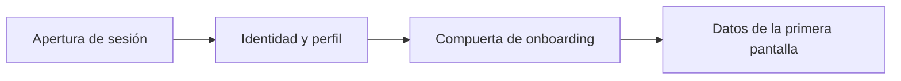

<!-- Generado por scripts/processes/generate-process-docs.ts desde src/modules/workflow-catalog/definitions. No editar a mano. -->

# C-02 · De la sesión iniciada a la primera pantalla

`post_login_first_screen` · v1 · prioridad **P1** · tipo `customer_journey` · dueño `OPERATIONS_MANAGER` · bloques `ATLAS_BACKEND`

El arranque de la app, llamada por llamada: abrir sesión, resolver identidad y perfil, decidir por la compuerta de onboarding si va a inicio o a completar el alta, y traer los datos que la pantalla principal muestra.

## Por qué existe

Decide qué ve el cliente justo después de iniciar sesión según dónde va en su alta: evita que la app tenga su propia copia de las reglas de habilitación y que dos pantallas digan cosas distintas.

## Quién lo inicia y quién lo cierra

Lo dispara la app al recibir la sesión y lo cierra el Backend al devolver el estado y la pantalla que corresponde; ninguna persona interna interviene.

## Cuándo empieza y cuándo termina

Empieza con la primera lectura autenticada tras el login y termina cuando la app pinta la pantalla de destino (continuar alta, esperar revisión, inicio con crédito).

## Qué pasa cuando falla

Si la lectura tarda más de 20 s la app muestra «sin conexión» (timeout, no caída); si el cliente está bloqueado recibe la pantalla de estado con su motivo, no un error.

## Qué indicador dice que va bien

Latencia p95 de la primera lectura tras el login por debajo de 2 s y cero pantallas de destino desconocidas en los registros de la app.

## Resultado

- **Éxito:** Sesión abierta, identidad resuelta y pantalla principal con sus datos.
- **Fracaso:** La sesión no abre, el token no renueva o el expediente incompleto desvía al onboarding.

## Etapas

| Etapa | Nombre | Actor | Cliente | Pantalla | Pasos |
|---|---|---|---|---|---|
| `first_screen_session` | Apertura de sesión | customer | CONSUMER_APP | **sin pantalla declarada** | 3 |
| `first_screen_identity` | Identidad y perfil | customer | CONSUMER_APP | **sin pantalla declarada** | 3 |
| `first_screen_gate` | Compuerta de onboarding | system | BLOCK | — | 3 |
| `first_screen_home` | Datos de la primera pantalla | customer | CONSUMER_APP | **sin pantalla declarada** | 6 |

### Apertura de sesión (`first_screen_session`)

Abre la sesión de negocio (distinta del token): es la que sostiene la trazabilidad de todo lo que el usuario haga.

| Paso | Tipo | Bloque | Operación | Roles | Eventos |
|---|---|---|---|---|---|
| Abrir la sesión | http | ATLAS_BACKEND | `POST /customers/:customerId/sessions/start` | customer, internal_operator, risk_analyst, compliance_analyst, fraud_analyst, admin, platform_admin, system | session.started |
| Consultar el estado de la sesión | http | ATLAS_BACKEND | `GET /customers/:customerId/session-state` | customer, internal_operator, risk_analyst, compliance_analyst, fraud_analyst, admin, platform_admin, system | — |
| Mantener viva la sesión | http | ATLAS_BACKEND | `POST /customers/:customerId/sessions/:sessionId/heartbeat` | customer, internal_operator, risk_analyst, compliance_analyst, fraud_analyst, admin, platform_admin, system | — |

### Identidad y perfil (`first_screen_identity`)

Quién es el usuario y qué puede hacer. Determina el saludo, el menú y los permisos de la pantalla.

| Paso | Tipo | Bloque | Operación | Roles | Eventos |
|---|---|---|---|---|---|
| Confirmar el actor autenticado | http | ATLAS_BACKEND | `GET /auth/me` | — | — |
| Traer el perfil del cliente | http | ATLAS_BACKEND | `GET /customers/:customerId/me` | customer, internal_operator, risk_analyst, compliance_analyst, admin, platform_admin | — |
| Renovar el token de acceso | http | ATLAS_BACKEND | `POST /auth/refresh` | — | — |

### Compuerta de onboarding (`first_screen_gate`)

La bifurcación que decide la primera pantalla: expediente completo va a inicio; incompleto va a terminar el alta.

| Paso | Tipo | Bloque | Operación | Roles | Eventos |
|---|---|---|---|---|---|
| Consultar el avance del onboarding | http | ATLAS_BACKEND | `GET /customer-onboarding/:customerId/status` | customer, internal_operator, risk_analyst, admin, platform_admin | — |
| Consultar las observaciones abiertas | http | ATLAS_BACKEND | `GET /customer-onboarding/:customerId/observations` | customer, internal_operator, risk_analyst, admin, platform_admin | — |
| Consultar la elegibilidad | http | ATLAS_BACKEND | `GET /customers/:customerId/eligibility` | customer, internal_operator, risk_analyst, compliance_analyst, fraud_analyst, admin, platform_admin | — |

### Datos de la primera pantalla (`first_screen_home`)

Lo que se pinta: productos disponibles, solicitudes en curso y avisos. Con esto la pantalla ya es útil.

| Paso | Tipo | Bloque | Operación | Roles | Eventos |
|---|---|---|---|---|---|
| Listar los productos disponibles | http | ATLAS_BACKEND | `GET /customers/:customerId/credit-products` | customer, internal_operator, risk_analyst, admin, platform_admin | — |
| Listar las solicitudes en curso | http | ATLAS_BACKEND | `GET /customers/:customerId/credit-applications` | customer, internal_operator, risk_analyst, admin, platform_admin | — |
| Contar las notificaciones sin leer | http | ATLAS_BACKEND | `GET /customers/:customerId/notifications/unread-count` | customer, internal_operator, admin, platform_admin | — |
| Listar las notificaciones | http | ATLAS_BACKEND | `GET /customers/:customerId/notifications` | customer, internal_operator, admin, platform_admin | — |
| Registrar el token de notificaciones push | http | ATLAS_BACKEND | `POST /customers/:customerId/device-tokens` | customer, internal_operator, admin, platform_admin | — |
| Enviar la telemetría de la pantalla | http | ATLAS_BACKEND | `POST /customers/:customerId/telemetry/batch` | customer, internal_operator, risk_analyst, admin, platform_admin | — |

## Fuentes

- `src/database/seeders/demo/referencia.seed-data.ts`
