<!-- Generado por scripts/processes/generate-process-docs.ts desde src/modules/workflow-catalog/definitions. No editar a mano. -->

# P-08 · Compra con QR del comercio y desembolso del préstamo

`purchase_and_disbursement` · v1 · prioridad **P0** · tipo `customer_journey` · dueño `OPERATIONS_MANAGER` · bloques `ATLAS_BACKEND`, `DECISION_ENGINE`, `ERP_BACKEND`

Del escaneo del QR de caja a un préstamo activo: resolución del comercio, solicitud de crédito decidida por el Motor, aceptación del comercio desde el ERP, desembolso con cronograma y la venta visible en la cartera del comercio.

## Por qué existe

Es el momento en que Atlas gana dinero y asume riesgo: una compra en un comercio verificado se financia con una aprobación del Motor, el comercio confirma la venta y el desembolso crea el préstamo y sus cuotas en una sola transacción, heredando qué ejecución del Motor lo decidió para poder medir su desenlace.

## Quién lo inicia y quién lo cierra

Lo inicia el cliente al escanear en la app el QR de la caja y fijar el monto; el comercio responde sí o no desde «Gestión POS» del portal del comercio; el desembolso sólo lo puede ejecutar un operador interno (internal_operator, admin o platform_admin) y hoy no existe ninguna pantalla ni proceso automático que lo llame.

## Cuándo empieza y cuándo termina

Empieza con la resolución del token del QR (POST /merchant-qr/resolve) y la solicitud de crédito con el comercio y la caja; termina cuando POST /credit-applications/:applicationId/disbursement crea el préstamo en estado active con sus cuotas y consume el cupo reservado, y el comercio lo ve en «Mi cartera».

## Qué pasa cuando falla

Un QR ajeno, revocado o vencido se rechaza con QR_NOT_RECOGNIZED, QR_REVOKED o QR_EXPIRED; si el comercio declina, la solicitud no se desembolsa (CREDIT_BUSINESS_ACCEPTANCE_DECLINED); el desembolso aborta con 409 si la decisión venció (CREDIT_DECISION_EXPIRED), si el cliente retiró un consentimiento o si el importe ya no cabe en el cupo. Nadie recibe aviso: el cliente sólo ve la orden esperando.

## Qué indicador dice que va bien

Solicitudes aprobadas con aceptación del comercio que tienen préstamo en credit.loans (aprobado ≠ originado), tiempo entre aceptación y desembolso, y préstamos desembolsados que el job register_engine_facilities ya dio de alta en el Motor; hoy la primera cifra depende de un desembolso sin llamador.

## Resultado

- **Éxito:** El préstamo existe en estado active con sus cuotas, el cupo reservado quedó consumido y el comercio ve la venta en su cartera.
- **Fracaso:** La compra queda aprobada y aceptada sin préstamo, el comercio la declina o el desembolso aborta por decisión vencida, consentimiento retirado o cupo insuficiente.

## Dónde vive cada instancia

`ATLAS_BACKEND` · `credit.loans` · estado en `status` · abiertas: `active`

## Etapas

```mermaid
flowchart LR
  purchase_scan["Escanear el QR de la caja"]
  purchase_credit_request["Monto y solicitud de crédito"]
  purchase_engine_decision["Decisión del Motor"]
  purchase_merchant_acceptance["El comercio acepta o rechaza la venta"]
  purchase_customer_waits["El cliente espera la respuesta del comercio"]
  purchase_initial_payment["Commitment y pago del inicial"]
  purchase_disbursement["Desembolso del préstamo"]
  purchase_engine_registration["Alta del crédito en el Motor"]
  purchase_customer_loan["El cliente ve su préstamo"]
  purchase_merchant_portfolio["El comercio ve la venta en su cartera"]
  purchase_erp_sale_registration["Registro de la venta a plazos en el ERP"]
  purchase_scan --> purchase_credit_request
  purchase_credit_request --> purchase_engine_decision
  purchase_engine_decision --> purchase_merchant_acceptance
  purchase_merchant_acceptance --> purchase_customer_waits
  purchase_customer_waits --> purchase_initial_payment
  purchase_initial_payment --> purchase_disbursement
  purchase_disbursement --> purchase_engine_registration
  purchase_engine_registration --> purchase_customer_loan
  purchase_customer_loan --> purchase_merchant_portfolio
  purchase_merchant_portfolio --> purchase_erp_sale_registration
```

| Etapa | Nombre | Actor | Cliente | Pantalla | Pasos |
|---|---|---|---|---|---|
| `purchase_scan` | Escanear el QR de la caja | customer | CONSUMER_APP | **sin pantalla declarada** | 1 |
| `purchase_credit_request` | Monto y solicitud de crédito | customer | CONSUMER_APP | **sin pantalla declarada** | 2 |
| `purchase_engine_decision` | Decisión del Motor | system | BLOCK | — | 3 |
| `purchase_merchant_acceptance` | El comercio acepta o rechaza la venta | merchant_user | ERP_PORTAL | `/portal-comercio/gestion-pos` | 4 |
| `purchase_customer_waits` | El cliente espera la respuesta del comercio | customer | CONSUMER_APP | **sin pantalla declarada** | 1 |
| `purchase_initial_payment` | Commitment y pago del inicial | customer | CONSUMER_APP | **sin pantalla declarada** | 2 |
| `purchase_disbursement` | Desembolso del préstamo | internal_user | ADMIN_PORTAL | **sin pantalla declarada** | 1 |
| `purchase_engine_registration` | Alta del crédito en el Motor | system | BLOCK | — | 2 |
| `purchase_customer_loan` | El cliente ve su préstamo | customer | CONSUMER_APP | **sin pantalla declarada** | 3 |
| `purchase_merchant_portfolio` | El comercio ve la venta en su cartera | merchant_user | ERP_PORTAL | `/portal-comercio/cartera` | 2 |
| `purchase_erp_sale_registration` | Registro de la venta a plazos en el ERP | platform_user | ERP_PORTAL | `/operaciones/crm/conciliacion-cobertura` | 1 |

### Escanear el QR de la caja (`purchase_scan`)

El cliente apunta al QR interno de Atlas del comercio. Lleva un token opaco: el servidor resuelve comercio, sucursal y caja; fotografiar un QR ajeno no cambia a quién se le paga.

| Paso | Tipo | Bloque | Operación | Roles | Eventos |
|---|---|---|---|---|---|
| Resolver el QR al comercio que lo emitió | http | ATLAS_BACKEND | `POST /merchant-qr/resolve` | customer, internal_operator, risk_analyst, admin, platform_admin | — |

### Monto y solicitud de crédito (`purchase_credit_request`)

El cliente fija el monto bruto; la app muestra el plan (60 % inicial, 40 % financiado en cuotas) como previsualización y pide el crédito por lo financiado, enlazado al comercio y a la caja.

| Paso | Tipo | Bloque | Operación | Roles | Eventos |
|---|---|---|---|---|---|
| Elegir el producto que admite el importe | http | ATLAS_BACKEND | `GET /customers/:customerId/credit-products` | customer, internal_operator, risk_analyst, admin, platform_admin | — |
| Presentar la solicitud de crédito de la compra | http | ATLAS_BACKEND | `POST /customers/:customerId/credit-applications` | customer, internal_operator, risk_analyst, admin, platform_admin | credit.application.submitted |

### Decisión del Motor (`purchase_engine_decision`)

Atlas llama al artefacto de crédito del Motor con las features del cliente. Una aprobación del Motor deja businessAcceptance = pending: falta la palabra del comercio. El detalle de la decisión vive en P-06.

| Paso | Tipo | Bloque | Operación | Roles | Eventos |
|---|---|---|---|---|---|
| Ejecutar el artefacto de crédito | http | DECISION_ENGINE | `POST /v1/decisions/:artifactCode` | — | — |
| Avisar al ERP la banda de riesgo aprobada | event | ATLAS_BACKEND | Evento del outbox suscrito a atlas-erp; lo entrega el job opcional deliver_erp_events, que sólo corre si ERP_EVENTS_DELIVERY_URL y su secreto están configurados. | — | credit.decision.recorded |
| El ERP recibe el evento de Core | http | ERP_BACKEND | `POST /integration/core/events` | — | — |

### El comercio acepta o rechaza la venta (`purchase_merchant_acceptance`)

El comercio ve en «Gestión POS» las solicitudes que esperan su respuesta y sólo puede decir sí o no: no edita importe ni calendario. Aceptar reserva el cupo del cliente hasta que venza la decisión.

| Paso | Tipo | Bloque | Operación | Roles | Eventos |
|---|---|---|---|---|---|
| Solicitudes pendientes del comercio (ERP) | http | ERP_BACKEND | `GET /merchant-credit/:partnerId/applications` | merchant, MERCHANT_ADMIN, MERCHANT_OPERATIONS, OPERATIONS, ADMIN | — |
| Solicitudes pendientes del comercio (Atlas) | http | ATLAS_BACKEND | `GET /merchant/partners/:partnerId/credit-applications` | merchant, internal_operator, risk_analyst, admin, platform_admin | — |
| Aceptar o rechazar (ERP) | http | ERP_BACKEND | `POST /merchant-credit/:partnerId/applications/:applicationId/acceptance` | merchant, MERCHANT_ADMIN, MERCHANT_OPERATIONS, OPERATIONS, ADMIN | — |
| Registrar la aceptación del comercio | http | ATLAS_BACKEND | `POST /merchant/partners/:partnerId/credit-applications/:applicationId/acceptance` | merchant, internal_operator, risk_analyst, admin, platform_admin | — |

### El cliente espera la respuesta del comercio (`purchase_customer_waits`)

La orden queda en «esperando comercio» y el pago del inicial bloqueado; la app sondea sus solicitudes hasta leer accepted o declined.

| Paso | Tipo | Bloque | Operación | Roles | Eventos |
|---|---|---|---|---|---|
| Leer el estado de la aceptación | http | ATLAS_BACKEND | `GET /customers/:customerId/credit-applications` | customer, internal_operator, risk_analyst, admin, platform_admin | — |

### Commitment y pago del inicial (`purchase_initial_payment`)

Con la venta aceptada, la app confirma la compra y muestra el QR bancario del comercio para el 60 % inicial. El reporte y la verificación del pago siguen en P-09.

| Paso | Tipo | Bloque | Operación | Roles | Eventos |
|---|---|---|---|---|---|
| Confirmar la compra y generar el calendario | manual | ATLAS_BACKEND | Lo ejecuta el sandbox local de la app (commitPurchase): AtlasBackend todavía no tiene purchase_order, purchase_commitment ni payment_schedule. | — | — |
| Obtener el QR bancario del comercio | http | ATLAS_BACKEND | `POST /merchant-qr/payment` | customer, internal_operator, risk_analyst, admin, platform_admin | — |

### Desembolso del préstamo (`purchase_disbursement`)

Convierte la solicitud aprobada y aceptada en préstamo active con cronograma, en una transacción que revalida vigencia de la decisión, consentimientos y cupo, y consume la reserva. No hay pantalla en el portal admin ni job que lo dispare.

| Paso | Tipo | Bloque | Operación | Roles | Eventos |
|---|---|---|---|---|---|
| Desembolsar la solicitud aprobada | http | ATLAS_BACKEND | `POST /credit-applications/:applicationId/disbursement` | internal_operator, admin, platform_admin | — |

### Alta del crédito en el Motor (`purchase_engine_registration`)

El libro de préstamos no llama al Motor: un job registra después los créditos nuevos para que sus desenlaces se atribuyan a la versión del artefacto que los decidió.

| Paso | Tipo | Bloque | Operación | Roles | Eventos |
|---|---|---|---|---|---|
| Replicar consentimientos al Motor | job | ATLAS_BACKEND | job `sync_engine_consents` | — | — |
| Registrar el crédito desembolsado en el Motor | job | ATLAS_BACKEND | job `register_engine_facilities` | — | — |

### El cliente ve su préstamo (`purchase_customer_loan`)

El préstamo aparece en la app con el comercio donde nació y su calendario de cuotas.

| Paso | Tipo | Bloque | Operación | Roles | Eventos |
|---|---|---|---|---|---|
| Préstamos del cliente | http | ATLAS_BACKEND | `GET /customers/:customerId/loans` | customer, internal_operator, risk_analyst, admin, platform_admin | — |
| Detalle del préstamo | http | ATLAS_BACKEND | `GET /loans/:loanId` | customer, internal_operator, risk_analyst, admin, platform_admin | — |
| Calendario de pagos | http | ATLAS_BACKEND | `GET /customers/:customerId/payment-calendar` | customer, internal_operator, risk_analyst, admin, platform_admin | — |

### El comercio ve la venta en su cartera (`purchase_merchant_portfolio`)

«Mi cartera» lee de Atlas los préstamos y cobros del expediente. Hoy se queda con el primer expediente del usuario sin avisar.

| Paso | Tipo | Bloque | Operación | Roles | Eventos |
|---|---|---|---|---|---|
| Cartera del comercio (ERP) | http | ERP_BACKEND | `GET /merchant-credit/:partnerId/portfolio` | merchant, MERCHANT_ADMIN, MERCHANT_OPERATIONS, OPERATIONS, ADMIN | — |
| Cartera del comercio (Atlas) | http | ATLAS_BACKEND | `GET /merchant/partners/:partnerId/payment-claims/portfolio` | merchant, internal_operator, admin, platform_admin | — |

### Registro de la venta a plazos en el ERP (`purchase_erp_sale_registration`)

Libro propio del ERP (atlas_sales) para el MDR y la cobertura. No se alimenta del desembolso: lo registra a mano un operador del ERP o el comercio, con coreLoanRef opcional para enlazarlo al préstamo de Atlas.

| Paso | Tipo | Bloque | Operación | Roles | Eventos |
|---|---|---|---|---|---|
| Registrar la compra BNPL | http | ERP_BACKEND | `POST /b2b/bnpl/purchases` | MERCHANT_ADMIN, OPERATIONS, ADMIN | — |

## Fuentes

- `AtlasFrontend/apps/consumer-app/docs/flujo-cliente-final.md §4.2–4.4, §9 y §10`
- `AtlasFrontend/apps/consumer-app/src/api/config.ts (EXPO_PUBLIC_ATLAS_PURCHASE_SOURCE, sandbox por omisión)`
- `AtlasFrontend/apps/consumer-app/app/(app)/(tabs)/escanear.tsx`
- `AtlasFrontend/apps/consumer-app/src/features/credit-evaluation.ts`
- `AtlasFrontend/apps/consumer-app/src/sandbox/store.tsx (sondeo de businessAcceptance)`
- `src/modules/partner-onboarding/merchant-qr.controller.ts`
- `src/modules/credit/credit.controller.ts`
- `src/modules/credit/merchant-credit.controller.ts`
- `src/modules/credit/application/credit-application.service.ts`
- `src/modules/credit/application/credit-business-acceptance.service.ts`
- `src/modules/credit/application/credit-decision-event-publisher.ts`
- `src/modules/loans/loans.controller.ts`
- `src/modules/loans/application/loan-disbursement.service.ts`
- `src/modules/loan-payment-claims/merchant-payment-claims.controller.ts`
- `src/modules/runtime-jobs/scheduled-jobs.catalog.ts (register_engine_facilities, sync_engine_consents)`
- `src/modules/runtime-jobs/optional-jobs.catalog.ts (deliver_erp_events)`
- `src/platform/events/outbound-subscriptions.ts`
- `src/database/migrations/20260811090000-create-loan-book.ts (CHECK de loans.status)`
- `AtlasERPBackend/src/modules/partner-onboarding-gateway/merchant-credit-gateway.controller.ts`
- `AtlasERPBackend/src/modules/b2b-sales-crm/controllers/bnpl.controller.ts`
- `AtlasERPFrontend/app/portal-comercio/gestion-pos/page.tsx (MerchantRequestsScreen)`
- `AtlasERPFrontend/app/portal-comercio/cartera/page.tsx`
- `AtlasERPFrontend/app/operaciones/crm/conciliacion-cobertura/page.tsx`
- `memoria atlas-flujo-pago-qr-comprobante`
- `memoria atlas-camara-emulador-y-qr`
- `memoria atlas-recorrido-signup-a-credito`
- `memoria atlas-erp-consumo-facturacion`
- `_plan-documentar-procesos-y-cableado-portal-2026-09-26/datos/procesos.json (P-08)`
