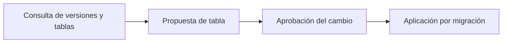

<!-- Generado por scripts/processes/generate-process-docs.ts desde src/modules/workflow-catalog/definitions. No editar a mano. -->

# P-35 · Cambios de esquema: propuestas, versiones, change log y aprobación

`schema_change_management` · v1 · prioridad **P2** · tipo `back_office` · dueño `DATA_GOVERNANCE_MANAGER` · bloques `ATLAS_BACKEND`

Gestión gobernada del catálogo de esquema: consultar versiones y tablas, proponer una tabla nueva (queda pending en el change log), aprobarla o rechazarla con el principio de cuatro ojos, y aplicar el cambio real por una migración revisada en PR, porque la aprobación no ejecuta DDL.

## Por qué existe

Gobierna las propuestas de estructura sin permitir cambios directos desde el portal: las relaciones son inmutables, las columnas críticas no se editan y un catálogo en uso exige versión nueva, así que cada cambio queda propuesto, decidido por otra persona y auditado en el change log.

## Quién lo inicia y quién lo cierra

Lo inicia una persona interna que propone una tabla desde «Versiones de esquema»; lo cierra otra persona con rol de sesión platform_admin que aprueba o rechaza en «Change log» (quien propone no puede aprobar), y después un desarrollador aplica la migración.

## Cuándo empieza y cuándo termina

Empieza con la propuesta, que entra en schema_change_log como pending; termina cuando el cambio queda approved o rejected (rechazar exige notas) y, si se aprobó, cuando la migración Sequelize que lo materializa se despliega.

## Qué pasa cuando falla

Aprobar un cambio ya resuelto da 409, sin rol da 403 y un token sin platformUserId da 403. Hoy el portal interno no emite nunca platform_admin ni platformUserId, así que proponer y aprobar desde ahí queda inalcanzable; y el gate check:domain-schema-layout mira la base real, no este catálogo.

## Qué indicador dice que va bien

Propuestas en pending y su antigüedad, cambios aprobados sin migración que los aplique y diferencia entre el catálogo de versiones y la base real; se ve en «Change log» del portal.

## Resultado

- **Éxito:** El cambio está propuesto, aprobado por otra persona, registrado y aplicado por una migración.
- **Fracaso:** La propuesta queda pending sin nadie que pueda aprobarla, o el cambio se aplica por migración sin pasar por el change log.

## Dónde vive cada instancia

`ATLAS_BACKEND` · `platform_ops.schema_change_log` · estado en `approval_status` · abiertas: `pending`

## Etapas

| Etapa | Nombre | Actor | Cliente | Pantalla | Pasos |
|---|---|---|---|---|---|
| `schema_browse` | Consulta de versiones y tablas | internal_user | ADMIN_PORTAL | `/internal/schema/versions` | 5 |
| `schema_propose` | Propuesta de tabla | internal_user | ADMIN_PORTAL | `/internal/schema/versions` | 1 |
| `schema_approve` | Aprobación del cambio | internal_user | ADMIN_PORTAL | `/internal/schema/change-log` | 2 |
| `schema_apply_migration` | Aplicación por migración | system | BLOCK | — | 1 |

### Consulta de versiones y tablas (`schema_browse`)

Versiones del esquema (append-only), sus tablas, columnas y relaciones.

| Paso | Tipo | Bloque | Operación | Roles | Eventos |
|---|---|---|---|---|---|
| Listar versiones | http | ATLAS_BACKEND | `GET /operations/schema/versions` | internal_operator, admin, platform_admin, risk_analyst, readonly_auditor | — |
| Ver una versión | http | ATLAS_BACKEND | `GET /operations/schema/versions/:versionId` | internal_operator, admin, platform_admin, risk_analyst, readonly_auditor | — |
| Ver los esquemas de una versión | http | ATLAS_BACKEND | `GET /operations/schema/versions/:versionId/schemas` | internal_operator, admin, platform_admin, risk_analyst, readonly_auditor | — |
| Listar tablas de una versión | http | ATLAS_BACKEND | `GET /operations/schema/tables` | internal_operator, admin, platform_admin, risk_analyst, readonly_auditor | — |
| Ver una tabla | http | ATLAS_BACKEND | `GET /operations/schema/tables/:tableId` | internal_operator, admin, platform_admin, risk_analyst, readonly_auditor | — |

### Propuesta de tabla (`schema_propose`)

La persona propone una tabla desde el formulario de «Versiones»; entra en el change log como pending.

| Paso | Tipo | Bloque | Operación | Roles | Eventos |
|---|---|---|---|---|---|
| Proponer una tabla | http | ATLAS_BACKEND | `POST /operations/schema/tables` | internal_operator, admin, platform_admin | — |

### Aprobación del cambio (`schema_approve`)

Otra persona aprueba o rechaza la propuesta con SELECT … FOR UPDATE; el proponente no puede aprobar y rechazar exige notas.

| Paso | Tipo | Bloque | Operación | Roles | Eventos |
|---|---|---|---|---|---|
| Leer el change log | http | ATLAS_BACKEND | `GET /operations/schema/change-log` | internal_operator, admin, platform_admin, risk_analyst, readonly_auditor | — |
| Aprobar o rechazar | http | ATLAS_BACKEND | `PATCH /operations/schema/change-log/:changeId/approve` | platform_admin | — |

### Aplicación por migración (`schema_apply_migration`)

El CREATE TABLE real sale por una migración Sequelize revisada en PR y aplicada por el job migrate al desplegar (P-38).

| Paso | Tipo | Bloque | Operación | Roles | Eventos |
|---|---|---|---|---|---|
| Migración que materializa el cambio | manual | ATLAS_BACKEND | ATLAS-TECH-007: la ejecución de DDL por API está fuera del MVP; el cambio real es una migración en PR que corre al desplegar. | — | — |

## Fuentes

- `src/modules/schema-management/README.md`
- `src/modules/schema-management/schema-management.controller.ts`
- `src/modules/schema-management/schema-change-log.repository.ts`
- `src/modules/schema-management/services/schema-management.service.ts`
- `src/modules/internal-users/internal-rbac.roles.ts (legacyRoleForInternalRoles)`
- `src/modules/systems-ops/systems-ops.constants.ts`
- `_plan-documentar-procesos-y-cableado-portal-2026-09-26/datos/procesos.json (P-35)`
