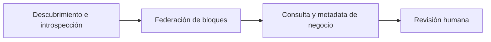

<!-- Generado por scripts/processes/generate-process-docs.ts desde src/modules/workflow-catalog/definitions. No editar a mano. -->

# P-30 · Catálogo de sistemas: descubrimiento, introspección, narrativas, revisión humana y federación

`systems_catalog_governance` · v1 · prioridad **P2** · tipo `back_office` · dueño `DATA_GOVERNANCE_MANAGER` · bloques `ATLAS_BACKEND`, `DECISION_ENGINE`, `ERP_BACKEND`

Cómo se llena y se firma el catálogo técnico de Atlas: escaneo del código para descubrir rutas, introspección de la base para columnas y relaciones, narrativas de negocio por tabla, federación de los catálogos del Motor y del ERP, y revisión humana de lo que la máquina detectó.

## Por qué existe

Sin un catálogo fiel de rutas, tablas, relaciones y dueños nadie puede decir qué toca un cambio ni quién responde por un dato. El linaje del portal no dibujaba relaciones porque el catálogo de relaciones estaba vacío con 400 claves foráneas reales en la base: este proceso es el que lo mantiene poblado.

## Quién lo inicia y quién lo cierra

Lo inicia un administrador de sistemas (rol de sesión admin o system_admin) desde «Sincronización del catálogo», o un guion yarn systems:catalog:* en el servidor; lo cierra la persona de gobierno de datos que aprueba o rechaza cada ficha en la cola de revisión.

## Cuándo empieza y cuándo termina

Empieza con el descubrimiento (escaneo del código) o el refresco de la siembra del catálogo, que deja fichas en AUTO_DETECTED; lo curado pasa a NEEDS_REVIEW, nunca a APPROVED; termina cuando una persona firma cada ficha como APPROVED o REJECTED.

## Qué pasa cuando falla

Si la introspección nunca corrió no hay columnas ni relaciones y el linaje sale vacío sin error; si la federación falla, las fichas del Motor o del ERP quedan viejas. Hoy la cola de revisión del portal es de sólo lectura: nadie llama a las seis rutas de revisión y las fichas se quedan en NEEDS_REVIEW sin aviso.

## Qué indicador dice que va bien

Fichas en NEEDS_REVIEW frente a APPROVED por bloque, filas con detected_from = information_schema_enriched (señal de que la introspección corrió) y el control «Catálogo de endpoints poblado» de la preparación de salida.

## Resultado

- **Éxito:** Las fichas de rutas, tablas y relaciones de los tres bloques existen, llevan narrativa y están firmadas por una persona.
- **Fracaso:** El catálogo queda vacío, desactualizado o con fichas que nadie revisa, y el linaje y el impacto de cambios mienten por omisión.

## Dónde vive cada instancia

`ATLAS_BACKEND` · `platform_ops.system_endpoint_catalog` · estado en `review_status` · abiertas: `AUTO_DETECTED`, `NEEDS_REVIEW`

## Etapas

| Etapa | Nombre | Actor | Cliente | Pantalla | Pasos |
|---|---|---|---|---|---|
| `catalog_discovery` | Descubrimiento e introspección | internal_user | ADMIN_PORTAL | `/internal/settings/catalog-sync` | 5 |
| `catalog_federation` | Federación de bloques | internal_user | ADMIN_PORTAL | `/internal/systems/network-health` | 5 |
| `catalog_browse` | Consulta y metadata de negocio | internal_user | ADMIN_PORTAL | `/internal/data-catalog/tables/[entityId]/metadata` | 5 |
| `catalog_human_review` | Revisión humana | internal_user | ADMIN_PORTAL | `/internal/review-queue` | 7 |

### Descubrimiento e introspección (`catalog_discovery`)

El administrador lanza desde «Sincronización del catálogo» el escaneo del código y el refresco de la siembra, que arrastra herramientas, rutas y la introspección de la base (columnas y relaciones).

| Paso | Tipo | Bloque | Operación | Roles | Eventos |
|---|---|---|---|---|---|
| Descubrir rutas en el código | http | ATLAS_BACKEND | `POST /systems/endpoints/discover` | system_admin, platform_admin, admin | — |
| Refrescar la siembra del catálogo | http | ATLAS_BACKEND | `POST /systems/endpoints/catalog-seed/refresh` | system_admin, platform_admin, admin | — |
| Inferir requisitos de herramientas | http | ATLAS_BACKEND | `POST /systems/tools/infer-requirements` | system_admin, platform_admin, admin | — |
| Inferir impactos ruta → tabla | http | ATLAS_BACKEND | `POST /systems/data-entities/infer-impacts` | system_admin, platform_admin, admin | — |
| Aplicar narrativas y metadata de negocio por guion | manual | ATLAS_BACKEND | Son guiones del repositorio que se ejecutan con docker exec en el contenedor del servidor; no hay pantalla ni ruta que los dispare. | system_admin, platform_admin, admin | — |

### Federación de bloques (`catalog_federation`)

Trae el manifiesto de catálogo del Motor y del ERP y lo guarda con su system_code; se autentica con el token del usuario, no con un secreto de máquina.

| Paso | Tipo | Bloque | Operación | Roles | Eventos |
|---|---|---|---|---|---|
| Ver los bloques federados | http | ATLAS_BACKEND | `GET /systems/blocks` | system_admin, platform_admin, admin, qa_engineer, devops, risk_analyst, compliance_analyst, readonly_auditor | — |
| Federar todos los bloques | http | ATLAS_BACKEND | `POST /systems/blocks/federate` | system_admin, platform_admin, admin | — |
| Federar un bloque | http | ATLAS_BACKEND | `POST /systems/blocks/:systemCode/federate` | system_admin, platform_admin, admin | — |
| Manifiesto de catálogo del Motor | http | DECISION_ENGINE | `GET /v1/platform/catalog-manifest` | system_admin, platform_admin, admin | — |
| Manifiesto de catálogo del ERP | http | ERP_BACKEND | `GET /platform/catalog-manifest` | system_admin, platform_admin, admin | — |

### Consulta y metadata de negocio (`catalog_browse`)

Gobierno de datos consulta rutas y tablas catalogadas y completa la metadata de negocio de una tabla (dueño, propósito, sensibilidad).

| Paso | Tipo | Bloque | Operación | Roles | Eventos |
|---|---|---|---|---|---|
| Listar rutas catalogadas | http | ATLAS_BACKEND | `GET /systems/endpoints` | system_admin, platform_admin, admin, qa_engineer, devops, risk_analyst, compliance_analyst, readonly_auditor | — |
| Listar tablas catalogadas | http | ATLAS_BACKEND | `GET /systems/data-entities` | system_admin, platform_admin, admin, qa_engineer, devops, risk_analyst, compliance_analyst, readonly_auditor | — |
| Editar la metadata de negocio de una tabla | http | ATLAS_BACKEND | `PATCH /systems/data-entities/:entityId/metadata` | system_admin, platform_admin, admin | — |
| Ver el linaje | http | ATLAS_BACKEND | `GET /internal/lineage` | internal_operator, risk_analyst, compliance_analyst, admin, platform_admin, system_admin, qa_engineer, devops, readonly_auditor | — |
| Ver el impacto de una tabla | http | ATLAS_BACKEND | `GET /internal/lineage/impact` | internal_operator, risk_analyst, compliance_analyst, admin, platform_admin, system_admin, qa_engineer, devops, readonly_auditor | — |

### Revisión humana (`catalog_human_review`)

La persona de gobierno aprueba o rechaza lo detectado por la máquina. La pantalla «Cola de revisión» sólo lista: las seis rutas de revisión no tienen llamador en el portal.

| Paso | Tipo | Bloque | Operación | Roles | Eventos |
|---|---|---|---|---|---|
| Leer la cola de revisión | http | ATLAS_BACKEND | `GET /systems/review-queue` | system_admin, platform_admin, admin | — |
| Firmar una ruta | http | ATLAS_BACKEND | `PATCH /systems/endpoints/:endpointId/review` | system_admin, platform_admin, admin | — |
| Firmar una tabla | http | ATLAS_BACKEND | `PATCH /systems/data-entities/:entityId/review` | system_admin, platform_admin, admin | — |
| Firmar una columna | http | ATLAS_BACKEND | `PATCH /systems/data-entities/columns/:columnId/review` | system_admin, platform_admin, admin | — |
| Firmar un impacto ruta → tabla | http | ATLAS_BACKEND | `PATCH /systems/impact/data/:impactId/review` | system_admin, platform_admin, admin | — |
| Firmar un impacto sobre un campo | http | ATLAS_BACKEND | `PATCH /systems/impact/fields/:fieldImpactId/review` | system_admin, platform_admin, admin | — |
| Firmar un requisito de herramienta | http | ATLAS_BACKEND | `PATCH /systems/tools/requirements/:requirementId/review` | system_admin, platform_admin, admin | — |

## Fuentes

- `src/modules/systems-ops/systems-catalog.controller.ts`
- `src/modules/systems-ops/systems-review.controller.ts`
- `src/modules/systems-ops/systems-network.controller.ts`
- `src/modules/systems-ops/systems-ops.constants.ts`
- `src/modules/internal-portal/internal-portal.controller.ts`
- `package.json (systems:catalog:introspect, :narratives, :business)`
- `memoria atlas-linaje-catalogo-relaciones`
- `memoria atlas-flow-intelligence-ya-existe`
- `_plan-documentar-procesos-y-cableado-portal-2026-09-26/datos/procesos.json (P-30)`
