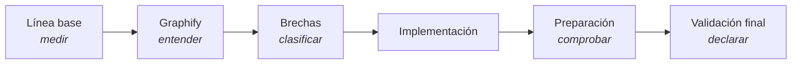

# Informes

Evidencia de lo que se midió, no de lo que se pretendía. Cada informe se puede reproducir con los
comandos que cita.

| Informe | Qué contiene |
|---|---|
| [Línea base](baseline.md) | Estado medido antes de tocar nada: inventario, gates ejecutados y riesgos iniciales |
| [Auditoría Graphify](graphify-audit.md) | Descubrimiento sobre el grafo real: 8 987 nodos, 32 aristas módulo→módulo, 0 ciclos |
| [Brechas documentales](documentation-gap-analysis.md) | 26 brechas clasificadas, con acción y validación por cada una |
| [Preparación para producción](production-readiness.md) | Checklist objetivo por área |
| [Validación final](final-validation.md) | Resultado de cada comando y declaración de aptitud |
| [Auditoría integral 2026-07-30](../audit/auditoria-integral-2026-07-30.md) | La auditoría previa y su plan de 8 fases |

## Orden en que se leyeron y se escribieron

Ninguna página de arquitectura de este portal se escribió antes que la auditoría de Graphify. Es la
regla que impide documentar el sistema que uno cree que existe en vez del que existe.
